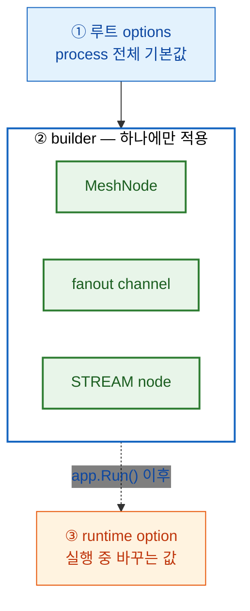

<!-- framework-adapter-nav:start -->
[가이드 홈](../../../index.ko.md) | [이전: E2E 테스트](15-e2e-testing.ko.md) | [다음: ZLink를 어디에 쓰나](17-alternative.ko.md)
<!-- framework-adapter-nav:end -->

# 16. Options — 설정 목록과 기본값

> **이 장의 계약 소유 문서** —
> [Topology 공개 인터페이스](../../../common/spec/server/languages/dotnet/interfaces/03-configuration-topology.ko.md)와
> [Host 구성 인터페이스](../../../common/spec/server/languages/dotnet/interfaces/02-configuration-host.ko.md)가
> 정확한 signature와 값 범위를 정의한다. 이 장은 그 표면을 **목록으로 정리하고 변경
> 시점을 판단**하도록 돕는다.

앞의 장들은 기능을 설명하면서 필요한 설정만 그 자리에서 다룬다. 이 장은 지정할 수 있는
설정 전체를 한곳에 모은 목록이다.

**대부분은 변경하지 않아도 동작한다.** 아래 표마다 기본값을 함께 적은 이유가 그것이다 —
변경할 이유가 생겼을 때 해당 줄을 확인하고, 그 전에는 기본값을 그대로 사용한다.

## 1. 설정 적용 위치

같은 설정이라도 어디에 지정하느냐에 따라 적용 범위가 달라진다.



```csharp
builder.Services.AddZLinkFramework(options =>
{
    options.Codecs.Use(ZLinkProtobufCodec.Default);   // ① 루트 — 이 process의 모든 payload에 적용된다.

    var mesh = options.AddRouteMesh("play")           // ② builder — 이 node 하나에만 적용된다.
        .Listen(node.MeshEndpoint)
        .SetRoutingIdPrefix("play")
        .SetSpotLimit(2_000);
    mesh.Channel("room").Server();
});

// ③ runtime — 실행 중에 바꾼다.
app.MapPost("/admin/drain", (IZLinkRouteMeshRuntimeOptions runtime) =>
{
    runtime.Channel("room").Weight = 0;               // 새 요청만 받지 않는다. 연결은 유지된다.
    return Results.Ok();
});
```

| 자리 | 적용 범위 | 변경 시점 |
| --- | --- | --- |
| 루트 `options` | process 전체의 기본값 | `app.Run()` 전에만 |
| builder | 그 node·channel·STREAM node 하나 | `app.Run()` 전에만 |
| runtime option | 이미 실행 중인 값 일부 | 실행 중([실행 중 바꿀 수 있는 것](#7-실행-중-바꿀-수-있는-것)) |

`app.Run()` 이후에 builder를 다시 호출하는 표면은 없다. 잘못된 조합은 첫 호출까지
미루지 않고 **host 시작 단계에서 예외로 막힌다**.

## 2. 루트 옵션

process 전체에 적용되는 값이다.

| 설정 | 정하는 값 | 기본값 | 변경 시점 |
| --- | --- | --- | --- |
| `DefaultRequestTimeout` | request가 응답을 기다리는 상한 | 30초 | 서비스 응답이 그보다 느리거나, 더 빨리 실패로 판정하고 싶을 때 |
| `DefaultSocketSendTimeout` | 보낼 자리가 없을 때 기다리는 상한([backpressure](#31-backpressure--송신-대기-동작)) | 1초 | 혼잡을 더 참거나 더 빨리 실패로 넘길 때 |
| `Codecs.Use(...)` | payload를 bytes로 바꾸는 방식 | 내장 기본 codec | Protobuf·MessagePack으로 고정하거나 자체 serializer를 쓸 때 |
| `AddHandlersFromAssemblyOf<T>()` | handler type을 찾을 assembly | 찾지 않음 | handler를 자동으로 발견시킬 때 |
| `DisableImplicitHandlerAutoRegistration()` | 발견한 handler의 자동 등록을 끈다 | 켜져 있음 | 어느 handler가 어느 channel에 열리는지 등록 코드로만 통제할 때 |
| `UseFilter<T>()` | handler 앞에 둘 공통 처리 | 없음 | 로그·검증·권한 확인을 한곳에 모을 때 |
| `ConfigureMetadata()` | client 연결과 actor 사이에 넘길 수 있는 metadata key | 아무 key도 허용 안 함 | 인증 정보처럼 특정 값을 연결에서 actor로 넘겨야 할 때 |
| `ConfigureNetwork()` | 모든 endpoint의 기본 `BindHost`·`AdvertiseHost` | 지정 없음 | 컨테이너·Kubernetes에서 bind 주소와 광고 주소가 달라야 할 때 |
| `ApplicationVersion` | 이 process의 application 버전 | `0` | 무중단 배포에서 버전으로 이전 대상을 고를 때 |
| `MaintenanceWave` | 이 process가 속한 점검 그룹 이름 | 없음 | 노드를 묶어 차례로 점검·교체할 때 |
| `Worker` | 무거운 작업을 넘길 스레드 풀 | 최대 `프로세서 수 × 2`(최소 2) · 유휴 30초 · 대기열 1024 | 오래 걸리는 계산·I/O를 worker로 많이 넘길 때 |

- codec 선택과 자체 serializer 등록: [05-channel-messaging](05-channel-messaging.ko.md#7-직렬화-codec)
- handler 발견과 노출의 차이: [05-channel-messaging](05-channel-messaging.ko.md#3-handler를-channel에-노출하기)
- filter가 적용되는 범위: [05-channel-messaging](05-channel-messaging.ko.md#5-filter--공통-처리)
- worker 호출: [06-spot](06-spot.ko.md#6-timer와-worker)
- 버전·점검 그룹을 쓰는 배포 흐름: [12-operations](12-operations.ko.md)

`AddLocationStore(...)`와 `AddRelocationStore(...)`도 루트에서 등록한다. 논리 이름으로
상대를 찾는 자동 연결은 [10-location](10-location.ko.md)이, 상태를 다른 node로 옮길 때
쓰는 저장소는 [07-actor-spot](07-actor-spot.ko.md)이 다룬다.

> **metadata는 열어 준 key만 통과한다.** `AllowSessionToActor`와 `AllowActorToSession`으로
> 방향별 허용 key를 지정하지 않으면 어떤 값도 넘어가지 않는다. 오류가 나지 않고 값만
> 사라지므로, 인증 결과를 연결에서 actor로 넘기는 구성이라면 이 설정을 빠뜨리지 않는다.

## 3. MeshNode 옵션

[MeshNode](03-concepts.ko.md#1-channel--서버-간-연결)는 서버 간 연결의 기초 단위이고
한 process에 mesh마다 하나씩 만든다. 아래는 `AddRouteMesh(name)`이 반환하는 builder에서
지정하며, 그 node 하나에만 적용된다.

| 설정 | 정하는 값 | 기본값 | 변경 시점 |
| --- | --- | --- | --- |
| `Listen(endpoint)` · `Listen(port)` | 다른 node가 접속할 자기 endpoint | 없음 | 항상 필요하다. 포트를 `0`으로 두면 자동으로 받는다 |
| `SetBindHost` · `SetAdvertiseHost` | 이 node만의 bind·광고 주소 | 루트 `ConfigureNetwork()` 값 | 노드마다 주소 규칙이 다를 때 |
| `SetRoutingIdPrefix(...)` | 자동 발급 식별자의 앞부분 | 없음 | 일반적으로 이 설정을 사용한다. 재시작마다 새 식별자를 받아 이전 프로세스와 섞이지 않는다 |
| `SetRoutingId(...)` | 이 node의 고정 식별자 | 없음 | 프로세스를 교체해도 같은 식별자를 이어가야 할 때만 |
| `SetPlacementWeight(int)` | 새 Spot·actor를 이 node에 배치할 비율 | 100 | 사양이 다른 노드를 섞어 쓰거나 새 배치를 멈출 때 |
| `SetSpotLimit(int)` | 이 node가 동시에 들고 있을 Spot 수 상한 | 제한 없음 | 메모리 한도를 Spot 수로 지킬 때 |
| `SetActorLimit(int)` | 이 node의 actor 수 상한 | 제한 없음 | 접속자 수 상한을 노드 단위로 둘 때 |
| `SetActivationConcurrency(int)` | 동시에 진행할 수 있는 Spot·actor 활성화 수 | 128 | 활성화가 몰릴 때 저장소 부하를 제한할 때 |
| `SetDefaultRequestTimeout(...)` | 이 mesh에서 나가는 request의 기본 대기 상한 | 루트 값(30초) | 이 mesh만 응답이 느리거나 빠를 때 |
| `PeerConnections.Connect(endpoint)` | 수동으로 연결할 상대 endpoint | 없음 | 자동 연결을 쓰지 않는 구성일 때 |

`Objects().Server()`와 `Channel(name).Server()`에서 하는 등록(stable type, 이전 정책,
channel weight)은 [06-spot](06-spot.ko.md)과
[05-channel-messaging](05-channel-messaging.ko.md)이 다룬다. 수동 연결은
[05-channel-messaging](05-channel-messaging.ko.md#6-연결-제어)이 다룬다.

### 3.1 backpressure — 송신 대기 동작

보낸 message는 상대별 송신 queue를 거쳐 나가고, 그 queue의 상한에 닿으면 보내는 쪽이
기다린다. 이때 **`DefaultSocketSendTimeout`(기본 1초)까지 자리가 나기를 기다렸다가** 자리가
생기면 한 번 제출하고, 끝까지 나지 않으면 `DeadlineExceeded` 예외로 끝난다. 자동으로 다시
보내지 않으므로 재시도 여부는 application이 정한다.

```csharp
await client.SendToChannel("profile", command).Async(ct);
// 이 await가 끝났다는 것은 "내 runtime이 제출을 받아들였다"까지다.
// 상대가 받았거나 handler가 끝났다는 뜻이 아니다.
```

상대의 지연이 왜 이쪽 대기가 되는지, 상한이 언제 걸리고 언제 풀리는지는
[04-backpressure](04-backpressure.ko.md)가 다룬다. 이 절과 다음 절은 그 동작에서 값을 정하는
옵션만 다룬다. 흐름 제어 자체는 Core가 담당하며 정확한 계약은
[core guide의 socket option](https://kairos-code-dev.github.io/zlink/guide/12-socket-options/)이 다룬다.

> **Logical Multicast는 target마다 따로 판단한다.** 한 target에 제출하지 못해도 이미
> 수락된 target을 되돌리지 않고, target별 실패를 발행 결과로 돌려주지도 않는다.

### 3.2 backpressure 한도를 정하는 옵션

`ConfigureRouterSocket()`은 이 node가 쓰는 소켓의 한도를, `ConfigureSpotPublisher()`는
Spot끼리 이벤트를 주고받는 발행 소켓의 한도를 정한다. 지정하지 않으면 backend 기본값을
쓴다 — 지정하지 않은 socket에는 runtime이 연결 수에 맞춰 계산한 값이 적용된다. 기본
profile에서 연결이 64개 이하면 방향마다·상대마다 `1,048,576 bytes`(1 MiB)이고, 연결이
늘수록 연결당 값은 작아진다
([04-backpressure §4.1](04-backpressure.ko.md#41-auto-hwm--미지정-socket의-자동-계산)).
**두 high-water mark는 message 개수가 아니라 그 queue가 보관하는 byte를 제한하며, 연결
하나에 적용된다** — 목표 peer 수를 곱한 값이 process memory 예산 안에 들어오는지
확인한다([04-backpressure](04-backpressure.ko.md#4-영향을-주는-옵션)).

| 설정 | 정하는 값 | 올릴 때 | 내릴 때 |
| --- | --- | --- | --- |
| `SendHighWaterMark` | 이 node가 상대별로 **보내려고** 보관할 수 있는 byte. `0`은 무제한 | 순간 폭주를 더 흡수한다 | 보내는 쪽이 더 일찍 기다려 혼잡이 빨리 드러난다 |
| `ReceiveHighWaterMark` | 이 node가 상대별로 **받아서** 보관할 수 있는 byte. `0`은 무제한 | 처리 지연을 더 버틴다 | 이 node가 더 일찍 가져가지 못해 상대 송신이 먼저 지연된다 |
| `MaxMessageSize` | 받아들일 message 하나의 최대 크기 | 큰 payload를 주고받을 수 있다 | 과도한 payload를 입구에서 막는다 |
| `MailboxMessageBudget` · `MailboxByteBudget` | Spot·Actor 같은 실행 단위 하나가 보관할 수 있는 message 수와 byte | 느린 실행 단위가 burst를 더 버틴다 | 처리가 지연되는 실행 단위를 일찍 드러낸다 |
| `ReceiveTimeout` · `SendTimeout` | 소켓 수준 대기 상한 | — | 기본 동작으로 충분한 경우가 대부분이다 |
| `Linger`(발행 소켓) | 닫을 때 남은 message를 기다리는 시간 | 종료 시 마지막 발행을 흘리지 않는다 | 기본 `0`이라 즉시 닫는다 |

두 한도는 방향만 다를 뿐 성격이 같다. 각각 **자기 node가 들고 있을 byte**를 정하고,
그 한도가 상대 쪽 흐름으로 이어진다. 실행 단위별 상한을 host 전체 byte 예산 하나로
대체하는 설계가 확정되어 있으며, 적용 상태는
[04-backpressure §6](04-backpressure.ko.md#6-framework-runtime-적용-범위)이 밝힌다.

**high-water mark를 올리는 것이 기본 대응은 아니다.** 상한을 키우면 혼잡이 메모리로
흡수되어 `DeadlineExceeded`가 늦게 나타나고, 그만큼 원인을 늦게 알게 된다. 폭주가
짧고 분명한 구간에서만 올리고, 처리 지연이 계속된다면 상한이 아니라 처리 쪽(수신 node 수,
handler 실행 시간)을 확인한다. 반대로 빠르게 실패시켜 다른 경로로 전환하려면 상한을 낮추고
`DefaultSocketSendTimeout`을 줄인다.

`MaxMessageSize`를 무제한으로 두면 message 한 건이 상한을 얼마든지 넘을 수 있어 queue가
차지할 memory의 최악값을 계산할 수 없다. byte 상한을 근거로 process memory를 계획한다면
유한한 값을 지정한다.

## 4. 오류 처리와 진단

`ConfigureDispatch()`는 **등록되지 않은 packet이 도착했을 때의 동작**과 **진단 기록의
양**을 정한다.

```csharp
var dispatch = options.ConfigureDispatch();
dispatch.Unhandled.Request = ZLinkUnhandledDispatchAction.ReplyError;  // 보낸 쪽이 오류로 받는다.
dispatch.Unhandled.Publish = ZLinkUnhandledDispatchAction.Drop;        // 관심 없는 이벤트는 버린다.
dispatch.Diagnostics
    .SetLevel(ZLinkDiagnosticsLevel.Normal)
    .IncludeMessageSizes(false);
```

`Unhandled`는 request·send·publish 세 방향에 각각 지정한다.

| 값 | 동작 | 선택 기준 |
| --- | --- | --- |
| `ReplyError` | 보낸 쪽에 오류 응답을 보낸다 | request의 기본. 호출한 쪽이 바로 알아야 한다 |
| `LogAndDrop` | 로그를 남기고 버린다 | send·publish에서 원인은 남기되 흐름은 끊지 않을 때 |
| `Drop` | 조용히 버린다 | 구독자가 관심 없는 이벤트가 정상적으로 섞여 들어올 때 |
| `Throw` | 예외를 던진다 | 개발·테스트에서 계약 불일치를 즉시 드러낼 때 |

`Diagnostics`는 다음을 정한다.

| 설정 | 정하는 값 | 변경 시점 |
| --- | --- | --- |
| `SetLevel(...)` | `Off` · `Errors` · `Normal` · `Detailed` 중 기록 수준 | 평소에는 `Normal`, 원인을 추적할 때만 `Detailed` |
| `SetSampleRate(double)` | 기록할 비율 | 트래픽이 많아 전량 기록이 부담일 때 |
| `IncludeMessageSizes(bool)` | message 크기 기록 여부 | payload 크기를 확인해야 할 때 |

여기서 남긴 기록을 읽는 방법은 [11-monitoring](11-monitoring.ko.md)이 다룬다.

## 5. location 옵션

`ConfigureLocations()`는 위치 정보를 갱신하는 주기와 유효 기간, 그리고
[relocation](03-concepts.ko.md#5-relocation--다른-node로-옮겨가기)을 — actor나 Spot이
다른 node로 옮겨가는 동작을 — 한 번에 진행할 수 있는 수를 정한다. 등록 방법과 동작은
[10-location](10-location.ko.md)이 다룬다.

| 설정 | 정하는 값 | 기본값 | 변경 시점 |
| --- | --- | --- | --- |
| `OwnerLeaseRenewInterval` | 자기 소유권을 갱신하는 주기 | 5초 | 저장소 쓰기 부하를 줄이려면 늘린다 |
| `OwnerLeaseTtl` | 갱신이 끊긴 소유권이 만료되는 시간 | 15초 | 장애를 빨리 감지하려면 줄이고, 일시적 지연에 관대하려면 늘린다 |
| `OwnerLeaseRenewTimeout` | 갱신 시도 하나의 상한 | 3초 | 저장소 응답이 느릴 때 |
| `OwnerLeaseFencingMargin` | 만료 전에 스스로 권한을 내려놓는 여유 | 5초 | 두 node가 같은 대상을 소유하는 순간을 더 좁힐 때 |
| `PollingInterval` | 변경 알림이 없는 저장소를 다시 읽는 주기 | 1초 | 저장소 부하와 반영 속도 사이를 조정할 때 |
| `StoreFailureGrace` | 저장소 장애를 견디는 시간 | 30초 | 이 시간이 지나면 새 연결을 시작하지 않는다. 기존 연결은 유지된다 |
| `RouteCacheMaxAge` | 조회한 위치를 재사용하는 기간 | 15초 | `0`이면 캐시하지 않는다. 이전이 잦으면 줄인다 |
| `MessageFollowDuration` | 이전 소유 node가 새 소유 node로 메시지를 넘겨 주는 기간 | 30초 | `0`이면 넘겨 주지 않는다 |
| `MaxActiveOutboundRelocations` · `MaxActiveInboundRelocations` | 이 process에서 동시에 진행할 이전 수 | 각 64 | 대량 이전이 저장소나 네트워크를 압박할 때 |
| `MaxConcurrentRelocationCaptures` · `MaxConcurrentRelocationRestores` | 상태를 저장·복원하는 application callback의 동시 실행 수 | 각 8 | 그 callback이 무거워 CPU를 몰아 쓸 때 |
| `MaxRelocationPayloadInFlightBytes` | 이전 중인 payload가 동시에 차지할 수 있는 메모리 | 256 MiB | 상태가 큰 Spot을 많이 옮길 때 |

## 6. STREAM 옵션

[STREAM](03-concepts.ko.md#4-stream--외부-client-연결)은 모바일·게임 같은 외부 client와
맺는 연결 지향 채널이다. 그 연결을 받는 node에 아래를 지정한다. 사용법은
[09-stream](09-stream.ko.md)이 다룬다.

| 설정 | 정하는 값 | 기본값 | 변경 시점 |
| --- | --- | --- | --- |
| `AddStreamNode(name).Bind(...)` | client가 접속할 endpoint | 없음 | 항상 필요하다 |
| `SetBindHost` · `SetAdvertiseHost` | bind·광고 주소 | 루트 `ConfigureNetwork()` 값 | 컨테이너 배포 |
| `SetTlsServer(cert, key, requireClientCertificate)` | 서버 인증서와 client 인증서 요구 여부 | 사용 안 함 | 외부에 직접 노출할 때 |
| `EnableActorDispatch()` | 들어온 packet을 bind된 actor로 넘긴다 | 꺼져 있음 | 연결을 actor에 묶어 쓰는 구성일 때([08-actor-session](08-actor-session.ko.md)) |
| `AddSession<T>()` | 연결 수명을 다룰 session 구현 | 없음 | 연결·인증·해제를 직접 다룰 때 |
| `ConfigureStreamCompression()` | client와 주고받는 payload 압축 | LZ4 | `Disable()`로 끄거나 자체 codec으로 바꿀 때 |

## 7. 실행 중 바꿀 수 있는 것

나머지 설정은 시작 시점에 고정된다. 실행 중 변경할 수 있는 설정은 아래와 같다.

| 설정 | 주입 대상 | 바꾸는 값 |
| --- | --- | --- |
| channel weight | `IZLinkRouteMeshRuntimeOptions` | `Channel(name).Weight` — 이 node가 새 요청을 받는 비율. `0`이면 연결은 유지하고 새 요청만 받지 않는다 |
| 배치 weight | `IZLinkRouteMeshRuntimeOptions` | `Mesh(name).PlacementWeight` — 새 Spot·actor가 이 node에 배치되는 비율 |
| 진단 수준 | `IZLinkDiagnosticsRuntime` | `Level` — 원인을 추적하는 동안만 `Detailed`로 높였다가 되돌린다 |

weight 값의 범위는 `0..10000`이고 기본값은 `100`이다. 운영 흐름은
[05-channel-messaging](05-channel-messaging.ko.md#운영-drain--restore-런타임)과
[12-operations](12-operations.ko.md)가 다룬다.

## 8. 반드시 정해야 하는 것

기본값이 없어 직접 지정해야 하는 설정은 많지 않다.

| 필요한 설정 | 빠뜨렸을 때 |
| --- | --- |
| MeshNode의 `Listen(...)` | host 시작에서 예외 |
| MeshNode에 channel 또는 object 역할 하나 이상 | host 시작에서 예외 |
| Spot·actor factory의 이전 정책 정확히 하나 | host 시작에서 예외 |
| STREAM node의 `Bind(...)` | host 시작에서 예외 |
| 자동 연결을 쓸 때 `AddLocationStore(...)`, 안 쓸 때 `PeerConnections.Connect(...)` | 연결할 상대를 찾지 못한다 |
| 연결과 actor 사이로 넘길 metadata key | 오류 없이 값만 전달되지 않는다 |

나머지는 기본값으로 시작한다.

## 9. 자주 발생하는 문제

- **설정을 변경했는데 반영되지 않는다** → 대부분의 옵션은 `app.Run()` 전에 고정된다.
  실행 중 변경할 수 있는 설정은 [§7](#7-실행-중-바꿀-수-있는-것)에 정리되어 있다.
- **metadata가 actor에 도착하지 않는다** → `ConfigureMetadata()`에서 그 key를 방향에 맞게
  허용했는지 확인한다. 허용하지 않은 key는 오류 없이 사라진다.
- **컨테이너에서 다른 node가 접속하지 못한다** → bind 주소를 광고 주소로 그대로 쓰고
  있을 수 있다. `ConfigureNetwork()`나 node의 `SetAdvertiseHost`로 상대가 접속할 주소를
  지정한다.
- **send가 `DeadlineExceeded`로 끝난다** → 보낼 자리가 생기기를 기다리다 상한에 도달한
  것이다([backpressure](#31-backpressure--송신-대기-동작)). 받는 쪽 처리 속도를
  먼저 확인하고, 짧은 폭주라면 `SendHighWaterMark`나 `DefaultSocketSendTimeout`을 올린다.
- **활성화가 몰릴 때 저장소가 느려진다** → `SetActivationConcurrency`(기본 128)로 동시
  활성화 수를 줄인다.
- **이전 중 메모리가 크게 늘어난다** → `MaxRelocationPayloadInFlightBytes`(기본 256 MiB)와
  동시 이전 수를 줄인다.

## 10. 관련 문서

- 등록 표면의 interface 색인: [13-interface-catalog §2 Topology 등록](13-interface-catalog.ko.md#2-topology-등록) —
  검증 클래스 `BuilderContracts`
- 정확한 signature와 값 범위:
  [Topology 공개 인터페이스](../../../common/spec/server/languages/dotnet/interfaces/03-configuration-topology.ko.md) ·
  [Host 구성 인터페이스](../../../common/spec/server/languages/dotnet/interfaces/02-configuration-host.ko.md)
- 등록 지점과 계층 구조: [01-overview](01-overview.ko.md#아키텍처--계층-구조와-등록-지점)
- 실행 중 관측과 운영: [11-monitoring](11-monitoring.ko.md) · [12-operations](12-operations.ko.md)

---
<!-- framework-adapter-nav:bottom:start -->
[가이드 홈](../../../index.ko.md) | [이전: E2E 테스트](15-e2e-testing.ko.md) | [다음: ZLink를 어디에 쓰나](17-alternative.ko.md)
<!-- framework-adapter-nav:bottom:end -->
