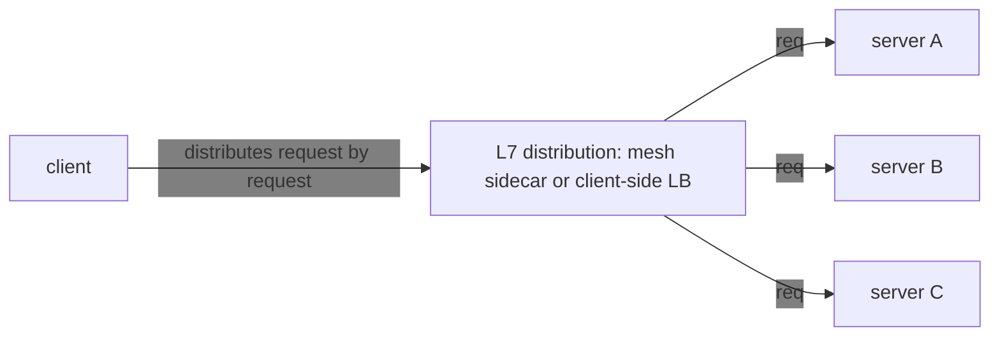
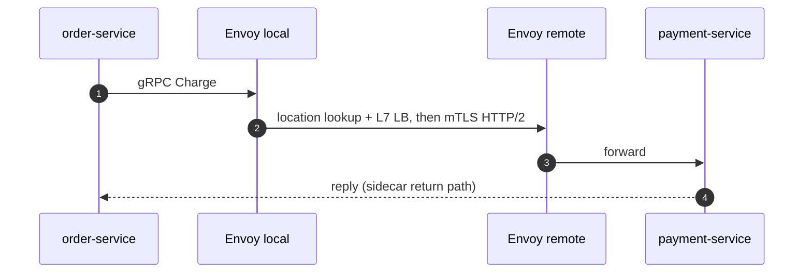
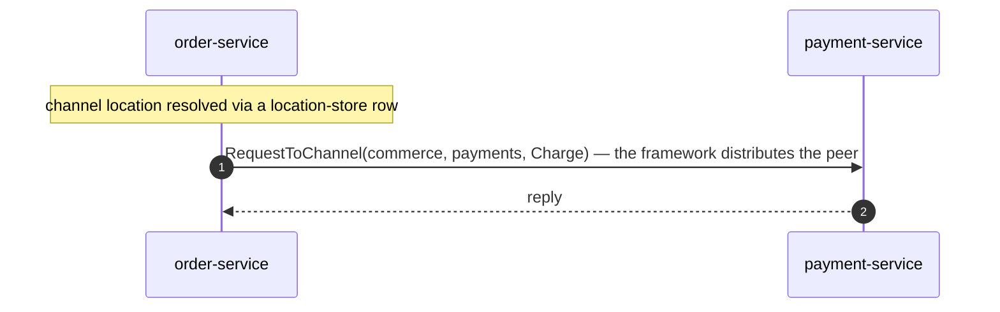

<!-- generated:start -->
<!-- This file is generated from `common/guide/server/17-alternative.en.md`. Do not edit directly.
     Edit the common source instead, then regenerate with `python3 doc/site/scripts/generate_language_guides.py`. -->
<!-- generated:end -->

<!-- framework-adapter-nav:start -->
[Guide Home](README.en.md) | [Previous: 16. Options — Configuration List And Defaults](16-options.en.md)
<!-- framework-adapter-nav:end -->

<!-- language-switch:start -->
View in another language — **C#/.NET** · [C++](../../../cpp/guide/server/17-alternative.en.md) · [Java](../../../java/guide/server/17-alternative.en.md) · [Kotlin](../../../kotlin/guide/server/17-alternative.en.md) · [Node/TypeScript](../../../node/guide/server/17-alternative.en.md)
<!-- language-switch:end -->

# 17. Where ZLink Fits — Internal Service Communication And Real-Time State Server Patterns

> **This chapter has no spec document that owns a contract.** It's an introductory
> discussion for deciding what to pick.
>
> **If you're building internal service communication or a real-time state server and
> weighing gRPC or Akka/Orleans, ZLink is a candidate to replace that slot.**
>
> ZLink isn't a plain RPC library — it's a **server-to-server, real-time messaging layer
> that bundles a logical channel, connection lifecycle, a dynamic state unit (SPOT),
> pub/sub, and location-based auto-connect into one framework** on the backend. It pays off
> especially when "where is the service," "where is the client connected," and "how do I
> serialize a state unit like a room/zone/symbol" **keep coming up as recurring problems.**
>
> If the three situations in `01. Overview` §2 (a real-time game server, adding real-time
> features to a web service, simplifying event-driven business processing) were "why you'd
> need it," this chapter is the introductory judgment document that takes that reasoning down
> to the level of a technology choice. The sample chapter covers the runnable business flow,
> and chapters 05–12 cover per-feature usage.

## 1. Where It's Used, At A Glance

Draw the boundary first. **If a monolith or modular monolith is enough, don't reach for
ZLink first.** A call between modules in the same process is just a function call — it
doesn't need server-to-server transport. ZLink is a tool for when you already have a reason
to split across several processes/servers, and you want to cut the complexity of the
communication, connection, routing, and state dispatch between them.

| Situation | Why ZLink helps | Feature used |
|------|--------------------|-----------|
| Internal services calling each other often | Call by **channel name** instead of host/port/stub | channel + location store |
| Broadcasting an event to several services in real time | **Transport fan-out** without a separate broker | fanout pub/sub |
| A dynamic state unit like a game room, chat room, or ride zone | Lock-free serial state processing via a **single execution queue** | SPOT |
| A long-lived connection to a mobile/game client | The framework owns connection lifecycle, framing, and the reconnect flow | STREAM |
| Separating the connection server from the logic server | **Reconnect portability** through ActorId-based binding | session actor dispatch |
| **Services implemented in different languages calling each other** | **Interoperable calls** over the same channel contract, on top of a language-neutral wire protocol + codec | cross-language binding |
| Ultra-low-latency HFT, a durable queue, a public external API | **Not ZLink's core territory** | keep gRPC/REST/Kafka/FIX |

## 2. What You Stop Having To Worry About — The Development Model

ZLink's felt benefit isn't that infrastructure components disappear — it's that **the
developer worries about less.** The application deals only with domain units
(channel/spot/session), and the framework handles the rest.

- **You call knowing only the channel name** — you don't know the target host/port/stub.
- **Service location and peer distribution** are handled by location-store-based
  auto-connect ([10-location](10-location.ko.md)).
- **Request correlation and waiting for a reply** are handled by the framework.
- **Client connection lifecycle and packet framing** are handled by STREAM.
- **Serial state for a room/zone/symbol** is handled by the SPOT execution queue.
- **Actor/session binding after a reconnect** is carried forward by the framework.
- **The handler/filter/DI model** matches how existing web frameworks work, so it feels
  familiar.

> ZLink doesn't **eliminate** these problems — it **pushes them out of the caller's way.**
> The framework handles location, connection, correlation, and dispatch serialization, so
> application code reads like **business flow**, not transport configuration.

### 2.1 Several Languages On One Channel (cross-language)

ZLink isn't tied to one language. Because the call contract is a **language-neutral wire
protocol (ZMP) + codec (protobuf/json/messagepack) + a logical channel/packet name**,
services implemented in different languages **call each other over the same channel**. For
example, in a game system you could put **the room server in C++ and the API/matchmaking
server in .NET or Java**, and message over the same channel/spot contract.

- The cross-language contract is a **packet name + a codec-encoded DTO** (protobuf is
  recommended across languages, or an agreed JSON/MessagePack schema). Unlike gRPC, it
  doesn't force service-stub code generation or HTTP/2 — only the payload schema is shared.
- Each language binding lays a handler/SPOT/STREAM surface on top of the same core (C ABI,
  ZMP). So even when the handler is written in a different language, on the wire it's the
  same channel and packet.

> **Different-language bindings.** The same channel/packet contract is implemented by each
> language's binding in its own language. This guide's examples are split into language
> tabs, and whichever tab you look at describes the same contract. Cross-language is a
> **design goal** of ZLink — the call contract doesn't depend on the binding's
> implementation language.

## 3. When These Problems Keep Recurring, ZLink Is A Candidate

Judge by **symptom**, not by technology name. If the following keep recurring, ZLink is a
candidate.

- The gRPC stub, channel factory, deadline, and service-location lookup setup repeat for
  every service.
- gRPC load isn't spreading evenly under a Kubernetes L4 LB, so you're considering a mesh.
- You're protecting a state unit like a game room, chat room, or ride zone with a lock.
- You separately track, in Redis, which server a client was connected to before a reconnect.
- You're using Kafka for real-time event fan-out, but you don't actually need replay.
- External client connections, internal service calls, and room-state processing are spread
  across different frameworks.

## 4. What ZLink Doesn't Do — The Boundary

For the benefits to be clear, the boundary has to be clear too. The following are correctly
left as-is.

| Requirement | ZLink's judgment |
|------|------------|
| A public-facing external HTTP API | Keep REST/gRPC |
| A durable queue, replay, consumer offsets | Keep Kafka/NATS |
| DB queries, geo-index, audit trail | Keep DB/Redis/event store |
| An HFT microsecond matching loop | Keep Disruptor/Aeron/FIX |
| Internal service communication + real-time state dispatch | **ZLink fits** |

The point: ZLink is a transport/dispatch layer, **not a datastore, a durable log, or an HFT
bus.** Domain-hard problems like distributed data consistency (saga, outbox, idempotency)
and persistence/duplicate control remain the application's and infrastructure's
responsibility.

## 5. Reference — Comparison With The gRPC/Service-Mesh Stack

Look at why "internal services calling each other often" in §1 is a ZLink candidate, with
the reasoning compared against the gRPC stack.

### 5.1 The Limits Of gRPC Alone

gRPC's own performance is excellent. The problem is that the official best practices for
making this kind of service **"production grade"** immediately call for additional
infrastructure.

- **Reusing channels/stubs is mandatory.** "Always re-use stubs and channels when possible"
  — creating a channel per call inflates latency significantly, so you manage the lifecycle
  yourself with a channel factory/pool.
  ([grpc.io performance](https://grpc.io/docs/guides/performance/))
- **A deadline on every call.** You attach a deadline so one slow RPC doesn't block an
  upstream service.
  ([Microsoft Learn](https://learn.microsoft.com/en-us/aspnet/core/grpc/performance))
- **The default load balancer (L4, per-connection distribution) doesn't spread gRPC load
  evenly.** Because gRPC keeps one connection open for a long time over HTTP/2 and
  multiplexes many requests over it, an L4 load balancer sees only one connection, and
  requests pile onto whichever server that connection first attached to. Since it's built on
  HTTP/2, per-request (L7) distribution is effectively required, so you typically add one of
  the following on top.
  - **Client-side LB**: the client holds the server list and calls them in rotation itself.
  - **A headless service** (Kubernetes): exposes the service not as one virtual IP but as
    **the IP list of each backing pod**, so the client distributes evenly on its own.
  - **An Envoy/Istio service-mesh sidecar**: a **proxy** auto-deployed alongside each
    service handles per-request (L7) distribution and encryption (mTLS) on its behalf.
  ([Kubernetes blog](https://kubernetes.io/blog/2018/11/07/grpc-load-balancing-on-kubernetes-without-tears/))
- **On top of that**, service-location lookup (Eureka/Consul/xDS), retry/hedging, the
  `.proto` pipeline, mTLS, and **event fan-out needs yet another separate broker**
  (Kafka/NATS).

L7 distribution splits work by looking at each individual request, not the connection — a
mesh sidecar or client-side LB plays this role.



In other words, "using gRPC" really means running **gRPC + an L7 LB (usually a mesh) +
service-location lookup + an event broker + a proto pipeline** together.

### 5.2 Deployment Shape Comparison

```text
[classic] gRPC + service mesh + broker + WS edge

  +------------------+          +------------------+
  | order-service    |          | payment-service  |
  | app + gRPC stub  |          | app + gRPC server|
  | Envoy sidecar    +--mTLS--->| Envoy sidecar    |
  +--------+---------+          +---------+--------+
           |                              |
           +-------------+----------------+
                         |
                +--------v---------+
                | service mesh ctl |
                | discovery + L7   |
                +------------------+

  +------------------+          +------------------+
  | event broker     |          | WS edge gateway  |
  +------------------+          +------------------+
```

```text
[ZLink] ZLink Framework  + location store

  +------------------+          +------------------+
  | order-service    |          | payment-service  |
  | app              | channel  | app              |
  | ZLink Framework  +--------->| ZLink Framework  |
  | channel client   | name     | channel server   |
  +--------+---------+          +---------+--------+
           |                              |
           +-------------+----------------+
                         |
                +--------v---------+
                | location store   |
                | descriptor rows  |
                +------------------+

  +------------------+          +------------------+
  | fanout channel   |          | STREAM session   |
  +------------------+          +------------------+
```

The Envoy sidecar and the mesh control plane's spot (service-location lookup, L7 LB, mTLS)
collapse into one layer: the framework plus the location store. The broker and the WS edge
can be absorbed into the fanout channel and STREAM if the need is simple real-time
propagation and connection admission; if you need a durable queue with replay, or HTTP-edge
policy, you keep them as-is.

### 5.3 The Path One Call Takes





### 5.4 Summary Of What Collapses

| gRPC best practice/required infrastructure | In ZLink | Note |
| --- | --- | --- |
| "Reuse stubs/channels" | The route client is a DI singleton and the framework manages the MeshNode connection lifecycle | Nothing to create per call |
| RPC deadline | `RequestToChannel(...).Timeout(...)` | The reply-wait duration |
| L7 load balancing (Envoy/Istio) | Channel name + store auto-connect distributes the peer | No sidecar needed |
| Interceptor | Handler filter | [5](05-channel-messaging.ko.md) §5 |
| Event broker (Kafka/NATS) | fanout channel pub/sub | Real-time fan-out only. A broker stays for persistence/replay |
| Unified observability (mesh telemetry) | The status stream and standard diagnostics | [11. Monitoring](11-monitoring.en.md) |
| Bidirectional streaming | STREAM session | Admits external clients. HTTP-edge policy is separate |

This comparison isn't trying to generalize which is better. gRPC is still a good choice when
a public external API, a standard RPC contract, or organization-standard tooling matters.
Performance also varies with payload size, codec, network, peer count, and deployment
shape, so no numeric claim is made here. The gain described here is that **the call path and
the number of operational components shrink** — a setup that used to go through an HTTP/2
proxy, a stub, and a separate broker collapses into one layer: the framework plus the
location store. If your organization's security policy or external ingress still needs it,
keep the existing mesh/LB alongside it.

## 6. Reference — Comparison With Distributed Actor Frameworks (Orleans/Akka)

The representative frameworks actually used for the ④ stateful-actor pattern in `01.
Overview` §2 are Microsoft Orleans and Akka. Because ZLink's SPOT/actor offers the same
primitives (mailbox serialization + location transparency), the candidates overlap for this
workload.

### 6.1 The Limits Of Orleans/Akka Alone

Orleans and Akka focus deeply on **a single actor primitive.** But to build "one real-time
state server," the subject of this guide, you still have to assemble the pieces outside the
actor yourself.

- **No external client connection.** Neither one bundles a protocol for a client to call a
  grain/actor directly. A web client is usually assembled with SignalR or a separate
  WebSocket server in front, which then calls into the actor.
- **Not polyglot.** Orleans is `.NET`-only, Akka is JVM-only (Akka.NET is a separate port).
  Combining a C++ room server with a `.NET` API server under the same contract is outside
  their design scope.
- **Service-to-service messaging is separate from actor calls.** Grain-to-grain calls exist,
  but there's no general service-messaging surface such as channel-name-based
  request/response or fanout — if you need one, you add gRPC or a message broker
  separately.

### 6.2 Deployment Shape Comparison

```text
[Orleans/Akka] actor cluster with separate edge

  +------------------+     +------------------+
  | web framework    |     | SignalR /        |
  | edge             +---->| WebSocket edge   |  (client gateway)
  +--------+---------+     +------------------+
           |
  +--------v---------+
  | Orleans/Akka     |
  | actor cluster    |
  | storage provider |
  | persistence      |
  +------------------+
```

```text
[ZLink] integrated stack

  +-----------------------------------------------+
  | web framework (ASP.NET Core / Spring / …)     |
  | STREAM clients / SPOT and actor state         |
  | channel messaging / location store            |
  +-----------------------------------------------+
```

Client connections, service messaging, and actor state — three separate layers — collapse
into one. But this picture doesn't hide everything either — it doesn't mean the auxiliary
tooling Orleans/Akka built up over a long time, like persistence connectors and reminder
schedulers, also collapses into one. The table below separates how much is a raw feature
difference from how much is a difference in whether this kind of pre-built tooling exists.

### 6.3 Feature Comparison — Advantages And Disadvantages

| Item | Orleans / Akka | ZLink |
| --- | --- | --- |
| Actor primitive (mailbox serialization + location transparency) | ✅ | ✅ (SPOT/actor) |
| Built-in external client connection | ❌ Assemble SignalR/WS separately | ✅ STREAM |
| Polyglot | ❌ Single language (.NET or JVM) | ✅ |
| Typed inter-service messaging + declared topology | ❌ Assemble separately (gRPC, etc.) | ✅ channel + location store |
| Actor state persistence | ✅ Mature provider ecosystem | ⚠️ Lifecycle hooks exist; no pre-built storage connector (① below) |
| Restoring a Spot timer after relocation | ✅ | ✅ Registration and the pending tick ride in the payload and restore automatically |
| Create a missing Actor or use an existing one | ✅ | ✅ `GetOrCreate` coordinates concurrent creation of the same ActorId |
| Waking a dormant actor at a scheduled time (reminder) | ✅ One API call (Orleans Reminder) | ❌ No dedicated API — compose with a distributed scheduler (② below) |
| Distributed transactions | Orleans has experimental support | ❌ None (the app composes a saga) — this is a genuine protocol-difficulty problem that can't be worked around with existing primitives |
| License | Orleans MIT / Akka BSL (a paid trigger based on annual revenue) | framework is FSL-1.1-ALv2, core/binding are MPL-2.0 — no revenue-based paid trigger (§7) |
| Time proven in production | 10+ years (Halo, Microsoft 365, Skype) | Short — this project itself is still in progress |

① **Actor state persistence** — lifecycle hooks like `OnCreateAsync`/`OnClosingAsync` are provided,
but which DB to use and how to store into it is left to the application to decide. This
means there's no bundle of pre-built storage connectors
([ShoppingMall](../../../common/sample/event/shoppingmall.en.md) is an example of this).

② **Reminder** — the application configures a distributed scheduler, such as Quartz.NET
Clustered or Hangfire, to run an Actor `GetOrCreate` or message at a scheduled time.

**Conclusion.** For this guide's workload — "build one real-time state server without
assembly" — ZLink is a substitute candidate. The Framework provides Actor/Spot lifecycle and
relocation-timer restoration. Persistent-state providers and scheduled-time reminders must
be composed by the application with its own storage and scheduler. Distributed transactions
aren't provided either. Whether to migrate an existing Orleans/Akka system should be decided
by weighing this difference together with your operational experience.

## 7. License — The Cost Of Using It

A technology choice comes bundled with its license terms. Akka is BSL, which requires a
commercial contract once annual revenue crosses a threshold; Orleans is MIT. ZLink's license
differs by layer.

| Layer | License |
| --- | --- |
| `core`, `bindings` — the messaging engine and per-language native bindings | [Mozilla Public License 2.0](../../../../../../LICENSE) |
| `framework` — the SPOT/actor, channel messaging, STREAM, and drain this guide covers | [Functional Source License 1.1, ALv2 Future License](../../../../../LICENSE) |
| Each language's `http-client` package | Apache License 2.0 |

**FSL-1.1-ALv2 in one line:** it only blocks selling a product that competes with ZLink;
everything else is allowed, and each release becomes Apache-2.0 two years after publication.

| | |
| --- | --- |
| Allowed | Building and shipping/selling your own product or service, internal company systems, education/research |
| Not allowed | A commercial product or service that replaces ZLink itself or provides substantially the same functionality |
| Cost | None. No usage fee, and no paid-conversion threshold like annual revenue |
| After two years | That release automatically converts to Apache-2.0 |

**Conclusion.** Whether it's a game server or a business server, there's no cost or
restriction on building it, running it as a service, and selling it. There's no trigger like
Akka's BSL that flips to paid once revenue grows large enough.

The reason `core` and `bindings` are MPL-2.0 is that `core` started from
[libzmq](https://github.com/zeromq/libzmq) v4.3.5, which is MPL-2.0. `http-client` is a thin
wrapper around each platform's conventional HTTP client library, so it's Apache-2.0.

The exact terms belong to [framework/LICENSE](../../../../../LICENSE); the policy background
belongs to
[doc/license/README.md](https://github.com/zlink-systems/zlink/blob/main/doc/license/README.md).

## 8. Related Documents

- Common business scenarios: [Framework Common Sample Scenarios](../../../common/sample/README.en.md)
- How to use it: [Channel Messaging](05-channel-messaging.ko.md)
- Surface mapping: [05-channel-messaging](05-channel-messaging.ko.md) §0, [13. Interface Catalog](13-interface-catalog.en.md) §1.6
- Samples as runnable code: [14-samples](14-samples.ko.md)

### References

- [gRPC Performance Best Practices](https://grpc.io/docs/guides/performance/)
- [Performance best practices with gRPC (.NET)](https://learn.microsoft.com/en-us/aspnet/core/grpc/performance)
- [gRPC Load Balancing on Kubernetes without Tears](https://kubernetes.io/blog/2018/11/07/grpc-load-balancing-on-kubernetes-without-tears/)
- [System Design Study: Netflix's adoption of Service Mesh](https://vivekbansal.substack.com/p/system-design-study-netflixs-adoption)
- [Scaling Microservices: Lessons from Netflix, Uber, Amazon, and Spotify](https://www.netguru.com/blog/scaling-microservices)
- [Orleans overview (Microsoft Learn)](https://learn.microsoft.com/en-us/dotnet/orleans/overview)
- [The impact of the Akka License Change (Coralogix)](https://coralogix.com/blog/akka-license-change/)
