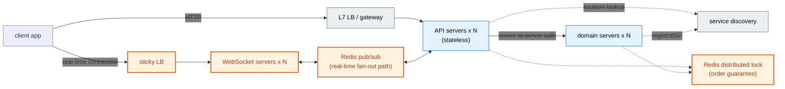
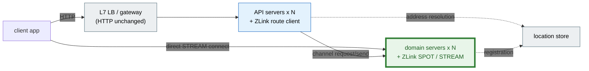

# ZLink Framework

**Existing frameworks designed for HTTP request-response don't handle TCP-based real-time
messaging.** ZLink Framework provides a messaging layer that meets that need, fully
integrated on top of `ASP.NET Core`, Spring Boot, NestJS, and a C++ host — the way Spring
MVC sits on top of Spring. There's no need to move to a separate runtime.

The area where this need shows up most clearly is real-time games, but it isn't limited to
that. Any system that keeps in-memory state like rooms, sessions, or players spread across
multiple servers and has to deliver it to clients in real time absorbs, into this one
layer, the complexity that an existing web service otherwise takes on when it bolts on
real-time features.

## The Purpose Of ZLink Framework

!!! note "Why there's never been a standard real-time messaging framework until now"

    Game servers make this problem clearest. The web shares a single shape — "respond when
    a request comes in" — which let standard frameworks like Spring and `ASP.NET Core`
    take hold. Game servers are different. The genre itself decides the topology: a board
    game's room-based matching, a MORPG's room/stage split from the lobby, an MMORPG's zone
    mesh and mass broadcast. With no shape to converge on, every team has redesigned its
    own topology starting from the socket layer.

    A second hard problem layers on top of this — state management. The web delegates state
    to a DB and scales out statelessly, but games keep room and participant state in memory
    and process it across multiple threads to protect response speed. From that point on,
    locks, contention, and deadlocks reach into the middle of business logic.

    The connection itself is also something to manage. Users hold long-lived connections,
    so the server takes on returning a reconnecting user to the room they were in, and
    protecting in-progress state when a node comes down for a deployment or scale-in.

    So for a long time the choice narrowed to two — build all of this yourself from
    scratch, or move to a separate runtime, a game server engine, and relearn everything
    from how you write code to how you deploy and operate it. The industry has actually
    used four major configurations, and in ZLink all four combine on top of one
    declarative model. How the four map to each other is covered in
    [Overview](dotnet/guide/server/01-overview.en.md) chapter 2.

## In Code

Code that, **inside a dungeon room**, defeats a boss and reflects part of the reward on the
player's guild too. The first is the player-side handler — it applies the kill reward to
the player, then sends a request to the guild. The second is the handler on the receiving
guild Instance Spot — it applies it as-is, with no synchronization. Both things show up at
once. **There's no lock** — both handlers are already processed serially, each inside its
own spot. And **the async call reads like synchronous code** — the request the player side
sends to the guild is just the next line, with no callback or futures composition.

=== "C#/.NET"

    ```csharp
    // Inside the dungeon room -- the handler that processes a boss kill.
    public sealed class DefeatBossHandler
        : IZLinkSpotRequestHandler<PlayerSpot, DefeatBossRequest, DefeatBossResult>
    {
        public async ValueTask<DefeatBossResult> HandleAsync(
            PlayerSpot player, DefeatBossRequest request, IZLinkMessageContext context, CancellationToken ct)
        {
            player.Exp += request.RewardExp;                // No lock -- serial inside this player's spot

            var reply = await context.Channel
                .RequestToSpot(player.GuildId, new GuildBenefitRequest(request.RewardExp / 10))
                .InstanceSpot("guild-workflow")
                .InMesh("guild")
                .Async<GuildBenefitResult>(ct);               // The async call reads just like the next line too

            return new DefeatBossResult(reply.Ok);
        }
    }
    ```

    ```csharp
    // One spot, cold-activated by guild_id, receives every request for this guild serially.
    public sealed class GuildBenefitHandler
        : IZLinkSpotRequestHandler<GuildSpot, GuildBenefitRequest, GuildBenefitResult>
    {
        public ValueTask<GuildBenefitResult> HandleAsync(
            GuildSpot guild, GuildBenefitRequest request, IZLinkMessageContext context, CancellationToken ct)
        {
            guild.Exp += request.Exp;                 // No lock -- serial inside this guild's spot
            return ValueTask.FromResult(new GuildBenefitResult(true));
        }
    }
    ```

=== "C++"

    ```cpp
    // Inside the dungeon room -- the handler that processes a boss kill.
    task_t<defeat_boss_result_t> player_spot_t::defeat_boss (const defeat_boss_request_t &request)
    {
        _exp += request.reward_exp;                          // No lock -- serial inside this player's spot

        auto reply = co_await channel.request_to_spot (_guild_id, guild_benefit_request_t{request.reward_exp / 10})
                         .instance_spot ("guild-workflow")
                         .in_mesh ("guild")
                         .submit<guild_benefit_result_t> ();  // The async call reads just like the next line too

        co_return defeat_boss_result_t{reply.ok};
    }
    ```

    ```cpp
    // One spot, cold-activated by guild_id, receives every request for this guild serially.
    task_t<guild_benefit_result_t> guild_workflow_spot_t::apply_benefit (const guild_benefit_request_t &request)
    {
        _exp += request.exp;                     // No lock -- serial inside this guild's spot
        co_return guild_benefit_result_t{true};
    }
    ```

=== "Java"

    ```java
    // Inside the dungeon room -- the handler that processes a boss kill.
    public final class DefeatBossHandler
        implements ZLinkSpotRequestHandler<PlayerSpot, DefeatBossRequest, DefeatBossResult> {

        @Override
        public CompletionStage<DefeatBossResult> handle(
            PlayerSpot player, DefeatBossRequest request, ZLinkMessageContext context) {

            player.setExp(player.getExp() + request.rewardExp());   // No lock -- serial

            return context.channel()
                .requestToSpot(player.getGuildId(), new GuildBenefitRequest(request.rewardExp() / 10))
                .instanceSpot("guild-workflow")
                .inMesh("guild")
                .submit(GuildBenefitResult.class)              // The async call chains just like the next line too
                .thenApply(reply -> new DefeatBossResult(reply.ok()));
        }
    }
    ```

    ```java
    // One spot, cold-activated by guild_id, receives every request for this guild serially.
    public final class GuildBenefitHandler
        implements ZLinkSpotRequestHandler<GuildSpot, GuildBenefitRequest, GuildBenefitResult> {

        @Override
        public CompletionStage<GuildBenefitResult> handle(
            GuildSpot guild, GuildBenefitRequest request, ZLinkMessageContext context) {

            guild.setExp(guild.getExp() + request.exp());   // No lock -- serial
            return CompletableFuture.completedFuture(new GuildBenefitResult(true));
        }
    }
    ```

=== "Kotlin"

    ```kotlin
    // Inside the dungeon room -- the handler that processes a boss kill.
    class DefeatBossHandler : ZLinkSpotRequestHandler<PlayerSpot, DefeatBossRequest, DefeatBossResult> {

        override suspend fun handle(
            player: PlayerSpot, request: DefeatBossRequest, context: ZLinkMessageContext
        ): DefeatBossResult {
            player.exp += request.rewardExp              // No lock -- serial inside this player's spot

            val reply = context.channel
                .requestToSpot(player.guildId, GuildBenefitRequest(request.rewardExp / 10))
                .instanceSpot("guild-workflow")
                .inMesh("guild")
                .submit(GuildBenefitResult::class.java)
                .await()                                       // The async call reads just like the next line too

            return DefeatBossResult(reply.ok)
        }
    }
    ```

    ```kotlin
    // One spot, cold-activated by guild_id, receives every request for this guild serially.
    class GuildBenefitHandler : ZLinkSpotRequestHandler<GuildSpot, GuildBenefitRequest, GuildBenefitResult> {

        override suspend fun handle(
            guild: GuildSpot, request: GuildBenefitRequest, context: ZLinkMessageContext
        ): GuildBenefitResult {
            guild.exp += request.exp         // No lock -- serial inside this guild's spot
            return GuildBenefitResult(true)
        }
    }
    ```

=== "Node/TypeScript"

    ```typescript
    // Inside the dungeon room -- the handler that processes a boss kill.
    export class DefeatBossHandler
      implements ZLinkSpotRequestHandler<PlayerSpot, DefeatBossRequest, DefeatBossResult> {

      async handle(
        player: PlayerSpot, request: DefeatBossRequest, context: ZLinkMessageContext
      ): Promise<DefeatBossResult> {
        player.exp += request.rewardExp;                     // No lock -- serial inside this player's spot

        const reply = await context.channel
          .requestToSpot(player.guildId, { exp: request.rewardExp / 10 })
          .instanceSpot('guild-workflow')
          .inMesh('guild')
          .submit<GuildBenefitResult>();                        // The async call reads just like the next line too

        return { ok: reply.ok };
      }
    }
    ```

    ```typescript
    // One spot, cold-activated by guild_id, receives every request for this guild serially.
    export class GuildBenefitHandler
      implements ZLinkSpotRequestHandler<GuildSpot, GuildBenefitRequest, GuildBenefitResult> {

      async handle(
        guild: GuildSpot, request: GuildBenefitRequest, context: ZLinkMessageContext
      ): Promise<GuildBenefitResult> {
        guild.exp += request.exp;                 // No lock -- serial inside this guild's spot
        return { ok: true };
      }
    }
    ```

Building the same thing with a Redis distributed lock means taking and releasing two locks
in a fixed order, and the code in between gets scattered across request/response callbacks.
None of that is here -- how calls between Spots and an Instance Spot actually behave is
covered in [06-spot](cpp/guide/server/06-spot.en.md).

- **Zero-downtime relocation** — bringing a node down doesn't drop in-progress rooms or
  users.
- **Call by name** — all you need is the channel name. No gateway, no service discovery.
- **No locks** — whether it's a dungeon room or a guild, one owning Spot always processes
  it serially.
- **A language-agnostic mesh** — C++, `.NET`, and Java share the same contract over the
  same channel.

## Reducing Complexity

Drawing the same system -- adding a real-time feature like chat or order tracking to a web
API -- two different ways makes the difference obvious at a glance.

**The existing approach.** Because a connection is pinned to a specific instance, you need
a sticky LB; real-time delivery between servers goes through a broker like Redis pub/sub;
and a distributed lock keeps order so multiple instances don't modify the same order at
once. Adding one real-time feature adds a set of components (orange) nearly as large as the
main system.



**The ZLink approach.** Every orange piece disappears, leaving one location store that
tells you where nodes, actors, and spots live. Server-to-server calls and real-time
delivery connect directly between runtimes.



Sticky LB, WebSocket server, pub/sub relay, distributed lock, service discovery -- five
pieces reduced to **one location store.** This doesn't replace an existing stack like Kafka
or Redis -- what ZLink cuts is the complexity of connection, routing, and state management
you used to assemble by hand in between, just to get real-time delivery working.

## Core Concepts

Every remaining chapter is just a combination of these five.

| | What it is | What it solves |
| --- | --- | --- |
| **channel** | A logical address for a server-to-server call. request/reply, send, pub/sub | Code never needs to know the target server's address |
| **Spot** | A unit that holds state and runs **serially**, like a room, stage, or zone | Processes requests arriving concurrently from multiple sources in order, in one place, so handler code needs no lock |
| **Actor** | A state object representing one connection/user. Held inside a Spot | Handles per-user message requests and manages their state |
| **STREAM** | A long-lived connection an external client attaches to (TCP / TLS / WS / WSS) | Socket framing and session lifetime management |
| **relocation** | The procedure that moves a Spot/Actor to another node | Offsets the weakness of a stateful system where state is pinned to a specific physical machine, keeping location transparency while enabling zero-downtime deployment |

## Where It Applies

Representative domains where the patterns described above actually show up. What they
share: multiple servers split roles and cooperate, and state changes are delivered to
clients in real time.

| Domain | Core scenario | What it solves |
| --- | --- | --- |
| Real-time games | Create room -> join -> update state -> client push | Serial processing of concurrent requests, zero-downtime relocation during deployment |
| Customer support chat | Open conversation -> assign agent -> relay messages -> status push | Per-conversation order guarantee, keeping the agent connection on reconnect |
| Order workflow | Take order -> process by stage -> change status -> notify | Per-order serial processing with no distributed lock |
| Delivery dispatch | Dispatch request -> assign/accept -> track status -> real-time push | Serial processing of dispatch status, real-time location push |

## Choosing A Language

The guide is **fully self-contained per language.** Inside the guide for the language you
pick, there's only that language's code, and you read it start to finish within it. The
switch line at the top of each chapter lets you view the same chapter in another language.

| Language | Server guide | Get started right away | Client-side guide |
| --- | --- | --- | --- |
| `.NET` | [Server](dotnet/guide/server/README.ko.md) | [Installation and first run](dotnet/guide/server/02-getting-started.ko.md) | [Stream Connector](dotnet/guide/stream-connector/README.en.md) · [HTTP Client](dotnet/guide/http-client/README.en.md) |
| C++ | [Server](cpp/guide/server/README.ko.md) | [Installation and first run](cpp/guide/server/02-getting-started.ko.md) | [Stream Connector](cpp/guide/stream-connector/README.en.md) · [HTTP Client](cpp/guide/http-client/README.en.md) |
| Java | [Server](java/guide/server/README.ko.md) | [Installation and first run](java/guide/server/02-getting-started.ko.md) | [Stream Connector](java/guide/stream-connector/README.en.md) · [HTTP Client](java/guide/http-client/README.en.md) |
| Kotlin | [Server](kotlin/guide/server/README.ko.md) | [Installation and first run](kotlin/guide/server/02-getting-started.ko.md) | [Stream Connector](kotlin/guide/stream-connector/README.en.md) · [HTTP Client](kotlin/guide/http-client/README.en.md) |
| Node.js | [Server](node/guide/server/README.ko.md) | [Installation and first run](node/guide/server/02-getting-started.ko.md) | [Stream Connector](node/guide/stream-connector/README.en.md) · [HTTP Client](node/guide/http-client/README.en.md) |

**The two client-side guides** cover libraries deployed separately from the server
framework. Stream Connector is the library a client uses to connect to a STREAM endpoint
(including Unity, Godot, and browsers), and HTTP Client is what a server uses to call an
external HTTP API.

Each language's guide home lays out what order to read in. Chapters 1-17 are shared across
all five languages, and C++-only DI, configuration, HTTP hosting, and the execution model
continue as chapters 18-21.

### How This Documentation Is Built

Concept and behavior explanations are the same regardless of language, so they're
**written once and generated into per-language guides** (`common/guide/server/` is the
source). Only chapters whose content itself actually differs by language -- installation,
options, the interface index -- are written directly per language. That's why the
explanation never drifts no matter which language you're reading.

## Related Documents

| | |
| --- | --- |
| Language-neutral meaning and the public contract | [Common Spec](common/README.ko.md) |
| The messaging engine underneath — socket patterns, transport, options | [Core Guide](https://kairos-code-dev.github.io/zlink/guide/01-overview/) · [Core Spec](https://kairos-code-dev.github.io/zlink/spec/core/) |
| Using Core directly from a language — the C API binding | [Bindings Guide](https://kairos-code-dev.github.io/zlink/bindings/guide/) · [Bindings Spec](https://kairos-code-dev.github.io/zlink/bindings/spec/) |
| Source and issues | [github.com/kairos-code-dev/zlink](https://github.com/kairos-code-dev/zlink) |

Core is the messaging engine this framework sits on top of. You don't need to reference it
when you're only using the framework -- go down to that documentation when you need to
handle socket-level behavior or transport options directly. The guide covers patterns and
usage; the spec covers the C API's functions, options, and error codes.

A binding is a thin layer that uses that C API from a language (.NET, C++, Java, Node.js,
Python, Go, Rust). Start here if you're using zlink from a language with no framework, or
you need a socket feature the framework doesn't wrap.
