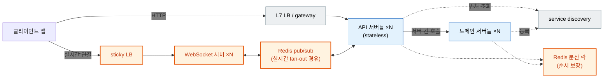
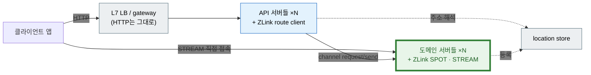

# ZLink Framework

**HTTP 요청-응답을 위해 설계된 기존 프레임워크는 TCP 기반의 실시간 메시징을
다루지 않는다.** ZLink Framework는 그 요구를 충족하는 메시징 계층을, Spring 위에
Spring MVC가 얹히듯 `ASP.NET Core` · Spring Boot · NestJS · C++ host 위에 완전히
통합된 형태로 제공한다. 별도 런타임으로 옮겨갈 필요가 없다.

가장 뚜렷하게 요구되는 영역은 실시간 게임이지만, 대상은 거기에 한정되지 않는다.
방·세션·플레이어처럼 메모리에 상주하는 상태를 여러 서버에 나눠 두고 client에
실시간으로 전달해야 하는 시스템이라면, 기존 web 서비스가 실시간 기능을 더하며
떠안던 복잡도도 이 계층 하나로 흡수한다.

## ZLink Framework 목적

!!! note "표준 실시간 메시징 프레임워크가 지금까지 없었던 이유"

    게임 서버가 이 문제를 가장 선명하게 드러낸다. 웹은 "요청이 오면 응답한다"는
    단일한 형태를 공유하기에 Spring과 `ASP.NET Core` 같은 표준 프레임워크가 자리
    잡을 수 있었다. 게임 서버는 사정이 다르다. 보드게임의 방 단위 매칭, MORPG의
    room/stage와 로비 분리, MMORPG의 zone mesh와 대규모 브로드캐스트처럼 장르가 곧
    토폴로지를 정한다. 하나로 수렴하는 형태가 없으니, 팀마다 소켓 계층부터 자신의
    토폴로지를 다시 설계해 왔다.

    여기에 상태 관리라는 두 번째 난제가 겹친다. 웹은 상태를 DB에 위임하고 stateless로
    scale-out하지만, 게임은 응답 속도를 지키려고 room과 참가자의 상태를 메모리에 두고
    여러 스레드로 처리한다. 그 순간부터 lock, 경합, 데드락이 업무 로직 한복판까지
    파고든다.

    연결 자체도 관리 대상이다. 유저는 장시간 연결을 유지하므로, 재접속한 유저를 원래
    있던 room으로 되돌리는 일과, 배포·축소로 노드를 내릴 때 진행 중인 상태를 지켜내는
    일까지 서버가 떠안는다.

    그래서 선택지는 오랫동안 둘로 좁혀져 있었다 — 이 모든 것을 처음부터 직접 만들거나,
    게임 서버 엔진이라는 별도 런타임으로 옮겨가 코드 작성 방식부터 배포·운영까지 다시
    배우거나. 업계가 실제로 써 온 구성 방식은 크게 넷이며, ZLink에서는 이 넷이 전부
    하나의 선언 모델 위에서 조합된다. 네 방식의 대응 관계는
    [개요](dotnet/guide/server/01-overview.ko.md) 2장이 다룬다.

## 코드로 보면

**던전 room 안에서** 보스를 처치하면, 그 보상의 일부를 소속 길드에도 반영하는
코드다. 첫 번째는 player 쪽 handler — 처치 보상을 플레이어에게 적용한 뒤 길드로
요청을 보낸다. 두 번째는 그 요청을 받는 guild Instance Spot의 handler — 동기화
없이 그대로 반영한다. 두 가지가 한 번에 보인다. **lock이 없다** — 두 handler 모두
각자의 spot 안에서 이미 직렬로 처리된다. 그리고 **비동기 호출이 동기 코드처럼
읽힌다** — player 쪽에서 길드로 보내는 요청도 콜백이나 futures 조합 없이 그냥
다음 줄이다.

=== "C#/.NET"

    ```csharp
    // 던전 room 안 — 보스 처치를 처리하는 handler.
    public sealed class DefeatBossHandler
        : IZLinkSpotRequestHandler<PlayerSpot, DefeatBossRequest, DefeatBossResult>
    {
        public async ValueTask<DefeatBossResult> HandleAsync(
            PlayerSpot player, DefeatBossRequest request, IZLinkMessageContext context, CancellationToken ct)
        {
            player.Exp += request.RewardExp;                // lock 없음 — 이 player의 spot 안에서 직렬

            var reply = await context.Channel
                .RequestToSpot(player.GuildId, new GuildBenefitRequest(request.RewardExp / 10))
                .InstanceSpot("guild-workflow")
                .InMesh("guild")
                .Async<GuildBenefitResult>(ct);               // 비동기 호출도 그냥 다음 줄처럼 읽힌다

            return new DefeatBossResult(reply.Ok);
        }
    }
    ```

    ```csharp
    // guild_id로 cold-activate된 spot 하나가 이 길드의 모든 요청을 직렬로 받는다.
    public sealed class GuildBenefitHandler
        : IZLinkSpotRequestHandler<GuildSpot, GuildBenefitRequest, GuildBenefitResult>
    {
        public ValueTask<GuildBenefitResult> HandleAsync(
            GuildSpot guild, GuildBenefitRequest request, IZLinkMessageContext context, CancellationToken ct)
        {
            guild.Exp += request.Exp;                 // lock 없음 — 이 guild의 spot 안에서 직렬
            return ValueTask.FromResult(new GuildBenefitResult(true));
        }
    }
    ```

=== "C++"

    ```cpp
    // 던전 room 안 — 보스 처치를 처리하는 handler.
    task_t<defeat_boss_result_t> player_spot_t::defeat_boss (const defeat_boss_request_t &request)
    {
        _exp += request.reward_exp;                          // lock 없음 — 이 player의 spot 안에서 직렬

        auto reply = co_await channel.request_to_spot (_guild_id, guild_benefit_request_t{request.reward_exp / 10})
                         .instance_spot ("guild-workflow")
                         .in_mesh ("guild")
                         .submit<guild_benefit_result_t> ();  // 비동기 호출도 그냥 다음 줄처럼 읽힌다

        co_return defeat_boss_result_t{reply.ok};
    }
    ```

    ```cpp
    // guild_id로 cold-activate된 spot 하나가 이 길드의 모든 요청을 직렬로 받는다.
    task_t<guild_benefit_result_t> guild_workflow_spot_t::apply_benefit (const guild_benefit_request_t &request)
    {
        _exp += request.exp;                     // lock 없음 — 이 guild의 spot 안에서 직렬
        co_return guild_benefit_result_t{true};
    }
    ```

=== "Java"

    ```java
    // 던전 room 안 — 보스 처치를 처리하는 handler.
    public final class DefeatBossHandler
        implements ZLinkSpotRequestHandler<PlayerSpot, DefeatBossRequest, DefeatBossResult> {

        @Override
        public CompletionStage<DefeatBossResult> handle(
            PlayerSpot player, DefeatBossRequest request, ZLinkMessageContext context) {

            player.setExp(player.getExp() + request.rewardExp());   // lock 없음 — 직렬

            return context.channel()
                .requestToSpot(player.getGuildId(), new GuildBenefitRequest(request.rewardExp() / 10))
                .instanceSpot("guild-workflow")
                .inMesh("guild")
                .submit(GuildBenefitResult.class)              // 비동기 호출도 그냥 다음 줄처럼 이어진다
                .thenApply(reply -> new DefeatBossResult(reply.ok()));
        }
    }
    ```

    ```java
    // guild_id로 cold-activate된 spot 하나가 이 길드의 모든 요청을 직렬로 받는다.
    public final class GuildBenefitHandler
        implements ZLinkSpotRequestHandler<GuildSpot, GuildBenefitRequest, GuildBenefitResult> {

        @Override
        public CompletionStage<GuildBenefitResult> handle(
            GuildSpot guild, GuildBenefitRequest request, ZLinkMessageContext context) {

            guild.setExp(guild.getExp() + request.exp());   // lock 없음 — 직렬
            return CompletableFuture.completedFuture(new GuildBenefitResult(true));
        }
    }
    ```

=== "Kotlin"

    ```kotlin
    // 던전 room 안 — 보스 처치를 처리하는 handler.
    class DefeatBossHandler : ZLinkSpotRequestHandler<PlayerSpot, DefeatBossRequest, DefeatBossResult> {

        override suspend fun handle(
            player: PlayerSpot, request: DefeatBossRequest, context: ZLinkMessageContext
        ): DefeatBossResult {
            player.exp += request.rewardExp              // lock 없음 — 이 player의 spot 안에서 직렬

            val reply = context.channel
                .requestToSpot(player.guildId, GuildBenefitRequest(request.rewardExp / 10))
                .instanceSpot("guild-workflow")
                .inMesh("guild")
                .submit(GuildBenefitResult::class.java)
                .await()                                       // 비동기 호출도 그냥 다음 줄처럼 읽힌다

            return DefeatBossResult(reply.ok)
        }
    }
    ```

    ```kotlin
    // guild_id로 cold-activate된 spot 하나가 이 길드의 모든 요청을 직렬로 받는다.
    class GuildBenefitHandler : ZLinkSpotRequestHandler<GuildSpot, GuildBenefitRequest, GuildBenefitResult> {

        override suspend fun handle(
            guild: GuildSpot, request: GuildBenefitRequest, context: ZLinkMessageContext
        ): GuildBenefitResult {
            guild.exp += request.exp         // lock 없음 — 이 guild의 spot 안에서 직렬
            return GuildBenefitResult(true)
        }
    }
    ```

=== "Node/TypeScript"

    ```typescript
    // 던전 room 안 — 보스 처치를 처리하는 handler.
    export class DefeatBossHandler
      implements ZLinkSpotRequestHandler<PlayerSpot, DefeatBossRequest, DefeatBossResult> {

      async handle(
        player: PlayerSpot, request: DefeatBossRequest, context: ZLinkMessageContext
      ): Promise<DefeatBossResult> {
        player.exp += request.rewardExp;                     // lock 없음 — 이 player의 spot 안에서 직렬

        const reply = await context.channel
          .requestToSpot(player.guildId, { exp: request.rewardExp / 10 })
          .instanceSpot('guild-workflow')
          .inMesh('guild')
          .submit<GuildBenefitResult>();                        // 비동기 호출도 그냥 다음 줄처럼 읽힌다

        return { ok: reply.ok };
      }
    }
    ```

    ```typescript
    // guild_id로 cold-activate된 spot 하나가 이 길드의 모든 요청을 직렬로 받는다.
    export class GuildBenefitHandler
      implements ZLinkSpotRequestHandler<GuildSpot, GuildBenefitRequest, GuildBenefitResult> {

      async handle(
        guild: GuildSpot, request: GuildBenefitRequest, context: ZLinkMessageContext
      ): Promise<GuildBenefitResult> {
        guild.exp += request.exp;                 // lock 없음 — 이 guild의 spot 안에서 직렬
        return { ok: true };
      }
    }
    ```

Redis 분산 락으로 같은 걸 만들면 락 두 개를 정해진 순서로 걸고 풀어야 하고, 그
사이 코드는 요청·응답 콜백에 흩어진다. 여기엔 그중 어느 것도 없다 — Spot 간 호출과
Instance Spot의 실제 동작은 [06-spot](cpp/guide/server/06-spot.ko.md)이 다룬다.

- **무중단 이전** — 노드를 내려도 진행 중인 방과 유저가 끊기지 않는다.
- **이름으로 호출** — channel name만 알면 된다. gateway도 서비스 디스커버리도 없다.
- **lock 없음** — 던전 room이든 길드든, 소유한 Spot 하나가 항상 직렬로 처리한다.
- **언어 무관 mesh** — 같은 계약을 C++ · `.NET` · Java가 같은 channel 위에서 공유한다.

## 복잡도 감소

웹 API에 채팅·주문 추적 같은 실시간 기능을 추가하는 같은 시스템을 두 방식으로
그리면 차이가 그림에서 바로 드러난다.

**기존 방식.** 연결이 특정 인스턴스에 고정되므로 sticky LB가 필요하고, 서버 간
실시간 전달은 Redis pub/sub 같은 브로커를 경유하며, 같은 주문을 여러 인스턴스가
동시에 수정하지 않도록 분산 락으로 순서를 지킨다. 실시간 기능 하나를 위해 본체에
준하는 구성 요소(주황)가 추가된다.



**ZLink 방식.** 주황 조각이 전부 사라지고, node·actor·spot의 위치를 알려주는
location store 하나가 남는다. 서버 간 호출과 실시간 전달은 runtime 간에 직접
연결된다.



sticky LB · WebSocket 서버 · pub/sub 경유 · 분산 락 · service discovery — 다섯 조각이
**location store 하나**로 줄었다. Kafka·Redis 같은 기존 스택을 대체하는 것이 아니다
— ZLink가 줄이는 것은 그 사이에서 실시간 전달을 위해 직접 조립하던 연결·라우팅·상태
관리의 복잡도다.

## 핵심 개념

나머지 장은 전부 이 다섯의 조합이다.

| | 무엇인가 | 해결하는 것 |
| --- | --- | --- |
| **channel** | 서버 간 호출의 논리 주소. request/reply · send · pub/sub | 대상 서버의 주소를 코드가 알 필요가 없다 |
| **Spot** | room · stage · zone처럼 상태를 쥐고 **직렬로** 실행되는 단위 | 여러 source에서 동시에 온 요청을 한곳에서 순서대로 처리해, handler 코드에 lock이 없어도 되게 한다 |
| **Actor** | 연결·사용자 하나를 대표하는 상태 객체. Spot 안에 둔다 | 사용자 단위 message 요청을 처리하고 그 상태를 관리한다 |
| **STREAM** | 외부 client가 붙는 장기 연결(TCP · TLS · WS · WSS) | 소켓 framing과 세션 수명 관리 |
| **relocation** | Spot·Actor를 다른 노드로 옮기는 절차 | state가 특정 물리 머신에 고정되는 stateful 시스템의 약점을 보완해, 위치 투명성을 유지한 채 무중단 배포를 가능하게 한다 |

## 적용 분야

앞서 설명한 패턴이 실제로 나타나는 대표 도메인이다. 여러 서버가 역할을 나눠
협력하고, 상태 변화를 client에 실시간으로 전달한다는 점이 공통이다.

| 도메인 | 핵심 시나리오 | 해결하는 지점 |
| --- | --- | --- |
| 실시간 게임 | 방 생성 → 입장 → 상태 갱신 → client push | 동시 요청의 직렬 처리, 배포 중 무중단 이전 |
| 고객 지원 채팅 | 대화 개설 → 상담원 배정 → 메시지 중계 → 상태 push | 대화 단위 순서 보장, 재접속 시 상담원 연결 유지 |
| 주문 워크플로 | 주문 접수 → 단계별 처리 → 상태 변경 → 알림 | 분산 락 없는 주문 단위 직렬 처리 |
| 배송·배차 | 배차 요청 → 배정·수락 → 상태 추적 → 실시간 push | 배차 상태의 직렬 처리, 실시간 위치 push |

## 언어 선택

가이드는 **언어마다 한 벌씩 완결되어 있다.** 고른 언어의 가이드 안에는 그 언어의 코드만
있고, 처음부터 끝까지 그 안에서 읽힌다. 장 머리의 전환 줄로 같은 장을 다른 언어에서 볼
수 있다.

| 언어 | 서버 가이드 | 바로 시작하기 | client 쪽 가이드 |
| --- | --- | --- | --- |
| `.NET` | [서버](dotnet/guide/server/README.ko.md) | [설치와 첫 동작](dotnet/guide/server/02-getting-started.ko.md) | [Stream Connector](dotnet/guide/stream-connector/README.ko.md) · [HTTP Client](dotnet/guide/http-client/README.ko.md) |
| C++ | [서버](cpp/guide/server/README.ko.md) | [설치와 첫 동작](cpp/guide/server/02-getting-started.ko.md) | [Stream Connector](cpp/guide/stream-connector/README.ko.md) · [HTTP Client](cpp/guide/http-client/README.ko.md) |
| Java | [서버](java/guide/server/README.ko.md) | [설치와 첫 동작](java/guide/server/02-getting-started.ko.md) | [Stream Connector](java/guide/stream-connector/README.ko.md) · [HTTP Client](java/guide/http-client/README.ko.md) |
| Kotlin | [서버](kotlin/guide/server/README.ko.md) | [설치와 첫 동작](kotlin/guide/server/02-getting-started.ko.md) | [Stream Connector](kotlin/guide/stream-connector/README.ko.md) · [HTTP Client](kotlin/guide/http-client/README.ko.md) |
| Node.js | [서버](node/guide/server/README.ko.md) | [설치와 첫 동작](node/guide/server/02-getting-started.ko.md) | [Stream Connector](node/guide/stream-connector/README.ko.md) · [HTTP Client](node/guide/http-client/README.ko.md) |

**client 쪽 가이드 둘**은 서버 framework와 따로 배포되는 라이브러리를 다룬다.
Stream Connector는 client가 STREAM endpoint에 접속하는 라이브러리이고(Unity ·
Godot · 브라우저 포함), HTTP Client는 서버가 외부 HTTP API를 호출할 때 사용한다.

어느 순서로 읽을지는 각 언어의 가이드 홈이 제시한다. 1~17장은 다섯 언어가 공유하고,
C++에만 있는 DI · configuration · HTTP hosting · 실행 모델이 18~21장으로 이어진다.

### 문서가 만들어지는 방식

개념과 동작 설명은 언어가 달라도 같으므로 **한 벌만 작성하고 언어별 가이드로
생성한다**(`common/guide/server/`가 소스다). 설치·옵션·인터페이스 색인처럼 내용
자체가 달라지는 장만 언어별로 직접 작성한다. 그래서 어느 언어를 보든 설명이
어긋나지 않는다.

## 관련 문서

| | |
| --- | --- |
| 언어 중립 의미와 공개 계약 | [공통 스펙](common/README.ko.md) |
| 그 아래 메시징 엔진 — 소켓 패턴, 전송, 옵션 | [Core 가이드](https://kairos-code-dev.github.io/zlink/guide/01-overview/) · [Core 스펙](https://kairos-code-dev.github.io/zlink/spec/core/) |
| Core를 언어에서 직접 쓸 때 — C API binding | [Bindings 가이드](https://kairos-code-dev.github.io/zlink/bindings/guide/) · [Bindings 스펙](https://kairos-code-dev.github.io/zlink/bindings/spec/) |
| 소스와 이슈 | [github.com/kairos-code-dev/zlink](https://github.com/kairos-code-dev/zlink) |

Core는 이 프레임워크가 얹히는 메시징 엔진이다. 프레임워크만 사용할 때는 참고할
필요가 없고, 소켓 수준의 동작이나 전송 옵션을 직접 다뤄야 할 때 그 문서로 내려간다.
가이드는 패턴과 사용법을, 스펙은 C API의 함수·옵션·오류 코드를 다룬다.

binding은 그 C API를 언어에서 사용하는 얇은 층이다(.NET · C++ · Java · Node.js ·
Python · Go · Rust). framework가 없는 언어에서 zlink를 쓰거나, framework가 감싸지
않은 소켓 기능이 필요할 때 여기서 시작한다.
