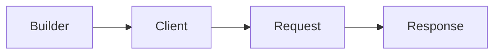

<!-- generated:start -->
<!-- This file is generated from `common/guide/http-client/02-getting-started.en.md`. Do not edit directly.
     Edit the common source instead, then regenerate with `python3 doc/site/scripts/generate_language_guides.py`. -->
<!-- generated:end -->

# Installation and the First Request

<!-- framework-adapter-nav:start -->
[Contents](README.en.md) | [Previous: HTTP Client Overview](01-overview.en.md) | [Next: Making Requests](03-making-requests.en.md)
<!-- framework-adapter-nav:end -->

<!-- language-switch:start -->
View in another language — [C++](../../../cpp/guide/http-client/02-getting-started.en.md) · [C#/.NET](../../../dotnet/guide/http-client/02-getting-started.en.md) · **Java** · [Kotlin](../../../kotlin/guide/http-client/02-getting-started.en.md) · [Node/TypeScript](../../../node/guide/http-client/02-getting-started.en.md)
{ .zlink-langswitch }
<!-- language-switch:end -->

!!! info "After reading this chapter"

    You can add the HTTP client package to a project, receive a typed GET response through one client,
    and choose a one-shot for a single request.

The HTTP client ships separately from the server framework. A calling process needs only the HTTP client package. The tutorial below creates a client and reads one profile.

## 1. Add the Package

```kotlin
dependencies {
    implementation("systems.zlink:zlink-http-client:<version>")
}
```

## 2. Create a Client and Send the First GET Request

A builder holding the base URL and default options creates a client. A request builder is created when a method such as GET or POST is selected from the client. A typed response terminator decodes the JSON body to the requested type and returns the response envelope. An asynchronous terminator does not occupy a thread or event loop while it waits for the result.

<!-- diagram: http-client-first-request -->


```java
--8<-- "framework/languages/java/tutorial/java/HttpClient/src/main/java/systems/zlink/tutorial/httpclient/HttpClientProgram.java:http-client-create"
--8<-- "framework/languages/java/tutorial/java/HttpClient/src/main/java/systems/zlink/tutorial/httpclient/HttpClientProgram.java:http-first-request"
```

## 3. Result

```text
first request: p1 rookie
```

## 4. A Single Request

A one-shot obtains its request builder directly from the client builder. It closes the client after completion, so it does not reuse a connection pool. A service that calls the same API repeatedly keeps a client as in the preceding section.

## Next Chapter

[Making Requests](03-making-requests.en.md) sets methods, paths, queries, headers, and per-request timeouts. [Handling Responses](05-handling-responses.en.md) chooses a response form, and [Client and Request Lifecycle](08-client-lifecycle.en.md) covers reuse and closing.
