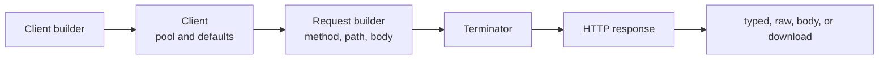

<!-- generated:start -->
<!-- This file is generated from `common/guide/http-client/08-client-lifecycle.en.md`. Do not edit directly.
     Edit the common source instead, then regenerate with `python3 doc/site/scripts/generate_language_guides.py`. -->
<!-- generated:end -->

# Client and Request Lifecycle

<!-- framework-adapter-nav:start -->
[Contents](README.en.md) | [Previous: Streaming](07-streaming.en.md) | [Next: Redirect, Retry, and Cookies](09-redirect-retry-cookie.en.md)
<!-- framework-adapter-nav:end -->

<!-- language-switch:start -->
View in another language — [C++](../../../cpp/guide/http-client/08-client-lifecycle.en.md) · [C#/.NET](../../../dotnet/guide/http-client/08-client-lifecycle.en.md) · **Java** · [Kotlin](../../../kotlin/guide/http-client/08-client-lifecycle.en.md) · [Node/TypeScript](../../../node/guide/http-client/08-client-lifecycle.en.md)
{ .zlink-langswitch }
<!-- language-switch:end -->

!!! info "After reading this chapter"

    You can decide when to reuse and close a client, how to finish a request builder, and where timeouts and options apply. The creation code comes from each language's `HttpClient` tutorial.

A client is a reusable unit that holds a base URL and transport options. A builder creates the client; a request builder gathers an HTTP method, path, and body. A terminator is the final call that submits the gathered request and selects its response form.

## 1. Flow from Builder to Response

<!-- diagram: http-client-client-lifecycle -->


The client keeps the connection pool and defaults for requests to the same target service. A request builder belongs to one request, and its terminator submits that request.

## 2. Create One Client and Reuse It

Create one client per service and reuse it for multiple requests. Building a client per request recreates keep-alive and the connection pool. Close the client through the language's resource-management mechanism when it is no longer needed.

```java
--8<-- "framework/languages/java/tutorial/java/HttpClient/src/main/java/systems/zlink/tutorial/httpclient/HttpClientProgram.java:http-client-create"
```

## 3. Choose a Terminator for the Response Form

A terminator submits the request builder as an HTTP request. The same response form has different language spellings; the names in the table identify the response role rather than the execution model of the calling site.

| Response form | C++ | C#/.NET | Java | Kotlin | Node/TypeScript |
| --- | --- | --- | --- | --- | --- |
| typed response | `async<T>()` | `Async<T>()` | `submit(Class<T>)` | `await<T>()` | `submit<T>()` |
| raw response | `async_raw()` | `AsyncRaw()` | `submitRaw()` | `awaitRaw()` | `submitRaw()` |
| body only | `fetch<T>()` | `Fetch<T>()` | `fetch(Class<T>)` | `fetch<T>()` | `fetch<T>()` |
| streaming download | `download(sink)` | `DownloadAsync(sink)` | `download(sink)` | `awaitDownload(sink)` | `download(sink)` |
| callback completion | `async<T>(callback)` | `Async<T>(callback)` | `submit(Class<T>, callback)` | replaced by a suspend function | `submit<T>(callback)` |
| gate return | `yield<T>()` | `Yield<T>()` | `yield(Class<T>)` | `yield<T>()` | `yield<T>()` |
| blocking CLI | `submit<T>()` / `submit_raw()` | unavailable | unavailable | unavailable | unavailable |

## 4. Distinguish the Two Timeout Boundaries

The client `timeout` defaults to 3000ms; a request builder `timeout` changes the per-attempt timeout only for that request. A request with retry enabled applies this timeout to every attempt. There is no option that sets one deadline over all retries.

## 5. Await Asynchronous Completion

An asynchronous terminator does not occupy the caller thread or event loop while the network is pending. Await completion through the language's asynchronous composition mechanism. A blocking terminator exists only for C++ CLI and client scenarios; it cannot be used in a framework runtime execution context.

## 6. Set Client Options in One Place

| Option | Default | Meaning |
| --- | --- | --- |
| `baseUrl` | required | base URL for every request path |
| `timeout` | 3000ms | per-attempt timeout |
| `defaultHeader` | none, accumulated | default header attached to every request |
| `basicAuth` | off | Basic authentication |
| `bearerToken` | off | Bearer authentication |
| `maxResponseBodySize` | 16 MiB | body limit applied after decompression too |
| `trustCertificateFile` | system roots | adds a trusted PEM certificate |
| `clientCertificateFile` | off | mTLS client certificate and key |
| `followRedirects` | off; 5 when called without an argument | automatic redirect limit |
| `retry` | off; 0 attempts | additional retry attempts |
| `cookies` | off | enables the cookie jar |
| `proxy` | off | `http://` proxy URL |
| `proxyBasicAuth` | off | proxy Basic authentication |
| `compression` | off | requests gzip/deflate and decodes transparently |

[Authentication, TLS, and Proxy](06-auth-tls-proxy.en.md) covers authentication and proxy options, [Streaming](07-streaming.en.md) covers streaming exceptions, and [Redirect, Retry, and Cookie](09-redirect-retry-cookie.en.md) covers redirect and retry rules.

## 7. A One-Shot Is a Single Convenience Path

A client builder can start an HTTP method directly. This one-shot path creates its client when submitted and closes it after completion, so it does not reuse the connection pool. It fits a single administrative operation, but repeated and high-load calls should use a reusable client.

## 8. Next Chapter

[Redirect, Retry, and Cookie](09-redirect-retry-cookie.en.md) covers automatic redirect, retry, and cookie-jar rules.
