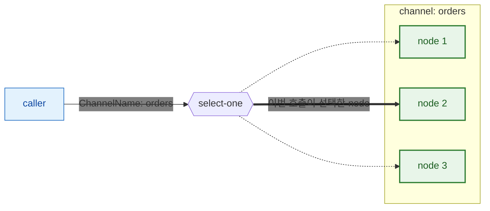
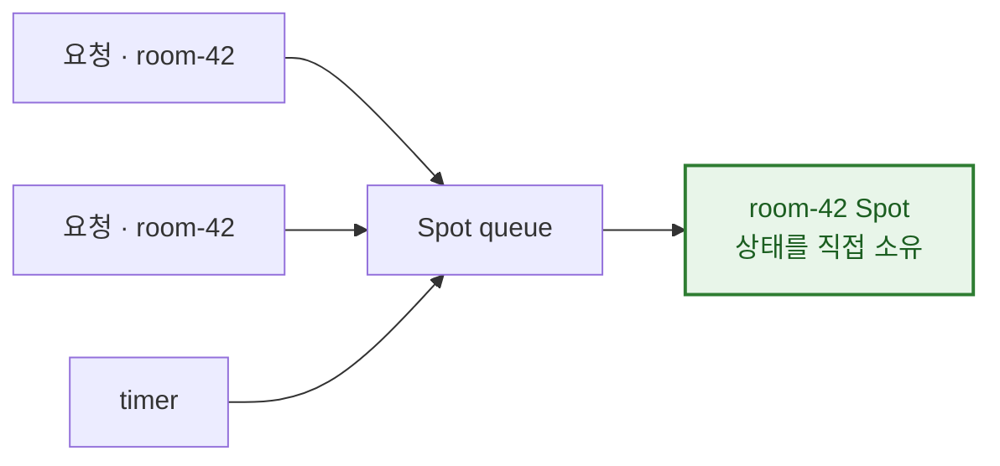
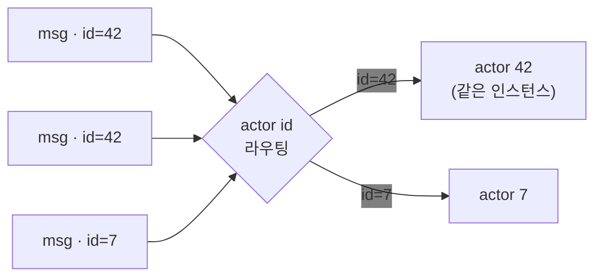
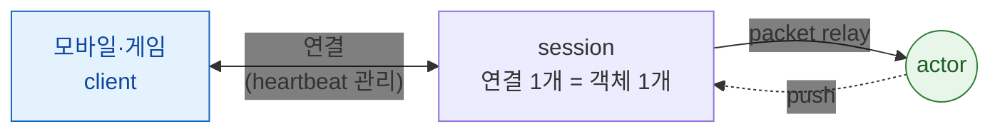
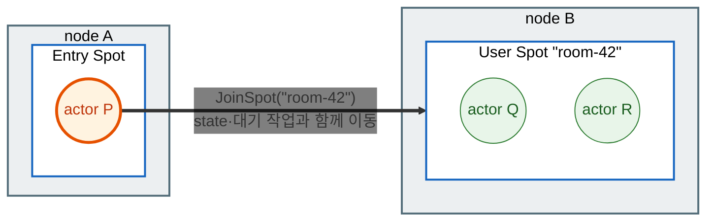
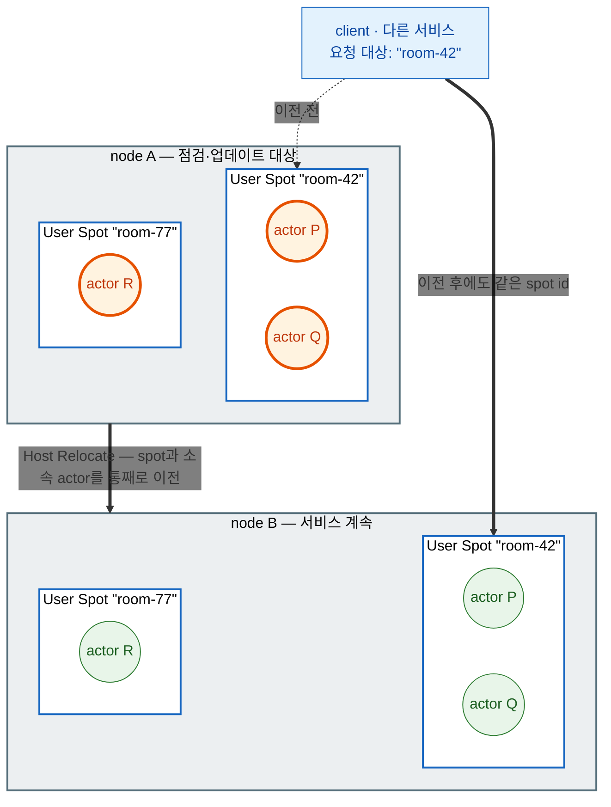

<!-- generated:start -->
<!-- 이 파일은 `common/guide/server/03-concepts.ko.md`에서 생성한다. 직접 고치지 않는다.
     고칠 곳은 공통 소스이고, `python3 doc/site/scripts/generate_language_guides.py`로 다시 만든다. -->
<!-- generated:end -->

<!-- framework-adapter-nav:start -->
[가이드 홈](README.ko.md) | [이전: 2. 시작하기](02-getting-started.ko.md) | [다음: 4. Backpressure — 처리보다 도착이 빠를 때](04-backpressure.ko.md)
<!-- framework-adapter-nav:end -->

<!-- language-switch:start -->
다른 언어로 보기 — [C#/.NET](../../../dotnet/guide/server/03-concepts.ko.md) · [C++](../../../cpp/guide/server/03-concepts.ko.md) · **Java** · [Kotlin](../../../kotlin/guide/server/03-concepts.ko.md) · [Node/TypeScript](../../../node/guide/server/03-concepts.ko.md)
<!-- language-switch:end -->

# 3. 핵심 개념

> **이 장의 계약 소유 문서** — [Framework 개요](../../../common/spec/02-overview.ko.md)와
> [상호작용 모델](../../../common/spec/03-interaction-model.ko.md)이 개념의 정식 의미를,
> [언어별 handler 인터페이스 계약](../../../common/spec/server/languages/README.ko.md)이
> 인터페이스의 정식 정의를 소유한다. 이 문서는 그 의미가 코드에서 어떤 모양으로 보이는지
> 정리한다.

ZLink framework는 **channel · spot · actor · stream · location**을 핵심 개념으로
제공한다. 나머지 챕터는 전부 이 개념들의 변주다.
아래에서 차례로 보고, 중간에 actor·spot이 다른 node로 옮겨가는
[relocation](#5-relocation--다른-node로-옮겨가기)을 함께 다룬다. 각 개념을 실제로
작성하고 운영하는 방법은 뒤의 전용 장이 소유한다.

## 1. channel — 서버 간 연결

**MeshNode**가 서버 간 연결의 기초 단위다. MeshNode 하나 위에 독립적인 두 역할을
추가한다.

- **Object role** — spot·actor를 배치하는 자리다.
  [spot](#2-spot--상태를-소유하고-순서대로-처리하는-단위),
  [actor](#3-actor--id로-식별되는-상태-객체)에서 각각
  설명한다.
- **Channel role** — request·send·publish를 주고받는 자리다. 이 문서에서 설명한다.

`ChannelName`은 그 mesh 안에서 같은 기능을 맡은 node들을 묶는 논리 이름이다 —
주소(`host:port`) 대신 `"orders"` 같은 이름으로 호출 대상을 고른다. 호출자는
route client에 `ChannelName`만 넘긴다 — `MeshName`은 등록에서 정해지고 호출
인자에 나타나지 않는다.

호출자는 지금 어느 node가 그 요청을 처리하는지 몰라도 된다. 주소도 node 번호도 아닌
논리 이름(`ChannelName`, spot id, actor id)만 넘기면, 그 이름이 지금 어느 node에 있든
framework가 찾아서 전달한다. 이렇게 **대상이 어디 있는지 호출자가 몰라도 되는 성질**을
위치 투명성이라 한다. channel·spot·actor 모두 이 방식으로 동작한다. 그래서 서버를
늘리거나(scale-out) 줄여도(scale-in) 호출 코드는 그대로다.

`ChannelName`으로 메시지를 전송하면 framework가 그 순간 요청을 받을 수 있는 node 중
하나를 선택해 전달한다 — 이 선택을 **select-one**이라 한다.



같은 `orders` channel을 맡은 node가 셋이면 호출마다 그중 하나가 선택된다. 호출자는
어느 node가 선택됐는지 알지 못하고, 알 필요도 없다.

MeshNode 하나에 두 역할을 함께 얹은 모양은 이렇다.

```java
ZLinkMeshNodeBuilder mesh = options.addRouteMesh("services"); // MeshNode 하나가 mesh "services"에 참여한다.
mesh.listen("tcp://0.0.0.0:7101");                            // 다른 node가 접속할 자기 endpoint.

mesh.objects().server();                   // Object role — 이 node에 spot·actor를 배치한다.
mesh.channelName("orders").server();       // Channel role — "orders" 요청을 이 node가 처리한다.
mesh.channelName("billing").client();      // 호출만 하는 channel은 client다.
```

peer 주소를 코드에 적지 않고 서버 증감을 따라가는 자동 연결은
[10-location](10-location.ko.md)이 다룬다.

> **주의:** `MeshName`과 `ChannelName`은 서로 다른 이름이다. 하나의 mesh에 여러
> `ChannelName`을 등록할 수 있고, 서로 다른 mesh에서 같은 `ChannelName`을 사용할 수도 있다.

"channel"이라는 이름을 쓰는 등록은 아래와 같고, 소켓을 공유하는지가 다르다.

| 종류 | 소켓 |
| --- | --- |
| route mesh channel | 이미 열려있는 MeshNode 소켓을 공유한다 |
| ClientServer channel | MeshNode와 별개인 자기 소켓을 연다 |
| fanout channel | 독자적인 PUB/SUB 소켓을 연다 |

pub/sub도 두 갈래다. route mesh channel 위에서 Spot끼리 주고받는 **Logical Multicast**는
mesh 소켓을 그대로 쓰고, **fanout channel**은 자기 소켓으로 연결된 구독자 전원에게
전달한다. 셋의 구조 비교와 사용법은
[05-channel-messaging §1](05-channel-messaging.ko.md#1-channel-종류)이 다룬다.

## 2. spot — 상태를 소유하고 순서대로 처리하는 단위

게임 방 하나, 길드 하나, 경매 물건 하나처럼 **여러 요청이 같은 상태를 동시에 건드리는
대상**이 있다.
이를 직접 만들면 그 상태를 지금 어느 process가 들고 있는지 찾아 요청을 그리로 보내는
일과, 도착한 요청들이 상태를 동시에 건드리지 않게 막는 일을 함께 챙겨야 한다.
상태를 process 메모리에 두면 앞의 라우팅을 직접 관리해야 하고, DB나 Redis에 두면
요청마다 읽고 쓰면서 락을 잡아야 한다.

spot은 이 둘을 framework가 맡는다. 대상을 **메모리에 살아 있는 객체 하나**로 두고,
그 앞으로 온 요청을 **한 줄로 세워 차례로** 처리한다. 동시에 두 요청이 같은 상태를
건드리는 상황 자체가 생기지 않으니 락이 필요 없다.

id로 주소를 지정한다는 점이 channel과 다르다. `"orders"` channel로 전송하면 그 일을
할 수 있는 아무 node나 처리한다. 반면 `"room-42"` 같은 spot id로 요청을 보내면, 그
spot이 존재하는 node가 메시지를 받아 그 spot에게 전달해 처리하도록 한다. 그 node가
어디인지는 [앞에서 본](#1-channel--서버-간-연결) 위치 투명성 그대로 framework가 찾는다.



spot은 MeshNode의 **Object role**에 등록한다. 같은 MeshNode의 Channel role과는
별개 표면이다.

spot은 만들어지는 시점에 따라 **Entry Spot · User Spot · Instance Spot** 세 종류로
나뉘고, 어떤 작업이 동시에 실행되는지는 **execution mode**가 정한다. 세 종류의 차이,
execution mode 선택, 등록·lifecycle·timer·outbound는 [06-spot](06-spot.ko.md)이 다룬다.

## 3. actor — ID로 식별되는 상태 객체

actor는 **ID로 식별되는 상태 보유 객체**다. 같은 ID로 온 메시지는 늘 같은
인스턴스가 처리한다. actor는 항상 어떤 spot에 속하며, 외부 client 연결과 묶는 방법은
[다음 절](#4-stream--외부-client-연결)에서 이어진다.



상세는 [07-actor-spot](07-actor-spot.ko.md).

## 4. stream — 외부 client 연결

stream은 모바일·게임 같은 **외부 client와의 연결 지향 양방향 채널**이다. 서버
간 [channel](#1-channel--서버-간-연결)과 달리 서버가 연결 수명·heartbeat를 관리하고,
연결 하나가 서버 측 **session** 객체에 대응한다. 연결이 끊긴 뒤 다시 연결하는 동작은
client connector가 담당한다.

session을 [actor](#3-actor--id로-식별되는-상태-객체)에 **bind**하면, 그 연결로 들어온
메시지를 session이 직접 처리하지 않고 bind된 actor로 relay한다. 반대 방향도 같아서
actor가 보내는 push는 그 actor에 bind된 session을 통해 client로 나간다.



그래서 **연결을 받는 node와 도메인 로직을 실행하는 node를 나눌 수 있다.** session은
gateway node에 두고 actor는 다른 node에 두어도, relay 경로는 framework가 유지한다.
actor가 [relocation](#5-relocation--다른-node로-옮겨가기)으로 옮겨가도 같은 session이
새 위치로 이어진다.

상세는 [09-stream](09-stream.ko.md), session과 actor를 bind하는 방법은
[08-actor-session](08-actor-session.ko.md)이 다룬다.

## 5. relocation — 다른 node로 옮겨가기

actor나 spot이 지금 owner node를 떠나 다른 node에서 계속 실행되는 것을 relocation이라
한다. 서로 다른 두 계기로 시작된다.

actor는 spot에 속하고, spot은 node에 속한다. relocation은 이 소속 관계를 그대로
유지한 채 실행되는 node만 바뀌는 것이다.

**actor가 다른 node의 spot에 join할 때.** actor가 어떤 User Spot에 join을 요청했는데
그 spot이 다른 node에 있으면, join이 받아들여지는 순간 actor가 상태와 대기 중인 작업을
그대로 들고 그 node로 옮겨간다. application이 요청해서 일어나는 이동이다.



join 호출이 지정하는 것은 **`room-42`라는 spot id뿐**이고, 대상 node를 지정하는 인자는
없다. 그 spot을 지금 어느 node가 가지고 있는지는 framework가 location store에서 찾아
actor P를 그 node로 옮긴다. 그래서 node A와 node B라는 이름은 application 코드 어디에도
나타나지 않는다. 이동이 끝나면 actor P는 node B의 `room-42` spot에 소속되어 Q·R와 같은
실행 규칙을 따른다.

**무중단 점검·배포로 host를 옮길 때.** 운영자가 한 host의 spot과 actor를 다른 host로
옮긴다. application이 개별 join을 요청하지 않아도 framework가 처리하며, 완료된 뒤
원래 host를 종료할 수 있다.



상태를 들고 있는 서버는 그 상태 때문에 함부로 내릴 수 없어서, 점검이나 배포를 하려면
연결을 끊고 기다리게 만드는 것이 보통이다. Host
Relocate는 spot과 actor의 state를 그대로 유지하면서 다른 node로 옮겨 node A를 비운다.
호출하는 쪽은 여전히 `room-42`라는 같은 id로 요청하므로 이전 사실을 알 필요가 없다.
결과적으로 **stateful 서비스를 stateless 서비스처럼 무중단으로 교체**할 수 있다.

두 경로 모두 **같은 relocation policy**를 따른다. 이동할 때 application 상태를 어떻게
할지(옮기지 않음 · 새로 만듦 · 그대로 복원)를 spot·actor factory 등록에서 하나
고정하며, 실행 중에는 바꾸지 않는다.

policy 종류와 선택 기준은 [07-actor-spot §1](07-actor-spot.ko.md), actor join 호출과
완료 결과 수신은 [07-actor-spot §5](07-actor-spot.ko.md), 무중단 점검·배포로서의
Host Relocate와 이전 단위 구분은 [12-operations §2](12-operations.ko.md)가 다룬다.

## 6. location — 주소 해석

Application 코드는 channel 이름 같은 논리 이름만 사용하고, 실제 peer 주소(`host:port`)는
배포 전체가 공유하는 **location store**가 해석한다. 각 서버는 시작할 때 자기 위치를
descriptor로 store에 등록하고, 호출하는 쪽은 논리 이름으로 store에서 대상을 찾아
연결한다. 서버 구성이 바뀌면 연결도 갱신된다.

사용법은 [10-location](10-location.ko.md), 계약은
[공통 스펙](../../../common/spec/21-location-runtime.ko.md)이 정의한다.

store 없이 endpoint를 등록에 직접 지정하는 수동 연결도 지원한다 — 개발·테스트와
소규모 고정 배포에 사용한다([05-channel-messaging §6](05-channel-messaging.ko.md)).
같은 MeshNode에서 두 방식을 함께 사용할 수는 없다.

> **샘플에서 보기 — [TicTacToe](../../../common/sample/tictactoe/README.ko.md).** 이 개념들이
> 한 샘플에 전부 나오는 가장 작은 예다. Play 서버의 등록 코드 한 곳에서 모두 만난다.
>
> | 개념 | TicTacToe에서 |
> | --- | --- |
> | channel | Play 서버가 독립 `tictactoe.api` ClientServer Channel로 인증 정보를 조회한다 |
> | spot | 대국 한 판이 `TicTacToeGame` spot 하나 — 두 플레이어의 수가 이 안에서 직렬 처리된다 |
> | actor | 플레이어가 actor이고, 재접속해도 같은 actor로 이어져 두던 판을 계속한다 |
> | stream | client가 API 응답의 Play STREAM endpoint에 직접 연결해 수를 두고 push를 받는다 |
> | location | Redis location store가 새 `TicTacToeGame` spot을 만들 Play node를 자동으로 고른다 — API 코드에 특정 Play node 주소가 없다 |
>
> 각 개념이 어떤 문제를 푸는지는 위에서 봤고, **함께 놓이면 어떤 모양인지**는
> 이 샘플이 보여 준다.

## 7. 무엇을 하려면 어디서 시작하나

개념을 잡았으면 다음 질문은 "그래서 어느 표면을 잡느냐"다. 시작 지점은 **여덟 갈래**이고,
전부 DI나 현재 handler context에서 얻는다. **application이 transport socket이나 endpoint를
직접 고르지 않는다.**

| 하려는 일 | 시작 표면 | 지정하는 대상 |
| --- | --- | --- |
| node를 직접 지정하거나 channel 이름으로 보내기 | route client | node 직접은 MeshName과 대상 RID, channel은 ChannelName |
| Spot에 보내기 | spot client | 전역 Spot ID |
| Actor에 보내기 | actor client | 전역 Actor ID |
| User Spot 만들거나 찾기 | spot manager | Spot type과 필요하면 전역 Spot ID |
| Actor 만들거나 찾기 | actor manager | 전역 Actor ID와 Actor type |
| Logical Multicast 발행 | spot publisher client | ChannelName과 topic |
| classic pub/sub 발행 | fanout client | fanout ChannelName과 필요하면 topic |
| STREAM client에 보내거나 응답 | session client | 현재 session |

정확한 타입 이름은 언어를 따른다 — [13. Interface 카탈로그](13-interface-catalog.ko.md)이 소유한다.

**완료의 뜻은 두 갈래로 통일되어 있다.** send 계열은 **보낼 자리가 수락**하면 반환값 없이
끝나고, request 계열은 **reply · timeout · route 오류** 중 하나로 끝난다. 어느 표면을
쓰든 같다([04-backpressure §3](04-backpressure.ko.md#3-api에-드러나는-backpressure)).

## 8. Framework가 맡는 것과 맡지 않는 것

**아래는 전부 framework가 안에서 처리한다.** application 코드에 나타나지 않는다.

| 맡는 것 |
| --- |
| transport 주소 선택과 peer 재연결 |
| multipart framing과 packet codec |
| reply correlation |
| backpressure queue |

**반대로 이것들은 이 framework의 계약 범위가 아니다.** 외부 edge에서 처리한다.

| 맡지 않는 것 |
| --- |
| 외부 client 인증과 quota |
| WAF |
| 공개 API 버전 관리 |
| 과금 |

서버 사이 통신과 실시간 상태 서버가 이 framework의 자리다. 인터넷에 직접 노출하는
edge의 정책은 그 앞단이 소유한다.

## 9. 관련 문서

- request/send/pub-sub 전체 사용법과 handler 작성·`async` 실행 모델:
  [05-channel-messaging](05-channel-messaging.ko.md)
- spot 종류·실행 모델·handler 수명과 DI scope: [06-spot](06-spot.ko.md)
- host 수명주기와 운영: [12-operations](12-operations.ko.md)
- 등록 지점과 계층 구조: [01. Overview](01-overview.ko.md)
- 전체 인터페이스/attribute/context: [언어별 handler 인터페이스 계약](../../../common/spec/server/languages/README.ko.md)
- 실행 코드로 보고 싶을 때 고를 샘플: [14-samples](14-samples.ko.md)
