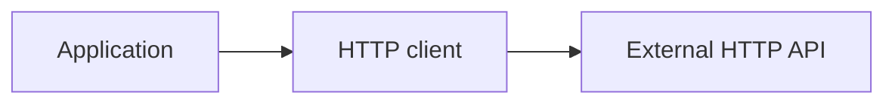

<!-- generated:start -->
<!-- This file is generated from `common/guide/http-client/01-overview.en.md`. Do not edit directly.
     Edit the common source instead, then regenerate with `python3 doc/site/scripts/generate_language_guides.py`. -->
<!-- generated:end -->

# HTTP Client Overview

<!-- framework-adapter-nav:start -->
[Contents](README.en.md) | [Next: Installation and the First Request](02-getting-started.en.md)
<!-- framework-adapter-nav:end -->

<!-- language-switch:start -->
View in another language — [C++](../../../cpp/guide/http-client/01-overview.en.md) · [C#/.NET](../../../dotnet/guide/http-client/01-overview.en.md) · [Java](../../../java/guide/http-client/01-overview.en.md) · **Kotlin** · [Node/TypeScript](../../../node/guide/http-client/01-overview.en.md)
{ .zlink-langswitch }
<!-- language-switch:end -->

!!! info "After reading this chapter"

    You can decide when an application inside or outside the server framework should use the HTTP client
    for an external HTTP API, and know its boundary.

The HTTP client is a client-side library that sends application requests to an external HTTP API and receives responses. The five languages differ only in names and notation; they provide the same semantics for building requests and choosing responses.

## 1. Where to Use the HTTP Client

A handler in the server framework, a CLI, a batch process, and a separate client process can all call an external HTTP API. Create one client and reuse it for repeated calls. Use a one-shot for a single call; a one-shot builds a request directly from the builder.

<!-- diagram: http-client-overview -->


The following example previews the first request with a typed response. A typed response contains the status, headers, and a JSON-decoded body.

```kotlin
--8<-- "framework/languages/java/tutorial/kotlin/HttpClient/src/main/kotlin/systems/zlink/tutorial/httpclient/HttpClientProgram.kt:http-first-request"
```

## 2. Boundary with the Server HTTP Surface

The HTTP client calls an external API. It does not open server HTTP routes or receive server requests, and it is not a browser replacement for `fetch`.

The HTTP client provides request methods, headers, bodies, and response rules. The external API's routes, authentication policy, and request and response DTOs belong to the application.

## 3. Follow the Flow in the Tutorial

The `HttpClient` tutorial for each language runs client creation, JSON requests, response forms, authentication, streams, and errors in one process. Start with [Installation and the First Request](02-getting-started.en.md).

## Next Chapter

[Installation and the First Request](02-getting-started.en.md) adds the package and runs the first GET request.
