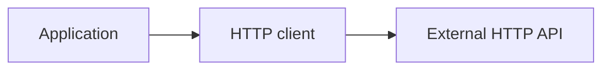

<!-- generated:start -->
<!-- 이 파일은 `common/guide/http-client/01-overview.ko.md`에서 생성한다. 직접 고치지 않는다.
     고칠 곳은 공통 소스이고, `python3 doc/site/scripts/generate_language_guides.py`로 다시 만든다. -->
<!-- generated:end -->

# HTTP client 개요

<!-- framework-adapter-nav:start -->
[목차](README.ko.md) | [다음: 설치와 첫 요청](02-getting-started.ko.md)
<!-- framework-adapter-nav:end -->

<!-- language-switch:start -->
다른 언어로 보기 — [C++](../../../cpp/guide/http-client/01-overview.ko.md) · [C#/.NET](../../../dotnet/guide/http-client/01-overview.ko.md) · [Java](../../../java/guide/http-client/01-overview.ko.md) · **Kotlin** · [Node/TypeScript](../../../node/guide/http-client/01-overview.ko.md)
{ .zlink-langswitch }
<!-- language-switch:end -->

!!! info "이 장을 읽고 나면"

    서버 framework 안팎의 application이 외부 HTTP API를 호출할 때 HTTP client를 선택하고,
    이 client가 맡지 않는 경계를 안다.

HTTP client는 application이 외부 HTTP API에 요청을 보내고 응답을 받는 client-side library다. 다섯 언어는 이름과 표기만 다르며, 요청을 만들고 응답을 고르는 같은 의미론을 제공한다.

## 1. HTTP client를 쓰는 자리

서버 framework 안의 handler도, framework를 올리지 않는 CLI·배치·별도 client process도 외부 HTTP API를 호출할 수 있다. 반복 호출에는 client 하나를 만들어 재사용하고, 한 번뿐인 호출에는 one-shot을 사용한다. one-shot은 builder에서 곧바로 요청을 만드는 편의 경로다.

<!-- diagram: http-client-overview -->


다음 예제는 typed 응답을 받는 첫 요청을 미리 보인다. typed 응답은 status·header와 JSON으로 해석한 body를 함께 담는다.

```kotlin
--8<-- "framework/languages/java/tutorial/kotlin/HttpClient/src/main/kotlin/systems/zlink/tutorial/httpclient/HttpClientProgram.kt:http-first-request"
```

## 2. 서버 HTTP 표면과의 경계

HTTP client는 외부 API를 호출하는 쪽의 도구다. 서버가 HTTP route를 열고 request를 받는 기능은 이 client의 범위가 아니며, browser의 `fetch`를 대체하는 API도 아니다.

요청의 method·header·body와 응답 처리 규칙은 HTTP client가 제공한다. 외부 API의 route, 인증 정책, 요청·응답 DTO는 application이 소유한다.

## 3. tutorial로 흐름 확인하기

각 언어의 `HttpClient` tutorial은 client 생성부터 JSON 요청, 응답 종류, 인증, stream, 오류까지 한 process에서 실행한다. [설치와 첫 요청](02-getting-started.ko.md)에서 그 첫 단계부터 시작한다.

## 다음 장

[설치와 첫 요청](02-getting-started.ko.md)에서 package를 추가하고 첫 GET 요청을 실행한다.
