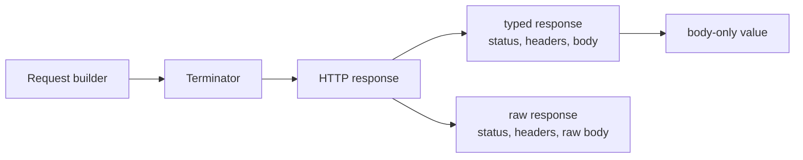

<!-- generated:start -->
<!-- This file is generated from `common/guide/http-client/05-handling-responses.en.md`. Do not edit directly.
     Edit the common source instead, then regenerate with `python3 doc/site/scripts/generate_language_guides.py`. -->
<!-- generated:end -->

# Handling Responses

<!-- framework-adapter-nav:start -->
[Contents](README.en.md) | [Previous: Request Bodies](04-request-body.en.md) | [Next: Authentication, TLS, and Proxy](06-auth-tls-proxy.en.md)
<!-- framework-adapter-nav:end -->

<!-- language-switch:start -->
View in another language — [C++](../../../cpp/guide/http-client/05-handling-responses.en.md) · [C#/.NET](../../../dotnet/guide/http-client/05-handling-responses.en.md) · [Java](../../../java/guide/http-client/05-handling-responses.en.md) · **Kotlin** · [Node/TypeScript](../../../node/guide/http-client/05-handling-responses.en.md)
{ .zlink-langswitch }
<!-- language-switch:end -->

!!! info "After reading this chapter"

    You can choose typed, raw, or body-only responses for their intended use. The code in this chapter comes from each language's `HttpClient` tutorial.

The HTTP client changes only the response form on the same request builder. A typed response is the default for reading a JSON body as a type; choose a raw response when application code must inspect status and headers. [Response Rules](10-response-rules.en.md) covers status-specific handling.

## 1. Use a Typed Response by Default

A typed response carries the status, headers, and a JSON-decoded body. Use it for a successful JSON API call. A typed response ends as an exception when the HTTP status is 400 or higher, so choose a raw response when the error body is required.

<!-- diagram: http-client-request-response -->


The response form does not change the request sent. It determines whether application code keeps status and headers or leaves only a JSON body value.

```kotlin
--8<-- "framework/languages/java/tutorial/kotlin/HttpClient/src/main/kotlin/systems/zlink/tutorial/httpclient/HttpClientProgram.kt:http-response-kinds"
```

## 2. Read HTTP Details from a Raw Response

A raw response carries the status, headers, and body before JSON decoding. A 4xx or 5xx response is returned as a raw response when its transfer succeeds, so use it when branching on a status or reading an API error body.

Use the body-only terminator when only the body is required. It leaves only the successful JSON value in the calling flow and does not return status or headers.

!!! note "Choose the response form first"

    Use a typed response for a normal JSON API, a raw response where HTTP status and error body are handled directly, and a body-only response where no other response information is needed.

## 3. Read a Compressed Response Transparently

`compression` requests `gzip` and `deflate`, then decodes the response body. It also removes the `content-encoding` header from the decoded response, so application code handles the body as if no compression were used. The body limit still applies after decoding.

```kotlin
--8<-- "framework/languages/java/tutorial/kotlin/HttpClient/src/main/kotlin/systems/zlink/tutorial/httpclient/HttpClientProgram.kt:http-compressed-response"
```

## 4. Next Chapter

[Authentication, TLS, and Proxy](06-auth-tls-proxy.en.md) covers credentials, certificates, and proxy configuration.
