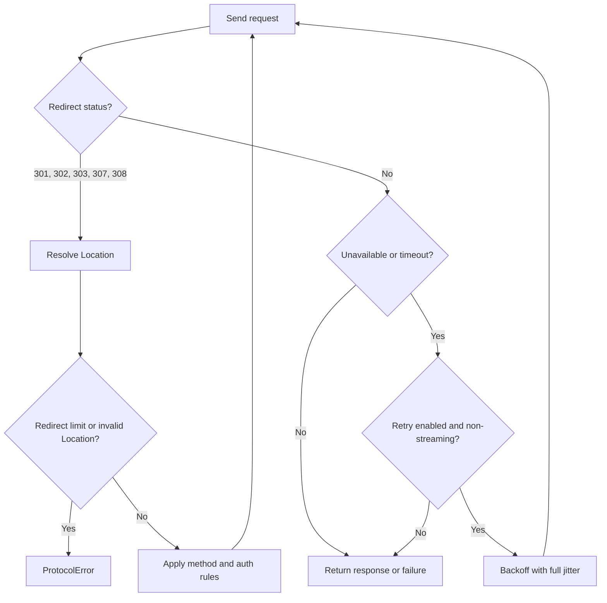

<!-- generated:start -->
<!-- 이 파일은 `common/guide/http-client/09-redirect-retry-cookie.ko.md`에서 생성한다. 직접 고치지 않는다.
     고칠 곳은 공통 소스이고, `python3 doc/site/scripts/generate_language_guides.py`로 다시 만든다. -->
<!-- generated:end -->

# Redirect·Retry·Cookie

<!-- framework-adapter-nav:start -->
[목차](README.ko.md) | [이전: Client와 요청의 생애](08-client-lifecycle.ko.md) | [다음: 응답 처리 규칙](10-response-rules.ko.md)
<!-- framework-adapter-nav:end -->

<!-- language-switch:start -->
다른 언어로 보기 — [C++](../../../cpp/guide/http-client/09-redirect-retry-cookie.ko.md) · [C#/.NET](../../../dotnet/guide/http-client/09-redirect-retry-cookie.ko.md) · [Java](../../../java/guide/http-client/09-redirect-retry-cookie.ko.md) · **Kotlin** · [Node/TypeScript](../../../node/guide/http-client/09-redirect-retry-cookie.ko.md)
{ .zlink-langswitch }
<!-- language-switch:end -->

!!! info "이 장을 읽고 나면"

    redirect를 추적할 때 요청이 어떻게 바뀌는지, 자동 retry의 범위와 cookie jar가 저장하는 범위를 판단할 수 있다.

외부 API의 주소는 이동할 수 있고 네트워크는 일시적으로 실패한다. redirect는 서버가 알려 준 다음
주소로 요청을 이어 가는 기능이고, retry는 전송 실패한 operation을 다시 시도하는 기능이다. 둘을
무조건 켜면 POST가 다른 의미로 실행되거나 같은 요청이 여러 번 처리될 수 있으므로, 이 장의 경계를
확인한 뒤 필요한 client에만 설정한다.

## 1. redirect를 켠 요청

redirect 추적은 기본으로 꺼져 있다. 아래 tutorial은 이전 player 주소를 읽을 때 추적을 켠 client를
사용한다.

```kotlin
--8<-- "framework/languages/java/tutorial/kotlin/HttpClient/src/main/kotlin/systems/zlink/tutorial/httpclient/HttpClientProgram.kt:http-redirect"
```

```console
redirect: 200 p1
```

## 2. redirect가 요청을 바꾸는 경우

redirect는 `location`의 절대 URL과 상대 URL을 해석한다. 301·302에서 GET과 HEAD는 method와 body를
유지하지만 POST는 GET으로 바꾸고 body를 제거한다. 303은 언제나 GET으로 바꾸며, 307·308은 method와
body를 유지한다. streaming body는 되감아 다시 읽을 수 없으므로 307·308에서도 다음 요청으로 넘기지
않는다.

<!-- diagram: http-client-redirect-retry -->


다른 origin으로 이동하면 `Authorization` header를 제거한다. origin은 scheme, host, port가 모두 같은
경우에만 같으므로, 같은 origin 안에서만 인증 정보를 보존한다. redirect 중간 응답의 body는 비우고
최종 응답만 호출자에게 전달한다.

추적 횟수의 기본 한도는 5이며, 한도를 넘거나 `location`을 해석하지 못하면 `protocolError`로 끝난다.
원 요청을 다시 보내지 않는다.

## 3. retry가 다시 시도하는 실패

retry는 network·DNS·proxy CONNECT처럼 target을 현재 사용할 수 없는 실패와, 시도별 timeout만 다시
시도한다. HTTP 4xx와 5xx status는 retry 대상이 아니다. `retry(attempts)`의 attempts는 추가 횟수이므로
총 시도 수는 `1 + attempts`다.

시도 사이에는 상한 `min(1초, 50ms × 2^attempt)`의 지수 backoff를 두고, 0부터 그 상한까지 full jitter를
적용한다. timeout도 각 시도에 따로 적용되므로 전체 operation의 최대 대기 시간은 시도 수와 지연의
합으로 늘어난다.

**streaming upload와 download는 retry하지 않는다.** provider와 sink는 이미 읽거나 전달한 byte를 다시
만들 수 없기 때문이다. 요청을 application이 새로 시작할지는 요청의 idempotency와 서버의 중복 처리
규칙을 확인해 결정한다.

## 4. cookie jar의 저장 범위

cookie jar는 응답의 `Set-Cookie`를 client 안에 저장해 다음 요청에 붙이는 저장소다. 활성화하지 않으면
cookie를 저장하거나 보내지 않는다. 활성화한 jar는 host가 정확히 같은 cookie만 고르며 `domain` 속성은
해석하지 않는다.

`path`는 기본 `/`이고 path segment prefix에 맞을 때만 적용한다. `secure` cookie는 HTTPS 요청에만
붙고, `Max-Age`가 0 이하이면 즉시 삭제한다. `Expires`, `HttpOnly`, `SameSite`는 해석하지 않는다.
host마다 최대 128개를 보관하며 넘치면 가장 오래된 cookie부터 제거한다. 형식이 잘못된 `Set-Cookie`는
무시한다.

## 5. 자주 발생하는 문제

| 증상 | 원인 |
|---|---|
| redirect 뒤 인증이 사라진다 | 목적지가 다른 origin이어서 `Authorization`을 제거했다. |
| POST body가 redirect 뒤에 전달되지 않는다 | 301·302의 POST 또는 303이 GET으로 바뀌며 body를 제거했다. |
| 같은 요청이 기대보다 여러 번 서버에 도달한다 | retry가 전송 실패나 timeout을 다시 시도했다. 중복 처리 방지는 application과 서버가 정한다. |
| cookie가 다른 subdomain으로 전달되지 않는다 | jar는 host 정확 일치만 사용하며 `domain` 속성을 해석하지 않는다. |

## 6. 다음 장

- status와 JSON decode의 처리 경로 — [응답 처리 규칙](10-response-rules.ko.md)
- retry 뒤에 남는 오류 kind — [오류 처리](11-error-handling.ko.md)
