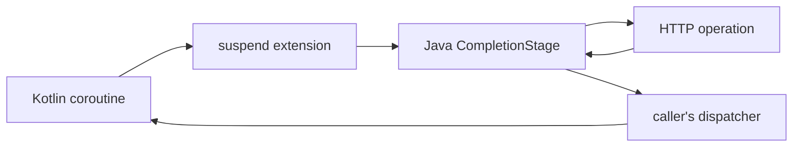

# Kotlin Coroutine Integration

<!-- framework-adapter-nav:start -->
[Contents](README.en.md) | [Previous: Error Handling](11-error-handling.en.md)
<!-- framework-adapter-nav:end -->

!!! info "After reading this chapter"

    You can await an HTTP request from a Kotlin coroutine and distinguish cancellation boundaries from dispatcher boundaries.
    The code example comes from the Kotlin `HttpClient` tutorial; the coroutine bridge behavior is verified against the Kotlin public interface.

Kotlin extensions turn the Java HTTP client's `CompletionStage` into suspend functions. `await` waits for a typed
response, `awaitRaw` for a raw response, `fetch` for a decoded body, and `awaitDownload` for download completion.
This chapter covers why those extensions do not occupy a thread and where a coroutine resumes.

## 1. Suspend extensions bridge CompletionStage

<!-- diagram: http-client-kotlin-coroutines -->


`await`, `awaitRaw`, `fetch`, `awaitDownload`, and `yield` are suspend functions. The extensions resume the
coroutine when the `CompletionStage` completes, so no thread is occupied while an HTTP response is pending. `yield`
is the server request builder terminator that waits while retaining the current execution turn.

The tutorial below reads a typed response through the body-only suspend extension.

```kotlin title="framework/languages/java/tutorial/kotlin/HttpClient/src/main/kotlin/systems/zlink/tutorial/httpclient/HttpClientProgram.kt"
--8<-- "framework/languages/java/tutorial/kotlin/HttpClient/src/main/kotlin/systems/zlink/tutorial/httpclient/HttpClientProgram.kt:http-first-request"
```

## 2. Separate coroutine cancellation from HTTP cancellation

`awaitWithoutCancellingOperation` separates a coroutine wait from ownership of an HTTP operation that has already
been submitted. Cancelling the coroutine prevents that coroutine from resuming, but cancellation does not propagate
to the HTTP operation. Its retry, body reading, and client lease therefore continue under the submitted request's rules.

!!! warning "Cancellation boundary"

    Do not assume that cancelling a coroutine stops the underlying HTTP request. Establish the business boundary for stopping work with timeout and response-lifetime rules.

## 3. The dispatcher chooses where resumption occurs

After an extension completes, its continuation resumes on the calling coroutine's dispatcher. The HTTP client does
not choose a separate dispatcher. Wrap a CPU-bound or framework operation in `withContext` when it must run on a
different dispatcher.

This separates HTTP I/O waiting from the placement of follow-up work. Long-running work in a download sink occupies
the callback's execution lane, so a sink should hand work off when further processing needs a separate coroutine boundary.

## 4. Keep runBlocking in CLI code

Handler, actor, and spot paths call the HTTP extensions directly from suspend functions. `runBlocking` belongs only
in a CLI or test that deliberately occupies its calling thread. Using it in a runtime handler turns an asynchronous
wait into an occupied-thread wait.

## 5. Next chapters

- Client defaults and the complete execution model — [Client and Request Lifecycle](08-client-lifecycle.en.md)
- Error kinds and retry decisions — [Error Handling](11-error-handling.en.md)
