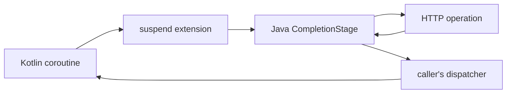

# Kotlin 코루틴 통합

<!-- framework-adapter-nav:start -->
[목차](README.ko.md) | [이전: 오류 처리](11-error-handling.ko.md)
<!-- framework-adapter-nav:end -->

!!! info "이 장을 읽고 나면"

    Kotlin coroutine에서 HTTP 요청을 suspend로 기다리고, 취소와 dispatcher 경계를 구분할 수 있다.
    코드 예제는 Kotlin `HttpClient` tutorial에서, coroutine bridge의 동작은 Kotlin 공개 인터페이스에서 확인했다.

Kotlin 확장은 Java HTTP client가 돌려주는 `CompletionStage`를 suspend 함수로 잇는다. `await`는 typed
응답을, `awaitRaw`는 raw 응답을, `fetch`는 decoded body를, `awaitDownload`는 download 완료를 기다린다.
이 장은 이 확장이 thread를 점유하지 않는 이유와 coroutine 경계를 다룬다.

## 1. Suspend 확장이 CompletionStage를 잇는다

<!-- diagram: http-client-kotlin-coroutines -->


`await`·`awaitRaw`·`fetch`·`awaitDownload`·`yield`는 suspend 함수다. 확장은 `CompletionStage`가
완료될 때 coroutine을 재개하므로 HTTP 응답을 기다리는 동안 thread를 점유하지 않는다. `yield`는
server request builder에서 현재 execution turn을 유지하며 완료를 기다리는 종결자다.

다음 tutorial은 typed 응답을 body만 받는 suspend 확장으로 읽는다.

```kotlin title="framework/languages/java/tutorial/kotlin/HttpClient/src/main/kotlin/systems/zlink/tutorial/httpclient/HttpClientProgram.kt"
--8<-- "framework/languages/java/tutorial/kotlin/HttpClient/src/main/kotlin/systems/zlink/tutorial/httpclient/HttpClientProgram.kt:http-first-request"
```

## 2. Coroutine 취소와 HTTP 요청 취소를 구분한다

`awaitWithoutCancellingOperation`은 coroutine의 대기와 이미 제출한 HTTP operation의 소유권을 분리한다.
coroutine을 취소하면 그 coroutine은 재개되지 않지만, HTTP operation에는 취소가 전파되지 않는다. 따라서
retry, body 읽기, client lease는 제출된 요청의 규칙대로 계속된다.

!!! warning "취소 경계"

    coroutine 취소로 하부 HTTP 요청을 멈출 수 있다고 가정하면 안 된다. 요청을 멈춰야 하는 업무 경계는 timeout과 응답 수명 규칙으로 설정한다.

## 3. 재개 위치는 dispatcher가 정한다

확장이 완료된 뒤 continuation은 호출한 coroutine의 dispatcher에서 재개된다. HTTP client가 별도의
dispatcher를 고르는 것이 아니다. CPU 작업이나 framework 작업을 다른 dispatcher에서 실행해야 하면
`withContext`로 그 범위를 감싼다.

이 규칙은 HTTP I/O 대기와 후속 작업의 실행 위치를 분리한다. download sink 안에서 오래 걸리는 작업을
실행하면 해당 callback을 호출한 실행 줄을 점유하므로, 필요한 경우 sink에서는 전달만 하고 후속 작업을
별도 coroutine 경계에서 처리한다.

## 4. runBlocking은 CLI에만 둔다

handler, actor, spot 경로는 suspend 함수 안에서 HTTP 확장을 직접 호출한다. `runBlocking`은 CLI와
테스트처럼 호출 thread를 의도적으로 점유하는 곳에만 둔다. runtime handler에서 `runBlocking`을 사용하면
비동기 대기를 thread 점유 대기로 바꾼다.

## 5. 다음 장

- client 기본값과 실행 모델 전체 — [Client와 요청의 생애](08-client-lifecycle.ko.md)
- 오류 kind와 재시도 판단 — [오류 처리](11-error-handling.ko.md)
