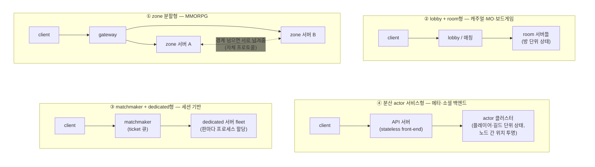
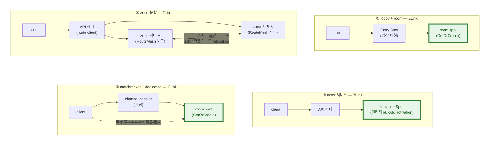
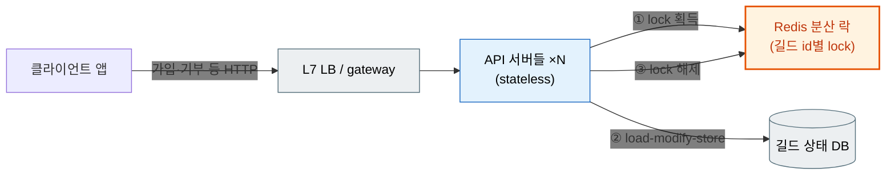
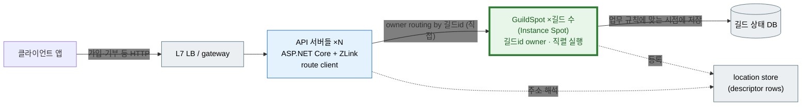
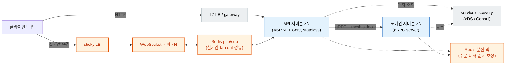
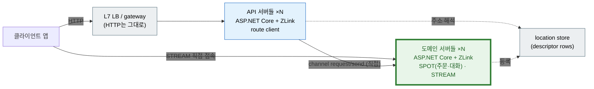
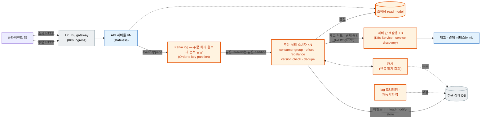
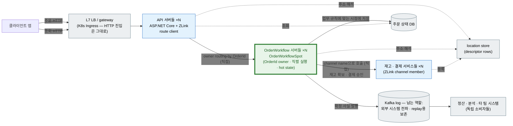
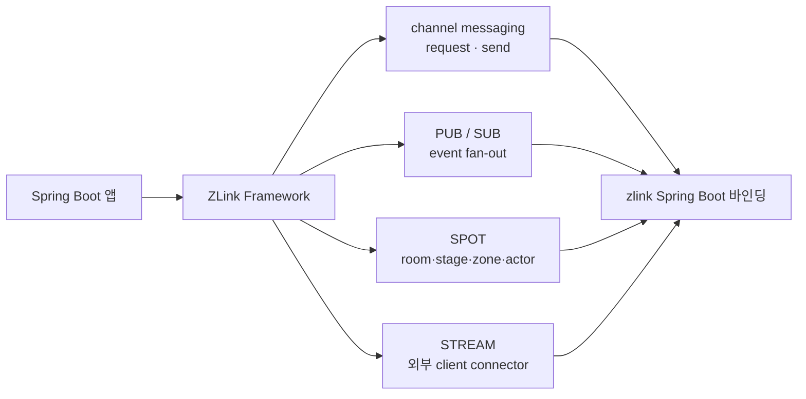
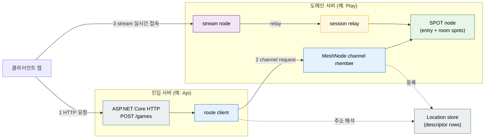

<!-- generated:start -->
<!-- 이 파일은 `common/guide/server/01-overview.ko.md`에서 생성한다. 직접 고치지 않는다.
     고칠 곳은 공통 소스이고, `python3 doc/site/scripts/generate_language_guides.py`로 다시 만든다. -->
<!-- generated:end -->

<!-- framework-adapter-nav:start -->
[가이드 홈](README.ko.md) | [다음: 2. 시작하기](02-getting-started.ko.md)
<!-- framework-adapter-nav:end -->

<!-- language-switch:start -->
다른 언어로 보기 — [C#/.NET](../../../dotnet/guide/server/01-overview.ko.md) · [C++](../../../cpp/guide/server/01-overview.ko.md) · [Java](../../../java/guide/server/01-overview.ko.md) · **Kotlin** · [Node/TypeScript](../../../node/guide/server/01-overview.ko.md)
<!-- language-switch:end -->

# 1. 개요

> **이 장의 계약 소유 문서** — [Framework 개요](../../../common/spec/02-overview.ko.md)와
> [언어별 공개 계약 목차](../../../common/spec/server/languages/README.ko.md)가 소유한다.

> 이 문서는 `Kotlin` 가이드의 진입점이다. 가이드는 Kotlin 개발자가
> ZLink Framework의 기능을 **읽고 바로 따라 쓸 수 있도록** 개념과 사용법을
> 직접 설명한다. 개념의 **언어 중립 정식 정의**는 [공통 스펙
> 개요](../../../common/spec/02-overview.ko.md)가, `Kotlin` public API의 **정식 계약**은
> [Java exact interface 목차](../../../common/spec/server/languages/java/interfaces/README.ko.md) 문서가 다룬다. 두 표기가 어긋나면
> spec이 우선이다.

## 1. 한 줄 정의

`ZLink Framework`는 **기존 메이저 프레임워크와 통합되는 실시간 메시징
프레임워크**다. Spring 위에 Spring MVC가 웹 계층으로 올라가듯, `Spring Boot` 위에
ZLink Framework가 **실시간 메시징 계층**으로 올라간다. 별도 런타임이나 전용 서버로
갈아타는 것이 아니라, 쓰던 DI·hosted service·설정·로깅 모델 안에 그대로 들어온다.

이 계층은 서버 간 호출, pub/sub, 그리고 실시간 상태 단위를 제공한다. 서버 간
호출과 pub/sub는 별도 **gateway나 전용 로드밸런서 없이** 논리 `channel name`만으로
대상을 찾는다. 실시간 상태 단위는 `SPOT`(room · stage · zone), actor(연결·사용자
하나를 대표하는 상태 객체), `STREAM`(외부 client 연결)이다(용어가 낯설면
[03-concepts](03-concepts.ko.md)의 개념 설명을 먼저 본다). 개발자는 HTTP/gRPC를
쓰던 감각으로 **handler, client, filter**를 작성하고, 연결·위치 조회·라우팅·재연결·
correlation은 framework가 처리한다.

> **ZLink는 여러 언어에서 같은 계약으로 쓰는 framework다.** 같은 계층이 Spring
> (Java/Kotlin)과 NestJS(Node) 위에도 똑같이 올라가고, 호출 계약이 언어 중립 wire
> protocol(ZMP) + codec + 논리 channel/packet이라 서로 다른 언어로 구현된 서비스가
> 같은 channel 위에서 상호 호출한다(예: room 서버 C++, API 서버 .NET·Java). 이
> 가이드는 `.NET` 기준이며 `.NET` 구현을 reference implementation(기준 구현)으로
> 삼는다. 자세한 cross-language 모델은 [17-alternative §2.1](17-alternative.ko.md)이 다룬다.

## 2. 사용이 필요한 상황

### 실시간 게임 서버 구축

**무엇이 어려운가.** 게임 서버에는 웹의 `ASP.NET Core`/Spring 같은 표준화된
프레임워크가 없다. 우연이 아니라 이유가 있다.

- **장르마다 요구하는 네트워크 토폴로지가 다르다.** 웹은 어떤 서비스든 "client
  요청 → 서버 응답" 한 모양이라 프레임워크가 표준화될 수 있었다. 게임은 다르다 —
  보드게임은 방 단위 매칭과 턴 진행, MORPG는 room/stage 서버와 매칭·로비의 분리,
  MMORPG는 zone/field 서버 mesh와 대규모 브로드캐스트, FPS는 소규모 세션의 저지연
  tick 루프를 요구한다. **장르가 토폴로지를 결정하니 하나의 정해진 형태가 없고**, 팀마다
  소켓 위에서 자기 토폴로지를 다시 짠다.
- **상태가 메모리에 유지된다.** 웹은 상태를 DB에 두고 stateless로 scale-out하면
  되지만, 게임은 빠른 처리를 위해 room·참가자 상태를 **in-memory**에 두고 멀티
  스레드로 로직을 실행한다. 그 순간 lock, 경합, 데드락, "어느 스레드가 이 room을
  만지는가"라는 동기화 문제가 업무 로직 안으로 스며든다.
- **연결 자체가 관리 대상이다.** 유저는 장기 연결을 유지한다. 소켓 framing과
  세션 수명을 직접 다루고, 재접속하면 어느 서버의 어느 room에 있었는지 이어 줘야
  하고, 배포·축소 때 접속 유저와 진행 중인 게임 상태를 유지해야 한다.

그래서 지금까지 선택지는 둘이었다 — 이걸 전부 직접 만들거나, 게임 서버 엔진이라는
**별도 런타임으로 옮겨가** 로직 작성 방식·설정·배포·운영을 엔진 방식으로 다시
배우거나.

**실제로는 어떻게 만들어 왔나.** 업계에서 통용되는 이름이 붙은 패턴으로 묶으면
대략 네 방식이다. 어느 패턴이든 login/auth, gateway, DB cache 같은 상자가 반복해서
등장하지만 — 그걸 받쳐 주는 공통 프레임워크는 없어서, 팀은 자기 장르의 방식을
골라 그 구조를 소켓부터 다시 만든다.



- **① zone 분할.** 월드를 지리적 구역으로 나눠 구역마다 서버(노드)가
  담당하고, 캐릭터가 경계를 넘으면 시뮬레이션을 인접 구역 서버로 넘긴다. 대규모
  오픈월드를 감당하기 위한 MMORPG의 대표적인 확장 방식이다. sharding(월드 전체를
  복제해 플레이어를 나눔), instancing(같은 구역의 독립된 사본을 여러 개 생성)도
  많은 동시 접속자를 처리하기 위해 함께 사용하는 대표적인 월드 분산 방식이다.
- **② lobby + room.** 유저를 lobby/매칭에서 받아 room에 배정하고, 그 room이 판이
  끝날 때까지 참가자 상태를 소유한다. room은 보통 한 프로세스 안에 여러 개가
  함께 도는 논리 단위다. 캐주얼·모바일 MO·보드게임에서 흔하다.
- **③ session 기반 dedicated fleet.** 매칭 ticket이 모이면 fleet에서 판 전용
  서버 프로세스를 하나 할당하고, client는 그 서버에 직접 접속한다. 판이 끝나면
  프로세스가 반납된다. ②와 달리 **판 하나 = 프로세스 하나**가 기본 단위다.
  경쟁 FPS·배틀로얄 같은 세션 기반 게임의 표준 구성이다.
- **④ stateful actor.** 플레이어·길드 같은 엔티티 상태를 서버 메모리 위 actor로
  유지하고, DB는 주기적 저장소 역할만 한다. 읽기 편중 부하가 줄고 별도 캐싱
  계층이 필요 없어져, 메타·소셜 백엔드에서 흔히 쓰인다. 대표 프레임워크는
  Orleans·Akka다. **개념 차이 하나** — Akka의 actor는 사용자 하나가 아니라 어디에나
  쓰는 범용 동시성 단위이고, ZLink는 이걸 Spot(실행 격리 단위)과 Actor(도메인
  엔티티)로 나눴다. Orleans의 virtual actor·grain에 더 가까운 건 ZLink Actor가
  아니라 이 방식이 쓰는 **Instance Spot**이다. 세부 비교는
  [17장 §6](17-alternative.ko.md)에서 다룬다.

**ZLink가 제공하는 것.** 어려움 하나하나에 기능이 대응한다.

| 어려움 | ZLink 기능 | 자세히 |
| --- | --- | --- |
| 장르별 토폴로지를 소켓부터 직접 만듦 | **channel 조합으로 토폴로지 선언** — 1:N 요청/응답, fan-out, 노드 지목 route mesh, room 단위 spot mesh를 등록 몇 줄로 조합, 연결은 location store가 자동 유지 | [§3 아키텍처](#아키텍처--계층-구조와-등록-지점) · [05](05-channel-messaging.ko.md)·[06](06-spot.ko.md)·[10](10-location.ko.md) |
| in-memory 상태의 lock·경합 | **SPOT 직렬 실행** — 한 room의 모든 메시지를 하나의 실행 줄로 세워 순서대로 실행. lock이 업무 로직에서 사라진다 | 아래 코드 · [06](06-spot.ko.md) |
| 소켓 framing·세션 수명 직접 구현 | **STREAM** — 연결 수명·framing·packet codec을 framework가 소유(TCP/TLS/WS/WSS) | [09](09-stream.ko.md) |
| 재접속 유저 위치 추적 | **actor binding** — 재접속한 새 연결이 같은 actor로 이어진다 | [08](08-actor-session.ko.md) |
| 배포 때 유저 튕김 | **graceful drain** — 신규 차단, actor handoff, 진행 중 마무리 후 종료. 앱 코드 0줄 | [12](12-operations.ko.md) |

그리고 위의 **네 방식이 전부 같은 선언 모델 위의 조합**이 된다. 방식마다 소켓부터
다시 만들 필요가 없다.

- **① zone 분할** — zone을 `addRouteMesh` + 노드 지목 route mesh로 잡는다. 경계를 넘는
  플레이어는 **actor 크로스노드 relocation**이 대신 넘겨준다([07](07-actor-spot.ko.md)).
  [ZoneWorld](../../../common/sample/zoneworld/README.ko.md)가 이 방식 그대로다.
- **② lobby + room** — 입장·매칭은 Entry Spot, 방은 `getOrCreate`로 만드는 room spot이다.
  [Bingo](../../../common/sample/bingo/README.ko.md)가 이 방식 그대로다.
- **③ matchmaker + dedicated** — 매칭은 channel handler(HTTP 등)로 구현한다. **판마다 새
  프로세스를 띄우는 대신** 매칭 결과로 `getOrCreate`된 room spot에 client가 STREAM으로
  접속한다. [TicTacToe](../../../common/sample/tictactoe/README.ko.md)가 이 흐름에 가장
  가깝다 — 매칭 요청 → room·접속 정보 응답 → 이미 준비된 room spot에 접속.
- **④ actor 서비스** — **Instance Spot**이 엔티티 ID로 cold activation되어, 여러 유저가
  동시에 건드리는 엔티티 상태를 Redis 분산 락 없이 직렬로 처리한다.
  [길드 서비스 예시](#하나의-엔티티에-대한-동시-접근)에서 이어진다.

위 "기존 방식" 4분할 그림과 같은 자리에서, ZLink로는 각 방식이 이렇게 조립된다.



초록(굵은 테두리)이 SPOT 계열 primitive다. 위 "기존 방식" 그림과 대조되는 지점은
바로 여기다 — 기존에는 방식마다 인프라(전용 fleet orchestrator, sticky routing,
actor 클러스터)가 따로 필요했지만, ZLink에서는 네 방식 전부 같은
RouteMesh·Spot·Instance Spot 조합으로 구현한다. 방식이 바뀌어도 새로 배워야 할
런타임이 없다.

> 트위치 FPS의 **초저지연 snapshot netcode**는 유실을 허용하는 비신뢰 전송을 쓴다.
> 현재 STREAM이 제공하는 transport는 TCP/TLS/WS/WSS이며, **비신뢰 전송(QUIC
> datagram·WebTransport)은 지원 예정**이다. 다만 그런 게임에서도 매칭·로비·메타·
> 소셜은 지금 이 네 방식으로 충분히 처리된다. 어디까지 되고 안 되는지는
> [17장](17-alternative.ko.md) §4에서 다룬다.

**게임 서버 엔진·서비스와는 어떻게 다른가.** 직접 만들지 않는 길로는 엔진과
관리형 서비스가 있다. 이들이 제공하는 것을 영역별로 놓고 보면 ZLink의 자리가
분명해진다.

| 제공 영역 | 대표 제품 | 제공 형태 |
| --- | --- | --- |
| 연결·전송 최적화 — 소켓/세션 관리, 암호화·압축, TCP/UDP 병행, 네트워크 I/O와 로직 스레드 분리 | [ProudNet](https://docs.proudnet.com/proudnet.eng) | 전용 서버 모듈 + client SDK |
| room·lobby·매칭 — room 생성/조회, lobby, 매치 초대 | [Photon](https://www.photonengine.com/)·[SmartFoxServer](https://docs2x.smartfoxserver.com/Overview/zones-room-architecture) | 자체 런타임 위의 room 모델 |
| 호스팅·fleet — dedicated 서버 할당, autoscaling, 매치메이킹 규칙 엔진(FlexMatch) | [AWS GameLift](https://aws.amazon.com/gamelift/servers/)·Agones | 클라우드 관리형 서비스 |
| 소셜·메타 기능 — 친구, 리더보드, 그룹, 채팅 | [Nakama](https://heroiclabs.com/nakama-gamelift/) | 백엔드 서버 제품 |

ZLink는 이 중 **연결·세션(STREAM), room·상태 단위(SPOT), 서버 간 메시징(channel),
참가자 상태(actor), 무중단 종료(drain)** 를 제공한다 — 단, 전용 런타임이나 관리형
서비스가 아니라 **쓰던 메이저 프레임워크 위의 라이브러리 계층**으로.

- **호스팅·fleet은 ZLink의 몫이 아니다.** K8s든 GameLift든 그 위에서 ZLink 서버가
  돌면 된다 — 호스팅 서비스와 경쟁하지 않고 조합된다.
- **매치메이킹 규칙과 소셜 기능은 제품 기능이 아니라 앱 로직이다.** channel
  handler와 spot으로 직접 작성한다. 미리 만들어진 기능은 적지만, 로직의 소유권과
  자유도가 앱에 남는다.

그리고 이 전부가 쓰던 프레임워크 안이다 — 엔진을 새로 들여와 별도 생태계로 옮겨가야
하는 것과는 정반대 방향이다.

```text
+-----------------------------------------------------------+
|  ASP.NET Core / Spring / NestJS                           |
|  DI · 설정 · 로깅 · 배포 그대로                           |
+-----------------------------------------------------------+
|  ZLink Framework                                          |
|  SPOT · actor · STREAM · drain                            |
+-----------------------------------------------------------+
```

**코드로 보면.** room 하나를 선언하고, 그 room의 진행 로직을 쓴다.

```kotlin
// 등록 — room mesh 하나와 room 타입
val node = options.addRouteMesh("game.room")
node.listen("tcp://0.0.0.0:9001")
node.channel("game.room").server()      // mesh는 최소 1개 logical membership을 갖는다
node.objects().server()
    .addSpotFactory("room", BingoRoomSpot::class.java) { factory ->
        factory.recreateOnRelocation()
    }
```

```kotlin
// bingo room의 진행 코드 — 이 안에서 동시성은 존재하지 않는다.
class MarkNumberHandler : ZLinkSpotRequestHandler<BingoRoomSpot, MarkNumber, MarkResult> {

    override suspend fun handle(room: BingoRoomSpot, request: MarkNumber): MarkResult {
        room.board.mark(request.number)         // lock 없음
        room.lastActivity = Instant.now()
        return MarkResult(room.board.hasBingo())
    }
}
```

여러 플레이어가 동시에 요청을 보내고 timer가 도는 room인데 `lock`도,
`Interlocked`도, Redis 분산 락도 없다. framework가 한 room의 모든 메시지(요청,
구독 이벤트, timer tick, actor packet)를 **하나의 실행 줄에 세워 순서대로**
실행하기 때문이다. 여기서 직렬은 codec 직렬화가 아니라 **실행 순서의
직렬화**다([06 §3](06-spot.ko.md)).

실행되는 근거 샘플: [TicTacToe](../../../common/sample/tictactoe/README.ko.md) ·
[Bingo](../../../common/sample/bingo/README.ko.md) · [GameQuest](../../../common/sample/event/gamequest.ko.md)

### 하나의 엔티티에 대한 동시 접근

**왜 어려운가.** 길드처럼 **서로 다른 여러 유저가 같은 엔티티를 동시에 수정**해야
하는 경우가 있다. 두 유저가 동시에 가입을 신청해 정원을 넘기거나, 두 기부가 동시에
반영돼 하나가 유실되는 것처럼, stateless API 서버 여러 대가 같은 row를 동시에
만지면 race condition이 생긴다.

- **동시 수정이 충돌한다.** 여러 API 인스턴스가 같은 길드 row를 동시에
  읽고-고치고-쓰면 lost update가 생긴다.
- **직렬화 장치를 직접 조립해야 한다.** Redis 분산 락이나 DB row lock으로 길드
  단위 critical section을 만들어야 한다.
- **락 자체가 새 실패 모드다.** 락 획득 실패·타임아웃·데드락·락 만료 후 stale
  write 처리를 앱이 떠안는다.

**ZLink가 제공하는 것.** 락을 조립하는 대신 그 엔티티를 직렬 실행 단위로 만든다.

| 조립하던 것 | ZLink 기능 | 자세히 |
| --- | --- | --- |
| 길드 id별 Redis 분산 락 | **Instance Spot** — 길드 id로 cold activation되는 spot 하나가 그 길드의 모든 요청을 직렬 처리 | [06](06-spot.ko.md) |
| 락 획득·해제·타임아웃 처리 | **직렬 실행** — 락 개념 자체가 없어지고, 항상 spot 큐 순서대로 처리된다 | [06 §3](06-spot.ko.md) |
| 길드 spot을 찾는 서버 간 호출·LB | **channel name + location store** | [05](05-channel-messaging.ko.md)·[10](10-location.ko.md) |
| 새 길드의 사전 프로비저닝 | 첫 요청이 오면 그 자리에서 cold activation — 별도 준비 불필요 | |

**기존 방식** — 락 획득·해제가 매 요청마다 왕복한다.



**ZLink 방식** — 락이 사라지고, 길드 id가 곧 그 요청이 도착할 spot 주소가 된다.



같은 길드로 온 요청은 항상 같은 GuildSpot의 큐를 통과하므로, 두 번째 요청은 첫
번째가 끝난 뒤에야 처리된다 — 락을 잡고 있는 시간만큼 다른 요청이 막히는 게 아니라,
애초에 동시에 두 요청이 같은 상태를 만질 수 없다.

**코드로 보면.** 락 획득·해제가 있던 자리에 한 호출이 남는다.

```kotlin
// 길드 가입 신청 — 길드 id로 바로 요청한다. 사전 락도, 사전 생성도 없다.
spots.requestToSpot(guildId, JoinGuildReq(userId))
    .instanceSpot("guild")
    .inMesh("social")
    .submit(JoinGuildRes::class.java)
    .await()
```

이 시나리오는 아직 실행 가능한 기준 샘플이 없다 — 위 코드는 GameQuest의
`PlayerQuestSpot` 등록·호출 방식과 같은 API 표면을 길드에 적용한 것이다.

### 기존 웹 서비스의 실시간 기능 추가

**왜 복잡도가 올라가는가.** 대규모 웹 서비스의 표준 구성 — Spring/`ASP.NET Core` +
Redis(캐시) + Kafka(이벤트) + LB/K8s — 은 **stateless 요청/응답**에 최적화되어
있다. 여기에 채팅·알림·주문 추적 같은 실시간 기능을 추가하는 순간 이 전제들이
하나씩 안 맞으면서 복잡도가 올라간다.

- **연결이 상태가 된다.** HTTP 요청은 아무 인스턴스가 받아도 되지만, WebSocket
  연결은 특정 인스턴스에 설정되어 있다. 그래서 연결을 고정하는 sticky LB가 생기고,
  "이 사용자가 지금 어느 인스턴스에 연결돼 있지?"를 앱이 Redis로 관리하기 시작한다.
- **서버 사이 실시간 전달이 우회한다.** 연결이 인스턴스마다 흩어져 있으니 서버 간
  전달은 브로커(Redis pub/sub, 또는 replay가 필요 없는데도 Kafka)를 경유한다 —
  운영할 인프라가 또 하나 늘어난다.
- **순서가 중요한 단위가 생긴다.** 주문·대화는 이벤트 처리 순서가 곧 정합성이다.
  여러 인스턴스가 같은 주문을 동시에 만질 수 있으니 분산 락으로 직렬화한다.

기능 하나 붙였는데 WebSocket 서버, sticky LB, 브로커 경유, 분산 락 — 조립 세트
한 벌과 그 운영 부담이 늘어난다.

**ZLink가 제공하는 것.** 조립 세트의 조각마다 기능이 대응한다.

| 조립하던 것 | ZLink 기능 | 자세히 |
| --- | --- | --- |
| WebSocket 서버 + sticky LB | **STREAM** — 앱 서버가 client 연결을 직접 받는다 | [09](09-stream.ko.md) |
| 분산 락으로 순서 보장 | **SPOT owner routing** — 같은 주문·대화는 항상 자기 Spot 한 곳에서 직렬 실행 | [06](06-spot.ko.md) |
| 브로커 경유 실시간 전달 | **channel·fanout** — 서버 간 전달과 fan-out을 transport가 직접 | [05](05-channel-messaging.ko.md) |
| "누가 어디 연결돼 있지" 관리 | **actor binding + location store** — 재접속 이전성과 위치 조회를 framework가 소유 | [08](08-actor-session.ko.md)·[10](10-location.ko.md) |

같은 시스템 — 웹 API + 실시간 기능(채팅·주문 추적) — 을 두 방식으로 그리면 차이가
그림에서 바로 보인다.

**기존 방식** — 실시간 기능을 위한 구성 요소(주황)가 본체만큼 추가된다.



**ZLink 방식** — 주황 조각이 전부 사라지고, node·actor·spot 위치정보를 제공하는
location store 하나가 남는다.



sticky LB, WebSocket 서버, pub/sub 경유, 분산 락, mesh/discovery — 다섯 조각이
**location store 하나**로 줄었다. 서버 간 호출과 실시간 전달은 전부 runtime끼리
직접 이어진다.

**기존 스택을 대체하는 것이 아니다.** Kafka는 내구성 있는 이벤트 스트림으로, Redis는
캐시/영속 보조로 양쪽 그림 모두에 그대로 남는다(그래서 그림에서 뺐다). ZLink가
줄이는 것은 그 사이에서 실시간 전달을 위해 직접 조립하던 **연결·라우팅·상태 관리의
복잡도**다.

**코드로 보면.** 분산 락과 sticky 라우팅이 있던 자리에 다음 코드가 남는다.

```kotlin
// HTTP handler 안 — 주문 이벤트를 그 주문의 workflow Spot으로.
// 첫 요청이 OrderId 기준 spot을 cold-activate하고, 이후 요청은 이미 만들어진
// 같은 spot에 도착해 항상 한 곳에서 순서대로 처리된다(분산 락 없음).
spots.requestToSpot(request.orderId, request)      // request는 이미 StartOrderWorkflowReq 바디다.
    .instanceSpot("order-workflow")
    .inMesh("commerce")
    .submit(StartOrderWorkflowRes::class.java)
    .await()

// actor handler 안 — 재접속해도 같은 actor로 이어진 client에 push(sticky LB 없음).
actor.context().boundSession().send(OrderStatusChanged(orderId, status)).submit().await()
```

실행되는 근거 샘플: [SupportChat](../../../common/sample/supportchat/README.ko.md) ·
[DeliveryDispatch](../../../common/sample/deliverydispatch/README.ko.md)

### 이벤트 중심 업무 처리 단순화

ZLink의 사용 지점은 실시간 기능만이 아니다. 주문 처리·정산·재고처럼 **같은 엔티티의
이벤트를 순서대로, 중복 없이 처리해야 하는** 업무는 화면에 실시간 push가 하나도 없어도
같은 복잡도 문제를 만난다.

**왜 복잡해지는가.** 이런 업무의 표준 답은 Kafka 같은 log 기반 파이프라인이다(이벤트
소싱 구성도 보통 이 위에 올린다). 그런데 log가 실제로 해결하는 것은 "같은 key를 한
곳에 모아 순서대로"인데, 그 하나를 위해 조각이 줄줄이 따라온다.

- **순서가 partition에 묶인다.** 같은 주문의 이벤트를 순서대로 처리하려면 key
  partition으로 모아야 하고, 소비자 수는 partition 수에 묶이며, consumer group의
  rebalance와 offset 관리가 운영 항목으로 따라온다.
- **소비자가 stateless라 상태는 매번 DB 왕복이다.** 이벤트 하나를 처리할 때마다 DB에서
  현재 상태를 읽고-고치고-쓴다. 반복 읽기를 줄이려 캐시를 붙이면 무효화 문제가
  따라온다.
- **at-least-once라 멱등성이 앱 몫이 된다.** 재전달·rebalance·재처리로 같은 이벤트가
  두 번 올 수 있어, version check나 dedupe 정책 없이는 중복 반영된다.
- 처리 결과 조회용 read model을 따로 만들고, 파이프라인이 밀리면 lag 모니터링과
  재동기화 잡이 남는다.

stateful stream processor(Kafka Streams/Flink)로 상태를 소비자 곁에 두면 DB 왕복은
줄지만, partition 설계·state store 복구·rebalance가 운영 책임으로 남는다 — 이 비교의
상세는 [GameQuest 공통 시나리오 §3](../../../common/sample/event/gamequest.ko.md)이 다룬다.

같은 업무 — 주문 workflow — 를 두 방식으로 그리면 조각 차이가 그림에서 바로 보인다.

**기존 방식** — 순서 처리를 위한 파이프라인 조각(주황)이 본체만큼 추가된다.



**ZLink 방식** — Kafka를 대체하는 것이 아니다. **주문 처리 경로에서** 파이프라인
조각(주황)이 사라지고, Kafka는 자기 본연의 자리 — 확정된 사실을 독립 시스템들에
전파하고 replay가 필요한 이벤트를 보존하는 durable log — 로 남는다(회색).



두 그림에서 Kafka의 색이 바뀐 것이 핵심이다. 처리 경로 **안에서** 순서를 담당하던
Kafka(주황)가 처리 경로 **밖으로** 나가 전파·보존만 맡는다(회색). 그러면서 순서
담당을 위해 조립했던 조각들 — 주문 처리 소비자 그룹(offset·rebalance·dedupe), 캐시,
조회용 read model, 재동기화 잡 — 이 사라진다. 같은 `OrderId`가 항상 같은 owner에서
직렬로 처리되므로, 파이프라인이 제공하던 순서·중복 방지를 조립할 필요가 없어진
것이다.

**서버 간 호출의 LB도 사라진다.** 주문 처리는 재고·결제 같은 다른 서비스를 동기
호출하는데, 기존 방식은 그 경로마다 K8s Service나 service discovery로 상대를 찾아
분배해야 한다(주소를 코드에 하드코딩할 수는 없으니까). ZLink에서는 `"inventory"` 같은
**channel name으로 부르고 location store가 현재 사용 가능한 peer를 알려 주므로**, 서버 간
호출용 LB 계층이 따로 필요 없다 — 그래서 after 그림에서 주황 `서버 간 호출용 LB`가
사라진다.

**남는 것은 남는다.** 클라이언트 HTTP 진입은 여전히 stateless라 L7 LB/Ingress가 평소처럼
API 서버에 분배하고(회색), 주문 상태는 여전히 DB에 저장한다. gRPC와 달리 이 HTTP 진입
경로에 L7 분배 장치를 **추가로** 요구하지도 않는다(그 이유는
[17장 §5.1](17-alternative.ko.md)이 다룬다).

**ZLink가 제공하는 것.** "같은 key를 한 곳에 모아 순서대로"를 log가 아니라 **owner
routing**으로 풀면, 위 조각의 대부분은 조립할 필요 자체가 사라진다.

| 조립하던 것 | ZLink 기능 | 자세히 |
| --- | --- | --- |
| key partition + consumer group | **SPOT owner routing** — 같은 `OrderId`는 항상 같은 Spot에서 직렬 실행. 어느 API 인스턴스가 받아도 같은 owner로 route된다 | [06](06-spot.ko.md) |
| 이벤트마다 DB load-modify-store | **owner spot의 hot state** — 상태가 owner 메모리에 있고, 저장 시점은 업무 규칙에 맞춰 앱이 결정한다 | [06](06-spot.ko.md) |
| 재전달 대비 version check·분산 락 | **직렬 실행** — 같은 단위에 동시 writer가 없어 정상 경로에서 락·version 경합이 없다 | [06 §3](06-spot.ko.md) |
| 서버 간 호출용 LB·service discovery | **channel name + location store** — `"inventory"` 이름으로 부르면 현재 사용 가능한 peer로 직접 전송한다 | [05](05-channel-messaging.ko.md)·[10](10-location.ko.md) |
| offset·lag·재동기화 잡 운영 | 소비 파이프라인이 없으므로 해당 운영 항목 자체가 없다 | |

**경계는 그대로다.** durable log가 진짜 필요한 요구 — 이벤트 replay, 장기 보존, 독립
시스템들로의 광범위 fan-out — 는 Kafka가 맞고 그대로 남긴다([17장 §4](17-alternative.ko.md)).
ZLink가 줄이는 것은 "엔티티 단위 순서 처리"만을 위해 log 파이프라인을 조립하던
경우다. 순서와 정합성이 목적의 전부였다면, owner routing이 그 목적을 파이프라인 없이
직접 달성한다.

**코드로 보면.** partition 소비자 자리에 owner Spot handler가 온다.

```kotlin
// 같은 OrderId의 처리는 항상 이 Spot 안에서 순서대로 실행된다 —
// partition도, offset도, 분산 락도, 멱등성 재시도 정책도 조립하지 않는다.
class StartOrderWorkflowHandler :
    ZLinkSpotRequestHandler<OrderWorkflowSpot, StartOrderWorkflowReq, StartOrderWorkflowRes> {

    override suspend fun handle(
        spot: OrderWorkflowSpot, request: StartOrderWorkflowReq): StartOrderWorkflowRes =
        workflow.startInSpot(spot, request)        // spot 상태에 lock 없이 접근
}
```

실행되는 근거 샘플: [ShoppingMall](../../../common/sample/event/shoppingmall.ko.md) — 실시간 push
없이 HTTP API + 주문 workflow만으로 구성된 이 상황의 기준 샘플이다. 주문 상태
전이·보상 흐름·중복 방지·projection 재생성을 owner routing 위에서 검증한다.

세 상황의 차이는 진입점일 뿐, 쓰는 표면은 같다. 기능 하나씩 제공하는 제품은
있어도 — RPC는 gRPC가, actor는 Orleans가, 연결은 게임 엔진이 — **메이저
프레임워크 통합 + 직렬 실행 상태 단위 + 자동 연결 토폴로지를 한 몸에 담은
조합**이 ZLink의 자리다.

## 3. 표면과 구조

### 호출 단위 — MeshName과 ChannelName

ZLink Framework의 서버 간 호출은 **`MeshName`과 `ChannelName`**으로 대상을 고른다.
application에서는 "`services` mesh의 `orders` channel로 요청을 보낸다"처럼 사용한다.
어느 노드가 그 channel을 처리하는지는 location store에 등록된 membership을 framework가
확인해 선택한다.

서버 하나를 만들 때 직접 작성해야 했던 것들을 framework가 처리한다.

| 직접 만들어야 했던 것 | framework가 처리하는 방식 |
| --- | --- |
| endpoint 개설·peer 연결 관리 | MeshNode와 STREAM node를 선언하면 hosted service가 연결 |
| 메시지 직렬화·역직렬화 | codec 등록과 handler 계약에 맞춰 DTO를 그대로 주고받음 |
| 요청 routing·dispatch | `ChannelName`의 typed handler 등록으로 메시지가 알맞은 handler에 도착 |
| 로깅·검증·권한 확인 같은 공통 처리 반복 | HTTP route는 middleware, ZLink handler는 `ZLinkHandlerFilter`로 분리 |
| 동시 요청의 상태 보호 | SPOT의 직렬 실행으로 lock 없이 상태 관리 |
| 서비스 생성·의존성 관리 | Spring DI에서 handler, client, filter를 생성 |
| 서버 주소 관리·연결 결정 | location store를 통해 현재 활성 endpoint 추적 |
| 설정·로그·모니터링 | Spring 설정·logging·수명주기와 통합 |

### 기존 방식 대비 체감 난이도

같은 "서버 간 요청/응답"을 붙이는 코드량 차이다.

**raw 바인딩으로 직접 (개념적):**

```kotlin
// 위치 저장소 조회, endpoint 연결, 재연결 관리,
// correlation id 매칭, 직렬화, 수신 루프 ... 수십 줄의 연결·설정 코드
```

**ZLink Framework:**

```kotlin
// 서버: handler 하나
class GetPriceHandler : ZLinkRequestHandler<PriceRequest, PriceReply> {

    override suspend fun handle(request: PriceRequest, context: ZLinkMessageContext): PriceReply =
        PriceReply(request.symbol, BigDecimal("187.42"))   // 데모용 고정값(실제론 조회 결과)
}

// 등록 — MeshNode endpoint와 price membership의 handler를 함께 선언한다.
options.addRouteMesh("services")                        // MeshName으로 통신 범위를 구분한다.
    .listen("tcp://0.0.0.0:7301")                       // 이 MeshNode의 endpoint를 연다.
    .setRoutingId(RoutingId.from("price-1"))
    .channel("price")                                   // price 처리 membership을 등록한다.
    .server()
    .addRequestHandler(GetPriceHandler::class.java, PriceRequest::class.java, PriceReply::class.java)

// 클라이언트: route client를 주입받아 ChannelName으로 호출한다.
val reply = client
    .requestToChannel(
        "price",                                        // process-local로 찾을 ChannelName
        PriceRequest("AAPL"))
    .submit(PriceReply::class.java)                     // 송신한 뒤 reply를 비동기로 기다린다.
    .await()
```

연결·설정 코드가 사라지고 남는 것은 handler와 channel 등록 몇 줄이다.

### 아키텍처 — 계층 구조와 등록 지점

```text
+-----------------------------------------------------------+
|  Spring Boot app (Kotlin)                                 |
|  DI, configuration, logging, hosted services              |
+-----------------------------------------------------------+
|  ZLink Framework + Kotlin 레이어                             |
|  RouteMesh, SPOT, actor, STREAM, location, monitoring     |
+-----------------------------------------------------------+
|  bindings/java (backend adapter)                          |
|  raw DEALER/ROUTER/PUB/SUB/STREAM socket API               |
+-----------------------------------------------------------+
|  Core (C API, native)                                      |
+-----------------------------------------------------------+
```

application이 짜는 코드는 맨 위 두 층이다. Framework는 자신의 기능을
**DI · hosted service · handler · attribute** 모델로 제공하고, 아래 두 층
(`bindings/dotnet`, Core C API)은 framework 뒤에 숨는 backend로만 쓰인다 —
public API에 직접 노출되지 않으며, 나중에 교체돼도 application 코드는 바뀌지
않는다. 이 backend 경계와 데이터 흐름은
[internals/backend-dependency-policy](../../../java/internals/backend-dependency-policy.ko.md)가
별도로 설명한다.

application이 이 스택과 만나는 지점은 **등록 코드 한 곳**이다. 여기서 MeshNode,
fanout과 STREAM node를 선언한다.

```kotlin
val zlink = ZLinkFrameworkConfigurer { options ->
    options.addLocationStore(ZLinkRedisLocationStore(...))   // node·actor·spot 위치정보 제공 — 이 정보를 기반으로 node 간 연결은 자동

    options.addRouteMesh("services")                         // 서버 간 request/send용 MeshNode
        .listen("tcp://0.0.0.0:7301")
        .setRoutingId(RoutingId.from("service-a"))
        .channel("orders").server()                          // 처리할 논리 membership
    options.addFanoutChannel("events")
        .enablePublisher("tcp://0.0.0.0:7302")               // classic event fan-out
    options.addRouteMesh("game.room")                        // SPOT·actor도 MeshNode가 소유
        .listen("tcp://0.0.0.0:7304")
        .setRoutingId(RoutingId.from("room-a"))
        .channel("game.room").server()
    options.addStreamNode("gateway")
        .bind("tcp://0.0.0.0:7400")                          // 외부 client endpoint
}
```

gRPC+LB, broker, WebSocket 서버로 각각 조립하던 토폴로지들이 **같은 선언 모델
하나**로 내려온다. location store를 등록했으므로 서버가 늘어나거나 줄어들 때
connection도 자동으로 새로 연결되거나 정리된다 — 설정 파일을 고치거나 LB를
재구성할 일이 없다.
([05](05-channel-messaging.ko.md)·[06](06-spot.ko.md)·[09](09-stream.ko.md)·[10](10-location.ko.md))

무엇을 어디서 선언하는지는 다음 세 자리로 정리된다.

| 표면 | 역할 | 다루는 장 |
| --- | --- | --- |
| `builder.Services.AddZLinkFramework(...)` | channel·SPOT·STREAM 선언 | [5장](05-channel-messaging.ko.md)~[9장](09-stream.ko.md) |
| `options.AddRouteMesh(...)` / `addFanoutChannel(...)` | RouteMesh·fanout 선언 | [5장](05-channel-messaging.ko.md) |
| `IZLink*Runtime` status | 상태 관측과 진단 | [11장](11-monitoring.ko.md) |

각 표면에서 정할 수 있는 옵션 전체와 기본값은 [16-options](../../../java/guide/server/16-options.ko.md)에 모아 두었다.

## 4. 통합 4축 요약



| 축 | 사용자에게 보이는 것 | 가이드 챕터 |
| --- | --- | --- |
| channel messaging | `ZLinkRequestHandler`, `ZLinkSendHandler`, `ZLinkRouteClient`, `ZLinkHandlerFilter` | [05-channel-messaging](05-channel-messaging.ko.md) |
| fanout | `addFanoutChannel`, `ZLinkFanoutHandler` | [05-channel-messaging](05-channel-messaging.ko.md) |
| SPOT | typed spot factory, Spot context outbound, timer | [06-spot](06-spot.ko.md) |
| actor / session | actor factory, Entry Spot, `ZLinkBoundSession`, session actor dispatch | [07-actor-spot](07-actor-spot.ko.md) · [08-actor-session](08-actor-session.ko.md) |
| STREAM | framework session packet, Stream Connector | [09-stream](09-stream.ko.md) |
| 인프라 | Location 기반 자동 연결·운영 조회, runtime monitoring | [10-location](10-location.ko.md), [11-monitoring](11-monitoring.ko.md) |
| 운영 | 런타임 메트릭(등록 한 줄), graceful drain, readiness probe | [12-operations](12-operations.ko.md) |

## 5. 전체 topology

각 기능이 어떻게 맞물리는지 보여주는 예시다. 이 지도를 각 기능 장이 확대해 들어간다.



- **진입 서버** - ASP.NET Core HTTP로 외부 요청을 받아 domain 서버에 위임한다.
- **도메인 서버** - MeshNode channel membership + SPOT(상태 단위) + session relay + stream node.
- **Location store** - 서버 주소 정보를 관리한다. 점선은 store 조회를 통해 endpoint를 찾는 연결이다.
- **클라이언트 앱** - HTTP로 요청을 보내고, stream으로 실시간 상태를 받는다.

## 6. 가이드의 대상과 범위

이 가이드는 runtime 내부 구조보다 channel, handler, SPOT, STREAM, location store를
언제 골라 쓰는지에 초점을 둔다.

주요 독자는 다음과 같다.

- **백엔드 API 개발자**: HTTP endpoint 안에서 다른 내부 서비스로 요청을 보내거나,
  기존 gRPC 호출을 논리 `channel name` 기반 request / response로 바꾸려는 사람.
- **마이크로서비스 운영 개발자**: 서버 instance가 늘고 줄어도 주소를 코드에 하드코딩하지 않고,
  location store가 관리하는 현재 서버 목록으로 자동 연결하려는 사람.
- **실시간 서비스 개발자**: game room, stage, zone, 주문 workflow처럼 상태를 가진
  단위를 SPOT으로 묶고, 같은 상태에 들어오는 packet을 한 실행 흐름에서 처리하려는 사람.
- **gateway / connector 개발자**: 외부 client는 TCP, TLS, WebSocket 같은 STREAM으로
  받고, 내부 처리는 channel이나 actor로 넘기려는 사람.
- **기술 리더와 리뷰어**: ZLink를 도입할 만한 문제인지 판단하고, 어떤 책임은 ZLink가
  맡고 어떤 책임은 DB, broker, domain service에 남겨야 하는지 확인하려는 사람.

ZLink의 용도를 구체적인 업무 흐름으로 확인할 때는 [공통 샘플](../../../common/sample/README.ko.md)을
본다. 실시간 game server 구조는 [TicTacToe](../../../common/sample/tictactoe/README.ko.md)와
[Bingo](../../../common/sample/bingo/README.ko.md)에서 확인한다.
[ShoppingMall](../../../common/sample/event/shoppingmall.ko.md),
[DeliveryDispatch](../../../common/sample/deliverydispatch/README.ko.md),
[GameQuest](../../../common/sample/event/gamequest.ko.md),
[SupportChat](../../../common/sample/supportchat/README.ko.md)은 주문 workflow, 배정·상태 추적,
게임 진행, 상담·채팅처럼 업무 도메인까지 붙인 end-to-end 샘플이다.

**이 계층이 하지 않는 것도 분명하다.** ZLink Framework는 transport 구현을 application
코드에 노출하는 계층이 아니다. application 개발자는 DI, hosted service, handler와
location store 모델로 공개 기능을 사용한다. 정식 public API 계약을 검토하는 사람은
[spec/interfaces 목차](../../../common/spec/server/languages/java/interfaces/README.ko.md)를, runtime 내부 구조를
고치는 사람은 [internals/](../../../java/internals/backend-dependency-policy.ko.md)를 같이 봐야 한다.

## 7. 이름 표기 규칙

Java 표기를 그대로 쓴다. Kotlin 레이어가 더하는 표면도 같은 규칙이다.

- public 타입은 `ZLink` prefix(대문자 `L`)를 쓴다.
- coroutine 확장은 `suspend` 함수이거나 `flow`를 돌려준다.
- Maven 좌표와 패키지는 `systems.zlink.*`다.
- 하부 zlink core C API는 `zlink_*` snake_case다.

## 8. 가이드 읽는 순서

- [02-getting-started](02-getting-started.ko.md) — 패키지부터 첫 동작 확인까지
- [03-concepts](03-concepts.ko.md) — 핵심 개념 (channel, 역할, DI)
- [05-channel-messaging](05-channel-messaging.ko.md) — request/send/pub-sub 상세
- [06-spot](06-spot.ko.md) — room/stage/zone, timer, routed Spot 호출
- [07-actor-spot](07-actor-spot.ko.md) — actor lifecycle, Spot 호스팅·콜백
- [08-actor-session](08-actor-session.ko.md) — session↔actor binding·dispatch, client push
- [09-stream](09-stream.ko.md) — 외부 client(STREAM) 서버 + Stream Connector
- [10-location](10-location.ko.md) — location store 기반 자동 연결과 운영 조회
- [11-monitoring](11-monitoring.ko.md) — 상태 관측과 진단
- [13-interface-catalog](13-interface-catalog.ko.md) — 모든 계약 인터페이스를 코드로(ContractTests 검증)
- [14-samples](14-samples.ko.md) — 실행되는 샘플로 확인하기
- [16-options](../../../java/guide/server/16-options.ko.md) — 옵션 목록과 기본값, 무엇을 언제 바꾸나
- [17-alternative](17-alternative.ko.md) — **ZLink를 어디에 쓰나**(사용처·문제 신호·기술 선택 경계)
- [공통 샘플](../../../common/sample/README.ko.md) — 대표 업무 시나리오와 검증 기준
- [Java exact interface 목차](../../../common/spec/server/languages/java/interfaces/README.ko.md) — 정식 계약

---
