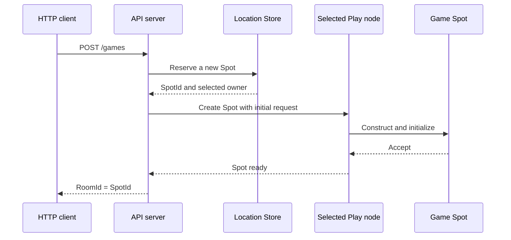

<!-- generated:start -->
<!-- This file is generated from `common/guide/server/02-getting-started.en.md`. Do not edit directly.
     Edit the common source instead, then regenerate with `python3 doc/site/scripts/generate_language_guides.py`. -->
<!-- generated:end -->

<!-- framework-adapter-nav:start -->
[Guide Home](README.en.md) | [Previous: 1. Overview](01-overview.en.md) | [Next: 3. Core Concepts](03-concepts.en.md)
<!-- framework-adapter-nav:end -->

<!-- language-switch:start -->
View in another language — [C#/.NET](../../../dotnet/guide/server/02-getting-started.en.md) · [C++](../../../cpp/guide/server/02-getting-started.en.md) · [Java](../../../java/guide/server/02-getting-started.en.md) · **Kotlin** · [Node/TypeScript](../../../node/guide/server/02-getting-started.en.md)
<!-- language-switch:end -->

# 2. Getting Started

> **The document that owns this chapter's contract** — none. This is a walkthrough for
> installing and confirming your first working setup.

> First install the package and run a minimal example of two processes calling each
> other (§1-§2), then follow the actual
> [TicTacToe sample](../../../../../languages/java/samples/kotlin/TicTacToe) through the
> flow of creating one room (§3-§11).

## 1. Installation

Get it from Maven Central. The minimal combination needed to build one server is these
three.

```kotlin
implementation("systems.zlink:zlink-framework-core")                // The contract and runtime
implementation("systems.zlink:zlink-framework-spring-boot-starter") // DI/lifecycle registration
implementation("systems.zlink:zlink-framework-kotlin")              // Coroutine idiom
```

Artifacts to add when you need them:

| Artifact | When to add it |
| --- | --- |
| `zlink-framework-locations-redis` | When using the Redis location store for auto-connect ([10-location](10-location.ko.md)) |
| `zlink-framework-codec-protobuf` · `-codec-msgpack` | To use instead of the default JSON codec ([05-channel-messaging §7](05-channel-messaging.ko.md#7-직렬화-codec)) |
| `zlink-stream-connector` | When building an external client (a game client, mobile) ([09-stream](09-stream.ko.md)) |
| `zlink-http-client` | When the server calls out over HTTP ([HTTP Client guide](../http-client/README.ko.md)) |

JDK 21 or later is required.

The license differs by layer — core/binding is MPL-2.0, framework is FSL-1.1-ALv2, and
`zlink-http-client` is Apache-2.0. There's no cost to building and selling a service
([17-alternative §7](17-alternative.ko.md#7-라이선스--쓰는-데-드는-비용)).

## 2. A Minimal Example — Two Processes Calling Each Other

With no location store and no Redis, try one request/reply over a manual connection where
you write the endpoint directly. This is the point where you confirm "installation is
done."

**The shared contract.** Both processes reference the same record.

```kotlin
data class Hello(val name: String)
data class Greeting(val text: String)
```

**The server process.** Owns the `greeting` channel and registers a handler.

```kotlin
@EnableZLinkFramework
@SpringBootApplication
class ServerApplication {

    @Bean
    fun zlink(): ZLinkFrameworkConfigurer = ZLinkFrameworkConfigurer { options ->
        options.addHandlersFromPackageOf(ServerApplication::class.java)  // Finds handler types.

        val mesh = options.addRouteMesh("services")                      // Names the mesh.
            .listen("tcp://0.0.0.0:7101")                                // Its own endpoint for other processes to connect to.
        mesh.channel("greeting").server()                                // This process handles "greeting".
            .addRequestHandler(HelloHandler::class.java, Hello::class.java, Greeting::class.java)
    }
}

// A handler that processes one request.
class HelloHandler : ZLinkRequestHandler<Hello, Greeting> {

    override suspend fun handle(request: Hello, context: ZLinkMessageContext): Greeting =
        Greeting("hello, ${request.name}")
}
```

**The client process.** Joins the same mesh and calls `greeting`.

```kotlin
@Bean
fun zlink(): ZLinkFrameworkConfigurer = ZLinkFrameworkConfigurer { options ->
    val mesh = options.addRouteMesh("services")
        .listen("tcp://0.0.0.0:7102")                       // It also needs its own endpoint.
    mesh.channel("greeting").client()                       // The call-only side is Client.
    mesh.peerConnections().connect("tcp://127.0.0.1:7101")  // Manual connection — write the server endpoint directly.
}

@RestController
class HelloController(private val route: ZLinkRouteClient) {

    @GetMapping("/hello/{name}")
    suspend fun hello(@PathVariable name: String): String =
        // The target is just one ChannelName. Which node handles it isn't specified.
        route.requestToChannel("greeting", Hello(name))
            .submit(Greeting::class.java)
            .await()
            .text
}
```

Start the server first, then the client, and call `curl http://localhost:5000/hello/world`
— it returns `hello, world`.

Three things are confirmed here — the package is wired up, the two processes are connected
through the mesh, and the call was routed by logical name (`greeting`) alone. This example
has no Redis and no location store. For the calling code to stay the same as servers scale
up and down, you need auto-connect, which is covered by
[10-location](10-location.ko.md).

## 3. TicTacToe — The Flow Of Creating One Room

From here on, we move to an actual sample. The API server doesn't pick a specific Play node
— it only passes the room's stable type and its initial settings. The Framework selects one
of the Object Servers that registered that type, and issues a globally unique `SpotId`.

### 3.1 Execution Flow



The API code never carries the Play node's `NodeRid` or endpoint. The same creation code is
used even as Play nodes are added or replaced.

### 3.2 Sample Locations

| What to check | File |
| --- | --- |
| Full run | `samples/kotlin/TicTacToe/run_sample.sh` |
| API entry point | `samples/kotlin/TicTacToe/Server/.../api/ApiServer.kt` |
| Play entry point | `samples/kotlin/TicTacToe/Server/.../play/PlayServer.kt` |
| HTTP handler | `samples/kotlin/TicTacToe/Server/.../api/handlers/CreateGameHttpHandler.kt` |
| Game Spot | `samples/kotlin/TicTacToe/Server/.../play/infrastructure/zlink/spots/tictactoegamespot/TicTacToeGame.kt` |
| Shared messages | `samples/kotlin/TicTacToe/Shared/.../contracts/Messages.kt` |

The table's relative paths are rooted at `framework/languages/java`.

## 4. API Server Configuration

The API server registers a Location Store and an Object Client role. The Object Client role
is used to create or call an Actor and Spot on another Object Server.

```kotlin
ZLinkFrameworkConfigurer { options ->
    // Registers a shared Store so every process queries the same location information.
    options.addLocationStore(
        ZLinkRedisLocationStore(settings.redisEndpoint, settings.redisKeyPrefix))

    val mesh = options.addRouteMesh(SampleNodes.MESH)
        .listen(settings.meshEndpoint)
        .setRoutingIdPrefix("tictactoe-api")

    // The API process doesn't hold any Object — it only initiates remote Object calls.
    mesh.objects().client()
}
```

The sample reads the peer endpoint from a config file for reproducible local runs. This
endpoint only sets up the connection — it doesn't specify which Play node the new Game Spot
gets placed on.

## 5. Creating A Spot From An HTTP Request

The HTTP handler uses the spot manager it received through DI.

```kotlin
// The HTTP handler uses the ZLinkSpotManager it received through DI.
@PostMapping("/games")
suspend fun create(@RequestBody request: CreateGameHttpReq): CreateGameHttpRes {
    val gameName = request.gameName.ifBlank { SampleDefaults.GAME_NAME }

    val created = spots
        .create(SampleTypes.GAME_SPOT)      // A node that provides this stable type becomes a candidate.
        .inMesh(SampleNodes.MESH)           // Selects the RouteMesh to create the Object on.
        .request(TicTacToeGameCreateReq(
            gameName,
            SampleDefaults.REQUIRED_LEVEL)) // The initial settings passed to the new Spot's onCreate.
        .submit()
        .await()

    return CreateGameHttpRes(
        created.spot().spotId(),            // Uses the Framework-issued SpotId as the room id.
        settings.playEndpoints,
        settings.playNodes,
        gameName,
        SampleDefaults.REQUIRED_LEVEL)
}
```

Use `create` for creating a new User Spot where the caller doesn't decide the `SpotId`. To
look up or create the same `SpotId` again, use `GetOrCreate(spotId, spotType)`.

## 6. Registering A Stable Type On The Play Server

The Framework only uses a Serving Object Server that registered the requested stable type as
a creation candidate. The Play server registers the `TicTacToeGame` factory as follows.

```kotlin
val mesh = options.addRouteMesh(SampleNodes.MESH)
    .listen(settings.meshEndpoint)
    .setRoutingIdPrefix("tictactoe-play")

mesh.objects().server()
    .addSpotFactory(
        SampleTypes.GAME_SPOT,          // The same stable type the API passed to create.
        TicTacToeGame::class.java
    ) { factory -> factory.disableRelocation() }
```

There's no sample contract for preferring a specific Play node or placing by `NodeRid`. The
Framework and Location Store decide the placement candidate and capacity.

## 7. Validating The Initial Settings

The selected Play node creates the Spot, then hands the initial request to `onCreate`. The
Spot validates the settings and returns whether it accepts creation.

```kotlin
override suspend fun onCreate(request: ZLinkMessage): ZLinkSpotCreateResponse {
    val settings = request.decode(TicTacToeGameCreateReq::class.java)

    if (settings.gameName.isBlank())
        return ZLinkSpotCreateResponse.reject("GameName is required.")

    gameName = settings.gameName
    requiredLevel = settings.requiredLevel

    // Only after accept is this Spot published as Ready in the Location Store.
    return ZLinkSpotCreateResponse.accept()
}
```

If creation is rejected, that reservation is never published as a Ready Spot. The caller
receives the completion result as a typed failure.

## 8. What The ClientServer Channel Is For

TicTacToe's `tictactoe.api` ClientServer channel is used when a Play session requests user
authentication from the API server. It isn't used for Game Spot creation.

```kotlin
// API process: handles the authentication request.
options.addClientServerChannel(SampleChannels.API)
    .server()
    .listen()
    .addRequestHandler(
        AuthenticatePlayerHandler::class.java,
        AuthenticatePlayerReq::class.java,
        AuthenticatePlayerRes::class.java)

// Play process: sends the authentication request.
options.addClientServerChannel(SampleChannels.API)
    .client()
```

Object creation and a ClientServer call are different features. No dedicated
room-creation channel or `CreateGameHandler` is added.

## 9. Building And Running

```bash
# Build the sample first.
./gradlew -p framework/languages/java/samples :kotlin:TicTacToe:build

# Prepares Redis and 4 processes, and verifies the whole scenario.
framework/languages/java/samples/kotlin/TicTacToe/run_sample.sh
```

The runner runs 2 APIs and 2 Plays. After creating a Game Spot, it verifies that
participants connected to different Play endpoints join the same room, and verifies game
messages and end-of-game cleanup.

## 10. What To Check When It Fails

| Symptom | What to check |
| --- | --- |
| No creation candidate | Check whether the Play process registered an Object Server and the `GameSpot` stable type on the same `MeshName`. |
| Startup fails | Check the Redis connection, `MeshName`, listen endpoint, and any duplicate-registration error. |
| Creation is rejected | Check the initial settings `onCreate` received and the reject reason. |
| The client can't join the room | Check whether the HTTP response's `RoomId` was passed to the Actor join request as-is. |

The next chapters each explain the role of the channel, Spot, Actor, Stream, and Location
Store used here.

---
