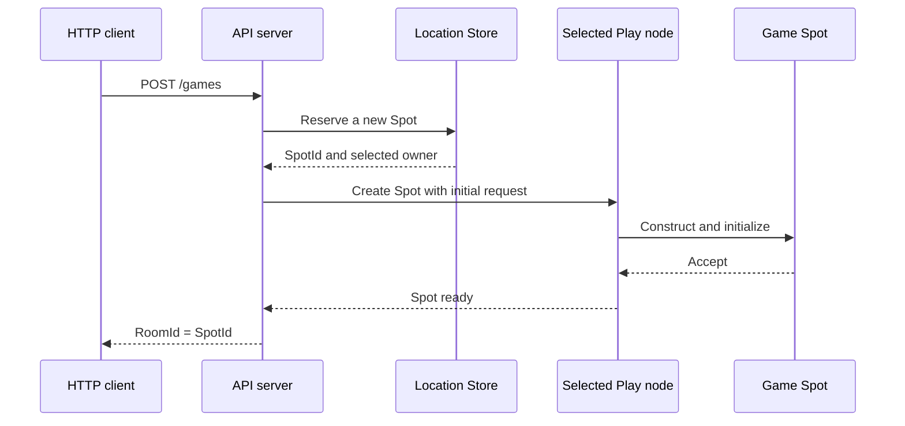

<!-- generated:start -->
<!-- 이 파일은 `common/guide/server/02-getting-started.ko.md`에서 생성한다. 직접 고치지 않는다.
     고칠 곳은 공통 소스이고, `python3 doc/site/scripts/generate_language_guides.py`로 다시 만든다. -->
<!-- generated:end -->

<!-- framework-adapter-nav:start -->
[가이드 홈](README.ko.md) | [이전: 1. 개요](01-overview.ko.md) | [다음: 3. 핵심 개념](03-concepts.ko.md)
<!-- framework-adapter-nav:end -->

<!-- language-switch:start -->
다른 언어로 보기 — [C#/.NET](../../../dotnet/guide/server/02-getting-started.ko.md) · [C++](../../../cpp/guide/server/02-getting-started.ko.md) · [Java](../../../java/guide/server/02-getting-started.ko.md) · **Kotlin** · [Node/TypeScript](../../../node/guide/server/02-getting-started.ko.md)
<!-- language-switch:end -->

# 2. 시작하기

> **이 장의 계약 소유 문서** — 없다. 설치하고 첫 동작을 확인하는 절차 안내다.

> 패키지를 설치하고 두 process가 서로 호출하는 최소 예제를 먼저 돌린 뒤(§1~§2),
> 실제 [TicTacToe sample](../../../../../languages/java/samples/kotlin/TicTacToe)이
> 방 하나를 만드는 흐름을 따라간다(§3~§11).

## 1. 설치

Maven Central에서 받는다. 서버 하나를 만들 때 필요한 최소 조합은 다음 셋이다.

```kotlin
implementation("systems.zlink:zlink-framework-core")                // 계약과 runtime
implementation("systems.zlink:zlink-framework-spring-boot-starter") // DI·수명주기 등록
implementation("systems.zlink:zlink-framework-kotlin")              // coroutine idiom
```

필요할 때 더하는 아티팩트는 다음과 같다.

| 아티팩트 | 언제 더하나 |
| --- | --- |
| `zlink-framework-locations-redis` | Redis location store로 자동 연결을 쓸 때([10-location](10-location.ko.md)) |
| `zlink-framework-codec-protobuf` · `-codec-msgpack` | 기본 JSON codec 대신 쓸 때([05-channel-messaging §7](05-channel-messaging.ko.md#7-직렬화-codec)) |
| `zlink-stream-connector` | 외부 client(게임 client·모바일)를 만들 때([09-stream](09-stream.ko.md)) |
| `zlink-http-client` | 서버에서 HTTP를 호출할 때([HTTP Client 가이드](../http-client/README.ko.md)) |

JDK 21 이상이 필요하다.

라이선스는 계층마다 다르다 — core·binding은 MPL-2.0, framework는 FSL-1.1-ALv2,
`zlink-http-client`는 Apache-2.0이다. 서비스를 만들어 파는 데 드는 비용은 없다
([17-alternative §7](17-alternative.ko.md#7-라이선스--쓰는-데-드는-비용)).

## 2. 최소 예제 — 두 process가 서로 호출한다

Location store도 Redis도 없이, endpoint를 직접 적는 수동 연결로 request/reply 하나를
돌려 본다. 여기까지가 "설치가 끝났다"를 확인하는 지점이다.

**공유 계약.** 두 process가 같은 record를 참조한다.

```kotlin
data class Hello(val name: String)
data class Greeting(val text: String)
```

**server process.** `greeting` channel을 맡고 handler를 등록한다.

```kotlin
@EnableZLinkFramework
@SpringBootApplication
class ServerApplication {

    @Bean
    fun zlink(): ZLinkFrameworkConfigurer = ZLinkFrameworkConfigurer { options ->
        options.addHandlersFromPackageOf(ServerApplication::class.java)  // handler type을 찾는다.

        val mesh = options.addRouteMesh("services")                      // mesh 이름을 정한다.
            .listen("tcp://0.0.0.0:7101")                                // 다른 process가 접속할 자기 endpoint.
        mesh.channel("greeting").server()                                // 이 process가 "greeting"을 처리한다.
            .addRequestHandler(HelloHandler::class.java, Hello::class.java, Greeting::class.java)
    }
}

// 요청 하나를 처리하는 handler.
class HelloHandler : ZLinkRequestHandler<Hello, Greeting> {

    override suspend fun handle(request: Hello, context: ZLinkMessageContext): Greeting =
        Greeting("hello, ${request.name}")
}
```

**client process.** 같은 mesh에 붙어 `greeting`을 호출한다.

```kotlin
@Bean
fun zlink(): ZLinkFrameworkConfigurer = ZLinkFrameworkConfigurer { options ->
    val mesh = options.addRouteMesh("services")
        .listen("tcp://0.0.0.0:7102")                       // 자기 endpoint도 필요하다.
    mesh.channel("greeting").client()                       // 호출만 하는 쪽은 Client.
    mesh.peerConnections().connect("tcp://127.0.0.1:7101")  // 수동 연결 — server endpoint를 직접 적는다.
}

@RestController
class HelloController(private val route: ZLinkRouteClient) {

    @GetMapping("/hello/{name}")
    suspend fun hello(@PathVariable name: String): String =
        // 대상은 ChannelName 하나다. 어느 node가 처리하는지는 지정하지 않는다.
        route.requestToChannel("greeting", Hello(name))
            .submit(Greeting::class.java)
            .await()
            .text
}
```

server를 먼저 띄우고 client를 띄운 뒤 `curl http://localhost:5000/hello/world`를 호출하면
`hello, world`가 돌아온다.

여기서 확인한 것은 셋이다 — 패키지가 붙었고, 두 process가 mesh로 연결됐고, 논리 이름
(`greeting`)만으로 호출이 라우팅됐다. 이 예제에는 Redis도 location store도 없다. 서버가
늘고 줄어도 호출 코드가 그대로이려면 자동 연결이 필요하고, 그건
[10-location](10-location.ko.md)이 다룬다.

## 3. TicTacToe — 방 하나를 만드는 흐름

아래부터는 실제 sample로 옮겨간다. API 서버는 특정 Play node를 고르지 않고 방의 stable
type과 최초 설정만 넘긴다. Framework가 해당 type을 등록한 Object Server 중 하나를
선택하고, 전역에서 유일한 `SpotId`를 발급한다.

### 3.1 실행 흐름



API 코드에는 Play node의 `NodeRid`나 endpoint가 들어가지 않는다. Play node가
추가되거나 교체되어도 같은 생성 코드를 사용한다.

### 3.2 sample 위치

| 확인할 내용 | 파일 |
| --- | --- |
| 전체 실행 | `samples/kotlin/TicTacToe/run_sample.sh` |
| API 실행 진입점 | `samples/kotlin/TicTacToe/Server/.../api/ApiServer.kt` |
| Play 실행 진입점 | `samples/kotlin/TicTacToe/Server/.../play/PlayServer.kt` |
| HTTP handler | `samples/kotlin/TicTacToe/Server/.../api/handlers/CreateGameHttpHandler.kt` |
| Game Spot | `samples/kotlin/TicTacToe/Server/.../play/infrastructure/zlink/spots/tictactoegamespot/TicTacToeGame.kt` |
| 공용 메시지 | `samples/kotlin/TicTacToe/Shared/.../contracts/Messages.kt` |

표의 상대 경로는 `framework/languages/java`를 기준으로 한다.

## 4. API 서버 설정

API 서버는 Location Store와 Object Client role을 등록한다. Object Client role은
Actor와 Spot을 다른 Object Server에 생성하거나 호출할 때 사용한다.

```kotlin
ZLinkFrameworkConfigurer { options ->
    // 모든 process가 같은 위치 정보를 조회하도록 공용 Store를 등록한다.
    options.addLocationStore(
        ZLinkRedisLocationStore(settings.redisEndpoint, settings.redisKeyPrefix))

    val mesh = options.addRouteMesh(SampleNodes.MESH)
        .listen(settings.meshEndpoint)
        .setRoutingIdPrefix("tictactoe-api")

    // API process는 Object를 보관하지 않고 원격 Object 호출만 시작한다.
    mesh.objects().client()
}
```

sample은 재현 가능한 로컬 실행을 위해 peer endpoint를 설정 파일에서 읽는다. 이
endpoint는 연결을 구성할 뿐, 새 Game Spot을 어느 Play node에 배치할지는 지정하지
않는다.

## 5. HTTP 요청에서 Spot 만들기

HTTP handler는 DI로 받은 spot manager를 사용한다.

```kotlin
// HTTP handler는 DI로 받은 ZLinkSpotManager를 사용한다.
@PostMapping("/games")
suspend fun create(@RequestBody request: CreateGameHttpReq): CreateGameHttpRes {
    val gameName = request.gameName.ifBlank { SampleDefaults.GAME_NAME }

    val created = spots
        .create(SampleTypes.GAME_SPOT)      // 이 stable type을 제공하는 node가 후보가 된다.
        .inMesh(SampleNodes.MESH)           // Object를 만들 RouteMesh를 선택한다.
        .request(TicTacToeGameCreateReq(
            gameName,
            SampleDefaults.REQUIRED_LEVEL)) // 새 Spot의 onCreate에 전달할 최초 설정이다.
        .submit()
        .await()

    return CreateGameHttpRes(
        created.spot().spotId(),            // Framework가 발급한 SpotId를 room id로 사용한다.
        settings.playEndpoints,
        settings.playNodes,
        gameName,
        SampleDefaults.REQUIRED_LEVEL)
}
```

`create`는 호출자가 `SpotId`를 정하지 않는 새 User Spot 생성에 사용한다. 같은
`SpotId`를 다시 찾거나 만들려면 `GetOrCreate(spotId, spotType)`을 사용한다.

## 6. Play 서버에서 stable type 등록

Framework는 요청한 stable type을 등록한 Serving Object Server만 생성 후보로
사용한다. Play 서버는 `TicTacToeGame` factory를 다음과 같이 등록한다.

```kotlin
val mesh = options.addRouteMesh(SampleNodes.MESH)
    .listen(settings.meshEndpoint)
    .setRoutingIdPrefix("tictactoe-play")

mesh.objects().server()
    .addSpotFactory(
        SampleTypes.GAME_SPOT,          // API가 create에 넘긴 stable type과 같다.
        TicTacToeGame::class.java
    ) { factory -> factory.disableRelocation() }
```

특정 Play node를 선호하거나 `NodeRid`로 배치하는 sample 계약은 없다. 배치 후보와
용량은 Framework와 Location Store가 판단한다.

## 7. 최초 설정 검증

선택된 Play node는 Spot을 만든 뒤 최초 요청을 `onCreate`에 전달한다. Spot은
설정을 검증하고 생성 수락 여부를 반환한다.

```kotlin
override suspend fun onCreate(request: ZLinkMessage): ZLinkSpotCreateResponse {
    val settings = request.decode(TicTacToeGameCreateReq::class.java)

    if (settings.gameName.isBlank())
        return ZLinkSpotCreateResponse.reject("GameName is required.")

    gameName = settings.gameName
    requiredLevel = settings.requiredLevel

    // accept 이후에만 Location Store에서 이 Spot이 Ready로 공개된다.
    return ZLinkSpotCreateResponse.accept()
}
```

생성을 거부하면 해당 예약은 Ready Spot으로 공개되지 않는다. 호출자는 typed failure로
완료 결과를 받는다.

## 8. ClientServer channel의 용도

TicTacToe의 `tictactoe.api` ClientServer channel은 Play session이 사용자 인증을
API 서버에 요청할 때 사용한다. Game Spot 생성에는 사용하지 않는다.

```kotlin
// API process: 인증 요청을 처리한다.
options.addClientServerChannel(SampleChannels.API)
    .server()
    .listen()
    .addRequestHandler(
        AuthenticatePlayerHandler::class.java,
        AuthenticatePlayerReq::class.java,
        AuthenticatePlayerRes::class.java)

// Play process: 인증 요청을 보낸다.
options.addClientServerChannel(SampleChannels.API)
    .client()
```

Object 생성과 ClientServer 호출은 서로 다른 기능이다. 방 생성 전용 channel이나
`CreateGameHandler`를 추가하지 않는다.

## 9. build와 실행

```bash
# sample을 먼저 build한다.
./gradlew -p framework/languages/java/samples :kotlin:TicTacToe:build

# Redis와 네 개 process를 준비하고 전체 scenario를 검증한다.
framework/languages/java/samples/kotlin/TicTacToe/run_sample.sh
```

runner는 API 두 개와 Play 두 개를 실행한다. Game Spot을 생성한 뒤 서로 다른 Play
endpoint에 연결한 참가자들이 같은 방에 join하고, 게임 메시지와 종료 정리를
검증한다.

## 10. 실패할 때 확인할 항목

| 증상 | 확인할 항목 |
| --- | --- |
| 생성 후보가 없다 | Play process가 같은 `MeshName`에 Object Server와 `GameSpot` stable type을 등록했는지 확인한다. |
| startup이 실패한다 | Redis 연결, `MeshName`, listen endpoint와 중복 등록 오류를 확인한다. |
| 생성이 거부된다 | `onCreate`가 받은 최초 설정과 reject 사유를 확인한다. |
| client가 방에 join하지 못한다 | HTTP 응답의 `RoomId`를 Actor join 요청에 그대로 사용했는지 확인한다. |

다음 장에서는 여기서 사용한 channel, Spot, Actor, Stream과 Location Store의 역할을
각각 설명한다.

---
