<!-- generated:start -->
<!-- This file is generated from `common/guide/server/04-backpressure.en.md`. Do not edit directly.
     Edit the common source instead, then regenerate with `python3 doc/site/scripts/generate_language_guides.py`. -->
<!-- generated:end -->

<!-- framework-adapter-nav:start -->
[Guide Home](README.en.md) | [Previous: 3. Core Concepts](03-concepts.en.md) | [Next: 5. Channel Messaging — request · send · pub/sub](05-channel-messaging.en.md)
<!-- framework-adapter-nav:end -->

<!-- language-switch:start -->
View in another language — [C#/.NET](../../../dotnet/guide/server/04-backpressure.en.md) · [C++](../../../cpp/guide/server/04-backpressure.en.md) · [Java](../../../java/guide/server/04-backpressure.en.md) · [Kotlin](../../../kotlin/guide/server/04-backpressure.en.md) · **Node/TypeScript**
<!-- language-switch:end -->

# 4. Backpressure — When Arrival Outpaces Processing

> **The documents that own this chapter's contract** — covered by the
> [Async Execution Policy](../../../common/spec/server/05-async-execution-policy.en.md),
> [Framework API](../../../common/spec/server/06-framework-api.en.md),
> [Runtime Monitoring](../../../common/spec/server/24-runtime-monitoring.en.md), and the
> [per-language topology public contract](../../../common/spec/server/languages/README.en.md).
> This chapter explains that behavior as concepts and principles, and covers which options
> affect it. Exact option names, defaults, and mutability are owned by each language's
> [16. Options](16-options.en.md) and exact interface.

## 0. Options When Inflow Exceeds Processing Capacity

One of the following happens.

- **Drop it** — throughput is preserved, but the message disappears, with no way to check
  what was lost.
- **Queue it indefinitely** — nothing is lost, but memory usage keeps growing until the
  process eventually dies.
- **Make the sender wait** — the receiver's processing delay comes back as the sender's send
  delay.

ZLink uses the third approach. **The flow control that turns the receiver's processing delay
back into the sender's send wait is called backpressure.** An application message that has
already been accepted is never dropped because of load. So under load, what shows up on the
application isn't "the message vanished" — it's "`send` got slow" or "`DeadlineExceeded`
happened."

## 1. Core HWM And The Application Job Queue

Framework host backpressure limits two different resources. Core HWM limits accounted bytes
held by ordinary send/receive queues per origin. The framework's application job queue limits
the number of jobs waiting to start a handler across the whole host instance. Bytes and jobs
aren't combined into one ceiling or converted into each other.

When a Core queue hands an application record to the binding/framework, Core receive-HWM
accounting for that record ends. The framework acquires an application job queue permit
immediately before receive/claim and returns it immediately before the actual user callback's
first instruction. A handler that has started and is awaiting asynchronous I/O therefore does
not reacquire the queue permit. A framework-side owner keeps the record payload valid until its
required terminal, but it does not continue to occupy Core HWM budget.

```mermaid
%%{init: {'themeVariables': {'edgeLabelBackground':'transparent'}}}%%
flowchart LR
    H1["sending handler<br/>SendToChannel(...)"]:::app
    SQ["Core ordinary send queue<br/>accounted-byte HWM"]:::queue
    AC(["Application connection"]):::net
    RQ["Core ordinary receive queue<br/>accounted-byte HWM"]:::queue
    BUD["application job queue<br/>reserved + queued permits"]:::budget
    H2["receiving handler"]:::app
    CC(["Completion connection"]):::net

    H1 --> SQ --> AC --> RQ --> BUD --> H2
    H2 -. "terminal reply · error" .-> CC
    CC -.-> H1

    classDef app fill:#e3f2fd,stroke:#1565c0,color:#0d47a1
    classDef queue fill:#fff3e0,stroke:#e65100,color:#bf360c
    classDef budget fill:#f3e5f5,stroke:#6a1b9a,color:#4a148c
    classDef net fill:#eceff1,stroke:#546e7a,color:#000000
```



When the application job queue reaches its limit, every ordinary ingress record other than a
terminal reply/error completion identifiable before receive waits cancellably for a permit
before a new receive/claim.
Load does not turn an accepted message into a drop or capacity error. As Core ordinary receive
queues fill, their per-origin byte HWMs propagate pressure back to the sender.

## 2. How It Works

### 2.1 The Basis For Locking Sends

Whether to stop sending is judged from **one value inside your own process.** It doesn't ask
the peer how much it's OK to send — once the byte sum of messages the peer hasn't yet taken
reaches the send queue's ceiling, sending to that peer locks. There are several reasons the
ceiling gets reached.

- Sent far more than usual in a short time.
- Sent the usual count, but the payload was larger, filling the same byte total faster.
- The network is slow, so the queue isn't draining as fast as usual.
- The receiver can't keep up processing, so the send path is blocked.
- The connection dropped and there's nowhere to send while reconnecting.

### 2.2 How Receive-Side Delay Propagates To Sends

It passes through three stages. The receiving framework and Core handle the first two; the
sending application encounters a wait only at the last stage.

**Stage 1 — application job queue permits fill.** If ordinary ingress outpaces handler
processing, reserved supply and jobs waiting for handler start reach the host-instance limit.
The framework waits for a permit before receiving/claiming the next ordinary record. It does
not turn saturation into reject/drop or an unbounded temporary queue.

**Stage 2 — Core receive queues fill.** When the framework stops taking ordinary ingress,
accounted bytes accumulate in Core queues. A queue reaching its per-origin receive HWM slows
the sender's corresponding path. Other origins and terminal reply/error completion identifiable
before receive remain separate from this saturated queue.

**Stage 3 — the sender's Core submit waits.** While the receiver cannot take more records,
the sender's ordinary send queue stops draining. The binding submits the selected exact-target
operation once, and Core owns the HWM wait/retry and completes the per-operation completion.
The framework installs no separate readiness callback or retry adapter and does not reselect
the route of a waiting operation. Deadline expiry or target detach is terminal for that operation.

```text
The receiving handler can't keep up
  → application job queue permits fill and ordinary receiving waits
  → Core ordinary receive queues reach their accounted-byte HWM
  → per-origin backpressure propagates into the sender's Core queue
  → send waits until it can be accepted
```

The sender only knows that its submit wasn't accepted. A timeout result alone cannot
distinguish a remote handler delay, network delay, or local Core queue pressure, so inspect
Core HWM and application job queue status on both sides
([12-operations](12-operations.en.md) §1).

### 2.3 Permit Return And Wait Resumption

An application job queue permit is returned immediately before the user's callback first
instruction, not when a queue publishes a job or an executor task is created. A returned
permit is handed to the oldest live waiting ingress source, and a new acquire does not pass
an existing waiter. A handler does not reacquire the permit after it starts and awaits.

Terminal reply/error completion identifiable before receive uses neither an ordinary-ingress
permit nor the ordinary Core byte HWM. A record received first on an ordinary connection does
not gain this bypass after classification. Every other control or malformed record acquires
before receive and returns the permit immediately after classification and finite internal
processing when it creates no handler job. This separation allows terminal completion of an
already-started request to progress while ordinary traffic is saturated.

### 2.4 Splitting The Application Connection And Completion Connection

Connecting to one peer creates two paths. The **Application connection** carries ordinary
messages and requests as well as Framework heartbeat, topology, relocation, and service-wire
`sendReady` kind `12`; this Framework control remains on the data-line FIFO. The **Completion
connection** carries terminal replies and error replies for already-sent requests. It is not a
general-purpose Framework control channel.

The reason for splitting the path is that if the reply were on the same path when the
backlog fills and receiving stops, an already-sent request could never complete, its handler
could never finish, and there'd be no way for the backlog to shrink. The Completion
connection keeps reading even while application receiving is stopped, so an in-flight
request finishes normally, and the backlog drops as the next job starts executing.

There's no shared arrival order between the two paths. Even from the same peer, a terminal reply
on the Completion connection can overtake a message on the Application connection, so a handler
never judges before/after by arrival order.

## 3. Backpressure Visible In The API

### 3.1 Why send Is async

`send` doesn't wait for a response, but there's one thing it does have to wait for — **a
slot to send into.**

```typescript
await client.sendToChannel('orders', cancelOrder('order-1042')).submit();
// This await finishing means only "my runtime accepted the submission."
// It doesn't mean the peer received it or the handler finished.
```

The framework starts one binding operation. If there is no room, Core owns the HWM wait and
internal retries for that same operation and completes its per-operation completion within
`DefaultSocketSendTimeout` (1 second by default). If room never opens up, it ends in a
`DeadlineExceeded` exception. **The framework does not create or resend a second operation** —
after a terminal failure, whether to start a new operation, drop it, or tell the user it failed
is up to the application.

```typescript
try {
  await client.sendToChannel('orders', command).submit();
} catch (ex) {
  if (!(ex instanceof ZLinkFrameworkException)) throw ex;
  if (ex.kind !== ZLinkFrameworkErrorKind.DeadlineExceeded) throw ex;
  // Only this operation's DeadlineExceeded terminal is certain. The peer's state is unknown.
  // canSafelyRetry is an application-owned predicate that checks whether the command tolerates duplication.
  if (!canSafelyRetry(command)) throw ex;
  pending.push(command);
}
```

Whether it's OK to resend is judged by the application's business rules. Retry is safe
**only when the same command arriving twice produces the same result** — canceling an order
twice still ends in one canceled state, but approving a payment twice can approve it twice.
For the latter, either surface the failure to the caller instead of retrying, or carry a
unique id on the command so the receiver can filter duplicates before you retry. Even when
retrying, sending again immediately just piles the request back onto a queue that hasn't
drained yet and grows the congestion, so leave a gap between retries.

Only that call waits during the wait — the execution thread handles other work
([05-channel-messaging](05-channel-messaging.en.md#asynchronous-execution)).

**There's one case that fails immediately instead of waiting until the ceiling.** When even
the space that holds calls waiting for a slot is full. In that case, the payload isn't held
at all — it ends immediately in `DeadlineExceeded`. If the configured ceiling is 1 second and
`send` failed instantly, that means the queue isn't full — **too many calls are waiting** —
so look at the sender's concurrency first.

The target is fixed once, before the binding operation starts. A call that directly names a
node or sends by Spot/Actor ID uses that exact target; a channel call selects one current channel
candidate immediately before starting the operation. **After the operation starts, no call
reselects its target while Core performs the HWM wait and retry.** A later, new channel operation
can observe and select a candidate that has changed by then.

### 3.2 request's Timeout Boundary

A request waits for both a slot to send into and the peer's reply, so in a congested
stretch, `timeout(...)` is the real ceiling. In particular, **always give a finite timeout
to a flow that sends another request from inside a handler.**

```typescript
async handle(request: PlaceOrder, context: ZLinkMessageContext): Promise<PlaceOrderReply> {
  // While the handler waits for the reply, this handler's execution slot stays occupied.
  // If both nodes' processing is delayed at the same time, a finite timeout is the only place recovery starts.
  const reserved = await this.client
    .requestToChannel('inventory', reserveStock(request.sku, request.quantity))
    .timeout(3000)
    .submit<StockReserved>();

  return placeOrderReply(request.orderId, reserved.reservationId);
}
```

A timeout isn't a knob to tune backpressure — it's **the boundary where you stop waiting.**
Even when the caller ends on a timeout, the remote handler's execution, if already started,
is neither cancelled nor rolled back.

## 4. Options That Affect This

| Option | What it sets | Where it's configured |
| --- | --- | --- |
| `DefaultSocketSendTimeout` | The ceiling to wait when there's no slot to send into (1 second by default) | Root option |
| — | The value actually applied **differs by send path** (below) | — |
| `sendHighWaterMark` | Bytes that can be held **to send**, per peer. `0` means unlimited | `configureRouterSocket()` |
| `receiveHighWaterMark` | Bytes that can be held **after receiving**, per peer. `0` means unlimited | `configureRouterSocket()` |
| `maxMessageSize` | The max size of one message that will be accepted | `configureRouterSocket()` |
| `sendHighWaterMark` · `linger` | The pub/sub publish socket's ceiling and how long a pending publish waits at shutdown | `configureSpotPublisher()` |
| `coreHwmMemoryLimitBytes` · `coreHwmBudgetBytes` · `CoreHwmProfile` | The Core context's ordinary-queue byte budget | root inbound-dispatch configuration |
| `ApplicationJobQueueProfile` · `maxQueuedApplicationJobs` · pause/resume thresholds | The host instance's queued-application-job limit and flow-transition boundaries | root inbound-dispatch configuration |

**"The ceiling for waiting on a send slot" isn't a single global value.** The value actually
used is owned by the socket that call uses.

| Send path | Which ceiling it uses |
| --- | --- |
| RouteMesh node/channel, Spot, Actor | The chosen MeshNode's send ceiling. **Includes the time spent finding the location** |
| ClientServer | The client-side send ceiling |
| Logical Multicast | The chosen MeshNode's send ceiling, applied per target |
| classic pub/sub | The publish socket's send ceiling |
| session relay / bound session send | The Framework socket's send ceiling |
| STREAM send / reply | That STREAM socket's send ceiling |

The last row is an especially easy place to get confused. **A reply doesn't use the request
timeout the caller specified.** Just because the client decided to wait 5 seconds doesn't
mean the server's reply submission waits 5 seconds.
A STREAM one-way send can use a per-call timeout modifier to shorten this wait. It never extends the
socket timeout; the earlier deadline wins, with no late admission or replay afterward. This modifier
does not apply to a reply.

If unspecified, each path uses 1 second. The value is rounded up to milliseconds and must be
`1` or greater — `0`, a negative number, or infinity are **rejected at host startup** —
they're never silently swapped for the default.

The two HWMs differ only in direction, not in character. Each sets **how many bytes your own
node will hold**, and that limit carries through to the peer's flow. When deciding a value,
check the following.

- **Raising it** absorbs more of a momentary burst; **lowering it** surfaces congestion
  sooner.
- **Keep `maxMessageSize` finite.** If it's unlimited, one message can exceed the ceiling by
  any amount, making it impossible to compute the worst-case memory a queue can occupy.
- **This is a manual ceiling for a socket-direction physical queue.** Don't interpret it as
  a Core-context-wide budget or an application job queue limit.
- **Raising the high-water mark isn't the default response.** A larger ceiling absorbs
  congestion into memory, which makes `DeadlineExceeded` show up later — and that delays
  diagnosing the cause just as much. If processing delay keeps happening, check the
  processing side (receiving node count, handler execution time) instead of the ceiling.

Leaving manual socket HWMs unset does not make the framework calculate a connection-count
bucket table. The framework root forwards Core memory settings to the same Core context;
Core computes its physical-queue census and directional HWMs. The application job queue
limits job count independently of that byte calculation.

### 4.1 Core HWM — The Byte Budget Owned By Core

Set the following values through the root inbound-dispatch configuration. See `16. Options` and the
exact interface for each language's precise spelling.

| Setting | Purpose |
| --- | --- |
| `coreHwmMemoryLimitBytes` | A finite process/runtime memory-limit hint forwarded for Core budget calculation |
| `coreHwmBudgetBytes` | A positive manual Core budget that takes precedence over profile calculation |
| `CoreHwmProfile` | The Core Auto-budget profile. The default is `Balanced` |

The framework and binding do not apply the profile ratio or divide the budget by connection
count. They read Core's effective budget, directional queue HWMs, accounted bytes, and
blocked ratio directly from the Core snapshot. `coreHwmBudgetBytes` is not a hard process
RSS cap, so observe RSS, the managed heap, and allocator overhead separately
([Runtime Monitoring](../../../common/spec/server/24-runtime-monitoring.en.md)).

For a manual production budget, measure current/peak Core-accounted bytes, blocked ratio,
throughput, latency, and process memory under production-like payload distribution and
connection count. [Perf §23](../../../common/perf/README.en.md#23-measuring-production-values-for-core-hwm-and-the-application-job-queue)
defines the measurement procedure.

### 4.2 Setting An HWM Directly

`sendHighWaterMark` and `receiveHighWaterMark` are per-socket-direction manual HWMs. They use
bytes like `coreHwmBudgetBytes`, but have a different owner and scope. A manual socket HWM
applies to that directional queue; it is not a replacement calculation for the Core Auto
budget.

- **`0` means unlimited.** It removes the ceiling, so don't use `0` to mean "leave it at the
  default." Leave the manual value unspecified to use Core Auto calculation.
- **Each direction applies separately.** If only one is set, Core's calculated HWM applies
  to the opposite direction.
- **It does not apply to the completion lane.** Public send/receive HWMs are not copied to
  progress identifiable before receive as terminal reply/error completion.

### 4.3 Application Job Queue HWM — The Host-Wide Job Limit

The application job queue HWM limits the number of jobs waiting for handler start across a
framework host instance. It participates in backpressure alongside Core HWM, but does not
count bytes or a memory ratio.

| | Core HWM | Application Job Queue HWM |
| --- | --- | --- |
| Owner | A Core context's per-origin ordinary queues | The framework host instance's shared queue |
| Unit | Accounted bytes | Reserved supply plus queued application jobs |
| Acquisition | Core queue admission | Immediately before ordinary receive/claim |
| Release | When the Core queue gives up frame ownership | Immediately before the user callback's actual first instruction |
| Saturation result | The sender for that origin waits | The ordinary ingress source waits for a permit |
| Settings | `coreHwmMemoryLimitBytes` · `coreHwmBudgetBytes` · `CoreHwmProfile` | `ApplicationJobQueueProfile` · `maxQueuedApplicationJobs` · `applicationJobQueuePauseThresholdPercent` · `applicationJobQueueResumeThresholdPercent` |

Manual `maxQueuedApplicationJobs` is an exact limit in `1..2,147,483,647`. `0` is not
unlimited; it is a startup configuration error. Without a manual value, the framework
calculates the value once at startup from the effective processor count and profile.

By default, the framework changes to `paused` when permits in use reaches 80% of the limit and
back to `running` at or below 60%. It rounds the pause permit count up and the resume permit
count down. Tune these boundaries with `applicationJobQueuePauseThresholdPercent` (`1..100`)
and `applicationJobQueueResumeThresholdPercent` (`0..99`); resume must be below pause.
Pressure state itself does not change readiness or liveness.
Receive-flow coupling applies only to paired DEALER/ROUTER sockets for RouteMesh and
ClientServer; it does not apply this pressure state to PUB/SUB or STREAM.

| Profile | Jobs per effective processor |
| --- | ---: |
| `Compact` | 32 |
| `LowLatency` | 64 |
| `Balanced` (default) | 128 |
| `Throughput` | 256 |

`CoreHwmProfile` and `ApplicationJobQueueProfile` use the same labels but are different
public types and calculations. A profile is a bootstrap value for starting a benchmark. In
production, measure the `reserved + queued` permit distribution, payload-size distribution,
and process memory at the target CPU usage and acceptable latency, then set the manual job
limit. For a workload that retains large payloads for longer, lower `maxQueuedApplicationJobs`
to reduce the number of records owned concurrently by the framework instead of changing the
Core profile.

At the limit, new ordinary ingress waits for a returned permit in oldest-waiter order. Batch
and 1:N local dispatch do not create more handler jobs than the permits already secured.
Terminal reply/error completion identifiable before receive does not use this permit, and
`maxMessageSize` remains an independent single-message cap.

## 5. How To Confirm Congestion Is Happening

```typescript
// Node sets the level as a message flow log mode.
builder.configureDispatch()
  .messageFlow("errors"); // Default — records errors and backpressure.
```

If `backpressured` shows up in the message flow record, it means waiting for a send slot
genuinely happened. The metric to check alongside it is
`zlink.mesh_node.request.timeouts` (how many times a request hit the boundary), and which
execution target is causing the delay is narrowed down using handler execution time and
per-node processing metrics (the [11. Monitoring](11-monitoring.en.md) ·
[12-operations](12-operations.en.md)).

For byte pressure, inspect `zlink.host.core_hwm.effective_budget`, `applied`, `accounted`,
and `blocked_ratio` together. For pre-handler-start job pressure, inspect
`zlink.host.application_job_queue.limit`, `jobs`, `capacity_waiters`, `capacity_waits`, and
`capacity_wait_duration`. A metrics reset preserves current gauges, rebases peak to current,
and clears only the current epoch's counts and duration.

`zlink.mesh_node.messages.dropped` isn't a backpressure indicator. If this value rises, a
message was dropped for a separately confirmed reason, not load, so check the `reason`
attribute first.

## 6. Framework Runtime Coverage

This common guide does not list per-language implementation differences. Common behavior is
owned by [Framework API §2.1](../../../common/spec/server/06-framework-api.en.md#21-separating-the-core-memory-budget-from-the-application-job-queue),
and status/reset semantics are owned by
[Runtime Monitoring](../../../common/spec/server/24-runtime-monitoring.en.md). See the language's
`16. Options`, `11. Monitoring`, and
[exact interface](../../../common/spec/server/languages/README.en.md) for its spelling and
call form.

## 7. Common Problems

- **`send` ends in `DeadlineExceeded`** → a send slot never opened up. Before raising the
  ceiling, inspect the receiver's Core `blocked_ratio`, application job queue waiters, and
  handler execution time.
- **Core-accounted bytes are low, but receiving waits** → application job queue permits may
  be full. Inspect `reserved`, `queued`, `in_use`, and capacity waiters.
- **Application job queue `queued` is low, but the limit is reached** → `in_use` also counts
  the short pre-receive `reserved` permits. Size a manual limit from `reserved + queued`.
- **A handler appears scheduled, but the job count has not dropped** → permit release occurs
  at the user's actual first callback instruction, not executor task publication. Check the
  handler-start gate.
- **`MaxQueuedApplicationJobs = 0` fails startup** → `0` is not unlimited. Omit the manual
  value to select Auto.
- **Using the same profile label does not move byte and job limits by the same ratio** →
  `CoreHwmProfile` and `ApplicationJobQueueProfile` share labels only; their units and
  calculations are independent.
- **Replies still complete while the application job queue is full** → terminal reply/error
  completion identifiable before receive bypasses the shared permit and ordinary Core HWM, so
  this is expected.
- **Raising the ceiling made the symptom show up later** → this is normal. Once congestion
  is absorbed into memory, the failure surfaces later. To fail fast and switch to a
  different path, lower the ceiling and shrink `DefaultSocketSendTimeout`.
- **`publish` completed normally, but the subscriber never received it** → publish's
  completion means only that it was ready to send and the runtime accepted the submission.
  Delivery, resend, and ack aren't provided
  ([05-channel-messaging](05-channel-messaging.en.md#13-two-branches-of-pubsub)).
- **A request inside a handler hangs for a long time** → if both sides' processing is
  delayed at the same time, a finite timeout is where recovery starts. Give a nested request
  a `timeout(...)`.
- **One slow node is also delaying other calls** → the send queue is separate per peer, but
  waiting inside the same handler also occupies that handler's execution slot the whole
  time. Don't put a call to a slow-responding target in the same handler as other calls.

## 8. Related Documents

- Option defaults and when they can change: [16. Options](16-options.en.md) §3
- The formal contract for one-way submit and the completion boundary:
  [Async Execution Policy](../../../common/spec/server/05-async-execution-policy.en.md)
- Core HWM and application job queue settings:
  [Framework API §2.1](../../../common/spec/server/06-framework-api.en.md#21-separating-the-core-memory-budget-from-the-application-job-queue)
- Status, metrics, and reset semantics:
  [Runtime Monitoring](../../../common/spec/server/24-runtime-monitoring.en.md) ·
  [Runtime Metrics](../../../common/spec/server/25-runtime-metrics.en.md)
- The socket configuration surface:
  [per-language topology public contract](../../../common/spec/server/languages/README.en.md)
- The byte-unit contract for a socket option: [the core guide's socket option](https://zlink-systems.github.io/zlink/guide/12-socket-options/)
- Next axis: [05-channel-messaging](05-channel-messaging.en.md)
