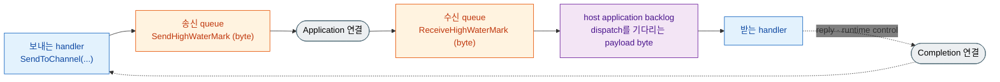

<!-- generated:start -->
<!-- 이 파일은 `common/guide/server/04-backpressure.ko.md`에서 생성한다. 직접 고치지 않는다.
     고칠 곳은 공통 소스이고, `python3 doc/site/scripts/generate_language_guides.py`로 다시 만든다. -->
<!-- generated:end -->

<!-- framework-adapter-nav:start -->
[가이드 홈](README.ko.md) | [이전: 3. 핵심 개념](03-concepts.ko.md) | [다음: 5. Channel Messaging — request · send · pub/sub](05-channel-messaging.ko.md)
<!-- framework-adapter-nav:end -->

<!-- language-switch:start -->
다른 언어로 보기 — [C#/.NET](../../../dotnet/guide/server/04-backpressure.ko.md) · [C++](../../../cpp/guide/server/04-backpressure.ko.md) · [Java](../../../java/guide/server/04-backpressure.ko.md) · [Kotlin](../../../kotlin/guide/server/04-backpressure.ko.md) · **Node/TypeScript**
<!-- language-switch:end -->

# 4. Backpressure — 처리보다 도착이 빠를 때

> **이 장의 계약 소유 문서** — [비동기 실행 정책](../../../common/spec/05-async-execution-policy.ko.md)과
> [언어별 topology 공개 계약](../../../common/spec/server/languages/README.ko.md)이
> 다룬다. 이 챕터는 그 동작을 개념과 원리로 설명하고 어떤 옵션이 영향을 주는지 다룬다.
> 옵션의 기본값과 변경 시점은 [16. Options](16-options.ko.md)이 소유한다. 이 챕터가 쓰는
> 계약 가운데 runtime에 아직 반영되지 않은 부분은
> [Framework에 아직 적용되지 않은 부분](#6-framework-runtime-적용-범위)이 밝힌다.

## 0. 처리 능력을 넘는 유입이 발생할 때의 선택지

다음 중 하나가 일어난다.

- **버린다** — 처리량은 유지되지만 message가 사라지고, 무엇이 사라졌는지 확인할 방법도 없다.
- **무한히 쌓는다** — 아무것도 잃지 않지만 memory 사용량이 계속 늘어 결국 process가 종료된다.
- **보내는 쪽을 기다리게 한다** — 받는 쪽의 처리 지연이 보내는 쪽의 송신 지연으로 돌아온다.

ZLink는 세 번째 방식을 사용한다. 이렇게 **받는 쪽의 처리 지연을 보내는 쪽의 송신 대기로
되돌리는 흐름 제어를 backpressure라고 한다.** 한 번 받아들인 application message는 부하를
이유로 버리지 않는다. 따라서 부하가 걸린 상태에서 application에 나타나는 증상은
"message가 사라졌다"가 아니라 "`send`가 느려졌다" 또는 "`DeadlineExceeded`가 발생했다"다.

## 1. 송·수신 queue와 high-water mark

`sendToChannel(...)`이나 `publish(...)`로 보낸 message는 이 process가 상대별로 유지하는
**송신 queue**에 먼저 들어가고, 그 queue에서 차례로 연결을 통해 나간다. 받는 쪽에도 아직
처리하지 못한 message가 머무는 **수신 queue**가 있다. 두 queue에는 각각 상한이 있고, 이
상한을 high-water mark(HWM)라 한다.

**HWM은 message 개수가 아니라 그 queue가 실제로 보관하는 byte로 센다.** 개수로 세면 같은
상한에서도 payload 크기에 따라 보유 memory가 수십 배 달라지고, 그 결과 설정값으로 process
memory를 예측할 수 없다. byte로 세면 queue 하나가 차지할 수 있는 memory가 설정한 값으로
정해진다.

두 queue가 세는 byte는 payload 크기가 아니다. runtime이 message와 함께 들고 있는 routing
frame과 고정 metadata를 더한 값이며, 그 합이 작더라도 message 한 건에 **최소 charge**가
적용된다. 크기가 거의 0인 message를 아주 많이 보내도 queue metadata만 늘어나는 상황을
막기 위해서다. 그래서 payload 합계로 계산한 값보다 상한에 조금 일찍 닿는다.



받는 쪽에서 message는 수신 queue를 지나 Framework의 **application backlog** 안으로 들어온다.
backlog는 Framework가 받았지만 **아직 handler 실행을 시작하지 못한** message의 payload
byte 합계다. connection이나 node마다 나누지 않고 한 host 전체에 하나로 적용하며, handler가
그 message 처리를 시작하는 순간 backlog에서 빠진다. backlog가 상한에 닿으면 Framework는 새
message를 받는 것을 멈추고, 그만큼 수신 queue가 차고, 그 압력이 보내는 쪽까지 이어진다.
**어느 단계에서도 이미 받아들인 message를 버리지 않는다** — 상한이 하는 일은 버리는 것이
아니라 기다리게 하는 것이다.

## 2. 동작 원리

### 2.1 송신 잠금 판단 기준

보내기를 멈출지 여부는 **자기 process 안의 값 하나**로 판단한다. 상대에게 얼마나 보내도
되는지 묻지 않고, 아직 상대가 가져가지 않은 message의 byte 합이 송신 queue의 상한에 닿으면
그 상대로 가는 송신을 잠근다. 상한에 닿는 이유는 여럿이다.

- 짧은 시간에 평소보다 훨씬 많이 보냈다.
- 평소와 같은 건수를 보냈지만 payload가 커서 같은 byte를 더 빨리 채웠다.
- 네트워크가 느려 queue가 평소만큼 비워지지 않는다.
- 받는 쪽이 처리하지 못해 전송 경로가 막혔다.
- 연결이 끊겨 재연결하는 동안 내보낼 곳이 없다.

### 2.2 수신 지연이 송신으로 전파되는 경로

세 단계를 거친다. 앞 두 단계는 받는 쪽 runtime과 TCP가 처리하고, 마지막 단계에서 비로소
보내는 application이 대기를 겪는다.

**1단계 — 받는 쪽이 수신을 멈춘다.** handler가 처리하는 속도보다 도착이 빠르면 dispatch를
기다리는 message가 쌓이면서 host의 application backlog가 먼저 상한에 닿는다. 그때부터
Framework는 그 host에서 새 application message를 받기 시작하지 않는다. 이미 도착한 message는
버려지지 않고 수신 queue에 그대로 남는다.

**2단계 — TCP 흐름 제어가 전송 속도를 낮춘다.** 받는 쪽이 수신을 멈추면 수신 queue가
상한까지 차고 그다음에는 수신 버퍼가 찬다. TCP는 남은 여유(수신 윈도우)를 보내는 쪽에 알려
주고, 여유가 없으면 보내는 쪽 TCP는 더 내보내지 않고 상대가 읽어 갈 때까지 기다린다.
결과적으로 **전송 속도가 받는 쪽이 처리하는 속도에 맞춰진다.** 이 단계는 실패가 아니라
감속이므로 보내는 application에는 아직 아무 변화도 나타나지 않는다.

**3단계 — 송신 queue가 상한에 닿으면 `send`가 대기한다.** 전송이 느려진 만큼 송신 queue도
천천히 비워진다. application이 그보다 빠른 속도로 계속 message를 넣으면 queue에 쌓이고,
보관 byte가 `sendHighWaterMark`에 닿는 순간 그 상대로 가는 송신이 잠긴다. 이때부터 `send`
호출이 곧바로 반환되지 않고 자리가 나기를 기다린다 — 받는 쪽의 지연이 application의 대기로
처음 나타나는 지점이다.

```text
받는 handler가 처리 속도를 못 맞춤
  → 받는 쪽 application backlog가 차고 수신이 멈춘다   (1단계: 받는 쪽이 멈춘다)
  → 수신 queue가 byte 상한까지 차고 수신 윈도우가 줄어든다
  → TCP가 전송 속도를 낮춘다                          (2단계: 전송이 느려진다)
  → 보내는 쪽 송신 queue가 비워지는 속도도 느려진다
  → 넣는 byte가 비워지는 byte보다 많으면 상한까지 찬다
  → send가 자리를 기다린다                            (3단계: application이 대기한다)
```

**즉 backpressure는 TCP 흐름 제어의 연장이다.** TCP는 전송 속도를 낮추는 데서 멈추고,
HWM이 그 영향을 application 호출까지 끌어올린다. 그래서 보내는 쪽이 알 수 있는 것은 "내 자리가
없다"는 사실뿐이고, "상대가 느리다"는 정보는 얻지 못한다. `DeadlineExceeded`도 상대의
상태를 알려 주지 못하므로, 원인을 구분하려면 상대 node의 처리 지표를 함께
확인한다([12-operations](12-operations.ko.md) §1).

### 2.3 잠금과 해제 임계값

상한에 닿으면 송신이 잠기지만, message가 하나 빠져나갈 때마다 곧바로 풀리지는 않는다.
**상한의 절반가량이 비워졌을 때** 다시 보낼 수 있게 된다.

message 하나 단위로 잠금과 해제를 반복하지 않기 위한 동작이다. 가득 찬 상태에서 하나가
빠질 때마다 하나씩 넣도록 하면 양쪽이 번갈아 깨어나기만 하고 throughput이 오르지 않는다.
반대로 queue가 완전히 빌 때까지 잠가 두면 필요 이상으로 오래 멈춘다. **그래서 상한은
"잠기는 지점"이면서 동시에 "절반만큼 비워야 풀리는 단위"다** — 값을 크게 설정할수록 한 번
잠겼을 때 다시 흐르기까지 비워야 하는 byte도 함께 늘어난다.

한 가지 예외가 있다. **queue가 완전히 비어 있으면 상한보다 큰 message도 한 건은
통과시킨다.** 그렇지 않으면 그 message는 어떤 상황에서도 보낼 수 없다. 다만 무제한으로
허용하지는 않고 그 방향의 `maxMessageSize` 이하일 때만 통과시키며, 여러 part로 나뉜
message를 보내는 중에는 이 예외를 적용하지 않는다. 따라서 순간 보유량이 상한을 넘을 수
있으므로, 한 queue가 차지할 수 있는 최악의 memory를 계산할 때는 상한과 `maxMessageSize`
중 큰 값을 사용한다.

### 2.4 Application 연결과 Completion 연결 분리

한 상대와 연결하면 두 개의 경로를 만든다. **Application 연결**은 일반 message와 request를
나르고, **Completion 연결**은 이미 보낸 request의 reply와 runtime이 진행에 필요한 control을
나른다.

경로를 나누는 이유는 backlog가 차서 수신을 멈출 때 reply까지 같은 경로에 있으면 이미 보낸
request가 완료되지 못하고 그 handler도 끝나지 못해 backlog가 줄어들 방법이 없어지기
때문이다. Completion 연결은 application 수신이 멈춘 동안에도 계속 읽으므로 진행 중이던
request가 정상적으로 끝나고, 다음 job이 실행을 시작하면서 backlog가 내려간다.

두 경로 사이에는 공통 도착 순서가 없다. 같은 상대가 보낸 것이라도 Completion 연결의 control이
Application 연결의 message를 앞지를 수 있으므로, handler는 도착 순서로 선후 관계를 판단하지
않는다.

## 3. API에 드러나는 backpressure

### 3.1 send가 `async`인 이유

send는 응답을 기다리지 않지만, 기다려야 하는 대상이 하나 있다 — **보낼 자리**다.

```typescript
await client.sendToChannel('orders', cancelOrder('order-1042')).submit();
// 이 await가 끝났다는 것은 "내 runtime이 제출을 받아들였다"까지다.
// 상대가 받았거나 handler가 끝났다는 뜻이 아니다.
```

자리가 없으면 즉시 실패하지 않고 `DefaultSocketSendTimeout`(기본 1초)까지 기다린다. 그
안에 자리가 생기면 정확히 한 번 제출하고 정상 완료하며, 끝까지 자리가 생기지 않으면
`DeadlineExceeded` 예외로 끝난다. **자동으로 다시 보내지 않는다** — 재시도할지, 버릴지,
사용자에게 실패를 알릴지는 application이 정한다.

```typescript
try {
  await client.sendToChannel('orders', command).submit();
} catch (ex) {
  if (!(ex instanceof ZLinkFrameworkException)) throw ex;
  if (ex.kind !== ZLinkFrameworkErrorKind.DeadlineExceeded) throw ex;
  // 이 시점에 확실한 것은 "제출되지 않았다" 하나다. 상대 상태는 알 수 없다.
  // canSafelyRetry는 command 중복을 허용하는지 확인하는 application 소유 predicate다.
  if (!canSafelyRetry(command)) throw ex;
  pending.push(command);
}
```

다시 보내도 되는지는 application이 업무 규칙에 따라 판단한다. **같은 명령이 두 번 도착해도
결과가 같을 때만** 재시도가 안전하다 — 주문 취소는 두 번 도착해도 취소된 상태 하나로
끝나지만, 결제 승인은 두 번 승인될 수 있다. 후자라면 재시도 대신 실패를 호출자에게
전달하거나, 명령에 고유 id를 실어 받는 쪽이 중복을 걸러내도록 한 다음에 재시도한다.
재시도하더라도 곧바로 다시 보내면 아직 비워지지 않은 queue에 요청을 다시 쌓아 정체를
키우므로, 재시도 사이에 간격을 둔다.

기다리는 동안 대기하는 것은 그 호출뿐이며, 실행 스레드는 다른 작업을 처리한다
([05-channel-messaging](05-channel-messaging.ko.md#비동기-실행)).

**상한까지 기다리지 않고 즉시 실패하는 경우가 하나 있다.** 자리를 기다리는 호출을 담아 두는
공간까지 모두 찼을 때다. 이때는 payload를 보관하지 않고 바로 `DeadlineExceeded`로 끝낸다.
설정한 상한이 1초인데 send가 즉시 실패했다면 queue가 찬 것이 아니라 **대기하는 호출이
너무 많다**는 뜻이므로, 보내는 쪽 동시성을 먼저 본다.

**기다리는 동안 target이 바뀔 수 있는 호출과 아닌 호출이 갈린다.** node를 직접 지정했거나
Spot · Actor ID로 보내는 호출은 기다리는 동안에도 그 대상을 그대로 유지한다. 반면 channel
이름으로 보내는 호출은 **자리가 확보되기 전까지 그 채널의 현재 후보를 다시 고를 수 있고**,
전송 queue가 수락한 시점에 대상이 확정된다. 한 node가 느릴 때 channel 호출이 다른 node로
흘러가는 것은 이 때문이다 — 대상이 고정된 호출에는 그 완충이 없다.

### 3.2 request의 timeout 경계

request는 보낼 자리와 상대의 reply를 모두 기다리므로, 정체가 일어난 구간에서는
`timeout(...)`이 실질적인 상한이다. 특히 **handler 안에서 다시 request를 보내는 흐름에는
유한한 timeout을 반드시 지정한다.**

```typescript
async handle(request: PlaceOrder, context: ZLinkMessageContext): Promise<PlaceOrderReply> {
  // handler가 reply를 기다리는 동안 이 handler의 실행 자리는 계속 점유된다.
  // 양쪽 node의 처리가 동시에 지연되면 유한한 timeout이 회복을 시작하는 유일한 지점이다.
  const reserved = await this.client
    .requestToChannel('inventory', reserveStock(request.sku, request.quantity))
    .timeout(3000)
    .submit<StockReserved>();

  return placeOrderReply(request.orderId, reserved.reservationId);
}
```

timeout은 backpressure를 조절하는 수단이 아니라 **더 기다리지 않는 경계**다. 호출자가
timeout으로 끝나도 이미 시작된 remote handler의 실행은 취소되거나 되돌려지지 않는다.

## 4. 영향을 주는 옵션

| 옵션 | 무엇을 정하나 | 설정 자리 |
| --- | --- | --- |
| `DefaultSocketSendTimeout` | 보낼 자리가 없을 때 기다리는 상한(기본 1초) | 루트 옵션 |
| — | 실제로 적용되는 값은 **보내는 경로마다 다르다**(아래) | — |
| `sendHighWaterMark` | 상대별로 **보내려고** 보관할 수 있는 byte. `0`은 무제한 | `configureRouterSocket()` |
| `receiveHighWaterMark` | 상대별로 **받아서** 보관할 수 있는 byte. `0`은 무제한 | `configureRouterSocket()` |
| `maxMessageSize` | 받아들일 message 하나의 최대 크기 | `configureRouterSocket()` |
| `sendHighWaterMark` · `linger` | pub/sub 발행 소켓의 상한과 종료 시 잔여 발행 대기 | `configureSpotPublisher()` |

**"보낼 자리를 기다리는 상한"은 하나의 전역 값이 아니다.** 실제로 쓰이는 값은 그 호출이
사용하는 socket이 소유한다.

| 보내는 경로 | 어느 상한을 쓰나 |
| --- | --- |
| RouteMesh node · channel, Spot, Actor | 고른 MeshNode의 송신 상한. **위치를 찾는 시간까지 포함한다** |
| ClientServer | client 쪽 송신 상한 |
| Logical Multicast | 고른 MeshNode의 송신 상한을 target마다 적용 |
| classic pub/sub | 발행 socket의 송신 상한 |
| session relay · bound session send | Framework socket의 송신 상한 |
| STREAM send · reply | 그 STREAM socket의 송신 상한 |

마지막 줄이 특히 헷갈리는 자리다. **reply에는 호출자가 지정한 request timeout을 쓰지
않는다.** client가 5초를 기다리기로 했다고 해서 서버의 reply 제출이 5초를 기다리지 않는다.

지정하지 않으면 각 경로가 1초를 쓴다. 값은 millisecond로 올림해 `1` 이상이어야 하며,
`0` · 음수 · 무한대는 **host 시작에서 거부한다** — 조용히 기본값으로 바뀌지 않는다.

두 HWM은 방향만 다를 뿐 성격이 같다. 각각 **자기 node가 들고 있을 byte**를 정하고, 그
한도가 상대 쪽 흐름으로 이어진다. 값을 정할 때는 다음을 확인한다.

- **올리면** 순간 폭주를 더 흡수하고, **내리면** 혼잡이 더 일찍 드러난다.
- **`maxMessageSize`를 유한하게 둔다.** 무제한이면 message 한 건이 상한을 얼마든지 넘을 수
  있어 queue가 차지할 memory의 최악값을 계산할 수 없다.
- **이 값은 연결 하나에 적용되는 상한이다.** process 전체 상한이 아니므로, 목표 peer 수를
  곱한 결과가 process memory 예산 안에 들어오는지 확인한다.
- **high-water mark를 올리는 것이 기본 대응은 아니다.** 상한을 키우면 혼잡이 memory로
  흡수되어 `DeadlineExceeded`가 늦게 나타나고, 그만큼 원인도 늦게 파악하게 된다. 처리
  지연이 계속된다면 상한이 아니라 처리 쪽(수신 node 수, handler 실행 시간)을 확인한다.

두 HWM은 지정하지 않아도 된다. 지정하지 않으면 runtime이 계획한 값이,
지정하면 그 값이 그대로 적용된다 — 두 경우의 차이는 아래 두 절이 다룬다. 옵션별 기본값과
실행 중 변경 가능 여부는
[16. Options](16-options.ko.md) §3.2가 다룬다.

### 4.1 Auto HWM — 미지정 socket의 자동 계산

두 high-water mark는 지정하지 않아도 무제한이 되지 않는다. runtime이 socket마다 상한
byte를 직접 계산해서 적용하며, 이 계산을 **Auto HWM**이라 한다. 기본으로 켜져 있고,
application이 값을 정하지 않은 socket에만 적용된다.

계산 결과는 byte다. 중간에 message 건수로 환산하는 단계가 없다. 값을 정하는 입력은
다음과 같다.

- **profile** — 이 process가 queue에 얼마나 여유를 둘지 정하는 성향. 기본은 balanced다.
- **그 socket에 붙은 연결 수** — 연결이 많아질수록 **연결 하나에 주는 byte를 줄인다.**

두 번째가 핵심이다. 상한은 연결마다 따로 적용되므로 연결당 값을 고정해 두면 peer가
늘어난 만큼 이 socket이 쥘 수 있는 memory도 그대로 따라 늘어난다. 그래서 연결 수를
구간으로 나누고, 구간이 올라갈수록 연결당 상한을 낮춘다.

| 그 socket의 연결 수 | balanced(기본) | compact | low-latency | throughput |
| --- | --- | --- | --- | --- |
| 64 이하 | 1,048,576 bytes(1 MiB) | 262,144(256 KiB) | 524,288(512 KiB) | 2,097,152(2 MiB) |
| 65 ~ 128 | 524,288(512 KiB) | 262,144(256 KiB) | 262,144(256 KiB) | 1,048,576(1 MiB) |
| 129 ~ 512 | 262,144(256 KiB) | 131,072(128 KiB) | 131,072(128 KiB) | 524,288(512 KiB) |
| 513 ~ 2,048 | 131,072(128 KiB) | 65,536(64 KiB) | 65,536(64 KiB) | 262,144(256 KiB) |
| 2,048 초과 | 65,536(64 KiB) | 32,768(32 KiB) | 32,768(32 KiB) | 131,072(128 KiB) |

값은 한 방향 queue 하나에 적용된다. balanced에서 상대가 100개면 이 socket이 수신 방향에
보관할 수 있는 byte는 `512 KiB × 100`이다. 연결이 늘면 연결당 상한이 줄어들지만 총량은
그대로 늘어나므로, 이 곱을 effective memory budget과 비교한다.

연결이 늘거나 줄면 계산을 다시 한다. 구간 경계에서 연결 수가 오르내려도 상한이 계속
바뀌지 않도록 구간을 바꾸는 기준에 여유를 두며, 짧은 시간에 연결이 여러 번 바뀌어도 3초
안에는 다시 계산하지 않는다.

여기서 쓰는 profile은 [§4.3](#43-application-hwm--host-전체-상한)의
`ApplicationHwmProfile`과 **같은 이름을 공유한다.** profile을 바꾸면 host 전체 상한과 이
연결별 상한이 함께 움직인다. 다만 계산식은 서로 다르다 — 이쪽은 연결 수 구간에서 byte를
고르고, 저쪽은 effective memory budget에 비율을 곱한다. profile을 지정하지 않으면 양쪽 모두
balanced를 쓴다.

STREAM socket은 같은 profile에서도 더 작은 값을 쓴다([09-stream](09-stream.ko.md)).

계산 결과를 짐작하지 말고 monitor status가 제공하는 값을 읽는다 — 계획한 byte, 실제
적용한 byte, 축소가 보류된 byte, 현재 in-flight byte, 상한을 넘겨 통과시킨 message의
횟수와 최대 크기를 각각 제공한다([12-operations](12-operations.ko.md) §1).

### 4.2 HWM을 직접 지정할 때

`sendHighWaterMark`나 `receiveHighWaterMark`를 지정하면 그 socket은 지정한 값을 그대로
쓰고, runtime은 그 socket의 상한을 다시 계산하지 않는다. **연결이 늘어도 값이 따라
줄어들지 않으므로**, 직접 정할 때는 목표 peer 수까지 계산한 값을 넣는다.

- **`0`은 무제한이라는 뜻이다.** 상한을 없애는 설정이므로 "기본값으로 두겠다"는 의미로
  `0`을 쓰지 않는다. 자동 계산에 맡기려면 아무 값도 지정하지 않는다.
- **한 방향씩 따로 적용된다.** `sendHighWaterMark`만 지정하면 수신 방향은 계속 자동
  계산값을 쓴다.
- **상한을 줄여도 즉시 반영되지 않을 수 있다.** 이미 보관 중인 byte가 새 상한보다 많아도
  runtime은 들고 있던 message를 버리지 않는다. 새로 넣는 것만 막고, 보관량이 내려간 뒤에
  줄어든 상한을 적용한다. 반대로 상한을 올리는 변경은 곧바로 반영된다.

### 4.3 Application HWM — host 전체 상한

앞의 두 절은 **연결 하나**의 상한이다. 연결이 늘면 총량도 늘어나므로 이 값만으로는
dispatch를 기다리는 message가 얼마나 쌓일지 정해지지 않는다. 그래서 Framework는 성격이
다른 상한을 하나 더 둔다 — **아직 handler 실행을 시작하지 못한 message의 payload
합계**에 적용하는 상한이며, 이것을 Application HWM이라 한다.

| | 연결마다 두는 상한 | host 전체 Application HWM |
| --- | --- | --- |
| 적용 범위 | socket의 방향별 queue 하나 | 이 host의 application job 전부 |
| 개수 | 연결 수만큼 | 하나 |
| 무엇을 세나 | 아직 상대가 가져가지 않은 전송 중 byte(routing frame·metadata·최소 charge 포함) | dispatch를 기다리는 **payload byte만** |
| 언제 빠지나 | 상대가 읽어 갈 때 | handler가 그 job 실행을 **시작할 때** |
| 상한에 닿으면 | 그 상대로 가는 송신이 잠긴다 | 이 host의 application 수신을 시작하지 않는다 |
| 설정 이름 | `sendHighWaterMark` · `receiveHighWaterMark` | `applicationHwmBytes` · `ApplicationHwmProfile` |

**두 값은 서로를 대신하지 못한다.** Framework는 Application HWM을 각 연결의 상한으로
복사하지도, 연결 수로 나누지도 않는다. MeshNode나 Channel, Spot마다 따로 두지 않는 이유는
나누어 두면 node나 connection이 늘어날 때 허용 총량이 자동으로 함께 늘어나기 때문이다.

세는 값이 payload뿐이라는 점도 연결 상한과 다르다. envelope, routing 정보, metadata,
allocator overhead와 최소 charge를 더하지 않는다. 여러 part로 나뉜 message는 application
payload part의 길이를 모두 합한다. 실행 중인 handler가 참조하는 message, Core pipe와 OS
socket buffer는 여기에 들어가지 않는다 — Application HWM은 process memory 전체가 아니라
**dispatch를 기다리는 양**을 제한한다.

#### 값을 어떻게 해석하는가

| 설정 | 적용 결과 |
| --- | --- |
| 지정하지 않음 | `ApplicationHwmProfile`로 자동 계산한다 |
| `0` | Application HWM을 적용하지 않는다(무제한) |
| 양수 | 지정한 byte를 그대로 적용한다 |

자동 계산은 process가 사용할 수 있는 유효 memory budget에 profile 비율을 곱한다. 이 값은 Framework가
미리 할당하거나 예약하는 메모리가 아니라, 수신을 잠시 멈출 시점을 정하기 위한 기준이다.

```text
Application HWM = floor(effective memory budget byte × profile 비율)
```

| profile | 비율 | 언제 고르나 |
| --- | ---: | --- |
| `COMPACT` | 2% | backlog memory를 가장 작게 제한해야 한다 |
| `LOW_LATENCY` | 5% | 짧은 queue 지연이 burst 흡수보다 중요하다 |
| **`BALANCED`**(기본) | **10%** | 별도의 우선 조건이 없다 |
| `THROUGHPUT` | 20% | 추가 memory와 queue 지연을 감수하고 burst를 흡수한다 |

유효 memory budget은 다음 규칙으로 정한다.

1. `processMemoryLimitBytes`를 지정하면 그 값을 그대로 사용한다.
2. 지정하지 않으면 process에 적용된 유한한 OS 상한과 language runtime managed heap 상한을 각각 확인한다.
   둘 다 있으면 더 작은 값을 사용하고, 하나만 있으면 확인된 값을 사용한다.
3. OS와 managed heap 상한을 모두 확인할 수 없으면 시스템 물리 메모리 총량을 사용한다.

Java와 Kotlin은 `Runtime.maxMemory()`가 보고하는 JVM heap 상한을 사용한다. .NET은
`GC.GetGCMemoryInfo().TotalAvailableMemoryBytes`, Node.js는 V8의 `heap_size_limit`을 사용한다.
C++에는 managed heap이 없으므로 OS 상한과 물리 메모리만 사용한다. managed heap은 process 전체 메모리가
아니므로 Metaspace, native memory, thread stack, direct buffer와 같은 영역을 위한 여유 공간이 남는다.

예를 들어 container 상한이 `1 GiB`이고 Java `-Xmx`가 `768 MiB`이면 유효 memory budget은 `768 MiB`다.
기본 `BALANCED` profile은 그 10%인 약 `76 MiB`를 Application HWM으로 사용한다. Application이
`applicationHwmBytes`와 `processMemoryLimitBytes`를 모두 지정하지 않아도 이 계산을 적용한다.

host 전체 물리 memory, 지금 남은 OS free memory, process RSS, CPU 사용률, 처리량은 이 계산에 쓰지 않는다.
계산은 ingress를 시작하기 전에 한 번 수행하며, memory limit이나 profile을 명시적으로 바꿨을 때만 다시 한다.

profile을 직접 정하는 것으로 부족하면 production과 같은 workload에서 지속 처리량을 재고
양수 값을 지정한다. 지속 처리량은 backlog가 있는 동안 handler가 처리를 끝낸 payload byte를
실행 시간으로 나눈 값이며, 도착 byte나 순간 peak가 아니다.

```text
후보값 = 측정한 지속 처리 byte/초 × 허용할 최대 queue 대기 초
```

지속 처리량이 초당 200 MiB이고 queue 대기를 2초까지 허용한다면 후보값은 400 MiB다. 이
값까지 backlog를 채워도 process memory limit을 넘지 않는지 같은 workload에서 확인한 뒤
production 값으로 쓴다.

#### 상한에 닿으면 무엇이 일어나나

Framework는 다음 message의 크기를 미리 알 수 없으므로 **byte를 미리 예약하지 않는다.**
판단 기준은 backlog와 상한의 비교다 — backlog가 상한보다 작으면 새로 받기 시작한다.

- 상한보다 작은 backlog에서 시작한 수신은 그 message가 상한보다 크더라도 **끝까지 받는다.**
  그래서 상한을 넘겨도 이미 시작한 수신은 실패하지 않고, 상한보다 큰 message 한 건도
  backlog가 비어 있으면 처리할 수 있다.
- 상한에 닿거나 넘어서면 **새 수신만 시작하지 않는다.** 넘었다는 이유로 message를
  제거하거나 오류로 끝내지 않는다.
- Framework queue에서 기다리던 job은 계속 dispatch하고, 이미 보낸 request의 reply와 진행에
  필요한 control도 계속 받는다.
- handler가 job 실행을 시작해 backlog가 상한보다 작아지면 수신을 재개한다.

양수 값이 `maxMessageSize`보다 작아도 설정 오류가 아니다. Application HWM은 message 한
건의 허용 크기를 정하지 않는다 — 그 판단은 `maxMessageSize`가 한다.

언어별 runtime 구현과 packaged E2E 검증의 현재 범위는
[§6](#6-framework-runtime-적용-범위)에서 별도로 확인한다.

## 5. 정체 발생 확인 방법

```typescript
// Node는 수준을 message flow log mode로 지정한다.
builder.configureDispatch()
  .messageFlow(ZLinkMessageFlowLogMode.ErrorsOnly); // 기본값 — error와 backpressure를 기록한다.
```

message flow 기록에 `backpressured`가 남았다면 보낼 자리를 기다리는 일이 실제로 일어났다는
뜻이다. 함께 확인하는 메트릭은 `zlink.mesh_node.request.timeouts`(request가
경계에 걸린 횟수)이며, 어느 실행 대상이 지연의 원인인지는 handler 실행 시간과 노드별 처리
지표로 좁힌다([11. Monitoring](11-monitoring.ko.md) ·
[12-operations](12-operations.ko.md)).

`zlink.mesh_node.messages.dropped`는 backpressure 지표가 아니다. 이 값이 오르면 부하가
아니라 별도의 확인된 사유로 message가 버려진 것이므로 `reason` attribute를 먼저 본다.

## 6. Framework runtime 적용 범위

위 절은 공통 public contract를 설명한다. 실제 package가 이 계약을 모두 제공하는지는
언어별 exact interface, runtime test와 packaged E2E 결과를 따로 확인해야 한다. 이 절은
공통 contract를 구현 완료로 간주하지 않고, 현재 검증에서 남은 runtime integration 항목만 기록한다.

- **두 연결을 나눠 보는 수신 경로** — Application 연결의 수신만 멈추고 Completion 연결은
  계속 읽는 동작이다([§2.4](#24-application-연결과-completion-연결-분리)).
- **보유 byte 귀속 관측** — 수신이 멈췄을 때 어느 실행 대상이 backlog byte를 붙잡고 있는지
  조회한다. 여기서 실행 대상은 자기에게 온 message를 한 줄로 하나씩 처리하는
  [Spot](03-concepts.ko.md#2-spot--상태를-소유하고-순서대로-처리하는-단위)과
  [Actor](03-concepts.ko.md#3-actor--id로-식별되는-상태-객체)다. 아직 target이 정해지지
  않은 message, relocation처럼 두 owner 사이에 있는 message, 이미 실행이 시작된 handler가
  들고 있는 byte는 각각 따로 집계한다.

## 7. 자주 발생하는 문제

- **`send`가 `DeadlineExceeded`로 끝난다** → 보낼 자리가 끝까지 생기지 않았다. 상한을 올리기
  전에 받는 쪽 handler의 실행 시간과 node 수를 확인한다.
- **건수는 평소와 같은데 더 일찍 대기한다** → 상한은 byte로 센다. payload가 커지면 같은
  건수로도 상한에 먼저 닿는다. 평균 payload 크기 변화를 함께 확인한다.
- **payload 합계는 상한보다 한참 작은데 대기한다** → 연결 queue가 세는 값은 payload가
  아니라 routing frame과 metadata를 더한 값이고, 작은 message에는 최소 charge가 적용된다.
  작은 message를 많이 보내는 구간일수록 차이가 커진다. host 전체 상한은 반대로 payload만
  세므로 두 값을 같은 기준으로 비교하지 않는다
  ([§4.3](#43-application-hwm--host-전체-상한)).
- **host 상한보다 큰 message를 보냈는데 처리된다** → 정상이다. 판단 기준은 받기 전의
  backlog가 상한보다 작은지 하나뿐이라, 상한보다 큰 message도 backlog가 비어 있으면 끝까지
  받는다. 그 결과 잠깐 상한을 넘고 그때부터 새 수신만 멈춘다.
- **HWM을 설정한 적이 없는데 상한이 걸린다** → 지정하지 않은 socket에는 runtime이 계산한
  값이 적용된다. 기본 profile에서 연결이 64개 이하면 방향마다·상대마다 1 MiB이고, 연결이
  늘수록 연결당 값은 작아진다
  ([§4.1](#41-auto-hwm--미지정-socket의-자동-계산)).
- **`0`으로 두었더니 memory가 계속 는다** → `0`은 기본값이 아니라 무제한이다. 기본 계산에
  맡기려면 값을 지정하지 않는다([§4.2](#42-hwm을-직접-지정할-때)).
- **상한을 낮췄는데 곧바로 반영되지 않는다** → 이미 보관 중인 byte가 새 상한보다 많으면
  그 queue가 줄어든 뒤에 적용한다. 이미 받아 둔 message를 버리지 않기 때문이다.
- **상한을 올렸더니 증상이 늦게 나타난다** → 정상이다. 혼잡이 memory로 흡수되면 실패가 늦게
  드러난다. 빠르게 실패시켜 다른 경로로 전환하려면 상한을 낮추고 `DefaultSocketSendTimeout`을
  줄인다.
- **`publish`는 정상 완료했는데 구독자가 받지 못했다** → publish의 완료는 보낼 준비가 끝나
  runtime이 제출을 받아들였다는 뜻까지다. 전달·재전송·ack는 제공하지
  않는다([05-channel-messaging](05-channel-messaging.ko.md#13-pubsub의-두-갈래)).
- **handler 안의 request가 오래 멈춘다** → 양쪽 처리가 동시에 지연되면 유한한 timeout이
  회복의 시작점이다. nested request에 `timeout(...)`을 지정한다.
- **한 node가 느린데 다른 호출까지 늦다** → 송신 queue는 상대별로 따로 있지만, 같은 handler
  안에서 기다리면 그 handler의 실행 자리도 함께 점유된다. 응답이 느린 대상으로 보내는
  호출은 같은 handler에 함께 두지 않는다.

## 8. 관련 문서

- 옵션 기본값과 변경 시점: [16. Options](16-options.ko.md) §3
- one-way submit과 완료 경계의 정식 계약:
  [비동기 실행 정책](../../../common/spec/05-async-execution-policy.ko.md)
- 소켓 설정 표면: [언어별 topology 공개 계약](../../../common/spec/server/languages/README.ko.md)
- socket option의 byte 단위 계약: [core guide의 socket option](https://kairos-code-dev.github.io/zlink/guide/12-socket-options/)
- 다음 축: [05-channel-messaging](05-channel-messaging.ko.md)
