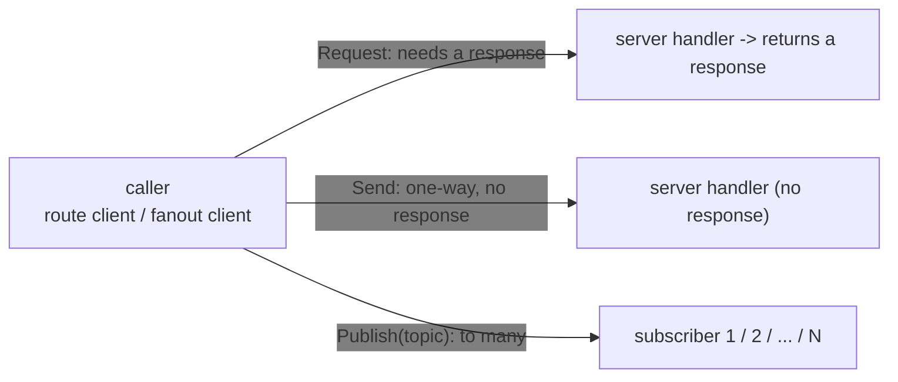
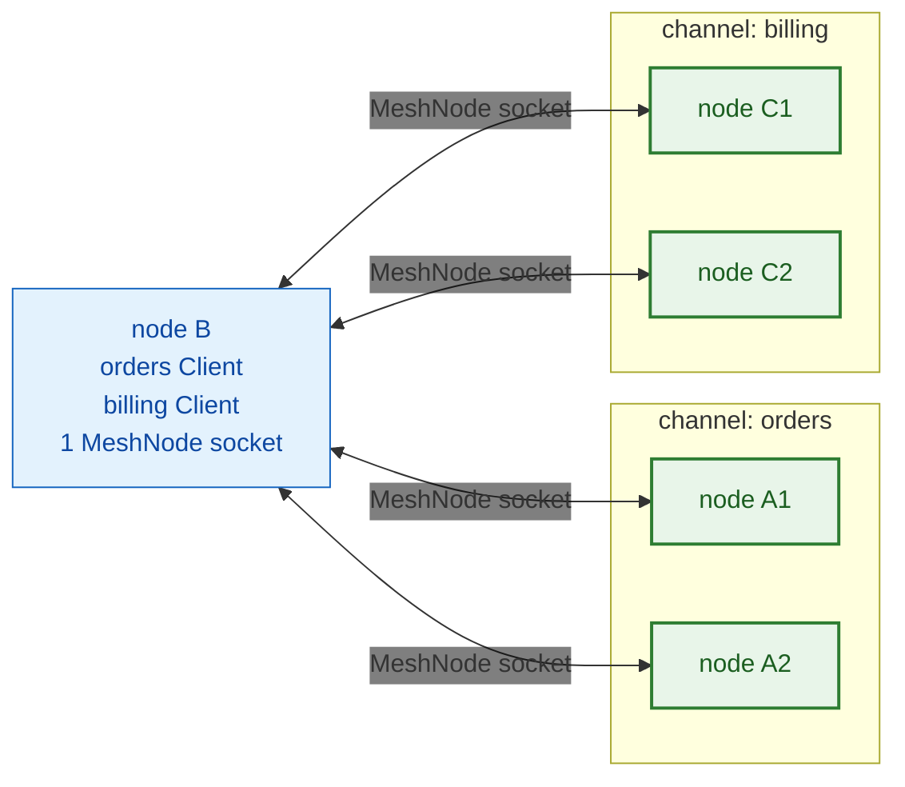
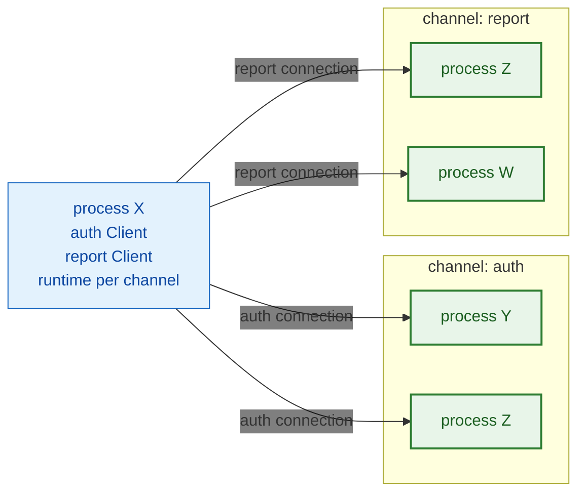
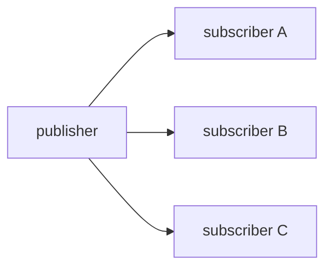
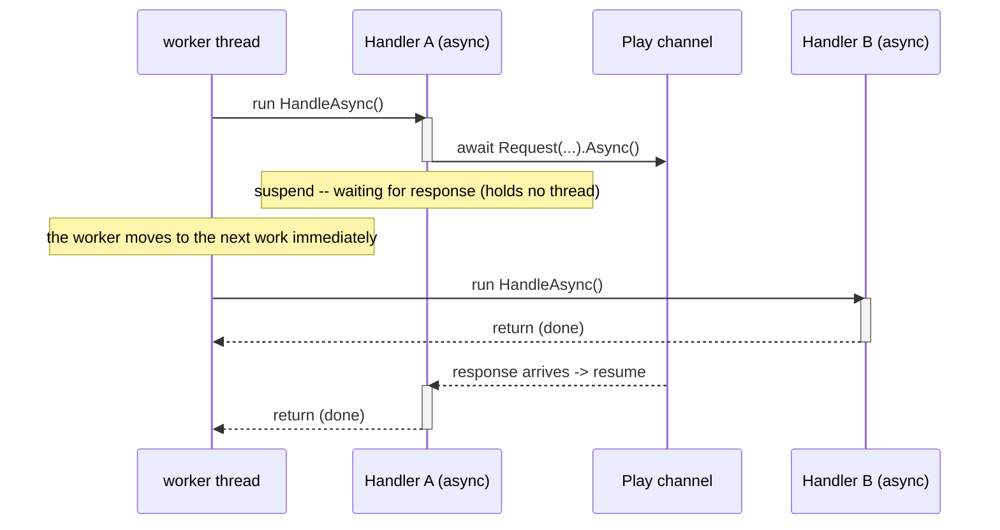
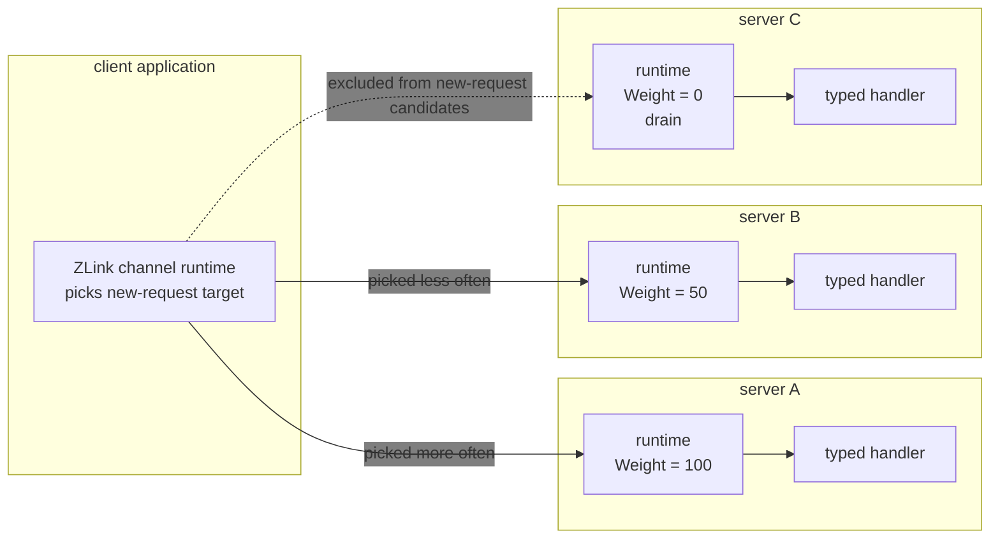
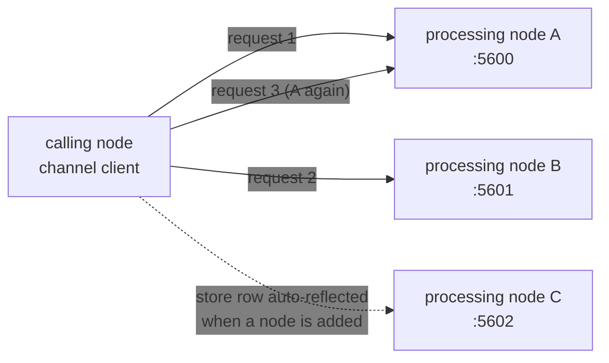
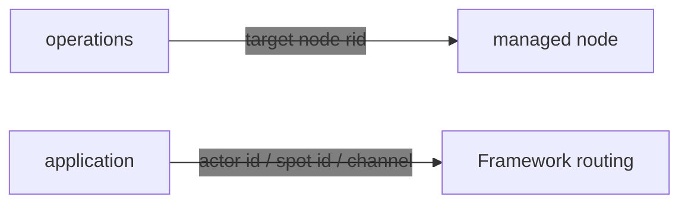

<!-- generated:start -->
<!-- This file is generated from `common/guide/server/05-channel-messaging.en.md`. Do not edit directly.
     Edit the common source instead, then regenerate with `python3 doc/site/scripts/generate_language_guides.py`. -->
<!-- generated:end -->

<!-- framework-adapter-nav:start -->
[Guide Home](README.en.md) | [Previous: 4. Backpressure — When Arrival Outpaces Processing](04-backpressure.en.md) | [Next: 6. Spot](06-spot.en.md)
<!-- framework-adapter-nav:end -->

<!-- language-switch:start -->
View in another language — [C#/.NET](../../../dotnet/guide/server/05-channel-messaging.en.md) · [C++](../../../cpp/guide/server/05-channel-messaging.en.md) · [Java](../../../java/guide/server/05-channel-messaging.en.md) · [Kotlin](../../../kotlin/guide/server/05-channel-messaging.en.md) · **Node/TypeScript**
<!-- language-switch:end -->

# 5. Channel Messaging — request · send · pub/sub

> **The document that owns this chapter's contract** — [Channel Messaging](../../../common/spec/08-channel-messaging.ko.md)
> and [ClientServer Channel](../../../common/spec/09-client-server-channel.ko.md) own the
> behavior, and the [per-language channel messaging public contract](../../../common/spec/server/languages/README.ko.md)
> owns the surface. This chapter covers how to actually register and call that surface,
> focused on usage.

Channel messaging is the framework's most fundamental axis. It covers these interactions.

- **request/response** — a 1:1 call that sends and waits for a response, e.g. a price
  lookup (DEALER → ROUTER)
- **one-way send** — a fire-and-forget one-way command, e.g. a cache-invalidation
  notification (DEALER → ROUTER)
- **publish/subscribe** — an event fan-out where every subscriber receives one send, e.g.
  propagating a domain event (PUB / SUB)

> 🔰 If terms like channel/handler/client/codec are unfamiliar, read the concept
> explanations in [03-concepts](03-concepts.en.md) first.
> `DEALER → ROUTER` and `PUB / SUB` in parentheses are the underlying socket kinds — **the
> application never handles these directly** (the framework auto-maps them by channel
> kind).



## 0. Use As A gRPC Replacement

Channel messaging is used in general web/microservice backends to **replace gRPC between
services.** Instead of every service announcing a host:port or putting a gateway/load
balancer in front, it ties calls together with a logical channel name and location-store
auto-connect. Without a `.proto` IDL, HTTP/2-only infrastructure, or code generation, you
get gRPC's four call shapes with just DTOs (records) and typed handlers.

| gRPC pattern | ZLink replacement | This guide |
|-----------|------------|-----------|
| Unary RPC | request/response | [Writing A Handler](#2-writing-a-handler) · [Outbound Calls](#4-outbound-calls) |
| Unary `Empty` / fire-and-forget | one-way send | [Writing A Handler](#2-writing-a-handler) · [Outbound Calls](#4-outbound-calls) |
| Server streaming / event feed | pub/sub fan-out | [Outbound Calls](#4-outbound-calls) |
| Client/Bidi streaming | STREAM session | [09-stream](09-stream.en.md) |
| Service location lookup (DNS/xDS) | location-store auto-connect | [10-location](10-location.en.md) |
| Interceptor | handler filter | [Filter — Common Processing](#5-filter--common-processing) |
| Deadline | request timeout | [Outbound Calls](#4-outbound-calls) |

The call path diverges at this point: in gRPC, a request an L7 load balancer or a service
mesh sidecar built from a stub sends it to one of the scaled-out servers, but in ZLink, when
the application requests by logical channel name, the framework runtime directly picks one
of the connected server runtimes itself. So what's left in application code isn't endpoint
or proxy configuration, but **a channel name and a handler.**

For example, for an order service, gRPC's `rpc PlaceOrder(...)` turns into this.

```typescript
// Server: one handler (instead of a gRPC service implementation)
export class PlaceOrderHandler implements ZLinkRequestHandler<PlaceOrder, OrderPlaced> {
  constructor(private readonly orders: OrderStore) {}

  async handle(request: PlaceOrder, context: ZLinkMessageContext): Promise<OrderPlaced> {
    await this.orders.save(request);
    return orderPlaced(request.orderId);
  }
}

// Client: inject ZLinkRouteClient instead of a gRPC stub
const placed = await client
  // The target is just one ChannelName. No address, no MeshName.
  .requestToChannel('orders', placeOrder('order-1042', 'acct-77', 18742))
  .submit<OrderPlaced>();
```

> To compare deployment structure, call path, and infrastructure mapping side-by-side with
> a gRPC stack, [17-alternative](17-alternative.en.md) covers that comparison. This chapter
> covers usage after that decision is already made.

## 1. Channel Kinds

A [channel](03-concepts.en.md#1-channel--a-connection-between-servers) is a unit of
connection between servers that picks a call target by a logical name like `"orders"`
instead of an address. That name is called `ChannelName`, and one of the nodes that
registered that name receives the request.

Below are the registrations that use the name "channel." All of them use `ChannelName`, but
they differ in which messaging pattern they support and whether they share a socket. Here,
a **MeshNode** is the basic unit of server-to-server connection that one process has, and a
route mesh channel just adds a name on top of that socket.

| Kind | Registration | Socket | Connection pattern |
| --- | --- | --- | --- |
| Route mesh channel | `mesh.Channel(name).Server()`/`.Client()` | Shares an already-open MeshNode socket | request/send via `ChannelName` select-one, publish between Spots (Logical Multicast) — Node direct, which specifies an RID directly, is separate ([Calling A Managed Node Directly](#9-route-mesh--calling-a-managed-node-directly)) |
| ClientServer channel | `AddClientServerChannel(name)` | Opens its own socket, separate from the MeshNode (`.Listen()`; connection is manual `.Connect()` or auto-discovery) | Only request/send started by the Client — the Server can't send anything first except that reply |
| Fanout channel | `AddFanoutChannel(name)` | Opens an independent PUB/SUB socket | publisher → many subscribers |

**A route mesh channel is a logical name that shares a MeshNode connection**, and a
**ClientServer channel is an independent connection unit that opens its own transport.**

### 1.1 Route Mesh Channel — One Connection, Channels Are Names On Top

You connect to the mesh with one MeshNode socket, and the channel name is the logical
grouping on top of it that decides "who receives this request."



The boxes are groups tied together by name, not sockets. Calling `orders` has select-one
pick one of A1/A2 inside that box, and registering ten more channels doesn't add any
sockets on node B.

### 1.2 ClientServer Channel — An Independent Runtime Per Channel

A ClientServer channel doesn't share RouteMesh transport. Each channel gets its own
independent runtime, and that runtime manages connections per Ready Server.

**The client starts the connection.** Since the server never connects out to the client,
firewalls and security groups only need to open in one direction — client → server.

**Registration info is also separate.** ClientServer server registration info doesn't
carry MeshName, RouteMesh membership, or Spot/Actor location. Conversely, MeshNode
registration info isn't used for ClientServer discovery either — **the two kinds never
substitute for each other.**

Using only manual endpoints means you don't need a location store. **If auto-discovery is
enabled and there's no store, startup fails before the listener binds.**



`auth` and `report` don't share connection targets or lifetimes. Even if the same process Z
participates in both channels, each channel runtime manages its connection to Z separately.

**A Server inside the same process is just as much a candidate as any other Server.** It's
neither picked first nor excluded for being in the same process. Even when selected, the
handler isn't called on the spot — it's **actually sent through the connection.** There's
no shortcut that skips codec, admission, caps, timeout, or reply handling. So don't assume
a local call is faster.

Direction is also fixed, so a Server can only respond to a request the Client started. If
the Server needs to send a notification first, use RouteMesh instead of ClientServer. This
is why TicTacToe separates login authentication (the `tictactoe.api` ClientServer channel)
from Game Spot creation (the MeshNode's Object role) (chapter `02. Getting Started` §7).

### 1.3 Two Branches Of Pub/Sub

A [Spot](03-concepts.en.md#2-spot--a-unit-that-owns-state-and-processes-it-in-order) is a
state object found by id that lines up work addressed to it and processes it one by one.
Exchanging events between Spots over a route mesh channel is called **Logical Multicast.**
As in [the earlier diagram](#11-route-mesh-channel--one-connection-channels-are-names-on-top),
it reuses the already-connected mesh socket as-is, so there's no separate socket, and the
receiving side is limited to Spots that subscribed to the same topic on that channel.

```typescript
// Publishing -- inside the TicTacToeGame spot.
await this.context.outbound
  .publish(SampleTopics.playerMilestoneChannel, // The ChannelName that decides delivery scope.
           SampleTopics.playerMilestone,        // The topic that picks which Spots receive it within that scope.
           milestoneEvent)
  .submit();

// Subscribing -- when PlayEntrySpot starts.
this.context.handlers.addSubscribe(
  PlayerWinMilestoneEventHandler,
  SampleTopics.playerMilestoneChannel, // Must match the publishing side's ChannelName/topic to receive it.
  SampleTopics.playerMilestone);
```

If you need to publish from outside a Spot, inject a spot publisher client and send the
same way.

Conversely, a **fanout channel** (called **Classic fanout** in the spec) opens an
independent pair of PUB/SUB sockets by itself. Regardless of Spot or MeshNode, one
publisher delivers to every connected subscriber.



For both, **publish completing doesn't guarantee delivery.** A publish call completing
means the send was locally accepted for transport, not confirmation that a subscriber
processed the event. Neither provides storage, retransmission, or ack.

The difference is **target scope.** Logical Multicast is limited to Spots that subscribed
to the same channel/topic within that mesh, while Classic fanout delivers to every
connected subscriber regardless of mesh composition.

**The loss rule also differs.** A fanout channel is a **loss-tolerant delivery.** If one
subscriber's receiving lags and the publisher's send queue hits its cap, **that
subscriber's share is discarded and the publish still ends as a success.** Other
subscribers aren't affected, and the publisher doesn't stall over one slow subscriber.

Logical Multicast doesn't use a PUB/SUB socket — it delivers to each node over the mesh
connection, so this rule doesn't apply to it. **Don't use a fanout channel for delivery
that can't tolerate loss.**

## 2. Writing A Handler

| Kind | The call it sends | What completion means |
| --- | --- | --- |
| request | Passes a channel name and a request, waits for the reply | The peer's reply arrived |
| send | Passes a channel name and a message | The send was accepted -- not the peer's processing result |
| publish (fanout) | Passes a channel, topic, and event | The send was accepted for transport -- not subscriber receipt |

**Even if a request fails, it isn't auto-resent to a different server.** If the connection
drops or times out after picking and sending to a target, it just ends as a failure. **This
is because the first target may have already processed it and only the reply failed to
come back.** Resending is a new call from the application, and handling duplicate
execution is its responsibility too.

**The payload's content doesn't change the target kind.** A message sent addressed to a
node is handled by that node's handler — even if it carries a Spot ID or Actor ID inside,
the Framework doesn't look inside and turn it into a Spot message. To send to a Spot or
Actor, use **that dedicated call from the start.**

The call shape and matching handler interface per language are as follows.

| Kind | The call it sends | The handler that receives it |
| --- | --- | --- |
| request | `requestToChannel(name, req).submit<TReply>()` | `ZLinkRequestHandler<TRequest, TReply>` |
| send | `sendToChannel(name, msg).submit()` | `ZLinkSendHandler<TMessage>` |
| publish (fanout) | `publish(name, topic, evt).submit()` | `ZLinkFanoutHandler<TEvent>` |

A channel handler is an independent class. Since different requests can run concurrently,
don't put mutable domain state in a handler member. The handler instance and its scoped
dependencies only live until that dispatch finishes.

> The Framework doesn't process HTTP requests. A web framework's endpoints/middleware
> handle HTTP, and a channel handler is a separate server-to-server message dispatch path.
> The only similarity to a controller action is the **authoring style** — write a class,
> receive dependencies via DI, register it, and the runtime calls it.

A handler implements an interface and returns its result as the return value.

> **See it in a sample — [TicTacToe](../../../common/sample/tictactoe/README.en.md).** The
> request handler where the API server receives an authentication request and returns
> player info. Actual code from the repository.

```typescript
--8<-- "framework/languages/node/samples/TicTacToe.Ts/Server/Api/Handlers/authenticate-player-handler.ts:doc-request-handler"
```

The three branches in minimal form look like this.

```typescript
// request-response
export class GetProfileHandler
  implements ZLinkRequestHandler<GetProfileRequest, GetProfileReply> {
  constructor(private readonly store: ProfileStore) {}

  async handle(
    request: GetProfileRequest, context: ZLinkMessageContext): Promise<GetProfileReply> {
    const profile = await this.store.load(request.accountId);
    return getProfileReply(profile.accountId, profile.nickname);
  }
}

// one-way send (no response)
export class RefreshCacheHandler implements ZLinkSendHandler<RefreshCacheCommand> {
  async handle(message: RefreshCacheCommand, context: ZLinkMessageContext): Promise<void> {
    // Cache invalidation, etc. The caller doesn't wait for a result.
  }
}

// Receiving a publish (subscriber side)
export class CacheRefreshedEventHandler implements ZLinkFanoutHandler<CacheRefreshedEvent> {
  async handle(message: CacheRefreshedEvent): Promise<void> {
    // A Classic fanout handler only receives the payload of the registered event type.
  }
}
```

- A handler's dependencies come via **constructor injection** (like `IProfileStore`). No
  service-locator pattern for pulling a service from context.
- Context is where you read that dispatch's message info (ChannelName, packet name,
  metadata, etc.). **Cancellation is owned by a separate cancellation argument, not
  context.** Per-path context types and the full field list are covered by the
  [per-language channel messaging public contract](../../../common/spec/server/languages/README.ko.md).
- A handler class is a **code organization unit**, not a dispatch key. Grouping methods
  topically in one class, or giving each packet its own class, both work the same.
- An interface-based handler has the strongest compile-time type checking. If
  `handle(...)`'s payload, context, or return type doesn't match the interface contract,
  it fails to compile.

### Attribute-Based Method Handlers

Instead of an interface, you can write the same handler as a method with an attribute.
This is convenient when one class holds several handler methods.

```typescript
// Groups this class's methods as the "api" group. Registration decides which channel exposes it.
@ZLinkHandlerGroup('api')
export class UserHandlers {
  constructor(private readonly publisher: ZLinkFanoutClient) {}

  // The method decorator decides the handler kind (doesn't take a channel name).
  @ZLinkRequest()
  async getUser(request: GetUserRequest, context: ZLinkMessageContext): Promise<GetUserReply> {
    return getUserReply(request.accountId, 'alice');
  }

  // A send handler -- returns Promise<void> (no response).
  @ZLinkSend()
  async refreshCache(
    command: RefreshUserCacheCommand, context: ZLinkMessageContext): Promise<void> {
    await this.publisher
      .publish('api.events', 'user.cache-refreshed',
        userCacheRefreshedEvent(command.accountId))
      .submit();
  }
}
```

- The method signature order is `(payload, context?, cancellation?)`, and context/token can
  be omitted.
- An attribute-based handler makes it easy to group several request/send/publish methods
  in one class, but it doesn't lock down the handler contract at compile time as strongly
  as the interface-based approach. A wrong context type or return type may only surface at
  the framework's scan/validation step, or at runtime.
- The attribute/annotation/decorator marking a handler kind **doesn't take a channel
  name.** Channel mapping is owned by [registration](#3-exposing-a-handler-on-a-channel).

### Asynchronous Execution

Async values across the Framework are expressed as each language's standard async type.
Send waits until the source runtime can submit the work, but doesn't wait for the target
handler to complete. Request waits until the peer's reply arrives. There's one rule --
**`await` on the runtime (handler) thread, blocking (`.Result`/`.GetAwaiter().GetResult()`)
only in test/client scenarios.**

```typescript
async handle(request: CreateGameRequest, context: ZLinkMessageContext): Promise<CreateGameReply> {
  // Runtime (handler) thread -- free it with await. There's no synchronous blocking.
  const room = await this.client
    .requestToChannel('tictactoe.play', createRoomRequest(request.gameName))
    .timeout(5_000)                     // The cap on waiting for the reply.
    .submit<CreateRoomReply>();         // Waits until the reply arrives.

  return createGameReply(room.roomId, room.gameName);
}
```

A channel handler runs in a per-channel asynchronous receive loop. When a handler reaches a
wait point, only that flow of execution pauses -- the thread returns to the pool to handle
other work.



So without callbacks, **code that reads top to bottom** lets a handful of workers handle
huge numbers of concurrent requests. Blocking with `.Result` keeps that thread occupied, so
it's forbidden inside a handler. Failures come out as exceptions on the `await` path.

The same `await` rule applies to Spot/Actor handlers too, but there the turn is held until
the handler completes, so the concurrency scope differs -- covered in
[06-spot §2.1](06-spot.en.md#21-the-execution-model--concurrency-scope).

## 3. Exposing A Handler On A Channel

The framework doesn't automatically open every discovered handler on every channel.
**Discovery and exposure are separate steps.**

> `AddHandlersFromAssemblyOf<...>` discovers handler types, and the typed registration
> under `Channel(name).Server()` fixes which MeshNode's which channel exposes it.

### RouteMesh And Handler Registration

```typescript
const mesh = builder.addRouteMesh('services')
  .listen('tcp://0.0.0.0:7101')
  .setRoutingId(RoutingId.from('api-1'));
mesh.channel('api').server()                    // server() is the role that receives handlers.
  .addRequestHandler(GetProfileHandler)
  .addSendHandler(RefreshCacheHandler);
```

### Registering Multiple Channels On One MeshNode

You can stack several channels on the same MeshNode, and each channel can have a different
role.

```typescript
const mesh = builder.addRouteMesh('services')
  .listen('tcp://0.0.0.0:7101')
  .setRoutingId(RoutingId.from('api-1'));

mesh.channel('api').server()                 // A channel this node handles.
  .addRequestHandler(GetProfileHandler);
mesh.channel('billing').client();            // A call-only channel is client -- no handler registered.
```

A fanout channel's subscription handler is registered with the fanout builder's
`AddHandler<...>()`.

> **See it in a sample — [ZoneWorld](../../../common/sample/zoneworld/README.en.md).** All
> three kinds appear in a single registration block. Control reports are received over a
> route mesh channel, and cluster-wide announcements over a fanout channel.
>
> ```csharp
> mesh.Channel(ZoneWorldNames.ZoneChannel).Server();    // A channel this node handles.
> mesh.Channel(ZoneWorldNames.ReportChannel).Client();  // A channel used only to send reports.
>
> options.AddFanoutChannel(ZoneWorldNames.BroadcastChannel)
>     .Connect(shared.BroadcastEndpoint)      // Connects to the publisher endpoint.
>     .AddHandler<WorldAnnounceSubscriber, WorldAnnounceEvent>()
>     .AddHandler<NodeMaintenanceChangedSubscriber, NodeMaintenanceChangedEvent>();
> ```

**Packet-name resolution order:** (1) the `packetName` argument in handler registration →
(2) a packet-name marker attached to the payload type → (3) if neither exists, the type
name. The packet name is fixed **once at registration** -- there's no surface to respecify
it per call.

### Startup-Phase Validation Of Registration Errors

The following are blocked as configuration errors **immediately at host startup**, not
deferred until the first call.

- Registering the same MeshName twice in the same process, or a MeshNode with no
  ChannelName registered at all.
- Duplicate registration under the same key (MeshName + ChannelName + message kind +
  packet name) -- the same packet name can be reused across different MeshNames or
  ChannelNames.
- A missing local endpoint or peer connection info.
- A disallowed handler return type.

A fanout handler is registered on its own independent fanout channel builder and isn't
mixed with RouteMesh handlers.

## 4. Outbound Calls

### Request / Send -- Route Client

```typescript
export class PriceService {
  constructor(private readonly client: ZLinkRouteClient) {}

  async get(symbol: string): Promise<number> {
    const reply = await this.client
      // The target is just one ChannelName. The reply type is specified in submit<T>.
      .requestToChannel('price', priceRequest(symbol))
      .submit<PriceReply>();
    return reply.price;
  }

  async refresh(accountId: string): Promise<void> {
    // send: only waits until my runtime accepts the submission.
    await this.client.sendToChannel('profile', refreshCacheCommand(accountId)).submit();
  }
}
```

- The reply type is specified in **`.Async<TReply>(...)`**, not the message.
- **`timeout(...)` is a request-only optional terminal.** The default reply-wait time is a
  global **30 seconds**, and you attach it only when it needs to differ from that default
  (see the priority order in the example comments below). `send`/`publish` don't wait for
  a response, so they have no timeout surface at all.
- The packet name can't be changed at call time. It's fixed once
  [at registration](#3-exposing-a-handler-on-a-channel).
- A route client uses the RouteMesh registered at startup. It fails as a configuration
  error if the MeshName or ChannelName isn't registered.
- **The reason `send` is `async` is that it waits for a slot to send in, not for a
  response.** If the receiving side is backed up, it waits until the send queue drains
  before submitting, and if a slot never opens up, it ends with `DeadlineExceeded`. How
  this flow control (backpressure) works and what options affect it are covered by
  [04-backpressure](04-backpressure.en.md).

Attach a terminal only when it needs to differ from the default.

```typescript
await client
  .requestToChannel('price', priceRequest(symbol))
  // Specify only when this call's reply-wait cap should differ from the default (30s).
  .timeout(5_000)
  .submit<PriceReply>();
// Order that decides the reply-wait cap (earlier wins):
//   1) Per-call .timeout(...)
//   2) The MeshNode builder's setDefaultRequestTimeout(...)
//   3) The global option's defaultRequestTimeout (30 seconds by default)
```

### Publish -- Fanout Client

```typescript
export class ProfileService {
  constructor(private readonly publisher: ZLinkFanoutClient) {}

  async announce(accountId: string): Promise<void> {
    // Arguments = (channel, topic, message). The topic is the fan-out routing key.
    await this.publisher
      .publish('api.events', 'profile.cache-refreshed',
        profileCacheRefreshedEvent(accountId))
      .submit();
  }
}
```

- The topic is optional. Sending with `Publish(channelName, message)` reaches every
  subscriber of that channel; `Publish(channelName, topic, message)` carries the topic
  along as a classification label.
- A subscriber connects to the publisher endpoint with
  `AddFanoutChannel(name).Connect(endpoint)`.
- A Classic fanout handler only receives the registered typed event and a cancellation
  signal -- it doesn't expose the transport topic in the handler context. If you need
  business branching, split it by event type or by registered handler.
- Completion of `Async(...)`/`Async<T>(...)` only guarantees delegation to transport -- it
  doesn't guarantee the remote handler completed or that a subscriber received it (see
  [Two Branches Of Pub/Sub](#13-two-branches-of-pubsub)).
- **Pub/sub has no replay.** A message published **before a subscriber connects**, or one
  that passed **while disconnected**, doesn't arrive even after reconnecting. Fill that gap
  for events you can't afford to miss with a separate resync (e.g., a one-time request for
  current state after reconnecting).

> **See it in a sample — [DeliveryDispatch](../../../common/sample/deliverydispatch/README.en.md).**
> An order taken over HTTP is delegated to the dispatch server via a channel call, and
> delivery-status changes are propagated to control and customer-push subscribers via
> fanout publish. A representative example where the request/send/publish surfaces are all
> used together in a single business flow.

## 5. Filter — Common Processing

A web framework's HTTP middleware is exclusive to the HTTP pipeline and doesn't apply to
ZLink handlers. Code that repeats across many handlers -- logging, validation, permission
checks, metrics -- is gathered in one place with a handler filter.

```typescript
export class AuditFilter implements ZLinkHandlerFilter {
  constructor(private readonly logger: Logger) {}

  async invoke(
    context: ZLinkHandlerFilterContext, // This dispatch's message info + which path it came through.
    next: ZLinkHandlerFilterNext        // A no-argument delegate -- runs the next filter or handler.
  ): Promise<void> {
    // Audit-logs only ops commands and lets regular business requests pass through.
    if (context.dispatchKind === ZLinkHandlerDispatchKind.NodeDirectRequest) {
      this.logger.log(`ops ${context.packetName} on ${context.meshName}`);
    }
    await next(); // If not called, the handler doesn't run.
  }
}

// Node passes filters via the module registration option's filters array. Array order is execution order.
ZLinkModule.forRootFactory({
  useFactory: () => zlinkFramework(),
  filters: [AuditFilter, ValidationFilter]
});
```

### Scope Of Application

A filter applies to **messages a node receives.** It doesn't apply to handlers owned by a
long-lived object like a Spot or Actor -- those use their own execution order and lifetime,
and if you need common processing, do it inside that handler.

| Dispatch | Filter |
| --- | --- |
| Channel send/request (both route mesh channel and ClientServer channel) | Runs |
| Fanout subscription handler | Runs |
| Node direct route handler ([Calling A Managed Node Directly](#9-route-mesh--calling-a-managed-node-directly)) | Runs |
| Spot handler, Actor handler | Doesn't run |
| A Logical Multicast subscription a Spot registers | Doesn't run |
| STREAM session handler | Doesn't run |

To handle it differently per path, check `context.DispatchKind`. `channelSend`/
`channelRequest` cover both route mesh channel and ClientServer channel, so if you need to
tell them apart, also check `context.MeshName` -- route mesh channel and Node direct
provide MeshName, but ClientServer channel and fanout don't.

### Execution Order And Short-Circuiting

Execution passes through handlers in registration order, then exits in reverse order once
`next` finishes.

```text
AuditFilter, before
  -> ValidationFilter, before
       -> handler
     ValidationFilter, after
AuditFilter, after
```

Each filter calls `next` at most once. If it isn't called, the handler doesn't run and that
dispatch ends -- but what the caller sees as the result differs by path.

| Dispatch | What the caller sees |
| --- | --- |
| send | Only that dispatch ends. The sender already received the send-accepted result, so nothing changes for them |
| request | Receives a `Rejected` error reply. `null` never goes out as a normal response just because there's no value |
| Fanout subscription | Only that one handler ends -- other subscription handlers that received the same event still run. Nothing is delivered to the publisher |

There's no way for a filter to construct and return a response value directly. To block a
request, don't call `next`; to change the response content, handle it in the handler.
Calling `next` twice doesn't re-run the handler -- it's rejected as an error, classified as
a code mistake.

### Instances And Dependencies

A new scope opens for every dispatch that runs one handler. Filters and the handler are
each created once within that scope and **share the same `Scoped` service instance.** A
value a filter pulls out is seen as-is by the handler, so you can carry per-request state
through a scoped service. This rule doesn't change regardless of what lifetime the filter
type is registered with in DI -- it's still created by DI, not `new`.

For fanout, a dispatch is created not per event but **per matching subscription handler.**
So a filter runs that many times too, and a heavy filter's cost grows with the number of
subscribers.

## 6. Connection Control

A manual connection is set on the MeshNode's peer list.

```typescript
const mesh = builder.addRouteMesh('services')
  .listen('tcp://0.0.0.0:7102')
  .setRoutingId(RoutingId.from('profile-client-1'));
mesh.channel('profile').client();
mesh.peerConnections().connect('tcp://10.0.10.15:7101');
mesh.peerConnections().connect('tcp://10.0.10.16:7101');
```

The endpoint argument is a startup setting. It's not a handle for directly controlling a
running socket after the host starts. **The one exception: availability (drain/restore)
can be changed at runtime -- see below.**

In auto-connect mode, the location store owns the peer list. When a server restarts on a
new endpoint, the store's descriptor row updates and client connections follow along, so no
separate action is needed. A manual connection only takes effect after you change the
config and restart the application.

**Finding it in the store doesn't mean it's sent right away.** A client gets the endpoint
from registration info, then **reconfirms identity and execution generation over the real
connection** before using that target. Manual connections go through the same
confirmation. So a call can still end as target-not-found even though a row exists in the
store -- at that point, check **whether the connection was actually established**, not the
store.

**Restarting a server changes its execution generation.** Even with the same endpoint, a
connection from a previous generation isn't used as the new target -- the client prepares
the new generation first, then tears down the old connection. Generation values **aren't
ordered by numeric size.**

A late-arriving reply **becomes the result if the original request is still waiting** --
even if it came from a previous generation. Conversely, if that request is already gone due
to timeout, cancellation, or a client restart, it's discarded, and **it's never used as the
result of a different, later-started request.**

**A stopped store doesn't affect already-established connections or already-received
requests.** During an outage, only adding/removing targets from the list stops being
computed. However, if the server side fails to renew its authority and exceeds the grace
period, it **stops accepting new business messages.** Once the store recovers, the list is
realigned against the latest registration info.

### Operational Drain / Restore (Runtime)

Right before maintenance, a rolling restart, or scale-in, sometimes you want to **stop
receiving new requests only**, without shutting down the node or removing the store's
descriptor row. Inject the RouteMesh runtime options and change weight by MeshName and
ChannelName.

The `Weight` used here isn't a drain-only flag -- it's the **peer weight** that ChannelName
membership consults when picking where to send a new message. If all connected servers'
weights are equal, new requests are distributed evenly by round-robin. If weights differ,
the server with the larger value is picked proportionally more often. `0` means "keep the
connection but exclude it from new-request candidates," and `100` is the default, normal
serving value.



```typescript
// An operational admin endpoint. "orders" is the registered ChannelName.
meshOptions.channel('orders').weight = 0;   // Excludes this ChannelName from new select-one targets
meshOptions.channel('orders').weight = 100; // Back to normal
```

- `Weight = 0` (drain) **doesn't close** the serving socket. In-flight requests that
  already arrived are processed and replied to as normal, and peers only remove that node
  from new-request candidates. The store's descriptor row stays too (graceful drain).
- The value range is `0..10000`, and the default is `100`. `Weight = 100` restores normal
  serving.
- Propagating the drain signal is best-effort eventual -- it only guarantees "the drain
  signal was sent." Confirm the point where a peer actually removed it from candidates by
  checking whether the peer's status is draining (chapter `11. Monitoring` §2). The
  operational vocabulary `drain`/`restore` above is just the app's admin layer putting a
  name on `Weight = 0`/`= 100`.

The same `Weight` is also set as an initial value at registration time.

```typescript
const mesh = builder.addRouteMesh('services')
  .listen('tcp://0.0.0.0:7101')
  .setRoutingId(RoutingId.from('orders-1'));
mesh.channel('orders').server().setWeight(30); // This channel role's starting weight
```

## 7. Serialization Codec

The payload serialization codec is enabled through framework registration.

```typescript
builder.codecs().use(ZLinkProtobufCodec.default);
builder.codecs().use(ZLinkMessagePackCodec.default);
```

A payload has to be a DTO the codec can serialize. If the root/element type is
abstract/interface, it's a configuration error without an explicit codec.

> **See it in a sample — when to specify a codec.** Only [Bingo](../../../common/sample/bingo/README.en.md),
> a real-time game that needs to cut packet size and encoding cost, registers the Protobuf
> codec and defines its DTOs with `.proto`. The rest of the
> [samples](../../../common/sample/README.en.md) don't register a codec and use the
> default -- explicit registration is an optional step you take only when you need it.

If you need a format beyond the default codecs (Avro, Thrift, etc.), implement a message
serializer and register it by content type. A configuration error occurs if **more than
one** matches a given payload type -- keep only one fallback serializer that accepts every
type with no type condition, but you can have several type-conditioned serializers as long
as they don't overlap.

```typescript
// A serializer's only responsibility is converting business object <-> Message (byte payload).
// Packet-name resolution and codec selection are done by the framework.
export class AvroOrderSerializer implements ZLinkMessageSerializer {
  private readonly type = avro.Type.forSchema(SCHEMA_JSON);

  serialize(value: unknown): ZLinkMessage {
    return ZLinkMessage.from(this.type.toBuffer(value));
  }

  deserialize(message: ZLinkMessage): unknown {
    return this.type.fromBuffer(Buffer.from(message.toBytes()));
  }
}

// Registers the Avro serializer once, inside the extension.
builder.codecs().use(new AvroCodecExtension());
```

After registration, high-level calls still exchange business objects as-is, and
serialization is handled by Avro. See the [framework-api §9](../../../common/spec/06-framework-api.ko.md#9-codec)
table for registration surfaces in other languages.

## 8. Scaling A ChannelName Horizontally

To increase throughput, run several providers that own the same MeshName and ChannelName.
The calling node registers provider endpoints via location-store auto-connect or
`PeerConnections.Connect(...)`.

> **See it in a sample — [ShoppingMall](../../../common/sample/event/shoppingmall.en.md).**
> Two `CommerceApi` and two `OrderWorkflow` instances run at once to verify this section's
> scaling. The caller doesn't know how many providers there are and calls only by channel
> name -- no matter which instance receives a request, the same `OrderId` always arrives at
> the same owner spot.

```typescript
// Processing node A -- a node registering the same ChannelName as server becomes a candidate.
const mesh = builder.addRouteMesh('media')
  .listen('tcp://0.0.0.0:5600')
  .setRoutingIdPrefix('resize');
mesh.channel('image.resize').server()
  .addRequestHandler(ResizeHandler);
```

The calling node registers the same ChannelName as Client and connects to the processing
nodes.

**The two paths treat "yourself" differently.** This is where they diverge, so check it
before you lock in a scaling configuration.

| | Route mesh channel | ClientServer channel |
| --- | --- | --- |
| When the sending node itself is that channel's Server | **Not a candidate** | Just as much a candidate as any other Server |
| So calling from a node where only itself is Server | **Fails as target-not-found** | It can select itself |
| When there are no candidates yet at all | Fails as target-not-found immediately | Fails **after waiting briefly** |

The reason route mesh excludes itself is structural -- channel registration doesn't create
a new socket, it uses an **already-existing peer connection**, and a MeshNode never forms a
peer connection with itself. If you want it handled in the same process, use the
ClientServer path.

There's a reason for the waiting side too. In route mesh, no candidates means **no peer has
published that name** -- waiting won't make one appear. In ClientServer, the configuration
may already exist in the same process and just not have finished preparing. So it waits for
**whichever is shorter: the call's timeout or 5 seconds** -- to prevent a call right after
startup from failing as target-not-found even though the configuration is correct. This
wait doesn't speed up preparation, it just waits for preparation already in progress to
finish.

**Selection ratio follows weight.** After excluding targets with weight `0` and those
draining, it picks by the remaining weight ratio. If two candidates are `100` and `300`,
that's roughly `1:3` over the long run -- **it does not guarantee the order of any
individual call.**

**An unregistered ChannelName isn't looked up anywhere else.** Even if another MeshNode or
ClientServer client exists in the same process, it isn't sent there instead. Conversely,
registering the same ChannelName on two or more physical send routes also **fails at host
startup.**

```typescript
// Calling node -- a manual connection that writes the processing node endpoints directly.
const caller = builder.addRouteMesh('media')
  .listen('tcp://0.0.0.0:5590')
  .setRoutingIdPrefix('resize-client');
caller.channel('image.resize').client();        // client, since it only calls.
caller.peerConnections().connect('tcp://10.30.1.10:5600');
caller.peerConnections().connect('tcp://10.30.1.10:5601');

// Or auto-discovery via the location store -- adding a node doesn't require restarting the caller.
builder.addRouteMesh('media').listen(0).channel('image.resize').client();
```



If a specific entity (order ID, user ID) always needs to be handled by the same execution
unit, use a Spot or Actor instead of a channel ([06-spot](06-spot.en.md)).

> **Give a provider a stable identifier.** `AddRouteMesh(...).SetRoutingId(...)` gives the
> MeshNode a fixed logical id. Even if the provider stops and restarts a new process under
> the same RID, the location store connects to the new endpoint under the same logical id
> (same-rid failover) -- use this to carry which node processed a response (rid), or to
> keep routing continuous across a process replacement.

## 9. Route Mesh — Calling A Managed Node Directly

A Node direct call specifies one specific MeshNode by `RoutingId`. Use this path only when
**the node itself** is the target -- like a health check or an ops command. Don't use it to
pick where an Actor/Spot is created or to pin a business message to a specific server.

```typescript
const mesh = builder.addRouteMesh('play')
  .listen(playRouterEndpoint)
  .setRoutingId(RoutingId.from(playRouterId));

// A handler that returns the node's own operational status.
mesh.addRouteRequestHandler(NodeStatusHandler, 'ops.node.status');
```

The caller passes the Node RID and MeshName confirmed from the management system together.

```typescript
const target = RoutingId.from('play-node-1');

// Uses Node direct because it's asking about a specific node's operational status.
const status = await routeClient
  .requestToNode('play', target, getNodeStatus())
  .submit<NodeStatus>();

export class NodeStatusHandler
  implements ZLinkRouteRequestHandler<GetNodeStatus, NodeStatus> {
  async handle(
    request: GetNodeStatus, context: ZLinkRouteMessageContext): Promise<NodeStatus> {
    return nodeStatusReady();
  }
}
```

A business message uses the target's logical address.

- Call an Actor with an actor client and ActorId.
- Call a Spot with a spot client and SpotId.
- To pick one member of a service, use `sendToChannel(...)` or `requestToChannel(...)`.

The Framework picks the current owner and an eligible node, so the application doesn't hold
onto a Node RID.



The tie-in with SPOT continues in [06-spot](06-spot.en.md).

## 10. A Combined Example — Server + Outbound + Pub/Sub

```typescript
@Module({
  imports: [
    ZLinkModule.forRootFactory({
      useFactory: () => {
        const builder = zlinkFramework();
        builder.codecs().use(ZLinkProtobufCodec.default);

        const mesh = builder.addRouteMesh('services')
          .listen('tcp://0.0.0.0:7101')
          .setRoutingId(RoutingId.from('api-1'));
        mesh.channel('api').server()
          .addHandlerGroup('api');                   // Exposure: ties the handler group to the channel.
        mesh.channel('account').client();            // A call-only channel.

        const events = builder.addFanoutChannel('api.events');
        events.enablePublisher('tcp://0.0.0.0:7201'); // This process is the publisher.
        events.connect('tcp://127.0.0.1:7201');       // Also subscribes to its own publish, as an example.
        events.addHandlerGroup('api.events');         // Attaches the subscription handler as a group.

        return builder;
      }
    })
  ],
  providers: [UserHandlers, UserCacheRefreshedEventHandler] // Discovery: registered as providers.
})
export class AppModule {}
```

## 11. Common Problems

- **The handler never fires** → `AddHandlersFromAssemblyOf(...)` alone doesn't expose it.
  It needs the typed registration under `Channel(name).Server()`
  ([Exposing A Handler On A Channel](#3-exposing-a-handler-on-a-channel)).
- **A configuration error** → the channel doesn't exist, or that role isn't registered on
  it. Check the registration.
- **An exception at startup** → a duplicate channel name, a duplicate `kind + packet name`
  on the same channel, or a client with no connection route. It's fail-fast
  ([Startup-Phase Validation Of Registration Errors](#startup-phase-validation-of-registration-errors)).
- **`ZLink` vs `Zlink`** → every server framework type is `ZLink` (capital L).
- **Sending to a packet with no handler (at runtime)** → **request fails with an error
  reply** (the client gets it as an exception), while **send is silently dropped.** Dropped
  means the caller gets no reply -- it doesn't mean there's no observable trace: with
  message flow logging/observer enabled, the dispatch failure is recorded as a marker
  (`no_handler` / `reply_error`/`drop`) (chapter `11. Monitoring`).

## 12. Related Documents

- Runnable verification examples for this chapter's contract (client/handler/filter/codec):
  chapter `13. Interface Catalog` §1
- The full interface and handler context:
  [per-language channel messaging public contract](../../../common/spec/server/languages/README.ko.md)
- Topology and handler registration:
  [per-language topology public contract](../../../common/spec/server/languages/README.ko.md)
- The full scenario: [common samples](../../../common/sample/README.en.md)
