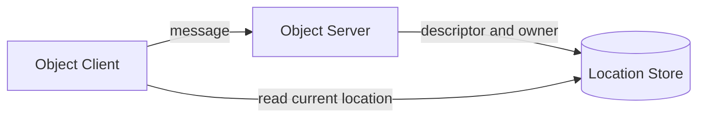

<!-- generated:start -->
<!-- This file is generated from `common/guide/server/10-location.en.md`. Do not edit directly.
     Edit the common source instead, then regenerate with `python3 doc/site/scripts/generate_language_guides.py`. -->
<!-- generated:end -->

<!-- framework-adapter-nav:start -->
[Guide Home](README.en.md) | [Previous: 9. STREAM](09-stream.en.md) | [Next: 11. Monitoring — Status Observation And Diagnostics](11-monitoring.en.md)
<!-- framework-adapter-nav:end -->

<!-- language-switch:start -->
View in another language — [C#/.NET](../../../dotnet/guide/server/10-location.en.md) · [C++](../../../cpp/guide/server/10-location.en.md) · [Java](../../../java/guide/server/10-location.en.md) · [Kotlin](../../../kotlin/guide/server/10-location.en.md) · **Node/TypeScript**
<!-- language-switch:end -->

# 10. Location — Auto-Connect And Object Location

> **The documents that own this chapter's contract** — defined by
> [Location runtime](../../../common/spec/21-location-runtime.ko.md),
> [Location Store](../../../common/spec/22-location-store-redis.ko.md), and the
> [per-language location public contract](../../../common/spec/server/languages/README.ko.md).
> This document explains how the application registers a Store and checks status.

## 0. What It Provides

The Location Store stores the MeshNode descriptor and the current owner of each Actor/Spot.
The Framework uses this information to auto-connect peers and deliver by logical ID to the
current owner.



The Store is used only to find location. The actual application message is sent directly to
the selected MeshNode.

## 1. Registering A Store

The official Redis extension provides the Location Store and Relocation Store as separate
classes. The Location Store handles atomic changes to a small location record. The
Relocation Store stores the immutable payload an object needs to move.

```typescript
// Register the Store that decides the current owner and location.
builder.addLocationStore(new ZLinkRedisLocationStore({
  url: 'redis://redis-host:6379',
  keyPrefix: 'game:location'
}));

// Register a separate Store that stores the state/queue/timer payload to move.
builder.addRelocationStore(new ZLinkRedisRelocationStore({
  url: 'redis://redis-host:6379',
  keyPrefix: 'game:relocation'
}));
```

Both Stores can use the same Redis deployment. Keep the key prefixes different. The Framework
doesn't rely on a cross-store transaction, so you can also split them onto separate physical
Redis instances if you need to.

Once a Store is registered, the application doesn't call the provider's operations or
dispose of it directly. The Framework manages the Store's lifetime and call order.

**Configuration decides which one is required.**

| Store | When it's required |
| --- | --- |
| Location Store | **Required** for a MeshNode whose Object role is `Client` or `Server`. Without it, startup ends in a configuration error before the socket opens |
| Relocation Store | **Required** if there's **even one** factory or Instance Spot factory with a relocation policy. Only skippable if relocation is off everywhere and there's no Instance Spot factory either |

**Register each exactly once.** There's no surface that bundles both into one registration
call, and missing one that's needed, or registering either more than once, is a
configuration error before the socket binds. The Framework doesn't create a fallback Store
inside the process when one is missing — **it fails instead of silently running as a single
node.**

## 2. Auto-Connect

MeshNodes sharing the same Location Store confirm each other's endpoint and role through the
descriptor. In an Automatic RouteMesh, only the side with the smaller RID initiates the
connection. If connection contention produces a duplicate candidate, handshake and admission
keep only one Ready.

```typescript
const play = builder.addRouteMesh('play');
play.listen(5501).setRoutingIdPrefix('play');

play.objects().server()
  .addSpotFactory('room', RoomSpot, (factory) => factory.recreateOnRelocation());

play.channel('play.ops').server()
  .addRequestHandler(NodeStatusHandler);
```

The application never specifies the target Node RID or endpoint to create an Actor/Spot on.
The Framework checks the stable type, Serving status, capacity, and placement weight to
select an eligible node.

A host that uses even one manual peer doesn't support host relocation. Don't mix auto-connect
and manual connection on the same MeshNode.

## 3. Location Options

`configureLocations()` sets the lease, route cache, and relocation execution ceilings.

```typescript
const location = builder.configureLocations();
location.ownerLeaseRenewIntervalMs = 5_000;
location.ownerLeaseTtlMs = 15_000;
location.messageFollowDurationMs = 30_000;
location.maxActiveOutboundRelocations = 64;
location.maxActiveInboundRelocations = 64;
location.maxRelocationPayloadInFlightBytes = 256 * 1024 * 1024;
```

| Option | Default | Meaning |
|---|---:|---|
| `OwnerLeaseRenewInterval` | 5s | The owner lease renewal interval |
| `OwnerLeaseTtl` | 15s | Time after which an owner with stalled renewal is judged expired |
| `OwnerLeaseRenewTimeout` | 3s | The ceiling to wait for one renewal request |
| `OwnerLeaseFencingMargin` | 5s | Margin to cut off new work ahead of expiry |
| `PollingInterval` | 1s | The interval to re-read the Store when there's no change watch |
| `StoreFailureGrace` | 30s | How long the last route decision is kept during a Store outage |
| `RouteCacheMaxAge` | 15s | The max time before a cached route is re-checked |
| `MessageFollowDuration` | 30s | How long the previous owner relays messages to the new owner before the move |
| `maxActiveOutboundRelocations` | 64 | The ceiling on relocation units a process sends out concurrently |
| `maxActiveInboundRelocations` | 64 | The ceiling on relocation units a process restores concurrently |
| `maxRelocationPayloadInFlightBytes` | 256 MiB | The ceiling on encoded payload across the whole process |

**The four lease values are tied together.** Breaking the following relationship is a
startup error. Look at all four together when changing any one value.

```text
renew interval + renew timeout < owner lease TTL - fencing margin
```

At the defaults, `5 + 3 < 15 - 5` holds. Shrinking only the TTL, or only growing the renewal
interval, breaks this inequality. Every value must be positive.

**What happens during a Store outage splits into two.** `StoreFailureGrace` is how long the
last fully-read node list is kept — it is **not** how long owner eligibility is extended.

| During grace | Result |
| --- | --- |
| An already-established connection | Status judgment continues |
| A new outbound connection | Not made. Even after grace ends, not made until the entire node list can be re-read at one consistent point in time |
| Owner lease / relocation deadline | **Not extended** |

The moment a host whose lease renewal has stalled crosses its computed deadline, it **stops
accepting new work** — state-changing messages, starting a timer, finalizing a factory/restore
result, changing relocation state, and reserving admission capacity are all blocked. Work
already in the queue still finishes and cleans up. This is the mechanism that keeps a new
owner and an old owner from writing at the same time.

The Capture/Restore callback ceiling follows the
[per-language location option contract](../../../common/spec/server/languages/README.ko.md).

## 4. Readiness And Operational Queries

Operational code checks whether a needed peer is Ready through the location readiness
surface. Overall status and paged topology are queried through the location runtime query.

```typescript
const status = await query.getStatus();
const page = await query.listTopology({ meshName: 'play' }, { pageSize: 100 });

const objectPeerReady = await readiness.isPeerReady('play', ZLinkLocationRole.Spot);

// Assemble status.storeHealthy · status.ownerLeaseHealthy · objectPeerReady · page.items
// into the operational endpoint's response.
```

The operational query returns only health and human-checkable topology. Store keys,
authority versions, owner tokens, and relocation records are internal Framework information
and aren't returned. `NodeRid` is used only to map operational info back to the actual
transport node.

## 5. Looking Up An Actor And Spot

Business code uses the global ActorId and SpotId. The Manager's `find(...)` returns only a
currently Ready object.

```typescript
const actor = await actorManager.find('player-1');
const room = await spotManager.find('room-42');

if (room !== undefined) {
  await spotClient
    .requestToSpot(room.spotId, getRoomState())
    .submit<RoomState>();
}
```

Ordinary messaging doesn't use `SpotRef.NodeRid` as the target. The spot client and actor
client confirm the current owner from the Location Store, and apply Message Follow rules
while a move is in progress. `SpotRef` and `ActorRef` are used to close or delete an exact
generation.

## 6. Related Documents

- Runnable verification examples for this chapter's contract: `13. Interface Catalog`
  chapter §6 — the verification class `LocationContracts`
- The formal contract: [Location runtime](../../../common/spec/21-location-runtime.ko.md)
- Manual connection without auto-connect:
  [05-channel-messaging §6](05-channel-messaging.ko.md#6-연결-제어)
- Host relocate and drain observability: [12-operations](12-operations.ko.md)
