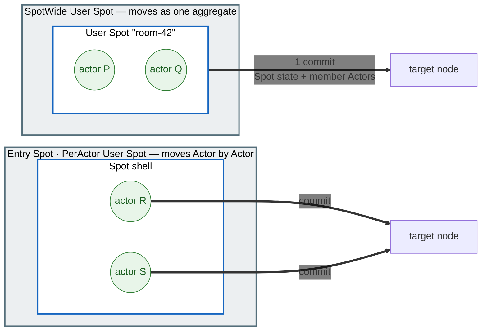
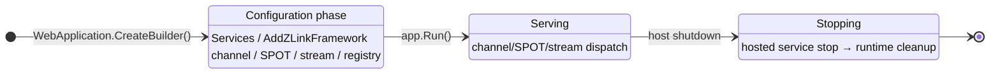

<!-- generated:start -->
<!-- This file is generated from `common/guide/server/12-operations.en.md`. Do not edit directly.
     Edit the common source instead, then regenerate with `python3 doc/site/scripts/generate_language_guides.py`. -->
<!-- generated:end -->

<!-- framework-adapter-nav:start -->
[Guide Home](README.en.md) | [Previous: 11. Monitoring — Status Observation And Diagnostics](11-monitoring.en.md) | [Next: 13. Key Type Usage Index](13-interface-catalog.en.md)
<!-- framework-adapter-nav:end -->

<!-- language-switch:start -->
View in another language — [C#/.NET](../../../dotnet/guide/server/12-operations.en.md) · [C++](../../../cpp/guide/server/12-operations.en.md) · [Java](../../../java/guide/server/12-operations.en.md) · [Kotlin](../../../kotlin/guide/server/12-operations.en.md) · **Node/TypeScript**
<!-- language-switch:end -->

# 12. Operations — Runtime Metrics · Graceful Drain · Readiness

> **The documents that own this chapter's contract** — owned by the common spec
> [Runtime state query and operational diagnostics](../../../common/spec/server/06-observability/01-runtime-monitoring.en.md),
> [Runtime metrics](../../../common/spec/server/06-observability/02-runtime-metrics.en.md), and
> [Graceful Drain & Handoff](../../../common/spec/server/05-location-relocation/05-host-relocation-flow.en.md). The
> formal definition of each language's surface is owned by the
> [per-language topology/monitoring public contract](../../../common/spec/server/languages/README.en.md).
> This chapter focuses on usage — what you actually wire up and declare in an operational
> environment.

## 0. What It Provides

Once a service goes into operation, beyond the event observation covered in the `11.
Monitoring` chapter, you need the following.

1. **Metrics** — see numbers like CCU, queue depth, and request latency on a dashboard.
2. **Graceful drain** — clean up a node being taken down for a deployment or scale-in
   without dropping connected users.
3. **Readiness** — tell the deployment infrastructure "is this node allowed to accept new
   requests."

The framework provides the metric instruments and the drain procedure at host shutdown. The
app wires the meter name into its collection pipeline, and composes the readiness endpoint
the deployment environment calls out of the public runtime query API.

Terms that appear for the first time:

| Term | One-line explanation |
|---|---|
| Meter / instrument | A language-standard metric emission unit. counter, gauge, and histogram are instruments |
| OpenTelemetry (OTel) | The standard for collecting metrics/traces. Exported via Prometheus and other exporters |
| Relocate | The operation that moves a stateful object to a compatible target and puts the host into `Relocated` state |
| Shutdown | The operation that performs bounded cleanup of local resources with no new relocation |
| Readiness probe | The deployment infrastructure's status check asking "is it OK to accept new requests" |

## 1. Runtime Metrics

The framework emits every instrument through one `System.Diagnostics.Metrics.Meter` named
`"zlink.framework"`. The app registers this canonical meter name in its collection pipeline.

```typescript
// Wire the zlink meter into the OpenTelemetry Node SDK.
// "zlink.framework" is the canonical meter name the Framework emits instruments through.
const meterProvider = new MeterProvider({ readers: [prometheusExporter] });
meterProvider.getMeter('zlink.framework');
```

- There's no zlink-specific metrics API. Each language's standard metrics API is the surface
  as-is. To collect without OTel, subscribe directly to the meter name `"zlink.framework"`
  from a `MeterListener`.
- If no listener is attached at all, an instrument update ends on a minimal-cost inactive
  path. Registering an instrument without turning it on has no effect on messaging
  performance.
- Choosing a dashboard and exporter is the app's job. The framework doesn't bundle a scrape
  server.

The instrument catalog is below. The labels, units, and kinds of the MeshNode,
object/STREAM, and location/fanout instruments are set by
[Runtime Metrics §§3-5](../../../common/spec/server/06-observability/02-runtime-metrics.en.md), and the drain
instruments by
[Complete Host Relocation Flow §13](../../../common/spec/server/05-location-relocation/05-host-relocation-flow.en.md#16-observability-information).

| Instrument | What it measures |
|---|---|
| `zlink.stream.connections.active` | Active STREAM connection count (CCU) |
| `zlink.stream.connections.opened` | Cumulative STREAM connections started |
| `zlink.stream.connections.closed` | Cumulative STREAM connections closed |
| `zlink.spot.count` | Active spot count |
| `zlink.actor.count` | Active Actor count |
| `zlink.relocation.started` | Cumulative Actor/User/Instance Spot relocations started |
| `zlink.relocation.completed` | Cumulative relocation terminal results |
| `zlink.relocation.duration` | Time from prepare to the terminal phase |
| `zlink.relocation.bytes` | Encoded size of the moved relocation payload |
| `zlink.instance_spot.activations` | Cumulative Instance Spot activation results |
| `zlink.instance_spot.activation.duration` | Time from first address resolution to Ready or terminal failure |
| `zlink.instance_spot.pending.messages` | Number of messages waiting at the activation barrier |
| `zlink.instance_spot.pending.bytes` | Payload bytes reserved at the activation barrier |
| `zlink.instance_spot.claim.conflicts` | Cumulative Instance location claim conflicts |
| `zlink.mesh_node.peers.configured` | Peer count present in the descriptor |
| `zlink.mesh_node.peers.connected` | Peer count with transport connected |
| `zlink.mesh_node.peers.ready` | Peer count that passed admission and handler readiness |
| `zlink.mesh_node.channels.ready_members` | Member count available for ChannelName select-one |
| `zlink.mesh_node.channel.selection_failures` | Count of times no member was available for select-one |
| `zlink.mesh_node.requests.inflight` | Requests currently waiting for a reply |
| `zlink.mesh_node.request.duration` | Time from request submit to terminal completion |
| `zlink.mesh_node.request.timeouts` | Cumulative request timeouts |
| `zlink.mesh_node.messages.dropped` | Cumulative one-way drops with a cause confirmed by the Framework |
| `zlink.fanout.published` | Cumulative classic fanout publishes |
| `zlink.fanout.received` | Cumulative classic fanout receives |
| `zlink.fanout.dropped` | Cumulative classic fanout drops with a cause confirmed by the Framework |
| `zlink.location.store.errors` | Cumulative Redis read/write/lease failures |
| `zlink.location.owner_lease.renew.failures` | Cumulative owner lease renewal failures |
| `zlink.location.owner_lease.renew.lateness` | Owner lease renewal delay versus the scheduled time |
| `zlink.observability.events.overflow` | Cumulative monitoring/trace observer queue overflows |
| `zlink.host.state` | The current host Framework runtime state |
| `zlink.host.core_hwm.effective_budget` | Effective Core HWM byte budget fixed at startup |
| `zlink.host.core_hwm.applied` | Sum of ordinary directional queue HWMs, excluding the completion lane |
| `zlink.host.core_hwm.accounted` | Current or epoch-peak Core-accounted bytes (`state=current|peak`) |
| `zlink.host.core_hwm.completion_accounted` | Current or epoch-peak completion-accounted bytes (`state=current|peak`) |
| `zlink.host.core_hwm.blocked_ratio` | Core blocked ratio in parts per million |
| `zlink.host.application_job_queue.limit` | Effective Application Job Queue permit limit fixed at startup |
| `zlink.host.application_job_queue.jobs` | Reserved, queued, in-use, or peak permits (`state=reserved|queued|in_use|peak`) |
| `zlink.host.application_job_queue.capacity_waiters` | Current number of permit-capacity waiters |
| `zlink.host.application_job_queue.capacity_waits` | Permit-capacity waits in the current measurement epoch |
| `zlink.host.application_job_queue.capacity_wait_duration` | Cumulative permit-capacity wait duration in the current epoch |
| `zlink.host.application_job_queue.pressure_state` | Current running · paused state (state) |
| `zlink.host.application_job_queue.pressure_transitions` | Transitions by destination state (state=running · paused) |
| `zlink.host.application_job_queue.pause_duration` | Current/cumulative pause seconds (state=current · cumulative) |
| `zlink.host.application_job_queue.flow_state_config_failures` | Failures to apply an absolute Core flow state |
| `zlink.host.relocation.duration` | Time from starting Host `relocate` to the terminal result |
| `zlink.host.relocation.blocked` | Count of host `relocate` calls that ended in `Blocked` |
| `zlink.host.shutdown.duration` | Time from starting Host `shutdown` to the terminal result |
| `zlink.host.shutdown.forced` | Count of host `shutdown` calls that ended via bounded teardown |

### 1.1 Capacity Snapshot And Measurement Reset

The host runtime's capacity snapshot exposes the Core HWM and Application Job Queue status
together. Use it to correlate the fixed startup configuration and effective limits with
current/peak accounted bytes, reserved/queued/in-use permits, and capacity waits. Read the
exact type and member names from the relevant
[per-language monitoring contract](../../../common/spec/server/languages/README.en.md).

Resetting measurements starts a new epoch without changing capacity. Current gauges and
configuration stay unchanged, including pressure state and current pause duration. Each peak
is rebased to its current value, and epoch waits, pressure transitions, cumulative pause
duration, and flow-state configuration failures become zero.
An event concurrent with reset belongs to exactly one epoch. Always-on metrics deliberately do
not timestamp every job or create a per-job queue-wait histogram;
record such distributions only inside a bounded performance fixture. The exact snapshot and
reset rules are in
[Runtime state query and operational diagnostics](../../../common/spec/server/06-observability/01-runtime-monitoring.en.md)
and the metric names, units, and labels are in
[Runtime metrics](../../../common/spec/server/06-observability/02-runtime-metrics.en.md).

## 2. Relocate — Moving To Another Host While Keeping State

`relocate(...)` moves every User Spot, Instance Spot, and Actor alive on this host to another
Serving node. It's an operation that targets the whole host, and the call itself doesn't
terminate the host.

**What's preserved.** This means what the client and other nodes were using stays exactly as
it was after the move.

| What's preserved | Meaning |
| --- | --- |
| SpotId/ActorId and `ObjectGeneration` | The logical ID the caller was using doesn't change. There's no need to re-announce the address |
| A not-yet-executed message and the accepted journal | Work still sitting in the queue at seal time resumes execution on the target |
| Timer registration and pending ticks | The name, period, options, and schedule cursor move together, so the target doesn't re-register them |
| Application state | Moved through the `capture`/`Restore` of the relocation adapter registered on the factory |
| A bound STREAM session's route | The client session is left alone, and the route is changed to point at the new owner |

The procedure:

1. Preflight confirms every stateful object and target capability/capacity. If there's no
   eligible target, it ends in `Blocked` without changing source admission.
2. Publishes the host as `Relocating` and schedules an infrastructure notification on the
   standalone Actor's, Instance Spot's, and User Spot aggregate's execution queue.
3. Target kind/version eligibility is confirmed before source dispatch stops. When the
   notification reaches a turn boundary, only the currently executing turn finishes on the
   source; it starts no new application turn. Transport reception remains open and later
   messages enter the source ingress hold while target preparation is pending.
4. At seal time, the message that didn't run, the accepted journal, the logical timer
   registration/pending tick, and the optional Snapshot bytes are sent by the source directly
   to the target over the mesh connection. The moving state never passes through the
   Relocation Store, and the transfer stays within §2.2's chunk-size and in-flight-budget
   settings. The target installs its temporary queue before factory/`Restore`, and
   finishes journal staging before the owner/membership commit. Ordinary target staging uses
   the shared Application Job Queue reservation before receive and returns it after finite
   durable handoff to the retained-byte backlog. Relocation adds no outbound/inbound or
   `capture`/`Restore` capacity gate of its own; a backlog larger than the
   live-job limit later acquires runnable-turn permits progressively.
5. A `SpotWide` User Spot and its member Actors change owner/membership together in one
   aggregate commit. An Entry Spot's and a `PerActor` User Spot's Actors are each moved
   individually. Infrastructure relocation doesn't call the application's join/leave
   callbacks.
6. Relays the source hold after the target reports relay-ready, then submits the cutover
   control one-way. The target performs its owner CAS, merges the ordered backlog, finishes
   required lifecycle callbacks, and opens application dispatch. For a bound Actor it then
   sends the Session owner a one-way target-route update; neither control has a completion
   reply or ACK.
7. Once every source unit has ended dispatch and every cutover submit has succeeded, the host
   transitions to `Relocated`. This source-side result does not mean it awaited target CAS or
   Session route application. Connections and infrastructure stay up until `shutdown(...)` is
   called.

A failure before the first relocation commit can restore the source queue and admission.
After the first commit, there's no rollback to the source — target recovery continues, and
exceeding the deadline ends in `ForceStopped`.

### 2.1 Move Unit Per Execution Mode

Even within the same host, what gets bundled into one unit to move differs by Spot kind and
execution mode. A `SpotWide` User Spot is a single aggregate together with its member Actors,
so it commits together. An Entry Spot's and a `PerActor` User Spot's Actors are each an
independent unit, so they move Actor by Actor, and in this case the Spot instance is a shell
that doesn't carry state.



So a `PerActor` User Spot's factory can only use `RecreateOnRelocation()` as its relocation
approach. Each member Actor's factory decides its own policy separately. An Instance Spot has
no Actor, so one Spot is directly the move unit.

### 2.2 Moving-State Transfer Settings

The moving state travels over the source–target mesh connection in chunks, and four server
settings keep it from crowding out ordinary messages on the same connection. The defaults
are fine to start with; the runtime never adjusts them on its own, so change them based on
what you observe in your deployment.

| Setting | Default | Purpose and tuning criterion |
| --- | --- | --- |
| `RelocationPayloadChunkLimit` | 256 KiB | Size of one chunk. Lower it if chunk transfers intrude on the latency target of ordinary messages sharing the connection |
| `RelocationInFlightPayloadBudget` | 16 MiB | Total relocation bytes that may be in flight at once on one peer connection. 0 disables it. Lower it if relocation transfers eat into ordinary message bandwidth; raise it if host move throughput is capped by this budget |
| `RelocationNodeInFlightPayloadBudget` | 0 (disabled) | Node-wide cap on concurrent transfers. Set it only when a node with many peer connections needs its total occupancy bounded |
| `RelocationCutoverWaitTimeout` | 1,000ms | How long the target waits for a cutover retransmission. If the `cutover_timeout` counter is nonzero, adjust it to your deployment's round-trip time |

When the budget is full, a new relocation unit waits before its seal, and the Actor/Spot
keeps processing messages normally while it waits — no payload size is ever too large to
start because of the budget. Internal protocol details such as the chunk format and
verification rules are covered by
[Relocation Flow](../../../common/spec/server/05-location-relocation/04-relocation-flow.en.md).

### 2.3 SafeToShutdown — When It's Safe To Terminate

`Relocated` means the source finished sending its cutovers, not that every caller caching
the old route now points at the new owner. The source runtime publishes the
`SafeToShutdown` state in its own runtime status once every unit's Message Follow can end
and the cutover retransmission window has closed. A deployment orchestrator is recommended
to confirm `Relocated`, then observe this state before calling `shutdown` — terminating
before it's published is allowed, but the remaining follow routes disappear and requests
from callers still caching the old route can end in `Unavailable`. State queries and change
observation follow
[Runtime Status Queries And Operational Diagnostics](../../../common/spec/server/06-observability/01-runtime-monitoring.en.md).

The relocation window is observed as three separate segments — source stop (from seal to
cutover submission), target resume (from the target's owner confirmation to dispatch
opening), and route convergence (from cutover submission until the Message Follow route can
be removed). The number of fallbacks that proceeded unverified after waiting for a cutover
is published as the `cutover_timeout` counter. Metric names, units, and labels are owned by
[Runtime Metrics](../../../common/spec/server/06-observability/02-runtime-metrics.en.md).

## 3. Shutdown — Terminating Without Moving

`shutdown(...)` terminates this host. Unlike §2, **it doesn't move state to another node.**

Calling it starts no new relocation; work already in progress either finishes within the
given deadline or is settled as a failure. It then notifies the Entry, User, and Instance
Spots' `onClosing` with the `HostShutdown` reason, and once that callback finishes, cleans up
scope, authority, session, and topology resources. If no deadline is given, it's 30 seconds.

The state of any Spot cleaned up here doesn't survive. If your deployment automation needs to
keep state alive while taking a host down, call `relocate(...)` first before shutting down,
confirm the result is `Relocated`, and only then move on to this call (the example in §4).
When possible, also confirm the `SafeToShutdown` publication (§2.3).

A Spot's lifetime is independent of any request. A User/Instance Spot isn't closed just
because an ordinary request finished. Likewise, preparing a nonexistent Instance Spot never
starts from a separate address or manager create — only from attaching Instance intent to a
SpotId direct call ([06-spot](06-spot.en.md) §5).

## 4. Wiring Operational Calls And Readiness

The two operations above don't happen automatically. The application calls them directly on
the framework runtime. This interface is a DI singleton that owns host maintenance.

The order used in deployment is "move first, and shut down only if it succeeded." Confirming
`Relocated` and then observing the `SafeToShutdown` publication (§2.3) before terminating
avoids failures for callers still caching the old route.

```typescript
const result = await runtime.relocate({
  mode: ZLinkFrameworkRelocationMode.RollingUpdate,
  targetApplicationVersion: 12n,   // Uses only eligible nodes on the specified new version.
  deadlineMs: 25_000
});

if (result.outcome === ZLinkFrameworkRelocationOutcome.Relocated) {
  await runtime.shutdown({ deadlineMs: 10_000 });
} else {
  logger.error(`host relocation blocked: ${result.reason}`);
}
```

`PlannedMaintenance` uses only a target on the same application version as the source.
`RollingUpdate` requires a `targetApplicationVersion` greater than the source's, and uses
only a target exactly at that version. If there's no eligible target, it waits until the
deadline and then returns `Blocked/TargetUnavailable`. Cancellation ends only that waiter —
a shared lifecycle operation that's already started keeps running.

Readiness checks both the host framework runtime's readiness and the readiness of any
business-required component runtime, together, and wires them to an existing HTTP endpoint.

```typescript
// The readiness endpoint looks only at the host runtime's status.
const ready = runtime.status.isReady;
// Respond 503 if ready is false.
```

Wired into a Kubernetes deployment, it becomes this concept.

```yaml
# readiness probe → /healthz/ready — excluded from new-traffic targets the moment Draining starts
# preStop hook + terminationGracePeriodSeconds >= drain deadline — secures time for auto-drain to finish
```

### 4.1 Calling It Again Or Overlapping Calls

Deployment automation retries on failure. So **what happens when you make the same call
twice** is defined by contract.

| Situation | Result |
| --- | --- |
| `relocate` called again with the same mode while one is in flight | Shares the deadline with the first operation. The later call doesn't extend the deadline |
| `relocate` called again with a different mode while one is in flight | `Blocked` with no wait — meaning an operation is already in progress |
| `relocate` called again after `Blocked` | `Blocked` isn't stored, so it re-checks the host's condition from scratch. **This is the only result where retrying is meaningful** |
| `relocate` called again after `Relocated` | Returns the original success result as-is. Doesn't move again |
| `shutdown` called again while one is in flight | Shares the same operation and stores the terminal result |
| `shutdown` called again after `Stopped` | Returns the stored result |
| `relocate` called while starting up, or in an error/stopped state | `Blocked` without touching admission |

**A caller's cancellation ends only that call.** The shared operation itself isn't
cancelled.

**`shutdown` is never blocked.** It proceeds even with no target, insufficient capacity, or
no Relocation Store. So if `shutdown` gets confirmed while something is waiting on
`relocate`, the waiter ends in `Blocked` — this is why you must keep to the order "move
first, confirm success, then shut down."

If `shutdown` doesn't finish within its deadline, it performs only bounded cleanup and ends
in a forced-termination result. A deadline overrun and a callback failure are distinguished
by different result values.

### 4.2 What Stays Alive During A Transition

`Relocating`, `Relocated`, and `Draining` aren't "accepting nothing" states. **Only starting
something new is blocked — what's already accepted is processed through to completion.**

| | `Relocating` | `Relocated` | `Draining` |
| --- | --- | --- | --- |
| Selection by channel name | Excluded from new selection. The existing owner path is kept | Excluded from new selection | New admission closed |
| A request that directly names a node | Accepted until the unit seals | Not accepted | Ends with the shutdown result |
| Spot/Actor creation and join | Rejected | Rejected | Rejected |
| STREAM | New binding excluded. An existing session is handled via a barrier | New binding excluded | New session not accepted |
| An already-accepted request | Ends **exactly once**, via reply, error, timeout, or shutdown | Same | Same |

**Monitoring or observer callbacks never hold up termination.** Even if code observing
status runs for a long time, maintenance never waits for it.

## 5. MeshNode Runtime Control And Observation

A MeshNode registered with `addRouteMesh` is operated through two DI singletons.

**Runtime options.** Values that can be changed while serving are below. The remaining
socket options (HWM, timeout) are exclusive to `configureRouterSocket()` before startup.

```typescript
meshOptions.mesh('game.room').placementWeight = 0; // Excludes it from new object placement
meshOptions.channel('game.room').weight = 0;       // Excludes it from new channel select-one
```

The two weights are independent and take effect on new selections while running. Placement
weight is used only for Actor/Spot create and relocation target selection. Channel weight is
used only for selecting new select-one targets for that server membership. Looking up an
unregistered mesh or membership is a configuration error.

**Status query — RouteMesh runtime.** Provides one consistent snapshot and an ordered
component event stream for one mesh. Host termination is owned by the framework runtime.

```typescript
// The immutable current status of nodes/peers/channels
const snapshot = meshRuntime.snapshot('game.room');
const ready = meshRuntime.isReady('game.room');

for await (const observed of meshRuntime.observe('game.room', 64, signal)) {
  // observed.status carries the transition, observed.loss the missed count —
  // see the shared rule in the [11. Monitoring](11-monitoring.en.md) §2.
}
```

## 6. Host Lifecycle

The Framework runtime is tied to the host's start/stop as its **lifecycle service.** The
channel/SPOT/STREAM runtime is created based on the roles registered at startup, and cleaned
up at shutdown.



- **Configuration phase** — finish every declaration before `app.Run()`. A bad configuration
  is rejected as an exception at host startup.
- **Stopping** — once the host shutdown signal arrives, it goes down in the order hosted
  service `stop()` → channel/SPOT/STREAM runtime cleanup.
- Fold background work into the same lifecycle using the host's standard lifecycle service.

### 6.1 Observing Status

Host `relocate`/`shutdown` state transitions are observed through the framework runtime's
bounded status stream. The per-MeshName runtime provides a component snapshot, but doesn't
create a separate termination authority or partial-drain operation.

```typescript
for await (const observed of runtime.observe(signal)) {
  // Records the whole-host state, effective intent, and terminal outcome in sequence order.
  const status = observed.status;
  logger.log(
    `host lifecycle: ${status.state} ${status.relocationResult} ${status.terminationResult}`
  );
}
```

Observe the seven host lifecycle states as-is (preparing, serving, relocating, relocated,
draining, stopped, error). The notation follows the language. The status's relocation/
termination results must match that operation's terminal result. To view it as numbers, use
the `zlink.host.*` instruments from §1.

## 7. Related Documents

- Runnable verification examples for this chapter's contract: `13. Interface Catalog`
  chapter §7 — the verification class `FrameworkRuntimeContracts`
- The formal contract:
  [Complete Host Relocation Flow](../../../common/spec/server/05-location-relocation/05-host-relocation-flow.en.md) ·
  [Runtime Metrics](../../../common/spec/server/06-observability/02-runtime-metrics.en.md)
- Status observation and diagnostics: the [11. Monitoring](11-monitoring.en.md)
- The Spot where the application decides the relocation boundary:
  [06-spot §7](06-spot.en.md#7-signaling-when-relocation-may-begin)
