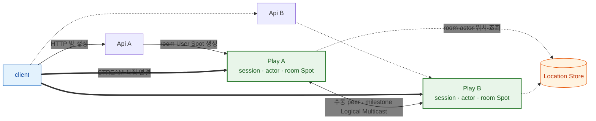
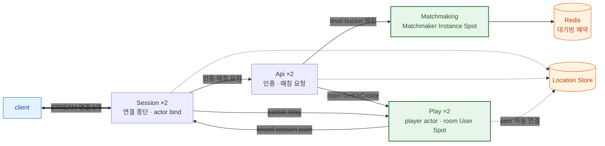
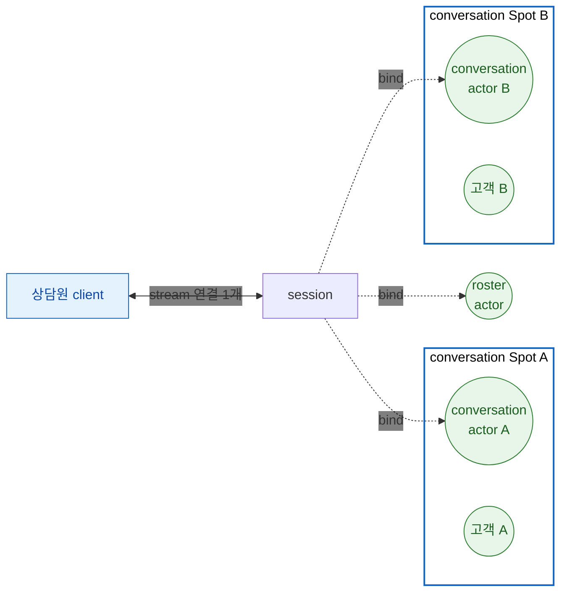
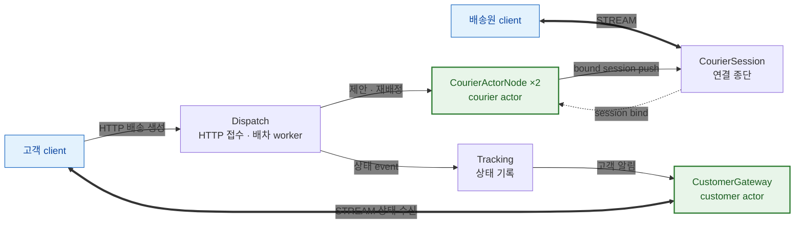
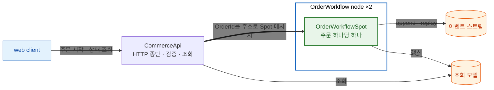
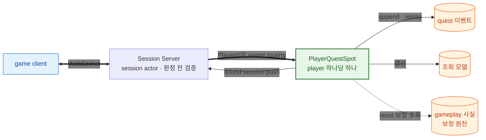
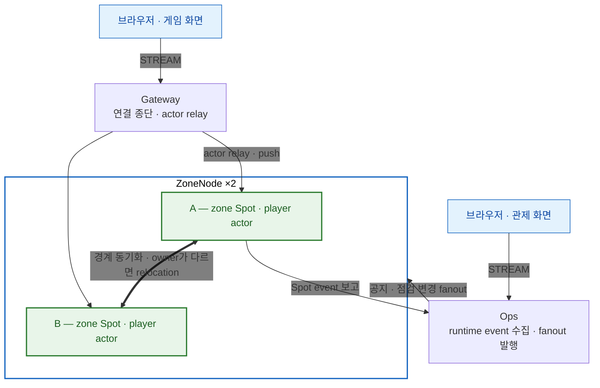

<!-- generated:start -->
<!-- 이 파일은 `common/guide/server/14-samples.ko.md`에서 생성한다. 직접 고치지 않는다.
     고칠 곳은 공통 소스이고, `python3 doc/site/scripts/generate_language_guides.py`로 다시 만든다. -->
<!-- generated:end -->

<!-- framework-adapter-nav:start -->
[가이드 홈](README.ko.md) | [이전: 13. 주요 타입 사용 색인](13-interface-catalog.ko.md) | [다음: 15. E2E 테스트 — client로 시스템 전체를 검증하기](15-e2e-testing.ko.md)
<!-- framework-adapter-nav:end -->

<!-- language-switch:start -->
다른 언어로 보기 — [C#/.NET](../../../dotnet/guide/server/14-samples.ko.md) · [C++](../../../cpp/guide/server/14-samples.ko.md) · [Java](../../../java/guide/server/14-samples.ko.md) · [Kotlin](../../../kotlin/guide/server/14-samples.ko.md) · **Node/TypeScript**
<!-- language-switch:end -->

# 14. 샘플 고르기 — 내 문제에 가까운 예제부터

> **이 장에는 계약을 소유하는 스펙 문서가 없다.** 어떤 샘플부터 보면 좋은지 고르는
> 안내이기 때문이다. 각 샘플의 언어 중립 시나리오, 메시지 계약과 검증 기준은
> [공통 sample 문서](../../../common/sample/README.ko.md)가 정의한다. 이 문서는 그중
> **어떤 샘플을 먼저 보면 도움이 되는지**와 실행하는 방법을 정리한다.

샘플은 서로 다른 기능 묶음을 맡도록 나뉘어 있다. 전부 읽을 필요는 없고, 만들려는
것에 가장 가까운 하나를 골라 그 안에서 등록 코드와 handler를 따라가는 편이 빠르다.

**어디서 시작할지 모르겠다면 [Bingo](#3-bingo--온라인-게임-서버-구축)를 본다.** framework
기능이 가장 많이 등장하고, 구성 자체가 일반적인 온라인 게임 서버 그대로다.

## 1. 무엇을 만드는지로 고르기

| 만들려는 시스템 | 샘플 | 이 샘플이 맡은 주제 |
| --- | --- | --- |
| 실시간 대전 게임 서버 | [TicTacToe](#2-tictactoe--실시간-대전-게임-서버-구축) | 자동 연결과 자동 등록을 걷어낸 가장 작은 구성 |
| 온라인 게임 서버 전체 — framework 기능도 가장 많이 나온다 | [Bingo](#3-bingo--온라인-게임-서버-구축) | 접속 gateway·인증/매칭·룸 서버로 나눈 통상적인 게임 서버 구성 |
| 라이브 채팅 상담 시스템 | [SupportChat](#4-supportchat--라이브-채팅-상담-시스템-구축) | 상담원 한 명이 여러 대화를 동시에 처리하는 actor·라우팅 구성 |
| 배차 시스템 | [DeliveryDispatch](#5-deliverydispatch--배차-시스템-구축) | 요청 생성 → 수행자 선택 → 무응답 시 재배정 → 당사자에게 전달 |
| 주문 처리 시스템 | [ShoppingMall](#6-shoppingmall--주문-처리-시스템-구축) | 조율 계층 없이 순차 코드로 쓰는 무손실 event sourcing |
| 퀘스트·미션 진행 시스템 | [GameQuest](#7-gamequest--퀘스트-진행-시스템-구축) | 유실을 허용하는 대신 실시간성을 얻는 owner 처리 |
| zone 분할 MMORPG와 운영 관제 | [ZoneWorld](#8-zoneworld--zone-분할-mmorpg와-운영-관제-구축) — `.NET`과 Node.js만 제공한다 | 여러 노드에 무언가를 할 때 어떤 표면을 고르는가 |

기능 쪽에서 거꾸로 고르려면 [01. Overview](01-overview.ko.md)의 도입 순서를
먼저 본다.

두 쌍은 서로 대비하도록 만들어져 있어 함께 보면 선택 기준이 분명해진다.

- **TicTacToe ↔ Bingo** — 같은 실시간 게임을 수동 연결·수동 등록과 자동 연결·자동 등록으로,
  session을 Play가 직접 소유하는 구성과 별도 gateway로 나눈 구성으로 각각 보여 준다.
- **ShoppingMall ↔ GameQuest** — 같은 owner Spot·event sourcing을 무손실이 필요한 도메인과
  유실을 허용하고 보정하는 도메인으로 나눠 보여 준다.

## 2. TicTacToe — 실시간 대전 게임 서버 구축

`Api` 2개와 `Play` 2개로 2인 대국을 처리하는 **가장 작은 실시간 게임 서버 구성**이다.
**peer 연결을 location store에 맡기지 않고 endpoint를 직접 적는 유일한 샘플**이기도 하다. 다만 room과 actor가 지금 어느 node에 있는지는
여기서도 Location Store가 해석한다 — 수동인 것은 **node 사이의 연결**이고, **object 위치
조회**는 아니다. handler도 스캔 없이 구성 코드에서 직접 등록하는 유일한 샘플이라, framework가
자동으로 해 주던 부분을 걷어낸 상태에서 나머지가 어떻게 맞물리는지 보기 좋다.



별도 Session 서버가 없어 각 `Play`가 stream session·actor·Entry Spot·room Spot을 함께
소유한다. client는 `Api`에서 받은 Play endpoint 목록으로 Play에 직접 연결한다. 승수가
100에 도달하면 room Spot이 milestone을 Logical Multicast로 publish하고, 다른 Play 서버의
Entry Spot에 등록된 observer handler가 그것을 받아 관전 client로 push한다.

- 짝이 되는 장: [05-channel-messaging](05-channel-messaging.ko.md)(ClientServer channel),
  [06-spot](06-spot.ko.md)(User Spot 생성), [09-stream](09-stream.ko.md)
- 시나리오: [TicTacToe](../../../common/sample/tictactoe/README.ko.md) · payload JSON
- [02. Getting Started](02-getting-started.ko.md)이 이 샘플을 따라간다. 처음 읽는다면 여기부터.

## 3. Bingo — 온라인 게임 서버 구축

**하나만 고른다면 이 샘플이다.** 인증·매칭·게임 진행·실시간 push까지 온라인 게임 서버에
필요한 구성이 모두 들어 있고, 그 과정에서 framework 기능이 가장 많이 등장한다.
세 종류 Spot, actor와 session bind, remote Spot join, Spot timer, Logical Multicast,
location store 자동 연결이 하나의 흐름 안에서 차례로 나온다.

동시에 이 구조는 Bingo에만 해당하는 것이 아니라 **일반적인 온라인 게임의 서버 구성**
그대로다. client는 접속 서버 하나에만 연결하고, 인증과 매칭은 별도 서버가 맡고, 게임
진행은 방을 소유한 서버가 처리한다. 다른 장르를 만들더라도 역할 분리와 연결 구조는 이
모양에서 크게 벗어나지 않으므로, 새 서비스의 출발점으로 삼기 좋다.



`Session`은 client 연결과 actor bind를, `Play`는 player actor와 room User
Spot을, `Api`는 인증과 매칭 요청을, `Matchmaking`은 level별 Matchmaker Instance Spot을
맡는다. client는 **`Session` 서버 연결 하나만** 유지하고, 서버 간 연결은 공유 Location
Store가 해석한다. `Session`·`Api`·`Play`는 각각 2개씩 띄워 gateway 구조에서도 scale-out이
유지되는지 확인한다.

여기서만 볼 수 있는 것이 둘 있다. Matchmaker Instance Spot이 Redis를 기준으로 대기방
예약을 원자적으로 결정하고, player actor와 room Spot이 **서로 다른 Play 서버에 있어도**
framework가 current owner를 찾아 remote Spot join을 실행한다. 이후 room Spot이 timer로
번호를 뽑아 bound session에 push하고, 희귀 보상이 나오면 Logical Multicast로 다른 Play
서버의 관전자에게 전달한다.

payload는 이 샘플만 Protobuf다. 역할과 계약 수가 많은 gateway형 게임이라 언어별 샘플이
같은 필드와 wire 이름을 유지하도록 schema를 기준으로 두었다.

- 짝이 되는 장: [06-spot](06-spot.ko.md)(세 종류 Spot이 모두 나온다),
  [07-actor-spot](07-actor-spot.ko.md), [08-actor-session](08-actor-session.ko.md),
  [10-location](10-location.ko.md)
- 시나리오: [Bingo](../../../common/sample/bingo/README.ko.md) · payload Protobuf
- 06과 07의 등록 코드 예시가 이 샘플에서 나온다.

## 4. SupportChat — 라이브 채팅 상담 시스템 구축

고객이 상담을 요청하면 상담원이 배정되어 실시간으로 대화하는 시스템이다. 대화 한 건이
conversation Spot에 대응하고, 참여자·메시지 순서·typing 상태·종료 상태를 그 Spot이 소유한다.

이 도메인의 기술적 어려움은 **상담원 한 명이 여러 고객을 동시에 응대**한다는 데서 나온다.
고객은 대화 하나만 가지므로 자기 actor가 곧 그 대화의 참여자다. 상담원은 그럴 수 없다 —
framework에서 **한 actor는 동시에 한 Spot에만 속하고**, 새 Spot에 join하면 이전 Spot에서
leave되기 때문이다. 상담원 actor 하나로는 대화 세 건에 동시에 들어가 있을 수 없다.

그래서 상담원 쪽 actor를 두 종류로 나눈다.

| actor | 속한 Spot | 책임 |
| --- | --- | --- |
| roster actor | Entry Spot | 상담원 신원과 배정 가능 여부를 소유하고 배정 통지를 받는다. 인증할 때 하나 만든다 |
| conversation actor | 각 conversation Spot | 대화 하나의 참여자다. 그 대화에 join할 때 하나씩 늘어난다 |

**연결은 하나인데 actor는 여러 개다.** 상담원 client는 stream 연결 하나만 유지하고, 그
session에 roster actor와 대화별 conversation actor를 함께 bind한다.



들어오는 방향은 **`ConversationId`를 stream 메시지의 metadata에 실어** 구분한다. Session
서버는 metadata만 읽어 대상 actor를 고르고 **payload는 해석하지 않는다.** 덕분에 접속
서버가 상담 도메인 schema에 묶이지 않는다. 나가는 방향은 각 conversation Spot의 push가 그
actor에 bind된 session을 통해 같은 연결 하나로 모인다.

배정은 용량 기준이다. 용량이 남은 상담원이 없으면 오류가 아니라 대기 상태로 남고, 용량이
차면 배정 목록에서 빠졌다가 대화가 닫히면 다시 들어온다. 재접속하면 같은 actor에 새
session이 bind되어 대화 상태가 그대로 이어지고, 일정 시간 메시지가 없으면 Spot timer가
대화를 종료 흐름으로 넘긴다.

이 구성은 상담에만 해당하지 않는다. **한 사용자가 여러 방·여러 작업에 동시에 참여하는
시스템**은 모두 같은 모양이 된다.

- 짝이 되는 장: [08-actor-session](08-actor-session.ko.md), [06-spot](06-spot.ko.md)(timer),
  [09-stream](09-stream.ko.md)
- 시나리오: [SupportChat](../../../common/sample/supportchat/README.ko.md) · payload JSON

## 5. DeliveryDispatch — 배차 시스템 구축

배송을 만들고, 배송원에게 제안하고, 정해진 시간 안에 응답이 없으면 다시 배정하고,
고객에게 상태를 전달한다. 이 샘플의 목적은 배송 업무 규칙이 아니라 **"요청을 만들고,
수행자를 고르고, 특정 사용자의 연결로 전달하고, 무응답이면 다시 시도한다"는 흔한 요구가
framework의 어느 기능에 대응되는지** 보여 주는 것이다. 택시 호출, 현장 출동, 방문 서비스도
같은 구조다.



외부 경계는 그대로 웹 기술을 쓴다. 고객은 HTTP로 배송을 만들고 stream으로 상태를 받는다.
바뀌는 것은 그 안쪽이다 — session map이나 socket registry를 직접 두는 대신 고객 actor에
bind된 session이 그 자리를 대신하고, 배송원 선택과 재배정은 dispatch worker와 courier
actor route가 맡는다. client 시나리오는 정상 배차와 timeout 재배차 두 흐름을 모두 검증한다.

- 짝이 되는 장: [05-channel-messaging](05-channel-messaging.ko.md),
  [07-actor-spot](07-actor-spot.ko.md), [09-stream](09-stream.ko.md)
- 시나리오: [DeliveryDispatch](../../../common/sample/deliverydispatch/README.ko.md) · payload JSON

## 6. ShoppingMall — 주문 처리 시스템 구축

주문 하나를 `OrderWorkflow` owner Spot이 소유하고, 재고 예약 → 결제 승인 → 확정을
진행하며 실패하면 보상한다. 바깥 HTTP는 `CommerceApi`가 종단하고 주문 상태는 직접 바꾸지
않는다.



이 샘플에서 owner Spot의 이득은 처리량이 아니다. **재시도와 중단에 안전한 다단계 처리를
saga 오케스트레이터·조율 상태·스케줄러·outbox 같은 별도 조율 계층 없이 순차 코드로 쓴다는
점**이 핵심이다. 웹 구성에서 바깥 인프라로 조립하던 "진행 지점 저장 · 다음 단계 조율 ·
멈춘 작업 재개"가 이벤트 스트림 하나로 접힌다. 중복 클릭은 멱등 키로, 이전 owner가 남아
있는 순간은 기대 버전으로, 멈춘 주문은 명시적 재개 명령으로 처리한다. 조회 모델은 깨지면
이벤트를 다시 재생해 만든다.

- 짝이 되는 장: [06-spot](06-spot.ko.md), [12-operations](12-operations.ko.md)
- 시나리오: [ShoppingMall](../../../common/sample/event/shoppingmall.ko.md) · payload JSON
- event sourcing 자체는 framework 기능이 아니라 application이 Spot 위에 올린 구성이다.

## 7. GameQuest — 퀘스트 진행 시스템 구축

게임에서 발생하는 player별 플레이 이벤트를 모아 퀘스트 진행과 완료를 **서버가** 판정한다.
client가 "퀘스트를 깼으니 보상을 달라"고 말하게 두면 조작되기 때문에, 판정과 보상 결정은
전부 `PlayerId` owner Spot에서 일어난다. 같은 player의 이벤트는 owner 하나가 순서대로
처리하고, 진행 상황은 projection을 통해 연결로 push된다.



ShoppingMall과 나란히 놓으면 선택 기준이 드러난다. 게임 진행은 꼬여도 재동기화라는
안전밸브가 있어 **유실을 허용하는 대신 실시간성을 얻는다.** 그래서 이전 owner 차단이나
명시적 재개 같은 무손실 장치를 두지 않고, 누락은 snapshot 기반 보정으로 흡수한다. 실제
재화 지급처럼 무손실이 필요한 부분은 별도 tier로 분리한다.

- 짝이 되는 장: [06-spot](06-spot.ko.md),
  [08-actor-session](08-actor-session.ko.md)
- 시나리오: [GameQuest](../../../common/sample/event/gamequest.ko.md) · payload JSON

## 8. ZoneWorld — zone 분할 MMORPG와 운영 관제 구축

> 앞의 일곱 샘플과 달리 ZoneWorld는 `.NET`과 Node.js에만 있다. 나머지 여섯은 다섯 언어
> 공통이다. 다른 언어에서 같은 주제를 보려면 이 장의 설명과 공통 시나리오 문서를 읽고
> 코드는 두 언어 중 하나를 참고한다.

월드를 구역으로 나눠 `ZoneNode` 여러 대가 나눠 맡고, 어느 노드가 어느 구역을 맡는지는
Location Store와 framework가 정한다. 플레이어가 경계를 넘으면 actor가 인접 zone Spot에
join하고, owner가 다르면 relocation이 일어나지만 client 연결은 유지된다. bound session이
없는 봇 actor도 Spot timer로 같은 경계 이동을 한다.



이 샘플의 교육 목표는 **"여러 노드에 무언가를 한다"가 상황마다 다른 표면을 요구한다**는
것이다.

| 하려는 일 | 쓰는 표면 |
| --- | --- |
| 어느 노드가 등록·연결됐는지 본다 | runtime event — 요청이 아니라 변화 알림이고, 종료된 노드에는 요청할 대상이 없다 |
| 전 노드에 공지한다 | classic fanout — 발행자가 노드 목록을 갖지 않는다 |
| 특정 노드를 점검 모드로 바꾼다 | desired state + fanout — 각 노드가 자기 `NodeId` 몫만 적용한다 |
| 한 zone의 모든 플레이어에게 보낸다 | zone Spot → 소속 actor들 → 각자의 bound session |
| 특정 플레이어 한 명에게 보낸다 | 그 actor → 자기 bound session |

경계 근처 상태는 인접 zone별 topic으로 Logical Multicast한다. 하나의 topic을 여러 zone이
구독하면 무관한 플레이어까지 전달되기 때문에 보내는 zone과 받는 zone을 topic 이름에 모두
넣는다. **브라우저 UI가 있는 유일한 샘플**이라 경계 이동과 노드 점검 전환을 눈으로 확인한다.

- 짝이 되는 장: [07-actor-spot](07-actor-spot.ko.md)(relocation),
  [11. Monitoring](11-monitoring.ko.md), [12-operations](12-operations.ko.md)
- 시나리오: [ZoneWorld](../../../common/sample/zoneworld/README.ko.md) · payload JSON
- server는 여러 언어가 제공하고 브라우저 client 하나를 공유한다.

## 9. 실행

각 샘플 디렉터리의 runner 하나가 서버 여러 개와 client 시나리오를 함께 띄우고
검증까지 수행한다. Location store가 필요한 샘플은 runner가 Redis 컨테이너를 직접
띄우고 끝나면 정리하므로 `docker`만 있으면 된다.

```bash
# 샘플 하나 실행
framework/languages/node/samples/Bingo.Ts/run_sample.sh

# 여러 개를 이어서 실행 (인자를 생략하면 전체)
framework/languages/node/samples/run_samples.sh TicTacToe Bingo
```

`run_samples.sh`는 서버 샘플 6개를 다룬다. 브라우저 UI가 필요한 ZoneWorld는
`ZoneWorld/run_sample.sh`로 따로 실행한다.

## 10. 관련 문서

- 샘플의 언어 중립 시나리오와 검증 기준: [공통 sample](../../../common/sample/README.ko.md)
- 언어별 샘플 디렉터리 구성: 각 언어 샘플 루트의 `README`
- 기능별 사용법: [05-channel-messaging](05-channel-messaging.ko.md) ~
  [12-operations](12-operations.ko.md)
