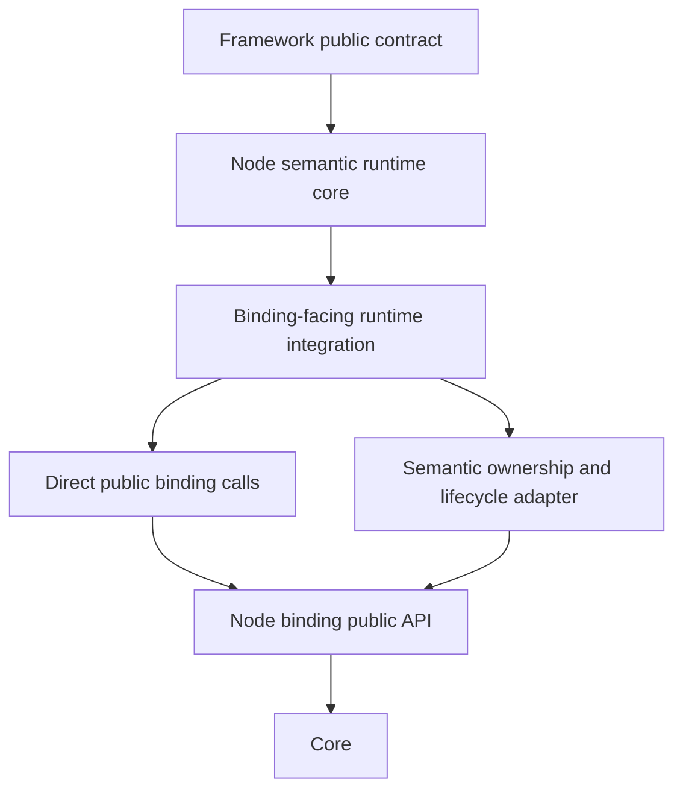

# Node.js transport readiness implementation

[Common layering](../../common/internals/01-layering.en.md) ·
[Transport liveness](../../common/spec/29-transport-liveness.en.md) ·
[MeshNode contract](../../common/spec/13-mesh-node.en.md)

> This document records how the current Node.js Framework implementation connects the
> common contract to its responsibility boundaries. It does not add a public contract or
> expose binding private members or native structures.

## 1. Scope and observable result

The state in which Framework may use a remote node as a message target is
[ready](../../common/spec/01-glossary.en.md#ready). The Node.js implementation does not
derive this state from a transport monitor event alone. It checks all three conditions for
the same peer:

1. A topology peer has completed service handshake and identity validation.
2. Service liveness is ready for that peer's current transport identity.
3. The Application transport pair observed by the monitor is still usable.

If any condition fails, the next Framework request completes with a `NotConnected` terminal
without starting a native request. A request that has already started is not automatically
sent to another peer. This preserves the common rule that a request is not executed twice;
see [failure and failover scope](../../common/spec/31-failure-failover-policy.en.md).

The implementation has the following responsibility graph:

`raw-service-mesh-runtime.ts` owns peer admission, liveness, monitor candidates and
Framework operations. `node-raw-binding-port.ts` calls the Node binding public API and
translates `Received`, poll events and Completion callbacks into Framework ownership rules.
Neither module promotes binding types into the Framework domain contract.

## 2. Monitor events and transport identity

The Core monitor reports `connectionId` for one physical transport attempt and
`transportPairId` plus `transportPairGeneration` for the logical pair formed by the
Application and Completion transports. `transportLane` identifies which lane an event
belongs to. An unpaired transport has zero pair fields and uses the Application lane. Pair
values are not globally unique across process restarts.

`ConnectionReady.value` may be a snapshot of the current ready-connection count. The Node
runtime does not create a candidate from every event whose value is greater than zero. It
accepts only events carrying `ZLINK_MONITOR_EVENT_FLAG_CONNECTION_READY_EDGE` as a ready
increase edge. If an older binding does not provide `flags`, it falls back to `value > 0`.
Repeated ready-count snapshots therefore do not repeat admission or reset the liveness
record.

The Node binding adapter copies these values across the monitor callback boundary:

| Value | Meaning in the Node semantic runtime |
|---|---|
| `connectionId` | Process-local identity of one physical transport attempt |
| `transportPairId` and `transportPairGeneration` | Identity shared by Application and Completion events for one logical pair |
| `transportLane` | Application or Completion lane within the pair |
| `flags` | Event transition bits, including the ready-edge bit |

When pair metadata is present, Node builds a candidate key from `routingId`,
`transportPairId` and `transportPairGeneration`. Without pair metadata it uses physical
`connectionId`; if that is also absent it uses the routing ID and endpoint tuple. A Completion
ready event can therefore arrive first without making the route independent of the
Application lane. A disconnect for the same pair removes the candidate even when its physical
connection ID differs.

## 3. Ready-fence processing order

The monitor callback invokes `observeMonitorEvent` before appending the event to the normal
drain queue. This small callback-side map records the last observed pair. A `null` value means
that the peer's Application route must not be used for a native call.

The normal connection sequence is:

1. Core emits a ready-edge event.
2. The Node binding calls the public monitor callback with the event and pair metadata.
3. The callback updates the pair fence first.
4. `drainMonitorEvents` builds a candidate and applies descriptor, generation and direction
   checks before admitting the peer.
5. A liveness ACK matching the current peer transport identity makes the liveness record
   ready.
6. `isPeerRouteReady` checks the topology peer, lifecycle generation, pair fence and liveness
   together.

Disconnect takes the shorter path:

1. A disconnect from either the Application or Completion lane reaches the callback with pair
   metadata.
2. The callback changes the current pair fence to `null`.
3. A new request is completed as `NotConnected` without invoking native request.
4. The next drain removes the candidate and admitted peer and clears the liveness record.

This ordering matters because Completion may still process a liveness ACK during the short
window in which the Application lane has already disconnected. If public `Ready` were based
only on Completion liveness, a native Application request could fail with `Host unreachable`.
The callback fence absorbs the ordering difference between the monitor callback and the
runtime drain timer.

A `ConnectionReady` snapshot without the ready-edge flag does not create a candidate or revive
the current pair. If a ready edge and disconnect enter the same drain batch, the ready branch
does not overwrite the `null` recorded by the callback. An old snapshot therefore cannot make
a connection ready again after disconnect was observed.

## 4. Binding-facing ownership adapter

The implementation uses only the Node binding's public `RouterSocket`, `MonitorSocket`,
`Received` and `Poller` APIs. `NodeRawSocketPort` is not a pass-through wrapper; it translates
the following semantic differences:

| Binding operation | Additional Framework meaning |
|---|---|
| Receive into `Received` | Reuse one `Received` per socket and copy the bytes needed by the Framework mailbox before the next native receive. |
| `Poller` and poll events | Separate Application and Completion progress and reuse poll-event storage for the socket lifetime. |
| `MonitorSocket.onEvent` | Apply the pair fence before the normal runtime drain. |
| Completion control send/receive | Use the existing Completion transport only for bounded Framework control; Application payload continues to use the Application path. |
| Socket, monitor and context close | Close host-owned resources in reverse order and clean up callbacks, timers and pollers together. |

Simple socket operations whose meaning matches the Framework contract call the binding
public method directly. The adapter remains where `Received` lifetime, Completion progress
and Application readiness are combined into one Framework operation. The Framework does not
use binding internal/private members, reflection or raw native symbols. Pair metadata was
added to the Core and Node binding public monitor contract because the previous public event
did not identify the logical pair; the Framework now reads only those public fields.

## 5. Message and Completion hot path

The Application receive path uses a `Received` object created once per socket, then copies the
parts needed by the Framework-owned mailbox before the next native receive. This is one
ownership-boundary copy that makes it safe for the binding envelope to be reused. The runtime
does not create `Received`, wrapper, poller, task or completion objects per message.

Completion control is delivered through a public callback separate from the Application receive
queue. The callback copies bounded control bytes, closes each binding message immediately and
lets the runtime process the record in the same turn. The Completion progress timer and poller
are scoped to the router lifetime, not to individual Application messages.

Request replies use the completion table and correlation required for the operation lifetime.
After a reply arrives, the binding reply collection is copied and native message ownership is
closed. These allocations belong to an operation or lifecycle path. The monitor event batch is
also detached by swapping arrays rather than copying or reindexing the current batch.

The following patterns are therefore not allowed in the Node message hot path:

- creating a new `Received` or poll-event storage for every message;
- putting Completion liveness into the Application mailbox and creating a second queue;
- sending a terminal request again with a new operation ID;
- converting binding message parts between bytes and message objects more than required by
  the ownership boundary; or
- adding a Framework lock on top of binding send readiness.

## 6. Store owner lease and stateful recovery

A host using the Location Store tracks the owner lease with a monotonic deadline. A failed renewal
does not immediately discard current work while that deadline has not passed, but the expired lease
is not used as an authoritative stateful owner. At the deadline, stateful authority reconciliation is
fenced so new Instance requests and timer evidence cannot continue through the expired owner.
The deadline subtracts `ownerLeaseFencingMarginMs`, so Store writes and requests near expiry do not
race with a new owner.

When the Store is unavailable during startup, the transport host may start in degraded mode. It does
not publish a Serving descriptor or stateful authority in that mode. After a fresh lease is claimed,
authority-route reconciliation starts as a single-flight operation, and descriptors are republished
only after durable authority recovery completes. An empty descriptor scan immediately after a Store
restart may be incomplete while owners reclaim their leases, so existing transports are not removed
immediately for one owner-lease TTL. This grace period applies only while Store state is uncertain after
an operation failure. A successful empty read is authoritative, including a legitimate scale-to-zero
result, so stale transports may be removed immediately.
If a MeshNode descriptor renew returns `RejectedConflict` or `IgnoredStale` because the row is absent,
the Location runtime retries once with `NewClaim` under the same owner lease. If another owner has
already recreated the row, the claim remains a conflict and is not hidden.

Redis provider reconnect is serialized as one in-flight public-client operation. If a client is open but
not ready, the same reconnect promise performs disconnect and connect. Concurrent Store operations
therefore do not start overlapping reconnect sequences.

The local owner-lease deadline is not derived only from the Store response time. The runtime measures
the request start and completion with a monotonic clock, subtracts the observed round trip from the
remaining TTL returned by the Store, and then applies the fencing margin. Store response latency
therefore cannot extend local Serving eligibility beyond the conservative lease bound.

Stateful authority-route recovery is serialized by one lifecycle owner. On lease failure, the existing
route is stopped before a replacement route is created, and owner-token and lease usability are checked
again immediately before the Serving descriptor is published. Authority registration happens once at
host startup; recovery recreates only the route runtime.

## 7. Request failure and retry boundary

`RequestTargetNotFound` can occur in two places while the public error kind remains the same.
If an existing Ready route fails during native target lookup before admission, the resolver
may be invalidated and the current authority may be read again. If the Missing Instance
completion table has already returned a terminal `NotFound`, the original application request
is not sent again.

Node distinguishes these cases at the call boundary without adding a public error kind:

- only `RequestTargetNotFound` from an existing route is a route-refresh candidate;
- only the same kind thrown synchronously by `requestToMissingInstanceSpot` receives the
  pre-admission retry marker;
- a completion-converted `NotFound`, `ActorLocationStale` and any error after transport
  admission is returned to the caller without retry.

`ActorLocationStale` is not automatically resubmitted because Node cannot know whether the
target has already processed the application envelope. The Application may start a new
operation after receiving the failure. This follows the [Framework error model](../../common/spec/32-framework-error-model.en.md)
and the common one-terminal-completion rule.

## 8. Implementation verification

The following checks cover both the public contract and the internal boundaries:

| Check | What it verifies |
|---|---|
| `npm run verify:m6a-runtime` | Pair metadata, the ready-edge flag and ready-count snapshots are distinguished, and a disconnect with a different physical ID still removes the same pair. |
| `npm run verify:m6b-runtime` | A stale route does not resubmit an application request and a Missing Instance completion terminal is not retried. |
| `./run_e2e.sh RM-A2` | Request and provider evidence across real processes using a manual endpoint. |
| Complete RegistryMessaging E2E | Discovery, failover, scale, targeted routing, timeout, payload and backpressure paths use the same readiness fence. |

Run the build and the contract checks together after an implementation change. Run E2E
scenarios one at a time so Core sockets and Redis resources do not affect one another. For
performance review, compare Application throughput, p99 latency, allocation/GC and lock
contention with the baseline. The callback-side fence and its map must not introduce an
unexplained regression.
