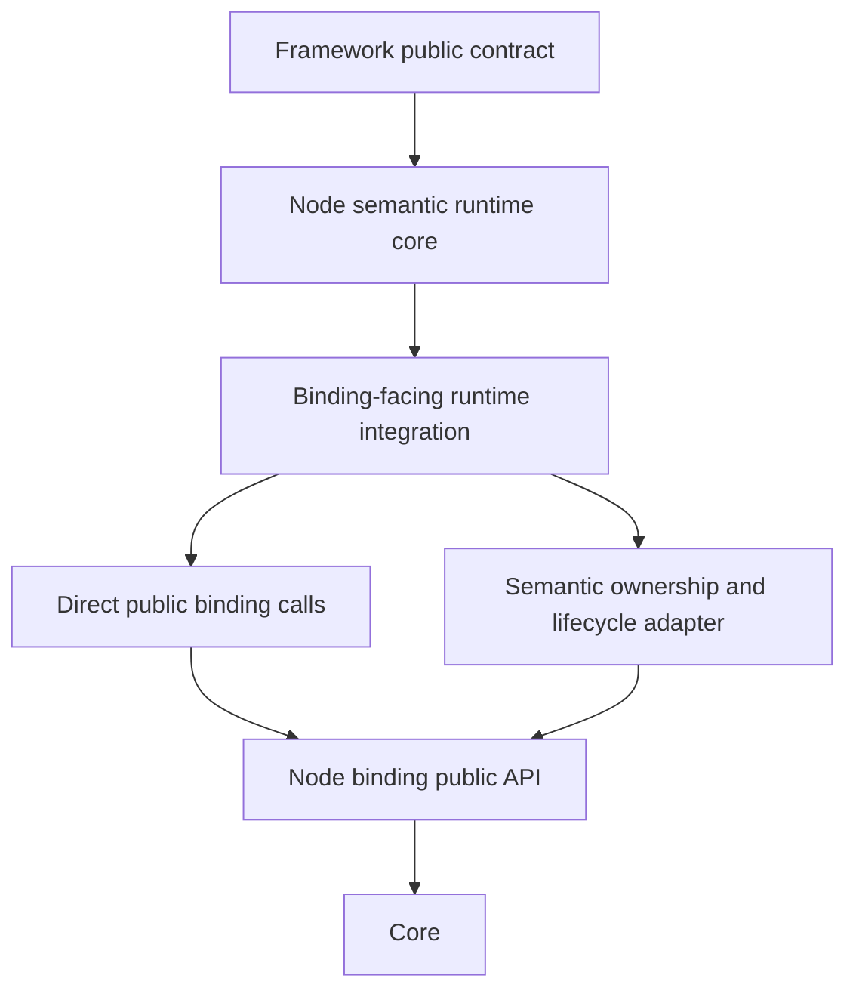

# Node.js transport readiness 구현

[공통 layering 기준](../../common/internals/01-layering.ko.md) ·
[Transport 연결 상태 확인](../../common/spec/29-transport-liveness.ko.md) ·
[MeshNode 계약](../../common/spec/13-mesh-node.ko.md)

> 이 문서는 Node.js Framework의 현재 구현이 공통 계약을 어떤 책임 경계와
> 내부 자료로 연결하는지 설명한다. Application이 사용하는 public contract를
> 새로 정의하지 않으며, binding의 private member나 native 구조를 보장하지 않는다.

## 1. 구현 범위와 관찰할 수 있는 결과

Framework가 remote node를 message target으로 사용할 수 있는 상태를
[ready](../../common/spec/01-glossary.ko.md#ready)라고 한다. Node.js 구현은
transport monitor의 연결 이벤트만으로 이 상태를 결정하지 않는다. 다음 세 조건을
같은 peer에 대해 확인한다.

1. service handshake와 identity 검사를 마친 topology peer가 있다.
2. service liveness가 그 peer의 현재 transport identity에 대해 ready다.
3. Application message를 보낼 수 있는 같은 transport pair가 monitor에서 아직 유효하다.

세 조건 중 하나라도 깨지면 다음 Framework request는 native request를 시작하지 않고
`NotConnected` terminal로 끝난다. 이미 시작한 request는 다른 peer에 자동으로
재전송하지 않는다. 이 규칙은 [장애 대응과 failover 범위](../../common/spec/31-failure-failover-policy.ko.md)와
같은 request를 두 번 실행하지 않는다는 계약을 유지한다.

구현의 책임은 다음 흐름으로 나뉜다.

`raw-service-mesh-runtime.ts`는 peer admission, liveness, monitor candidate와
Framework operation을 함께 관리하는 semantic runtime core다. `node-raw-binding-port.ts`는
Node binding의 public API를 호출하면서 `Received`, poll event와 completion callback의
소유권을 Framework runtime의 규칙으로 변환한다. 이 두 모듈 사이에는 binding type을
Framework domain contract로 올리지 않는다.

## 2. Monitor event와 transport identity

Core monitor는 물리 연결 시도 하나를 식별하는 `connectionId`와, Application 연결과
Completion 연결을 하나의 논리 pair로 묶는 `transportPairId`·`transportPairGeneration`을
제공한다. `transportLane`은 pair 안의 연결이 Application인지 Completion인지 구분한다.
pair에 속하지 않는 연결은 pair field가 0이고 Application lane으로 기록된다. pair 값은
process 재시작을 넘어 전역적으로 유일한 값이 아니다.

`ConnectionReady`의 `value`는 현재 ready connection 수를 나타내는 snapshot일 수 있다.
Node runtime은 수가 0보다 큰 모든 event를 새 candidate로 만들지 않는다. Core가
`ZLINK_MONITOR_EVENT_FLAG_CONNECTION_READY_EDGE`를 설정한 event만 ready 증가 edge로
받아들인다. 구버전 binding이 `flags`를 전달하지 않는 경우에만 `value > 0`을 fallback으로
사용한다. 따라서 같은 ready count snapshot을 반복해서 받아도 admission과 liveness
record를 다시 만들지 않는다.

Node binding adapter는 monitor event를 callback 경계를 넘기기 전에 다음 값을 복사한다.

| 값 | Node semantic runtime에서의 의미 |
|---|---|
| `connectionId` | 한 physical transport attempt를 구분하는 process-local 값 |
| `transportPairId`와 `transportPairGeneration` | Application·Completion event를 같은 logical transport pair로 묶는 값 |
| `transportLane` | pair 안에서 Application 또는 Completion을 구분하는 값 |
| `flags` | ready edge처럼 event의 전이를 구분하는 bit mask |

Node의 candidate key는 pair 값이 있으면 `routingId + transportPairId +
transportPairGeneration`으로 만든다. pair 값이 없으면 physical `connectionId`, 그것도
없으면 routing ID와 endpoint tuple을 사용한다. 따라서 Completion 연결의 ready event가
먼저 도착해도 Application 연결의 disconnect event가 같은 pair를 지우며, 서로 다른
physical connection ID가 남아 있다는 이유로 이전 route를 유지하지 않는다.

## 3. Ready fence의 처리 순서

monitor callback은 event를 일반 drain queue에 넣기 전에 `observeMonitorEvent`를 호출한다.
이 callback 단계의 작은 map은 마지막으로 관찰한 pair를 기록한다. 값이 `null`이면 해당
peer의 Application route를 native call에 사용할 수 없다는 뜻이다.

정상적인 연결 처리 순서는 다음과 같다.

1. Core가 ready edge event를 발생시킨다.
2. Node binding이 public monitor callback으로 event와 pair metadata를 전달한다.
3. callback이 pair fence를 먼저 갱신한다.
4. `drainMonitorEvents`가 candidate를 만들고 descriptor·generation·direction을
   검사해 peer admission을 수행한다.
5. liveness ACK가 현재 peer transport identity와 일치하면 liveness record가 ready가
   된다.
6. `isPeerRouteReady`가 topology peer, lifecycle generation, pair fence와 liveness를
   함께 검사한다.

disconnect 순서는 ready보다 짧다.

1. Application 또는 Completion lane 중 하나의 disconnect event가 pair metadata와
   함께 callback에 도착한다.
2. callback이 현재 pair를 `null`로 바꾼다.
3. 그 순간부터 새 request는 native request를 호출하지 않고 `NotConnected`로 완료한다.
4. 다음 drain에서 candidate와 admitted peer를 제거하고 liveness record도 제거한다.

이 순서가 필요한 이유는 Completion lane이 liveness ACK를 처리할 수 있어도 Application
lane이 이미 끊긴 짧은 창이 존재하기 때문이다. Completion liveness만 보고 public
`Ready`를 유지하면 native Application request가 `Host unreachable`로 실패할 수 있다.
callback fence는 drain timer와 monitor event queue의 순서 차이를 흡수한다.

`ConnectionReady` snapshot에는 ready edge flag가 없으므로 candidate를 만들거나 현재
pair를 되살리지 않는다. ready edge와 disconnect가 같은 drain batch에 들어오면 callback이
기록한 `null`을 ready branch가 덮어쓰지 않는다. 이 규칙은 disconnect가 먼저 관찰된
연결을 오래된 snapshot이 다시 ready로 만드는 것을 막는다.

## 4. Binding-facing adapter의 소유권

Node binding의 public `RouterSocket`, `MonitorSocket`, `Received`, `Poller`만 사용한다.
`NodeRawSocketPort`가 유지하는 adapter는 인자와 결과를 그대로 전달하는 wrapper가 아니다.
다음 의미를 변환하므로 유지할 이유가 있다.

| Binding public 동작 | Node Framework가 추가로 보장하는 의미 |
|---|---|
| `Received`로 수신 | socket마다 하나의 `Received`를 재사용하고, 다음 native receive 전에 Framework mailbox가 필요한 bytes를 소유하도록 복사한다. |
| `Poller`와 poll events | Application 수신과 Completion 수신을 서로 다른 progress 경로로 분리하고 poll event storage를 socket 수명 동안 재사용한다. |
| `MonitorSocket.onEvent` | monitor callback의 pair fence를 일반 runtime drain보다 먼저 반영한다. |
| Completion control send/receive | Framework service control만 기존 Completion 연결로 보내고, Application payload에는 같은 경로를 사용하지 않는다. |
| socket·monitor·context close | host가 생성한 resource를 역순으로 닫고 callback·timer·poller를 함께 정리한다. |

Binding과 Framework의 의미가 같은 단순 socket operation은 binding public method를
직접 호출한다. 반대로 `Received` 수명, Completion progress와 Application readiness를
하나의 Framework 동작으로 결합하는 부분은 adapter가 소유한다. Framework는 binding
internal/private member, reflection, raw native symbol을 호출하지 않는다. 필요한 pair
metadata가 이전 binding public event에 없었기 때문에 Core와 Node binding의 public
monitor event contract를 먼저 보강하고, Framework는 그 public field만 읽는다.

## 5. Message와 Completion hot path

Application receive 경로는 socket마다 만든 `Received` object에 native 결과를 채운 뒤
Framework-owned mailbox에 part를 복사한다. 이 복사는 binding envelope가 다음 receive에서
재사용될 수 있도록 lifetime을 경계에서 끊는 한 번의 복사다. message마다 `Received`,
wrapper, poller, task 또는 completion object를 만들지 않는다.

Completion control은 Application receive queue와 분리한 public callback으로 전달한다.
bounded control record의 bytes를 callback 경계에서 복사하고 각 binding message를 즉시
닫은 뒤, runtime이 같은 turn에서 처리한다. Completion progress를 위한 timer와
`Poller`는 router 수명에 한정되며 일반 Application message마다 생성되지 않는다.

Request reply는 operation 수명에 필요한 completion table과 correlation만 사용한다.
reply가 도착하면 binding reply collection을 복사한 뒤 native message ownership을 닫는다.
이 경로의 allocation은 operation/lifecycle 경로에 속하며, monitor event batch는 배열을
복사하지 않고 현재 배열을 분리한 뒤 새 배열로 교체한다.

따라서 다음은 Node runtime의 message hot path에서 허용하지 않는다.

- message마다 새로운 `Received`와 poll event storage를 만드는 것
- Completion liveness를 Application mailbox에 넣어 두 번째 queue를 만드는 것
- 이미 terminal이 된 request를 새 operation ID로 다시 보내는 것
- binding message part를 bytes와 message object로 여러 번 왕복 변환하는 것
- binding send readiness 위에 Framework 전용 lock을 하나 더 두는 것

## 6. Store owner lease와 stateful recovery

Location Store를 사용하는 host는 owner lease를 monotonic deadline으로 추적한다. 갱신 요청이
실패해도 deadline 전까지는 현재 작업을 유지할 수 있지만, deadline을 지나면 lease를 더 이상
유효한 authority로 사용하지 않는다. 이 시점에는 stateful authority reconciliation을 중단하고
새로운 Instance 요청과 timer evidence가 만료된 owner를 통해 진행되지 않도록 한다.
deadline에는 `ownerLeaseFencingMarginMs`를 미리 차감하여, 만료 직전의 Store 쓰기와 요청이
새 owner와 경쟁하지 않도록 한다.

Store가 시작 시점에 unavailable이면 transport host는 degraded 상태로 시작할 수 있다. 이 상태에서는
Serving descriptor와 stateful authority를 발행하지 않는다. 새 lease를 얻은 뒤 authority route
reconciliation을 single-flight로 시작하고, durable authority 복구가 끝난 다음 descriptor를 다시
발행한다. Store 재시작 직후의 빈 descriptor scan은 owner가 lease를 재획득하는 동안 일시적으로
불완전할 수 있으므로 Store 연산이 실패한 직후에는 기존 transport를 한 번의 owner lease TTL 동안
즉시 제거하지 않는다. 이 유예는 Store 상태가 불확실한 경우에만 적용한다. 읽기가 성공한 빈
결과는 scale-to-zero를 포함한 authoritative 결과이므로 기존 연결을 즉시 정리할 수 있다.
MeshNode descriptor 갱신이 row 부재로 `RejectedConflict` 또는 `IgnoredStale`를 반환하면 Location
runtime은 같은 owner lease 안에서 한 번만 `NewClaim`으로 재게시를 시도한다. 다른 owner가 이미
row를 만들었다면 재게시도 충돌로 끝나며, 그 충돌을 숨기지 않는다.

Redis provider의 reconnect는 하나의 in-flight public client operation으로 직렬화한다. `isOpen`이지만
`isReady`가 아닌 client는 동일한 reconnect promise 안에서 disconnect 후 connect한다. 따라서 동시에
도착한 Store operation이 중복 reconnect를 시작하지 않는다.

owner lease의 local deadline은 Store 응답을 받은 시각만으로 계산하지 않는다. 요청 시작과 완료
시각을 monotonic clock으로 측정하고, Store가 반환한 남은 TTL에서 관측한 왕복 시간을 뺀 뒤 fencing
margin을 적용한다. 따라서 Store 응답 지연이 local runtime의 Serving 판단을 lease 만료 이후까지
연장하지 않는다.

stateful authority route 복구는 하나의 lifecycle owner가 stop과 start를 직렬화한다. lease failure
시에는 기존 route의 stop 완료를 기다린 뒤 새 route를 만들며, Serving descriptor를 다시 기록하기
직전에 owner token과 lease usability를 재검사한다. authority registration은 host startup에서
한 번만 수행하고 recovery에서는 route runtime만 재생성한다.

## 7. Request failure와 retry 경계

`RequestTargetNotFound`는 두 위치에서 발생할 수 있지만 의미가 같다. 기존 Ready route의
native target lookup이 admission 전에 실패하면 resolver를 invalidate하고 현재 authority를
다시 읽을 수 있다. 반면 Missing Instance request의 completion table이 이미 operation의
terminal `NotFound`를 반환한 경우에는 같은 application request를 다시 보내지 않는다.

Node 구현은 이 둘을 public error kind를 추가하지 않고 호출 경계로 구분한다.

- 기존 route 호출에서 발생한 `RequestTargetNotFound`만 route refresh 후보로 본다.
- Missing Instance target의 동기 `requestToMissingInstanceSpot` 호출에서 발생한 같은
  kind만 pre-admission retry marker를 가진다.
- completion으로 변환된 `NotFound`, `ActorLocationStale`와 transport admission 뒤의
  오류는 marker가 없으므로 즉시 caller에 반환한다.

`ActorLocationStale`를 받은 뒤 원래 application envelope를 자동 재전송하지 않는 이유는
target이 envelope를 처리했는지 Node가 알 수 없기 때문이다. 실패 뒤 다른 operation을
시작할 책임은 Application에 있다. 이 규칙은 [Framework 오류 모델](../../common/spec/32-framework-error-model.ko.md)과
request 결과를 한 번만 완료한다는 공통 계약을 따른다.

## 8. 구현 검증

다음 검증은 public contract와 내부 책임 경계를 함께 확인한다.

| 검증 | 확인 내용 |
|---|---|
| `npm run verify:m6a-runtime` | pair metadata, ready-edge flag와 ready-count snapshot을 구분하고, 다른 physical ID의 disconnect가 같은 pair를 제거하는지 확인한다. |
| `npm run verify:m6b-runtime` | stale route에서 application request를 재전송하지 않고, Missing Instance completion terminal을 retry하지 않는지 확인한다. |
| `./run_e2e.sh RM-A2` | manual endpoint의 실제 process 사이에서 request와 provider evidence를 확인한다. |
| 공통 RegistryMessaging E2E | discovery, failover, scale, targeted route, timeout, payload와 backpressure 경로가 같은 ready fence를 사용하는지 확인한다. |

구현 변경 뒤에는 `build`와 위 contract test를 함께 실행한다. E2E는 한 번에 하나만
실행하여 Core socket과 Redis resource가 서로 영향을 주지 않게 한다. 성능을 판단할
때는 Application throughput, p99 latency, allocation/GC와 lock contention을 기준선과
비교하며, readiness fence를 위해 추가한 map·callback 처리가 설명되지 않은 regression을
만들지 않는지 별도로 확인한다.
