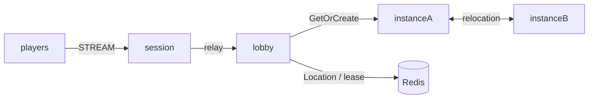

# my-game — MORPG lobby and dungeon instances

A Kotlin server template using the public ZLink Framework coroutine APIs. Players create a party in the lobby, mark every member ready, and enter a shared dungeon. The Party User Spot owns the roster and readiness; the Dungeon User Spot owns the dungeon stage. The Entry Spot owns no party state.


```mermaid
flowchart LR
    players -->|STREAM| session
    session -->|relay| lobby
    lobby -->|GetOrCreate| instanceA
    instanceA <-->|relocation| instanceB
    lobby -->|Location / lease| location[(Redis)]
```

The Lobby and Instance roles (`lobby`, `instanceA`, and `instanceB`) explicitly register the shared stateless application Entry and initial party-admission handlers. The structure declares Entry only for those application registrations; Framework infrastructure Entry instances are not declared. Party state remains in the Lobby Party User Spot. Message Follow is explicitly 30 seconds; the safe-shutdown observation budget adds that duration to the existing host-operation budget. Each instance admits one Dungeon, so the relocated Dungeon fills the surviving instance and fresh work must use the replacement.

## Prerequisites

Docker with Compose v2 and Linux containers, network access to Maven Central and the Gradle Plugin Portal, and PowerShell 7 on Windows. JDK 25 is required only for local process debugging. The Gradle wrapper is included; public package versions are pinned in `build.gradle.kts`.

## Build

```sh
./run-e2e.sh --build-only
```

```powershell
pwsh -NoProfile -File ./run-e2e.ps1 -BuildOnly
```

## Client connection

### Endpoint and first packet

The Session client STREAM listener defaults to `tcp://127.0.0.1:0` in `server/config/session.json`. Port `0` asks the OS for a free port; use the actual `streamEndpoint` in the process line `READY <json>`, which also contains `id` and `meshEndpoint`. TCP has no URL path. Web browsers, Unity WebGL, and Cocos Creator web cannot connect to this default TCP listener; they require a separately configured WebSocket deployment.

Loopback is reachable only inside the same host/network namespace. Keep a deployment running for external clients, bind to a reachable interface and port, and expose that port from containers. The Docker e2e deployment is temporary and is removed after the run. Mesh listeners and Redis are not game-client endpoints.

Send `JoinLobbyRequest(playerId)` first. Successful entry pushes `LobbyView`. Create or join a party and satisfy readiness before requesting dungeon entry; `ActionRejected` reports rejection.

After admission, `SessionInfoRequest` uses `connector.kotlin().request<SessionInfo>(SessionInfoRequest()).await()` for a correlated `SessionInfo` reply. The first game operation above uses `send(...).await()` and server pushes. This template does not authenticate player identity; add identity validation before Actor binding for production.

### Connector installation

Use the same connector release as this template pins in `build.gradle.kts`, `extra["frameworkVersion"]`; `e2e/build.gradle.kts` uses that key for `systems.zlink:zlink-stream-connector`. Replace `<version>` below with that pinned version. Engine installation instructions are in the linked repository READMEs; all clients use this template's packets.

| Client                             | Connector installation                                                                                                                                                                                                                                                                                                                                                                                                                                                          | Documentation guide                                                                                                                                                          |
| ---------------------------------- | ------------------------------------------------------------------------------------------------------------------------------------------------------------------------------------------------------------------------------------------------------------------------------------------------------------------------------------------------------------------------------------------------------------------------------------------------------------------------------- | ---------------------------------------------------------------------------------------------------------------------------------------------------------------------------- |
| Unity                              | Native/Editor: restore `Zlink.Stream.Connector` with NuGetForUnity. WebGL: add the `com.zlink.stream-connector.webgl` UPM Git package; include only the connector assembly for the active target. See the [Unity README](https://github.com/zlink-systems/zlink/blob/main/framework/languages/engines/Unity/README.md) and its package manifest.                                                                                                                                | [.NET engine integration](https://docs.zlink.systems/dotnet/guide/stream-connector/12-engine-integration/)                                                                   |
| Unreal                             | Copy `framework/languages/cpp/connector/engines/unreal` into `Plugins/ZLinkStreamConnector`, then package the native connector under `ThirdParty/ZLink` as described in the [Unreal README](https://github.com/zlink-systems/zlink/blob/main/framework/languages/engines/Unreal/README.md).                                                                                                                                                                                     | [C++ engine integration](https://docs.zlink.systems/cpp/guide/stream-connector/12-engine-integration/)                                                                       |
| Godot                              | .NET: add the NuGet package `Zlink.Stream.Connector` and run `dotnet restore`; see the [C# README](https://github.com/zlink-systems/zlink/blob/main/framework/languages/engines/Godot/csharp/README.md). GDExtension: build the C++ Godot adapter against the framework prebuilt and matching `godot-cpp`; see the [C++ README](https://github.com/zlink-systems/zlink/blob/main/framework/languages/engines/Godot/cpp/README.md). The .NET sample does not support Web export. | [.NET](https://docs.zlink.systems/dotnet/guide/stream-connector/12-engine-integration/), [C++](https://docs.zlink.systems/cpp/guide/stream-connector/12-engine-integration/) |
| Cocos Creator                      | Web target: `npm install @zlink-systems/stream-connector@<version>`; see the [Cocos Creator README](https://github.com/zlink-systems/zlink/blob/main/framework/languages/engines/CocosCreator/README.md). This package does not provide a Creator native adapter.                                                                                                                                                                                                                  | [TypeScript engine integration](https://docs.zlink.systems/node/guide/stream-connector/12-engine-integration/)                                                               |
| Axmol                              | Copy `framework/languages/cpp/connector/engines/axmol` into `third_party/zlink_axmol_connector` and link `zlink::stream_connector` from the installed C++ framework package; see the [Axmol README](https://github.com/zlink-systems/zlink/blob/main/framework/languages/engines/Axmol/README.md).                                                                                                                                                                              | [C++ engine integration](https://docs.zlink.systems/cpp/guide/stream-connector/12-engine-integration/)                                                                       |
| Web browser (TypeScript connector) | `npm install @zlink-systems/stream-connector@<version>`; import the package root in the browser build. Use `ws://` or `wss://`, subject to the page's security policy.                                                                                                                                                                                                                                                                                                             | [TypeScript connector](https://docs.zlink.systems/node/guide/stream-connector/)                                                                                              |
| C++                                | Install the C++ framework prebuilt containing the connector; use `find_package(zlink_stream_connector_cpp CONFIG REQUIRED)` and link `zlink::stream_connector`.                                                                                                                                                                                                                                                                                                                 | [C++ connector](https://docs.zlink.systems/cpp/guide/stream-connector/)                                                                                                      |
| C#/.NET                            | `dotnet add package Zlink.Stream.Connector --version <version>`                                                                                                                                                                                                                                                                                                                                                                                                                    | [.NET connector](https://docs.zlink.systems/dotnet/guide/stream-connector/)                                                                                                  |
| Java                               | Add Maven/Gradle dependency `systems.zlink:zlink-stream-connector:<version>`.                                                                                                                                                                                                                                                                                                                                                                                                      | [Java connector](https://docs.zlink.systems/java/guide/stream-connector/)                                                                                                    |
| Kotlin                             | Add `systems.zlink:zlink-stream-connector:<version>` and `systems.zlink:zlink-framework-kotlin:<version>` for the coroutine wrapper.                                                                                                                                                                                                                                                                                                                                                  | [Kotlin connector](https://docs.zlink.systems/kotlin/guide/stream-connector/)                                                                                                |
| Node                               | `npm install @zlink-systems/stream-connector@<version>`; use the package root and Node.js 22 or later.                                                                                                                                                                                                                                                                                                                                                     | [Node connector](https://docs.zlink.systems/node/guide/stream-connector/)                                                                                                    |

### Kotlin connection example

The example uses the same public connector and Kotlin coroutine wrapper as `e2e/src/main/kotlin/MyGame/e2e/Client.kt`. Save it as `e2e/src/main/kotlin/MyGame/e2e/ConnectOnce.kt` in a copy of the template. It defines a suspending function to call from your application coroutine while the deployment is running; compile it with `./gradlew :e2e:compileKotlin`.

```kotlin
package MyGame.e2e

import MyGame.*
import java.net.URI
import java.time.Duration
import java.util.concurrent.CompletableFuture
import kotlinx.coroutines.CompletableDeferred
import kotlinx.coroutines.withTimeout
import systems.zlink.framework.kotlin.*
import systems.zlink.stream.connector.*

suspend fun connectOnce(endpoint: String, playerId: String) {
    val d = ZLinkStreamConnectorOptions.createDefault(URI(endpoint))
    val connector = ZLinkStreamConnectorFactory.create(
        ZLinkStreamConnectorOptions(
            URI(endpoint), ZLinkStreamDispatchMode.IMMEDIATE, Duration.ofSeconds(5),
            d.maxReconnectAttempts(), d.connectTimeout(), d.maxSendPayloadSize(),
            d.heartbeatEnabled(), d.heartbeatInterval(), d.heartbeatTimeout(), false,
            d.reconnectInitialDelay(), d.reconnectMaxDelay(), d.reconnectBackoffFactor(),
        )
    )
    val response = CompletableDeferred<LobbyView>()
    val registrations = listOf(
        connector.on(LobbyView::class.java) { message ->
            response.complete(message.payload())
            CompletableFuture.completedFuture(null)
        },
        connector.on(ActionRejected::class.java) { message ->
            response.completeExceptionally(IllegalStateException(message.payload().toString()))
            CompletableFuture.completedFuture(null)
        },
        connector.onErrorReceived { event ->
            response.completeExceptionally(IllegalStateException(event.toString()))
            CompletableFuture.completedFuture(null)
        },
        connector.onDisconnected { event ->
            response.completeExceptionally(IllegalStateException(event.toString()))
            CompletableFuture.completedFuture(null)
        },
    )
    try {
        connector.kotlin().connect().await()
        connector.kotlin().send(JoinLobbyRequest(playerId)).await()
        println(withTimeout(5_000) { response.await() })
    } finally {
        try { connector.kotlin().close().await() }
        finally { registrations.forEach { it.close() } }
    }
}
```

## Docker e2e

Docker builds a shared node image for all roles and a runner image. The pinned Eclipse Temurin JDK/JRE bases are defined by the Dockerfile ARGs. The runner uses the Docker socket to create sibling nodes sharing its network namespace, preserving loopback listeners and stdin/stdout control. Each invocation removes its containers, network and image tags; cleanup errors return exit 1. Logs remain in `.logs/`.

For local process debugging, run `./run-e2e.sh --local` or `pwsh -NoProfile -File ./run-e2e.ps1 -Local`. Local mode uses JDK 25 and Compose Redis. Scenario and structure options work in both modes.

```sh
./run-e2e.sh
./run-e2e.sh --scenario party,reconnect,update
```

```powershell
pwsh -NoProfile -File ./run-e2e.ps1
pwsh -NoProfile -File ./run-e2e.ps1 -Scenario party,reconnect,update
```

The runner validates `zlink.structure.json`, starts its own Redis Compose project and node processes, then removes those resources. Each scenario has isolated nodes, a unique Redis key prefix, ephemeral listener ports, and logs in `.logs/run-<id>/`. Cleanup failure produces a failing exit code.

| Scenario | Assertions |
| --- | --- |
| party | Server-issued IDs; invalid-party, not-ready and non-leader rejection without state changes; internal packet rejection; back-to-back entry reaches one active run; distinct parties get distinct Dungeons; FinalStage completes the run |
| reconnect | Same Actor, Dungeon, RunId, Phase and Stage after reconnect; advancement and completion continue |
| update | Drain and safe-shutdown observations; preserved Sessions, RunId, Phase and Stage; replacement accepts a distinct party and Dungeon |

Run the structure checker alone with `./run-e2e.sh --check-structure` or `pwsh -NoProfile -File ./run-e2e.ps1 -CheckStructure`. Party domain tests run with `./gradlew --no-daemon :server:lobby:test`.

## Known issues

Validated against the published Framework 0.32.0 packages.

## Deployment sequence

1. Provision Redis, then start `lobby`, the two `instance` processes, and `session` with their respective files in `server/config/`. The application entry points are `MyGame.lobby.ProgramKt`, `MyGame.instance.ProgramKt`, and `MyGame.session.ProgramKt`. The two instances use the same executable and distinct configuration files.
2. Wait for `READY` from each process. Its JSON contains the actual bound mesh and stream endpoints; a port of zero delegates port selection to the OS.
3. Send `drain` to an occupied instance. Wait for `RELOCATION_REQUESTED`, `RELOCATED`, and `SAFE_TO_SHUTDOWN` before sending `shutdown`.
4. Confirm `STOPPED` and exit code zero. Start a replacement with the same configuration and wait for `READY` before assigning new work.

Instance capacity is one Dungeon per process to make replacement placement observable. Framework owns placement, membership, route continuity, and relocation. Application adapters capture only Party and Dungeon game state; Player has no application state. Non-request pushes use player IDs through Actor delivery handlers, without retaining Actor references in Spots.
